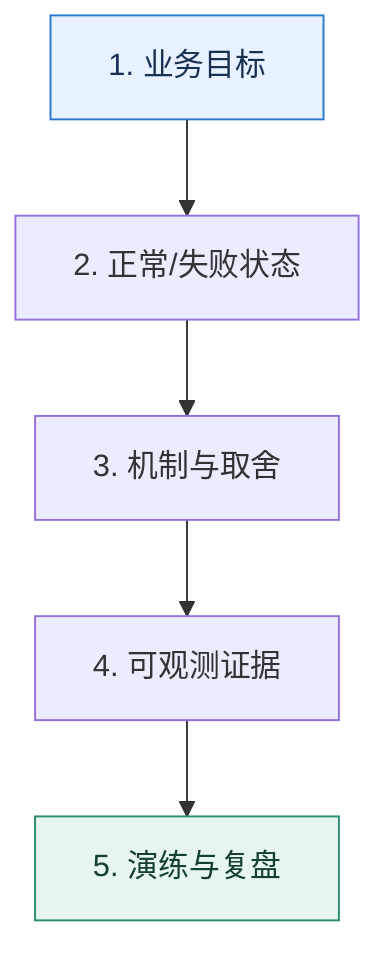

# 导学｜把零散知识变成可解释、可验证的工程能力

> 本课只回答一个问题：怎样学习一项后端技术，才能在真实故障和架构决策中用得出来？

这是一份独立学习稿。来源资料用于核对知识范围；下面的解释、推演、边界和图示均按工程学习路径重新组织，不依赖原页面也能完整阅读。

## 先补齐：建立正确的心智模型

先区分“知道名词”和“拥有工程模型”。前者能复述定义，后者能说清输入、状态变化、失败路径、取舍和验证证据。后续每一课都按这五个对象来读。

读这一课时，始终把“组件名字”换成三个可追踪对象：**谁发起动作、状态存在哪里、失败后由谁收敛**。这样遇到不同产品或版本，仍能用同一套模型判断。

## 本节精讲：机制是怎样一步步工作的

一项技术只有放进业务约束里才有意义。先问系统要保护什么指标，再画正常路径和失败路径；接着找出可观测信号、控制手段与副作用；最后用压测、演练或数据回放验证。这样得到的不是一句结论，而是一套能够迁移到新场景的推理方法。

下面这张图只表达本课最重要的状态推进，蓝色是入口，绿色是可验收的终点；任一箭头失败，都要回到上文寻找重试、回退或人工处理的位置。

### 一次带数字的完整推演

以服务注册为例：背下“客户端从注册中心获得节点”还不够。真正掌握意味着你能推演注册中心失联、服务端突然断电、客户端缓存过期三种状态，说明请求会落到哪里，并设计一次断网演练验证判断。

数字的作用不是制造精确感，而是暴露容量和时间关系。把例子中的流量、延迟、分片数或版本号替换成自己的真实数据，方案可能会随之改变。

## 误区与失效边界

这套学习法不承诺一次读完就会。工程能力来自反复预测、观察和修正；如果只收藏方案、从不写下假设和证据，知识仍然停留在记忆层。

判断一个结论是否可靠，可以追问两次：**它依赖什么前提？前提失效后系统留下了什么状态？** 如果回答只能停在“框架会自动处理”，就还没有走到工程边界。

## 按讲解顺序重建知识链

来源稿覆盖的论证主线在这里被重建成四步，保留问题、推导、反例和收束，不沿用原页面措辞：

1. 先建立完整的课程地图，知道服务治理、数据库、消息系统、缓存和 NoSQL 分别解决什么问题。
2. 把原课中的技术问答改造成工程问题：什么条件下会坏，为什么坏，怎样证明修复有效。
3. 保留真实案例与警告，但不保留为表达效果服务的重复话术。
4. 每学完一个专题，用串联复盘把孤立知识点重新放回同一条请求链。

把四步连起来后，本课不是一个孤立结论，而是一条可以复演的因果链。需要回查课程覆盖范围时，可打开文末的来源稿；学习时以本页模型为主。

## 工程验证：把理解变成证据

为每课建一张四列表：`假设 | 观测信号 | 控制动作 | 副作用`。如果某个方案只有动作、没有信号和副作用，就暂时不能进入生产设计。

### 状态检查表

| 步骤 | 状态或动作 | 需要留下的证据 |
| ---: | --- | --- |
| 1 | 业务目标 | 记录耗时、结果与异常分支，确认状态能进入下一步 |
| 2 | 正常/失败状态 | 记录耗时、结果与异常分支，确认状态能进入下一步 |
| 3 | 机制与取舍 | 记录耗时、结果与异常分支，确认状态能进入下一步 |
| 4 | 可观测证据 | 记录耗时、结果与异常分支，确认状态能进入下一步 |
| 5 | 演练与复盘 | 记录耗时、结果与异常分支，确认状态能进入下一步 |

检查表不是要求生产系统逐字采用这些字段，而是强迫设计者为每一步提供可观测结果。只有入口、没有终态的流程，最终都会形成无法解释的中间状态。

## 自我检查

为什么仅仅记住一个中间件的优点，仍不足以支持架构选择？

因为架构选择依赖当前业务目标、故障模型和约束。优点只有和可验证的指标、失败代价及替代方案连接起来，才构成决策。

再做一次闭卷练习：不看上文画出状态图，并为其中任意两个箭头注入超时、进程崩溃或重复请求。如果你能预测最终状态和观测信号，这一课才真正从“听懂”变成“会用”。

## 来源与版本校准

- [查看来源稿（9 页资料整理）](../content/00-introduction.md)

来源稿只用于追溯知识范围，不是本学习稿的正文。具体产品的默认值、命令与内部实现会随版本变化；落地前应使用目标版本官方文档和故障演练再次确认。
