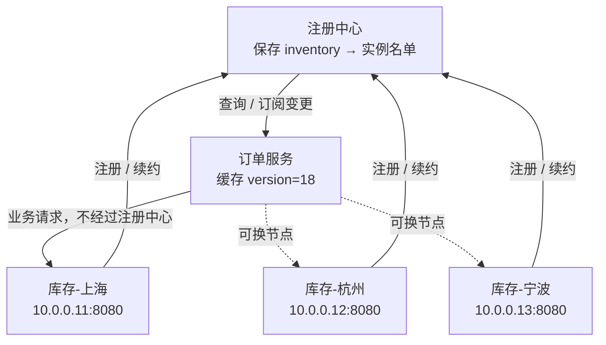
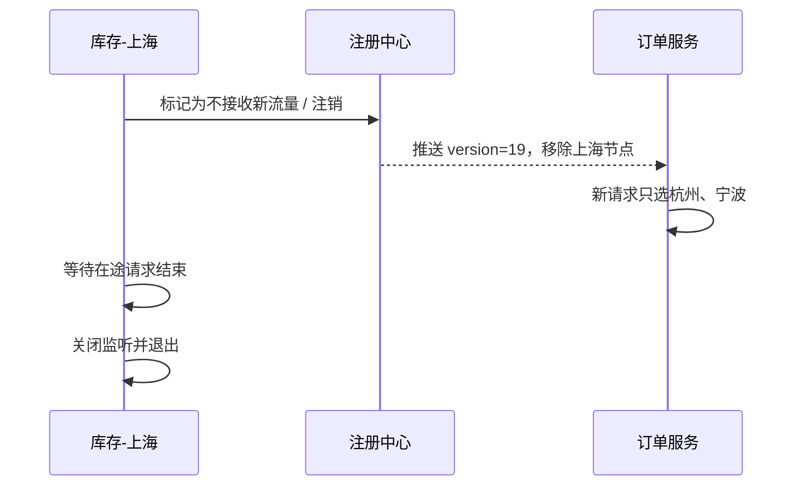
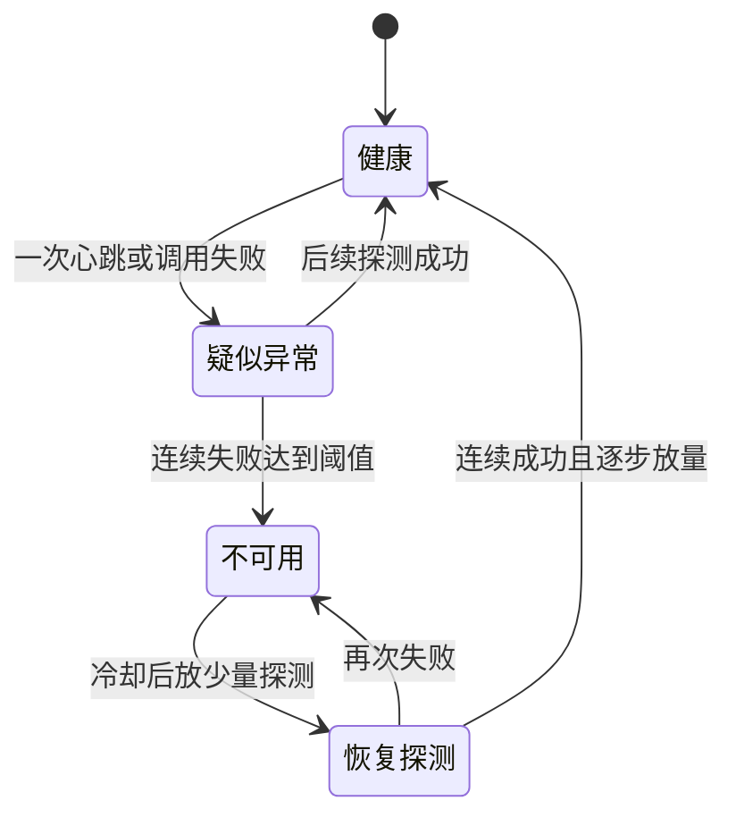

# 服务发现完整推导｜节点会消失，调用方怎样仍然找到活着的服务

> 本课只解决一个问题：库存服务的机器随时可能上线、下线、断电或失联，订单服务怎样持续找到真正可用的那一台？

读完这一课，你不应该只记住“注册、心跳、订阅”三个词。你应该能闭着眼睛推演下面五件事：一个新节点如何被看见；一个旧节点如何安全退出；节点突然断电时旧地址为什么还会存在；一次失败如何触发换节点；注册中心自身失联后，已有调用为什么还能暂时继续。

这份学习稿以来源资料的完整论证为范围，但重新建立了一条连续的工程故事。来源中的问答式表达被改成可运行、可计算、可故障演练的学习路径；原页面和原图都不是理解本课的前提。

## 零基础入口：先忘掉“注册中心”这个词

### 1. 从一家临时搬家的门店开始

你到陌生城市找一家火锅店。你不会先在脑中保存全城所有门店的地址，而会打开地图应用，搜索“重庆火锅”，得到当前营业的门店列表。门店开业时把地址登记上去；打烊前把状态改成停止营业；如果门店突然停电、来不及更新，地图里的信息就可能暂时落后。

这个熟悉场景只帮我们理解一件事：**地址不是永恒常量，而是一份随时间变化的名单。**

类比到这里就应该停止。真实服务调用比找门店严格得多：请求可能每秒发生数万次；一份旧地址会直接制造超时；调用方和地址簿之间也可能断网；而且“刚刚还能访问”并不能证明下一毫秒仍然可用。

现在再把正式名称贴回去：

| 日常场景 | 本课中的对象 | 它保存或执行什么 |
| --- | --- | --- |
| 找店的人 | 订单服务，也就是调用方/客户端 | 发起扣库存请求，并缓存库存节点名单 |
| 三家门店 | 三个库存服务实例 | 真正执行扣库存逻辑 |
| 地图应用 | 注册中心 | 保存服务名到实例地址的映射，并通知变化 |
| “营业中”状态 | 健康状态 | 表示某个实例是否应该继续接收新请求 |

注意：“客户端”在这里不是浏览器或手机。只要服务 A 调用服务 B，A 就是这次服务调用中的客户端，B 是服务端。

### 2. 建立一个能在脑中完整放下的小世界

我们只保留五个对象：

| 名称 | 地址 | 初始状态 | 角色 |
| --- | --- | --- | --- |
| 订单服务 | `10.0.1.20` | 正常 | 调用方 |
| 库存-上海 | `10.0.0.11:8080` | 正常 | 库存实例 1 |
| 库存-杭州 | `10.0.0.12:8080` | 正常 | 库存实例 2 |
| 库存-宁波 | `10.0.0.13:8080` | 正常 | 库存实例 3 |
| 注册中心 | `10.0.9.9:8848` | 正常 | 保存和分发节点名单 |

注册中心此刻保存：

```text
service = inventory
instances = [
  库存-上海  10.0.0.11:8080  healthy=true  zone=shanghai,
  库存-杭州  10.0.0.12:8080  healthy=true  zone=hangzhou,
  库存-宁波  10.0.0.13:8080  healthy=true  zone=ningbo
]
version = 18
```

订单服务第一次查询后，也在自己的内存里保存了一份 `version=18` 的副本。后续每次扣库存，不需要先同步询问注册中心；它会在本地名单中选择节点。这一点非常重要：**注册中心主要在控制地址名单，真正的业务流量通常直接从订单服务到库存服务。**



先做一个预测：如果此刻注册中心进程退出，但订单服务和三个库存实例仍能互通，下一次扣库存是否一定失败？

答案是：**不一定。** 订单服务已经有本地名单，数据面可以暂时继续；但它失去了名单更新能力，新扩容节点看不见、已下线节点也可能留在旧名单中。这就是后面要区分的“控制面失联”和“数据面不可用”。

## 本节精讲：一条地址从出现到消失的完整生命周期

### 3. 新节点上线：注册的不是一个抽象名字

库存-上海启动后，至少要把“我是谁”和“怎样找到我”交给注册中心。最低限度通常包括服务名、IP、端口；实际系统还可能携带区域、版本、权重、协议、标签和是否启用等元数据。

我们的小世界发生以下变化：

| 时刻 | 动作 | 注册中心状态 | 订单服务状态 |
| --- | --- | --- | --- |
| 09:00:00.000 | 库存-上海启动 | 还没有上海节点 | 本地也没有 |
| 09:00:00.080 | 上海节点注册成功 | 加入 `10.0.0.11:8080`，版本升为 18 | 仍是旧版本 17 |
| 09:00:00.120 | 注册中心推送变化 | 版本 18 | 收到并替换为版本 18 |
| 09:00:00.150 | 新请求到达 | — | 可以选择上海节点 |

“注册成功”与“所有调用方已经知道”不是同一个时间点。两者之间存在传播延迟。在发布系统中，这个事实直接影响放量：节点进程启动成功后，不应立刻假定它已经承接流量；反过来，准备下线时也不能刚发出摘除通知就直接杀进程。

元数据也不是装饰。假设上海节点只处理 VIP 租户，注册时带有 `group=vip`；订单服务收到 VIP 请求后，只在带该标签的实例中选择。这里的真正规则是：**发现结果可以先经过标签、区域、健康状态和权重过滤，再进入负载均衡。** 注册中心给的是候选集合，不是替业务完成了所有流量治理。

### 4. 优雅下线：先停止接新请求，再等待旧请求离开

库存-上海要发布新版本。最危险的顺序是：先杀进程，再通知大家别来了。此时所有还握着旧名单的订单服务都会继续请求一个已经消失的地址。

更合理的状态变化是：



等待时间不是拍脑袋的固定十秒，它至少应覆盖三部分：

```text
安全等待时间 ≥ 变更传播上界 + 客户端应用变更上界 + 在途请求完成上界
```

例如：注册中心推送 P99 为 300ms，客户端应用新名单最慢 200ms，库存接口超时上界 2s，那么理论下界约是 2.5s。工程上还要加入时钟、调度和漏通知余量。更成熟的发布流程会先把实例状态切到“不接新流量”，等待连接和在途请求排空，再终止进程；如果框架支持 readiness、连接排水或 preStop，它们解决的就是这个时间窗口。

这里有一个常见误解：**注销成功不等于全世界立即忘记该节点。** 推送可能延迟，某个客户端可能正断网，DNS 也可能有缓存。因此服务端下线必须接受短时间内仍有旧请求到达，并选择完成、拒绝或转交，而不是毫无准备地退出。

### 5. 突然断电：没有“下线通知”时，谁来发现死亡

现在换成更困难的情况。10:00:00.100，库存-上海被突然断电。它来不及注销，注册中心与订单服务都还保存着这个地址。

注册中心不能读取另一台机器的“生命值”，只能发送请求并观察结果。心跳或长连接断开只是一个观测信号：

```text
请求有响应 → 此刻这条路径可达
请求没响应 → 进程崩溃、网络丢包、拥塞、GC 暂停、注册中心自身卡顿，都有可能
```

所以一次失败永远无法证明“对方已经死了”。这不是某个框架的缺陷，而是分布式环境里的信息限制。

### 一次带数字的完整推演

为了把变化看清，我们设定：

- 心跳间隔 `I = 5s`；
- 连续失败阈值 `N = 3`；
- 注册中心向订单服务推送变更最多 `P = 0.2s`；
- 上海节点刚好在 10:00:00.1，即一次成功心跳之后断电。

后续探测发生在 10:00:05、10:00:10、10:00:15。第三次失败后才确认不可用，再用 0.2s 推送。最坏检测传播延迟接近：

```text
D_worst ≈ N × I + P
        = 3 × 5s + 0.2s
        = 15.2s
```

更一般地，从任意时刻故障到确认的延迟是：

```text
D = 距离下一次探测的剩余时间 + (N - 1) × I + 推送时间
```

如果只允许一次失败就临时摘除，最坏窗口接近 `I + P = 5.2s`，但一次普通丢包也可能误伤活节点。如果要求三次失败，误伤概率下降，真实故障却要多暴露约 10 秒。这就是来源讲解强调的两难：

- 判得快，容易把活节点当死节点；
- 判得稳，容易把死节点继续当活节点。

立刻连续重试三次也不是免费解决方案。若网络抖动持续 500ms，三次请求在 20ms 内打完，很可能全部落在同一次抖动里；它们不是三个独立证据。更合理的策略往往会组合短间隔快速确认、稍长间隔复查、状态抖动抑制和逐步恢复，但具体数值必须来自网络特征与业务容忍度，不能从课程例子直接复制到生产。

可以把节点健康建模成四个状态，而不是只有“活/死”两个布尔值：



来源讲解提出的核心策略是：第一次心跳失败时，可以先尽快阻止客户端继续使用该节点，同时后台继续探测；恢复则重新通知客户端，持续失败则最终确认崩溃。工程校准是：第一次失败究竟“全量摘除、降低权重还是仅标记可疑”，应由实现、规模和误判成本决定。不能把一种策略说成所有注册中心的固定行为。

### 6. 先预测再揭晓：检测通知到达以前，请求会发生什么

现在时间是 10:00:02，上海节点已经断电，但注册中心要到 10:00:15.2 才推送移除。订单服务的本地名单仍是：

```text
[库存-上海, 库存-杭州, 库存-宁波]
```

负载均衡器恰好选到库存-上海。请先自己回答：订单服务只能等注册中心通知吗？

不能。它已经得到一个比注册中心更贴近当前调用路径的新证据：**我现在直接连不上上海节点。** 因而可以立刻做三件事：

1. 把上海节点放入本地隔离区，短时间不再选择；
2. 在剩余候选中选择杭州或宁波；
3. 后台探测上海节点，满足恢复条件后再放回。

这就是客户端容错，也常被称为 failover。它填补的是“真实故障发生”到“全局节点名单完成传播”之间永远存在的空白。

但“换节点重试”必须带上一个重要边界。对读取请求，换节点通常较安全；对扣库存、扣款、创建订单这类写请求，第一次调用可能已经在服务端成功，只是响应在网络中丢了。贸然换节点再执行一次会产生重复副作用。因此调用方需要业务幂等键、条件更新或结果查询，而不能把节点切换当作无条件重试许可证。

我们的小世界中，第二个请求经历如下变化：

| 步骤 | 当前名单 | 隔离区 | 动作 | 结果 |
| ---: | --- | --- | --- | --- |
| 1 | 上海、杭州、宁波 | 空 | 选择上海 | 连接失败 |
| 2 | 上海、杭州、宁波 | 上海 | 选择杭州 | 调用成功 |
| 3 | 上海、杭州、宁波 | 上海 | 后台探测上海 | 暂不影响业务请求 |
| 4 | 杭州、宁波 | 上海 | 收到注册中心 version=19 | 全局名单也移除上海 |

请注意第 2 步以后，业务已经恢复，但控制面状态还没完全收敛。这说明高可用不是等所有节点获得绝对一致信息以后再工作，而是让局部证据、缓存和最终通知共同收敛。

### 7. 三条边分别断掉，结果并不相同

来源讲解用一个三角形组织高可用，这是本课最值得保留的记忆模型：订单服务、注册中心、库存服务是三个顶点；任意两个顶点之间的连接是一条边。不要只问“哪个节点挂了”，还要问“哪条通信路径断了”。

#### 边一：注册中心 ↔ 库存服务断开

注册中心看不到库存-上海的续约或连接，可能把它标为可疑或不可用。但订单服务与上海节点也许仍然能正常通信。这时全局名单可能暂时保守地少一个活节点，牺牲容量换取少发失败请求。

#### 边二：订单服务 ↔ 库存服务断开

注册中心和库存-上海都正常，其他调用方也可能访问正常，唯独这一台订单服务所在网络到上海不通。注册中心给出的“健康”只证明它观察到的路径健康，不能证明每个调用方的路径健康。订单服务必须依据自己的调用结果做本地隔离和恢复探测。

#### 边三：订单服务 ↔ 注册中心断开

订单服务无法获得新名单，但可以继续使用最后一份本地缓存：

- 热启动客户端已有名单，可能继续工作；
- 冷启动客户端从未拿到名单，通常无法凭空找到节点，需要本地快照、固定兜底地址或等待控制面恢复；
- 失联时间越长，本地名单越陈旧，风险越高；
- 长时间无法同步时要告警、限制发布与扩缩容，并根据业务选择退出、只读或降级。

这也解释了为什么本地缓存不是一个“性能小优化”，而是注册中心故障时的数据面生存机制。缓存必须带版本、更新时间和过期策略，否则调用方无法判断自己握着多旧的视图。

## 注册中心自身故障：控制面冻结以后怎样活下来

### 8. 不要把“注册中心挂了”误读成“所有业务请求立刻挂了”

假设注册中心集群整体不可用，但订单服务和库存服务都还运行。此时：

- 已有订单服务仍可按本地节点表调用；
- 新库存节点无法正常注册或被现有调用方发现；
- 下线、扩容和地址变化无法及时传播；
- 新启动的订单服务如果没有快照，可能无法获得任何库存地址；
- 依赖注册名单进行任务分配或成员协调的功能风险更高。

因此故障期的首要动作通常不是“继续频繁部署试试看”，而是冻结会改变地址集合的操作：暂停发布、扩缩容和主动迁移，保护现有机器和现有连接。来源讨论中有一个真实事故：团队的 etcd 不可恢复时，先禁止部署和伸缩，保护现有节点；抢修失败后切换到 Consul，并为关键任务增加固定列表兜底。这个案例的可迁移经验不是“永远准备两个特定产品”，而是：

1. 控制面故障时先冻结拓扑变化；
2. 保存可审计的本地快照或少量固定兜底节点；
3. 异构备份若存在，必须提前演练切换，不能故障当天才发现数据格式和语义不同；
4. 固定 IP 是应急控制杆，需要负责人和更新流程，否则很快变成另一份陈旧名单；
5. 恢复后先核对节点版本，再逐步解除冻结，防止旧实例突然重新接流量。

还要警惕把注册中心当作通用协调器。来源讨论提到用“有序节点列表”分配定时任务；如果列表在不同客户端上不一致，可能让任务重复执行或无人执行。服务发现适合回答“有哪些候选实例”，但唯一任务所有权更适合使用带租约的协调、数据库条件更新或具备 fencing 的选主机制。地址名单和业务唯一性是两类问题。

## AP 与 CP：先问清楚“一致”的究竟是什么

### 9. CAP 不是日常状态下的三选二按钮

CAP 的讨论聚焦网络分区发生时：集群被切成互相无法通信的部分后，你是继续在多个分区返回结果，接受视图可能不一致；还是拒绝一部分操作，以维持更强的一致视图。P 不是产品菜单里可随意取消的功能，而是分布式系统必须面对的故障条件。

注册中心语境中的 C，指的是**注册信息、健康状态和元数据视图的一致性**，不是订单金额或库存业务数据的一致性。拿到一个已经下线的旧地址，通常导致调用失败和换节点，不会直接把数据库里的余额改错；这也是很多服务发现工作负载可以容忍短暂旧视图的原因。

但由此推导出“一律选择 AP”仍然过度绝对。把选择放回业务语义：

| 问题 | 偏可用的行为 | 偏一致的行为 |
| --- | --- | --- |
| 分区期间是否继续返回名单 | 尽量返回，名单可能旧或各处不同 | 无法确认一致时拒绝一部分操作 |
| 调用方要承担什么 | 本地缓存、调用失败换节点、版本与收敛 | 控制面暂时不可用、冷启动可能失败 |
| 更匹配的状态 | 可短暂陈旧的临时实例、无状态副本 | 持久元数据、协调状态、不能接受双重归属的场景 |
| 主要风险 | 错地址、重复节点、短暂视图分叉 | 注册/查询不可用，发布与扩容被冻结 |

对大量无状态服务实例的发现，偏可用通常很有吸引力，因为错误地址还能由客户端容错消化；集群越大、所有服务共享同一控制面时，注册中心停摆的影响半径也越大。但如果这份状态同时承载持久配置、唯一所有权或安全策略，错误视图的代价会明显上升。

当前 Nacos 官方资料就把语义拆得更细：临时服务走偏 AP 的运行时客户端状态与同步路径，持久服务走偏 CP 的持久状态路径；这说明选择可以落到“这类实例状态是什么”，而不是给整个组织贴一个永久标签。落地时应查看目标版本的服务类型、客户端缓存和故障切换语义，不能只根据产品名字推断。

所以更稳健的决策顺序是：

1. 这份状态是临时实例名单，还是持久元数据？
2. 旧名单的最坏后果是一次失败，还是重复所有权和数据损坏？
3. 客户端有没有本地缓存、换节点、幂等和版本校验？
4. 控制面拒绝服务时，冷启动、发布和扩容能停多久？
5. 规模、写入频率、跨地域延迟和团队运维能力怎样？

回答完这五项以后，AP/CP 才从标签变成工程选择。

## 按讲解顺序重建知识链

这一节把来源讲解中的内容按原有推进关系保留下来，同时去掉了与学习无关的包装话术：

1. **为什么需要发现。** 服务部署在不同机房、机器和端口，地址随扩缩容变化，调用方不能把实例 IP 永久写死。
2. **基本三角模型。** 服务端注册地址并维持状态；客户端查询、订阅并缓存；业务请求从客户端直达服务端。
3. **上线与下线是两条相反状态流。** 上线要等待传播后才接流量；下线要先摘流量、再等待传播和在途请求，最后退出。
4. **注册内容不只有 IP 与端口。** 分组、区域、版本、权重和标签决定客户端看到的候选集合，例如 VIP 请求只进入 VIP 节点。
5. **高可用从三处展开。** 服务端崩溃检测处理“来不及注销”；客户端容错填补检测传播窗口；注册中心选型决定网络分区时偏向可用视图还是一致视图。
6. **心跳是怀疑证据，不是死亡证明。** 少重试发现快但误判多；多重试判断稳但失败暴露时间长；立刻连续重试也可能落入同一网络抖动。
7. **客户端要利用更近的证据。** 本次调用失败后，本地临时摘除该节点、换候选并后台探测；恢复需要门槛，写请求重试需要幂等。
8. **注册中心失联时依靠本地缓存暂存数据面。** 冷启动、长期失联和拓扑变化仍然危险，因此要冻结发布扩缩容、准备快照或固定兜底节点。
9. **一致性是注册信息一致性。** 它不同于业务数据库一致性；短暂错地址可能可由客户端容错处理，但协调状态不能照搬同一容忍度。
10. **规模只是一个因素。** 小规模集群可能接受偏一致控制面的不可用窗口，大规模共享控制面更在意可用性和故障半径；最终仍需结合状态语义和运行证据。

来源讨论还补齐了几个容易遗漏的边界：调用关系中的服务 A 才是“客户端”；服务前已有固定负载均衡地址时，调用方可以只发现该稳定入口；在 Kubernetes 中，Service、EndpointSlice 和集群 DNS 本身已经构成服务发现路径，不一定再部署独立的第三方注册中心。Kubernetes 官方文档也明确说明，Service 用一个稳定抽象暴露会动态变化的 Pod 后端，控制器持续更新 EndpointSlice；应用可以查询 API，也可以通过集群 DNS 发现 Service。

## 工程验证：不要说“高可用”，把时间点量出来

### 10. 一张故障演练表比十个架构名词更有用

在测试环境拔掉库存-上海的网络，记录下面这些时间：

| 指标 | 含义 | 本课示例目标 |
| --- | --- | --- |
| `t_fail` | 实例真正不可达 | 10:00:00.100 |
| `t_client_first_error` | 第一个客户端观察到失败 | 由请求流量决定 |
| `t_local_eject` | 该客户端本地停止选中 | 首次失败后数毫秒到数十毫秒 |
| `t_registry_suspect` | 注册中心进入疑似异常 | 下一次心跳失败后 |
| `t_registry_remove` | 注册中心确认不可用 | 本例约 10:00:15.000 |
| `t_all_clients_update` | 目标范围客户端应用新名单 | 本例目标 10:00:15.200 前 |
| `t_recover` | 节点真实恢复 | 故障修复时刻 |
| `t_rejoin` | 节点再次获得业务流量 | 连续探测成功并渐进放量后 |

同时观察：失败请求数、重试请求数、不同节点流量、隔离区大小、本地名单版本、名单最后更新时间、心跳失败率、推送延迟和冷启动失败数。这样你才能回答“5 秒心跳是否足够”，而不是凭感觉调整参数。

### 11. 最小可运行模拟：旧名单并不妨碍立即换节点

仓库里有一个与上文同名同值的确定性示例：

```bash
python3 examples/service_discovery_sim.py
```

核心代码如下：

```python
local_view = ["库存-上海", "库存-杭州", "库存-宁波"]
quarantine = set()

for name in local_view:
    if name in quarantine:
        continue
    if call(name) == "连接失败":
        quarantine.add(name)  # 本地先停止选择，不等全局通知
        continue
    return "调用成功"
```

实际运行的关键输出是：

```text
请求 req-001：库存-上海调用成功

事件：库存-上海突然断电，但订单服务仍握着旧节点表。
请求 req-002：库存-上海连接失败，放入隔离区
请求 req-002：库存-杭州调用成功

事件：后台探测成功，库存-上海移出隔离区。
请求 req-003：库存-上海调用成功
```

这段程序故意没有实现注册中心，因为它要验证一个单独结论：**全局名单更新之前，调用方也能依据本地调用结果完成快速止损。** 生产实现还必须增加超时、并发隔离、恢复门槛、写请求幂等、名单版本和指标。

| 脑中推演动作 | 代码责任 |
| --- | --- |
| 订单服务保存 version=18 | `local_view` 保存本地节点名单 |
| 上海节点调用失败 | `call(name)` 返回连接失败 |
| 临时不再选择上海 | `quarantine.add(name)` |
| 换杭州节点 | 循环继续尝试下一个候选 |
| 上海恢复后重新纳入 | 后台探测成功后移出隔离区 |

## 误区与失效边界

1. **注册成功不代表已准备好接流量。** 应先通过启动探针、依赖检查和预热，再被加入可用候选。
2. **心跳成功不代表业务接口一定健康。** 心跳路径可能很轻，而线程池、数据库连接或特定接口已经耗尽；需要结合真实调用结果和业务健康检查。
3. **注册中心健康不代表任意客户端都能访问某个服务端。** 网络路径具有局部性，所以调用方要有自己的失败反馈。
4. **本地缓存不代表可以永久脱离注册中心。** 名单会陈旧，冷启动没有缓存，长期失联还会错过扩容与下线。
5. **换节点不代表写请求可以安全重试。** 第一次请求可能已执行，只是响应丢失；业务幂等是另一项必需能力。
6. **一致性不是业务数据一致性。** 这里讨论的是注册信息视图；若把注册名单用于唯一任务分配，就改变了错误后果和系统要求。
7. **一致性哈希或负载均衡不能替代发现。** 前者在候选节点已知以后做选择；服务发现先回答候选节点有哪些。
8. **副本多不自动等于控制面可用。** 节点分布、法定人数、跨区延迟、磁盘和运维流程都会影响实际故障行为。
9. **Kubernetes 环境不一定需要另一个注册中心。** Service、EndpointSlice、DNS 或 API 已能完成发现；只有在跨集群、额外元数据或统一治理确有需求时再引入新控制面。

## 自我检查

<details>
<summary>问题一：注册中心停机，但订单服务仍能调用库存服务，这是否证明注册中心没有价值？</summary>

不能。订单服务依靠停机前缓存的旧名单维持数据面；它已失去新节点发现、下线通知和元数据更新能力。短时间可用与长期不需要控制面是两回事。

</details>

<details>
<summary>问题二：心跳间隔 4 秒、连续 3 次失败摘除、推送 0.3 秒。故障刚好发生在一次成功心跳之后，最坏多久所有目标客户端收到摘除？</summary>

近似 `3 × 4 + 0.3 = 12.3 秒`。更精确的表达是“距离下一次探测的剩余时间 + 两个完整间隔 + 推送时间”；刚好发生在成功心跳后时，剩余时间接近一个完整间隔。

</details>

<details>
<summary>问题三：第一次扣库存请求超时以后，为什么不能无条件换节点再扣一次？</summary>

超时只说明调用方没按时收到结果，不能证明服务端没有执行。原节点可能已经扣减成功，只是响应丢失。换节点重试前需要业务幂等键、条件更新或结果查询。

</details>

<details>
<summary>问题四：注册中心显示库存-上海健康，订单服务却持续访问失败，最可能漏看了什么？</summary>

漏看了网络路径的局部性。注册中心到上海可达，不代表订单服务到上海也可达。订单服务应依据自己的调用结果临时隔离，并后台探测恢复。

</details>

<details>
<summary>问题五：什么时候偏可用的旧名单风险会突然变大？</summary>

当名单不再只是“可替换的无状态候选”，而被用于唯一任务所有权、资金操作路由、安全策略或其他不能接受双重归属的状态时，错误视图的代价会从一次调用失败升级为重复执行或正确性问题。

</details>

## 学完检查：你现在应该能画出的完整因果链

请不看上文，在纸上画出订单服务、注册中心、三个库存实例。然后依次演练：上海优雅下线、上海突然断电、订单到上海的网络单独中断、注册中心整体停机。每次都写出：谁最先知道、谁仍握着旧状态、新请求发到哪里、怎样恢复、哪个指标能证明已经收敛。

如果四种故障都能解释清楚，再继续下一课负载均衡。因为负载均衡回答的是“已知这些候选以后选谁”；如果候选名单从哪里来、为什么可能是旧的还不清楚，后续所有选择算法都会悬在空中。

## 来源与当前事实校准

### 来源讲解保留了什么

- [查看完整来源稿（22 页资料整理）](../content/01-service-discovery.md)
- 本学习稿保留了来源中的火锅店类比、上线与下线流程、注册元数据与分组、三角模型、心跳误判两难、客户端换节点、本地缓存、AP/CP 讨论、注册中心事故和 Kubernetes/DNS 边界。
- 来源中的“第一次失败先停止使用、继续探测”“小规模与大规模选择可能不同”等内容被放回了具体时间线，而不是压成一句结论。

### 编辑校准了什么

- “注册中心标准答案一定是 AP”被改为条件化决策：要看状态语义、错误后果、客户端容错、规模和控制面停机预算。
- “心跳失败等于节点崩溃”被明确为不成立；失败只是一条路径在某个时间窗口内没有成功的证据。
- “换节点重试”补上了写请求幂等边界；“服务发现健康”补上了调用路径局部性边界。

### 当前官方资料

- [Nacos Service Discovery Overview](https://nacos.io/en/docs/latest/manual/user/naming/overview/)：当前服务、实例、集群、健康状态、订阅，以及临时/持久服务采用不同一致性路径的说明。
- [Nacos Subscription, Push, And Operations](https://nacos.io/en/docs/latest/manual/user/naming/subscription-and-ops/)：实例变化推送、客户端缓存与故障切换的当前说明。
- [Kubernetes Service](https://kubernetes.io/docs/concepts/services-networking/service/)：Service 如何抽象动态后端，以及 EndpointSlice、API 与 DNS 发现路径。

具体心跳间隔、失败阈值、缓存与恢复行为受产品版本和配置影响。落地时应以目标版本官方文档、压测和故障演练为准，不能把本课数字当成默认参数。
