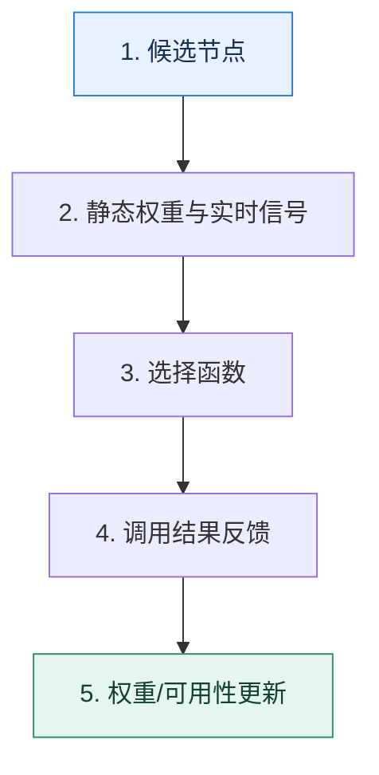

# 负载均衡｜不是平均分流，而是持续做出更好的节点选择

> 本课只回答一个问题：同一服务有多个节点时，怎样选择才能兼顾均衡、局部性和故障反馈？

这是一份独立学习稿。来源资料用于核对知识范围；下面的解释、推演、边界和图示均按工程学习路径重新组织，不依赖原页面也能完整阅读。

## 先补齐：建立正确的心智模型

轮询、随机、哈希、最少连接只是“选择函数”。真正的负载均衡还要定义输入信号：静态权重、实时延迟、并发数、调用结果、缓存归属和节点健康状态。

读这一课时，始终把“组件名字”换成三个可追踪对象：**谁发起动作、状态存在哪里、失败后由谁收敛**。这样遇到不同产品或版本，仍能用同一套模型判断。

## 本节精讲：机制是怎样一步步工作的

静态算法计算便宜但看不到节点瞬时状态；动态算法更贴近真实负载，却容易被噪声和慢反馈带偏。调用结果应更新节点的短期可用性，缓存亲和性则希望同一键尽量落到同一节点。一致性哈希通过环上后继节点减少扩缩容时的迁移，但虚拟节点数量和热点键仍会影响均匀度。选择算法必须和失败重试、缓存策略一起设计。

下面这张图只表达本课最重要的状态推进，蓝色是入口，绿色是可验收的终点；任一箭头失败，都要回到上文寻找重试、回退或人工处理的位置。

### 一次带数字的完整推演

节点 A/B/C 的稳定响应分别为 20/25/80ms。纯轮询会让三分之一请求长期变慢；最快响应算法若每次都选 A，又会把 A 压垮。可采用加权选择并用 EWMA 延迟做缓慢修正，例如权重 5:4:1；A 连续超时后临时降为 0，探测成功再逐步恢复。

数字的作用不是制造精确感，而是暴露容量和时间关系。把例子中的流量、延迟、分片数或版本号替换成自己的真实数据，方案可能会随之改变。

## 误区与失效边界

一致性哈希减少的是节点变动引发的键迁移，不保证请求量均匀，也不能代替健康检查。最少连接也不等于最少工作量：一个长查询和一个短查询都只算一个连接。

判断一个结论是否可靠，可以追问两次：**它依赖什么前提？前提失效后系统留下了什么状态？** 如果回答只能停在“框架会自动处理”，就还没有走到工程边界。

## 按讲解顺序重建知识链

来源稿覆盖的论证主线在这里被重建成四步，保留问题、推导、反例和收束，不沿用原页面措辞：

1. 先比较轮询、随机、哈希、最少连接、最少活跃和最快响应各自观察到的信号。
2. 再把调用结果纳入选择：失败节点应短期退出，而不是机械地继续轮询。
3. 结合本地缓存讨论一致性哈希，理解扩缩容时为什么只迁移部分键。
4. 最后把算法放回业务：请求有无状态、节点是否异构、缓存是否昂贵，决定了选择标准。

把四步连起来后，本课不是一个孤立结论，而是一条可以复演的因果链。需要回查课程覆盖范围时，可打开文末的来源稿；学习时以本页模型为主。

## 工程验证：把理解变成证据

记录每个节点的 `选择次数、成功率、P95、在途请求数、缓存命中率`。若总体延迟下降但单节点错误率升高，说明算法可能把压力集中到了“看起来最快”的节点。

### 状态检查表

| 步骤 | 状态或动作 | 需要留下的证据 |
| ---: | --- | --- |
| 1 | 候选节点 | 记录耗时、结果与异常分支，确认状态能进入下一步 |
| 2 | 静态权重与实时信号 | 记录耗时、结果与异常分支，确认状态能进入下一步 |
| 3 | 选择函数 | 记录耗时、结果与异常分支，确认状态能进入下一步 |
| 4 | 调用结果反馈 | 记录耗时、结果与异常分支，确认状态能进入下一步 |
| 5 | 权重/可用性更新 | 记录耗时、结果与异常分支，确认状态能进入下一步 |

检查表不是要求生产系统逐字采用这些字段，而是强迫设计者为每一步提供可观测结果。只有入口、没有终态的流程，最终都会形成无法解释的中间状态。

## 自我检查

为什么把所有请求都发给当前响应最快的节点，可能让总体响应越来越差？

因为观测到的快可能只是它尚未承压。流量集中会增加排队并改变节点状态；选择策略需要反馈平滑、并发约束和探测流量。

再做一次闭卷练习：不看上文画出状态图，并为其中任意两个箭头注入超时、进程崩溃或重复请求。如果你能预测最终状态和观测信号，这一课才真正从“听懂”变成“会用”。

## 来源与版本校准

- [查看来源稿（25 页资料整理）](../content/02-load-balancing.md)

来源稿只用于追溯知识范围，不是本学习稿的正文。具体产品的默认值、命令与内部实现会随版本变化；落地前应使用目标版本官方文档和故障演练再次确认。
