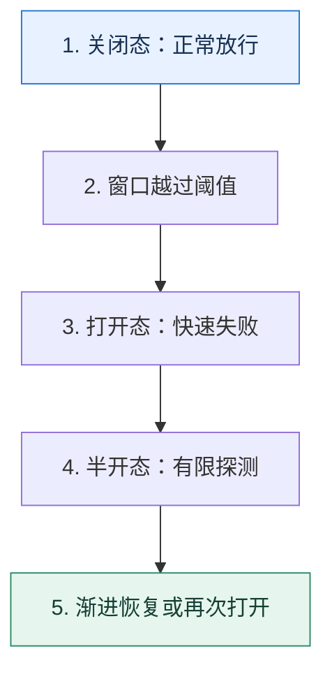

# 熔断器｜让失败依赖先休息，再用小流量确认恢复

> 本课只解决一个问题：下游持续失败时，调用方怎样避免把线程、连接和重试继续耗在无效请求上？

这不是原页面的缩写，也不是一组孤立结论。下面先建立一个能推演的最小世界，再把状态、数字和失败分支摊开，最后按来源讲解顺序覆盖全部知识线索。读完后，你应当能从 `关闭态：正常放行` 一直解释到 `渐进恢复或再次打开`，并说明中途任意一步失败会留下什么状态。

## 零基础入口：先建立本课的心智画面

熔断器是带记忆的状态机，不是一次失败就永久禁用。关闭态正常放行；达到失败条件进入打开态并快速失败；冷却后进入半开态，只允许少量探测。

先不要急着记组件名。只抓住四个问题：**现在手里有什么输入？下一步只做什么动作？哪个状态发生变化？变化后的结果交给谁？** 之后遇到新框架，只要这四个答案不变，核心机制就没有变。

### 放进一个足够小、可以手算的世界

最近 100 次调用中 65 次失败，超过 50% 阈值后熔断 10 秒。第 10 秒只放 5 个探测请求：若 5 个都成功，不应瞬间恢复 100% 流量，可以按 5%→20%→50%→100% 逐级放量；任一级再次恶化就退回打开态。

这个小世界故意只保留本课必需的对象。生产系统会有更多节点、线程、分片和异常，但数量增加不会改变这里的因果关系。先确认你能手算这个例子，再把数字替换成真实系统数据。

### 先预测，不要马上看结论

**半开态为什么不能直接恢复全部流量？**

先写下自己的判断，并指出你依赖的前提。文末自我检查会揭示答案；如果答案不同，回到下面的状态表找出第一个分叉点。

## 本节精讲：让机制一步一步发生

判定条件可用连续失败数、滑动窗口失败率或慢调用比例。打开态保护的是调用方资源和已经过载的下游。半开态必须限制探测并定义恢复门槛，否则大量实例会同时恢复、再次压垮下游，形成“开—关抖动”。冷却时间、最小样本数和半开并发度要依据下游恢复速度调节。

### 可见状态推进

| 当前步 | 现在发生的动作 | 下一步拿到什么 |
| ---: | --- | --- |
| 1 | 关闭态：正常放行 | 窗口越过阈值 |
| 2 | 窗口越过阈值 | 打开态：快速失败 |
| 3 | 打开态：快速失败 | 半开态：有限探测 |
| 4 | 半开态：有限探测 | 渐进恢复或再次打开 |
| 5 | 渐进恢复或再次打开 | 得到可核对的终态 |

图只承担一个任务：让你看清状态如何向前移动。它不意味着每一步必然成功；网络超时、进程退出、重复执行和数据竞争都可能让箭头停在中间，因此后面必须继续讨论失效边界。

### 一次带数字的完整推演

最近 100 次调用中 65 次失败，超过 50% 阈值后熔断 10 秒。第 10 秒只放 5 个探测请求：若 5 个都成功，不应瞬间恢复 100% 流量，可以按 5%→20%→50%→100% 逐级放量；任一级再次恶化就退回打开态。

数字不是装饰。它迫使我们回答容量、顺序、时间窗口或版本选择问题。若换一个数字就得出不同结论，真正的设计依据就是那个阈值，而不是某个中间件名称。

## 按讲解顺序重建知识链：完整来源讲解

下面按来源资料的教学顺序重新编排完整内容。转换页码、来源图片、推广信息、水印和个人宣传已经删除；原本围绕求职问答的角色与措辞改写为工程学习、方案评审和故障复盘语境。机制、算法、例子、反例、事故线索、评论补充和限制条件仍然保留。这里的作用是补齐知识覆盖，不取代前面的独立推演。

今天我们继续学习微服务架构，这节课我们讨论一个新的主题：熔断。

在微服务架构里面，熔断 - 限流 - 降级一般是连在一起讨论的，熔断作为微服务架构可用性保障的重要手段之一，是我们必须要掌握的，而且要能够说清楚自己在实践中是怎么利用熔断来提高系统的可用性的。

所以今天我就来给你梳理一下关于熔断有哪些知识是我们必须要掌握的，另外我还会在这个基础上给你提供一个全方位的熔断技术讨论方案，帮助你在技术讨论中脱颖而出。

### 先把机制拆开

熔断在微服务架构里面是指当微服务本身出现问题的时候，它会拒绝新的请求，直到微服务恢复。

看图，你会不会觉得有点困惑？服务端明明返回了错误的响应，怎么还说熔断提高了系统的可用性呢？

答案就是熔断可以给服务端恢复的机会。试想这么一个场景，CPU 使用率已经 100% 了，服务端因此触发了熔断。那么拒绝了新来的请求之后，服务端的 CPU 使用率就会在一段时间内降到 100% 以内。

回到熔断的基本定义上来，我们可以提炼出两个点进一步讨论。

怎么判断微服务出现了问题？怎么知道微服务恢复了？

接下来我们要讨论的进阶推导也是围绕这两个方面来进行的。

### 判定服务的健康状态

第一个问题，判断微服务是否出现了问题，它有点儿像我们在负载均衡里面讨论的动态算法。本质上也是要求你根据自己的业务来选择一些指标，代表这个服务器的健康程度。比如说一般可以考虑使用响应时间、错误率。

不管选择什么指标，都要考虑两个因素：一是阈值如何选择；二是超过阈值之后，要不要持续一段时间才触发熔断。

比如我们把响应时间作为指标，那么响应时间超过多少应该触发熔断呢？这是根据业务来决定的。比如说如果业务对响应时间的要求是在 1s 以内，那么你的阈值就可以设定在 1s，或者稍高一点，留点容错的余地也可以。

那么如果你的产品经理没跟你说这个业务对响应时间的要求，你就可以根据它的整体响应时间设定一个阈值，原则上阈值应该明显超过正常响应时间。比如你经过一段时间的观测之后，发现这个服务的 99 线是 1s，那么你可以考虑将熔断阈值设定为 1.2s。

那么是不是响应时间一旦超过了阈值就立刻熔断呢？一般也不是，而是要求响应时间超过一段时间之后才触发熔断。这主要是出于两个考虑，一个是响应时间可能是偶发性地突然增长；另外一个则是防止抖动。防止抖动这个问题后面我会和你进一步讨论。

那么这个“一段时间”究竟有多长，很大程度上就依赖个人经验了。如果时间过短，可能会频繁触发熔断，然后又恢复，再熔断，再恢复……反过来，如果时间过长，那就可能会导致该触发熔断的时候迟迟没有触发。

你可以根据经验来设定一个值，比如说三十秒或者一分钟。

当然最简单的做法就是超过阈值就直接触发熔断，但是采取这种策略就要更加小心抖动问题。

### 服务恢复正常

第二个问题，一个服务熔断之后要考虑恢复。比如说如果我们判断一个服务响应时间过长，进入了熔断状态。那么十分钟过后，已接收的请求已经被处理完了，即服务恢复正常了，那么它就要退出熔断状态，继续接收新请求。

因此在触发熔断之后，就要考虑检测服务是否已经恢复正常。

很可惜，这方面微服务框架都做得比较差。大多数情况下就是触发熔断之后保持一段时间，比如说一分钟，一分钟之后就认为服务已经恢复正常，继续处理新请求。

不过这里就涉及到我前面多次提到的抖动问题了。所谓抖动就是服务频繁地在正常 - 熔断两个状态之间切换。

引起抖动的原因是多样的，比如说前面提到的一旦超过阈值就进入熔断状态，或者我们这里说的恢复策略不当也会引起抖动。再比如刚刚我们提到的“一分钟后就认为服务已经恢复正常，继续处理新请求”就容易引发抖动问题。

你试想一下，如果本身熔断是高并发引起的。那么在一分钟后，并发依旧很高，这时候你一旦直接恢复正常，然后高并发的流量打过来，服务是不是又会触发熔断？

而要解决这个抖动问题，就需要在恢复之后控制住流量。比如说按照 10%、20%、30%……逐步递增，而不是立刻恢复 100% 的流量。

显然你能够看出来这种做法还是不够好。因为在这种逐步放开流量的措施下，依旧有请求因为熔断不会被处理。那么一个自然的想法就是，能不能让客户端来控制这个流量？简单来说就是服务端触发熔断之后，客户端就直接不再请求这个节点了，而是换一个节点。等到恢复了之后，客户端再逐步对这个节点放开流量。

当然可以，这也是我给出的进阶推导方案。

### 把知识转成可验证的工程判断

这些就是关于熔断你要了解的基础知识，不过如果你想要彻底掌握，还需要把这些知识点和实际工作联系在一起。所以我建议你在技术讨论之前，要弄清楚你所在的公司有没有用熔断来治理微服务。如果有，那么你需要进一步弄清楚下面这些情况。

1. 你们公司是怎么判断微服务出现故障的？比如说错误率、响应时间等等。
2. 你们公司是怎么判断微服务已经从故障中恢复过来的？
3. 在判断微服务已经恢复过来之后，有没有采取什么措施来防止抖动的问题？
关于熔断最佳的技术讨论策略是把它作为你构建一个高可用微服务架构的一环。例如你在介绍某一个微服务项目的时候可以这样说。

这是一个高可用的微服务系统，为了保证它的可用性，我采取了限流、降级、熔断等措施。

此外，如果技术评审者问到服务治理以及提高系统可用性的方法之类的问题，你也可以用熔断来解释。又或者技术评审者问到了限流或者降级，那么你就可以尝试把话题引到熔断上面。此外，如果技术评审者问到某个服务崩溃了怎么办？这个问题相当于是在问怎么提高可用性防止服务崩溃，以及万一服务真崩溃了你也要有措施防止拖累别的服务，那么熔断就是一个可用的手段。

如果你现在有时间，在学完这节课的内容之后，就可以尝试在公司内部落地一下熔断，并且可以试试我给你的进阶推导方案，来加深印象以及对细节的把控。

### 基本思路

当技术评审者问“你有没有用过熔断”或者“怎么保障微服务可用性”的时候，你就可以介绍你使用的熔断。但是要根据我在前置知识里面的提示，你在工程复盘时要说清楚什么时候判定服务需要触发熔断，为什么选用这个指标。

假如说你准备用响应时间来作为指标，那么你可以这么解释，关键词是持续超过阈值。

为了保障微服务的可用性，我在我的核心服务里面接入了熔断。针对不同的服务，我设计了不同的微服务熔断策略。

比如说最简单的熔断策略就是根据响应时间来进行。当响应时间超过阈值一段时间之后就会触发熔断。我一般会根据业务情况来选择这个阈值，例如，如果产品经理要求响应时间是1s，那么我会把阈值设定在 1.2s。如果响应时间超过 1.2s，并且持续三十秒，就会触发熔断。在触发熔断的情况下，新请求会被拒绝，而已有的请求还是会被继续处理，直到服务恢复正常。

这里技术评审者就可能有很多种问法，但是我在前置知识里面都讨论到了。虽然他的问题可能千奇百怪，不过万变不离这几问。

1. 这阈值还可以怎么确定？那么你就解释还可以根据观测到的响应时间数据来确定。
2. 这个持续三十秒是如何计算出来的？这个问题其实可以坦白解释是基于个人经验，然后你解释一下过长或者过短的弊端就可以了。
3. 为什么多了 0.2s？那么你可以解释是留了余地，防止偶发性的响应时间变长的情况。
4. 怎么判断服务已经恢复正常了？那么你可以解释等待一段固定的时间，然后尝试逐渐放开流量。
如果你在实践中根据自己的业务特征选用了一些比较罕见的指标，或者你设计的触发熔断的条件比较有特色，那么也可以用自己的实际方案。

这里我给你另外一个微创新的方案，关键词是缓存崩溃。

我还设计过一个很有趣的熔断方案。我的一个接口并发很高，对缓存的依赖度非常严重。所以我的熔断策略是要是缓存不可用，比如说 Redis 崩溃了，那么我就会触发熔断。这里如果我不熔断的话，请求会因为 Redis 崩溃而全部落到 MySQL 上，基本上会压垮 MySQL。

在触发熔断之后，我会额外开启一个线程（如果是 Go 就换成 Goroutine）持续不断地ping Redis。如果 Redis 恢复了，那么我就会退出熔断状态，新来的请求就不会被拒绝了。

这里我用 Redis 来作为例子，你可以将 Redis 替换为 MemCache 之类的，甚至你还可以将缓存替换成你业务上任何一个关键的第三方依赖。

这个方案里面我还留了一些可以引导的点。

缓存问题：在这里我提到了 Redis 失效，这种情况类似于缓存雪崩，那么你很自然地就可以把话题引导到如何处理缓存击穿、穿透、雪崩这些经典问题上。高可用 MySQL：我在这里使用的是熔断来保护 MySQL，类似地，你也可以考虑用限流来保护 MySQL。

最后我提到了退出熔断状态，如果技术评审者了解抖动问题，那么他就肯定会追问“你是一次性放开全部流量吗？”，那么你就可以阐述抖动的问题，然后总结一下。

我这种逐步放开流量的方案其实还是有缺陷的，还有一些更加高级的做法，但是需要负载均衡来配合。

这个总结就是你留下的追问入口，为了引出下面我给你展示的进阶推导方案。

### 进一步推导：怎样把机制用进真实系统

前面的基本思路如果你能答好，差不多也能通过跟熔断有关的技术讨论了，而且有不小的概率能够给技术评审者留下你技术很不错的印象。但是你还可以进一步展示你在服务治理和服务可用性保证上的独到见解。这就需要用到下面我要给你讲的综合了负载均衡算法和熔断措施的方案了。

这个方案很简单，在落地的时候也不是很难。

我在讲抖动与恢复的时候提到，恢复的时候可以逐步放开流量。那么你是否注意到，这个放开流量是在服务端处理的，也就是说服务端还是收到了 100% 的流量，只不过只有部分流量会被放过去并且被正常处理。

那么一个自然的想法就是为什么不直接让客户端来控制这个流量呢？

进一步结合我在负载均衡里面谈到的根据调用结果来调整负载均衡策略的讨论，是不是可以让客户端也采用这种负载均衡策略？答案是可以的。

整体流程：

1. 服务端在触发熔断的时候，会返回一个代表熔断的错误。
2. 客户端在收到这个错误之后，就会把这个服务端节点暂时挪出可用节点列表。后续所有的新请求都不会再打到这个触发了熔断的服务端节点上了。
3. 客户端在等待一段时间后，逐步放开流量。
4. 如果服务端正常处理了新来的请求，那么客户端就加大流量。
5. 如果服务端再次返回了熔断响应，那么客户端就会再一次将这个节点挪出可用列表。
6. 如此循环，直到服务端完全恢复正常，客户端也正常发送请求到该服务端节点。

那么这里可以这样解释，关键词是负载均衡。

整体思路是利用负载均衡来控制流量。如果一个服务端节点触发了熔断，那么客户端在做负载均衡的时候就可以将这个节点挪出可用列表，后续请求会发给别的节点。在经过一段时间之后，客户端可以尝试发请求给该节点。如果该节点正确处理了，那客户端就可以加大流量。否则客户端就要再一次等待一段时间。

到这里你还可以自己杠自己一下，就是万一所有可用节点都触发熔断了，应该怎么办？你就可以这样来说。

这个方案是需要兜底的，比如说如果因为某些原因数据库出问题，导致某个服务所有的节点都触发了熔断，那么客户端就完全没有可用节点了。不过这个问题本身熔断解决不了，负载均衡也解决不了，只能通过监控告警之后人手工介入处理了。

### 本节原始知识线索收束

这节课我们主要解决的是熔断问题。我们讨论了熔断的基本概念，怎么判定服务是否熔断，以及熔断后如何恢复的问题。其中的难点是抖动的问题，为了防止抖动，我们需要合理判定节点的健康状况，在恢复期间尽可能等待一段时间，然后逐步放开流量。

最后我给出了一个综合运用负载均衡和熔断的方案，重点在于客户端控制流量，并根据服务端节点的状况来操作可用节点列表。你在学习的时候注意把进阶推导方案和前面学习的负载均衡内容结合在一起，同时我也非常建议你在实际工作中尝试应用一下熔断，让它来保护你的系统，提高系统可用性。

同样地，我也整理这节课的思维导图，你可以参考。

除了熔断相关知识，这节课我还希望你学会综合运用各种技术手段来设计精巧的方案。在这里我给出了一个负载均衡 + 熔断的方案，后续你也可以看到更多这个技巧的应用。

最后我再强调一下，熔断技术讨论的最好方案是把它作为你构建高可用微服务的一环，也就是说，你可以认为前面讨论的负载均衡，还有接下来要讨论的限流、降级、隔离等措施，都是你整个高可用方案的一环。

### 继续推演

### 补充讨论与边界校准

补充讨论：

讲解补充：赞！基本上就是靠猜和试探，试探也是固定套路，你已经总结得很对了。你考虑得非常深远了。这种健康中心的想法应该说之前也有人探讨过，后来就是发现监控做得好，不太需要这么一个健康中心。比如说我们的监控都会采集各个机器的 CPU，内存之类的东西。所以现在其实是缺了一个能够综合运用各种监控指标打分的东西，但是一直以来也没有谁研究出来了通用的打分机制——适合各种业务的打分机制。早期我还想过，能不能借助 AI 来学习人判断节点是否健康的思路，然后让 AI 来监控、打分、执行容错。还可以进一步整合日志分析、流量预判等，做得非常高级。当然，这都是吹牛逼，我稍稍尝试过就放弃了。

补充讨论： : 什么是「熔断」在微服务架构里面是指当微服务本身出现问题的时候，它会拒绝新的请求，直到微服务恢复。

Why：微服务架构为什么要使用「熔断」可以给服务端恢复的机会个人理解：「熔断」机制就是在系统高负载/ 服务崩溃的时候，拒绝新的请求。相当于提供给服务/系统一段“喘息”时间，“喘息”时间的意义在于：

1. 服务端不再接受新请求，服务的负载可以降低下来，防止服务雪崩
2. 服务端崩溃的情况下，可以重启服恢复务，可以理解为是一种故障转移（failover）手段
3. 上游服务收到「熔断」信息返回，可以进行兜底方案处理：例如业务补偿、请求转发、同步转异步等
When：什么时候进行和结束「熔断」微服务本身「出现问题」的时候「熔断」的开始和结束时机判断就在于以下问题的判断：

1. 判断微服务出现问题
2. 判断微服务恢复服务
「熔断」开启：判断出现问题判断健康状态

1. 选择业务「指标」每个微服务实际上都是附带着业务属性（微服务的划分是根据业务的职责和边界来划分）所以可以根据业务来选择「指标」来代表微服务的健康状态。常见的指标可以是：「响应时间的99线」，「错误率」等
2. 设置合适的「阈值」这也是根据业务来决定的。假设我们选择「响应时间」作为指标。● 根据业务要求的「指标」阈值设置● 观察业务整体的「指标」来设置
3. 设置持续多长时间才触发「熔断」需要持续一段时间之后才触发「熔断」，因为：● 防止「指标」 偶发性的突然增长● 防止「服务抖动」「持续时间」的设置，依赖个人经验

「熔断」结束：判断恢复服务现状：大多数是触发「熔断」后保持「一段时间」，就认为服务已经恢复正常，继续处理新请求存在的问题：「抖动」解决方案：

1. 「服务端控制流量」：恢复服务之后，比如说10%，20%逐步递增，不是100%恢复流量这种做法不够好。依旧有请求因为熔断不会被处理。
2. 「客户端控制流量」：服务端熔断后，客户端不再请求这个节点，而是换一个节点。恢复之后，客户端逐步放开流量
进阶推导方案：客户端结合「负载均衡」控制流量，解决「抖动」问题

Question技术讨论中，经常在你讲完一些场景解决方案之后，技术评审者就会问你有自己实现吗？或者有没有落地在自己的项目中？如果解释有，技术评审者就会问遇到过什么问题没有？你解释没有，感觉自己给技术评审者的感觉又只是停留在理论上，没有实践经验。想问老师，对于类似这些问题，应该怎么去破局呢？

讲解补充：我愿称你为课代表，总结太强了！

Question：其实我在技术讨论的也会有这种困境，毕竟有些业务我确实没有解决过，只是听说过。

这里要分情况讨论：

1. 技术评审者问的场景是你确实要解决的，不过你用了 A 方案，但是你技术讨论的时候还解释了 B，C 方案。这种，我一般就是先讲自己的 A 方案，讲完之后看情况，要是技术评审者觉得 A 不符合口味，就接着讲自己了解的 B 方案和 C 方案。正常来说，在做方案选型的时候，我多半比较过 B 和 C，但是最终选了 A。我只需要讲完 B C 之后讲一下自己当初的决策理由就可以。因为本身我落地的是 A，B 和 C 被我放弃了，问题也不太大。
2. 如果是这个场景跟我业务没有关系，比如说我的项目经历是支付方向，问我的场景是订单方向，我也就只能把公司的解决方案拿出来说说。问到一些答不出来的细节很正常，毕竟我项目经历又不是这个地方的。不过一般要避免技术评审者不按套路出牌，也就是最好别让自己陷入这种境地。
你在技术讨论前，可以提前准备一下各种方案，包括如果真落地可能遇到什么问题，又或者你去搜搜业界落地的技术博客，也能解释上来一些细节性的问题。

4补充讨论：

讲解补充：现在的主流是根据错误率来判断要不要熔断，这个错误可以是业务错误，也可以是系统错误（比如中间件本身的错误）。当错误率比较高的时候就会触发熔断。我之前就用过这种策略，比较好实现。

补充讨论：

讲解补充：严格来说，如果你的异常机制（Go 中的错误机制）设计得好，你是知道的。比如说，你们有严格的错误码机制，每一个业务都有自己的错误码前缀，那么你根据错误码就知道究竟是谁出错了，也就是你能区别是自身、还是下游。而如果没有这种机制，你基本上判断不出来是自身，还是下游引起的。这时候对你来说已经不重要了，你直接将自身熔断了就可以。而单机故障还是集群故障，你站在调用者角度永远都是认为下游是单机故障。比如说 A 调用 B，如果A 调不通，它只会认为是它调用的 B 的那个节点崩了，而不会认为 B 整个集群都崩了。

集群故障是需要第三方来监控的。比如说你有 prometheus 监控，你发现所有的节点都各种超时，或者异常很多，这样你才能判定是整个集群都出问题了。

如果你利用的是负载均衡 fail-over 机制，或者你的客户端会给服务端发送心跳，那么服务端所有节点都调不通，也可以认为是集群崩溃了。

3补充讨论： 这篇文章里的客户端是指什么 app和电脑的话做这些策略成本很高吧讲解补充：这里的客户端基本上都是指服务调用中的客户端。比如说 A 调用 B 的接口，那么 A 就是客户端。

整个专栏，基本上都是这种语义，如果是APP 之类的，我一般都会直接说 APP，或者用户。

3补充讨论： 在进阶推导一节 是否可以用网关来解决? 由网关（比如kong）不管是检测各个服务节点的主要指标也好 还是服务端主动上报需要熔断信息也好。 如果节点健康就允许开放节点 如果不健康就下架节点保护服务。

讲解补充：可以的。而且网关做这种还更加合适，因为网关知道有多少个节点，也知道每一个节点的负载，调度的灵活性和准确性都很好。唯一的缺陷就是查询经过网关会有性能损耗，并且网关本身容易成为性能和可用性的瓶颈，

2补充讨论：

讲解补充：会！你已经领悟到了技术讨论另外一个可以提及的进阶推导。正常来说，你后端的节点处理能力是有冗余的，那么一两个节点熔断，这些冗余的处理能力刚好够用。

但是如果你要是大部分节点都已经快要撑不住流量了，那么你这时候一两台机器熔断，就会导致其它节点也撑不住。

所以这种流量的场景，用限流会更好。

2补充讨论：

从整个系统来看，使用客户端控制流量的方案使得整个系统的可用性更好；客户端通过调用返回情况来调整权重，交互的过程实际上也是一个考察对方恢复情况的过程，然后根据你的恢复情况来加大流量，从而避免服务器又再次陷入熔断；如果使用服务端逐步放开流量的方案，机械地按比例的放开很可能会让服务器再次陷入熔断。

讲解补充：对的！按比例是偷懒的做法，你讲的这是基于反馈的流量恢复，是更加高级的方案。

补充讨论：

1. "这个持续三十秒是如何计算出来的？这个问题其实可以坦白解释是基于个人经验，然后你解释一下过长或者过短的弊端就可以了。"，技术评审者要是问，从哪些经验了解到要怎么设计的呢，15秒或者35秒不行吗，这时候该怎么解释呢
2. 熔断是服务端去提示客户端的话，现在也就有普遍使用的熔断中间件么，还是说是在服务器代码内实现的呢
讲解补充：1. 35 秒也可以，差个 5 秒又没多大影响。至于 15 秒，看看效果怎样就可以。如果大部分时候 15 秒之后机器都还没恢复过来，那就要调大了。

2. 不是……现在的熔断，都是服务端直接熔断，根本不通知。你要利用类似于 grpc 的header 的机制，返回一个 Header 给客户端，客户端要配合检查；又或者你返回一个特定的错误码，也要客户端检测。
1补充讨论：

后，客户端收到熔断请求，此服务端节点被移出可用列表，此服务端节点在注册中心肯定也是不可用的，那么是不是可以谁都不去探测，等服务端恢复后，主动向注册中心上报自己恢复了。客户端要做的是等待一段时间后，定时向注册中心询问，某个服务端节点是不是恢复了。如果注册中心出问题了，这个时候客户端是一定要根据可用节点列表探测服务端是否可用的，顺带着就可以把触发熔断的服务端节点探测一下讲解补充：是的，熔断也可以这么做。应该说，熔断、限流、降级都可以这么做。推而广之，任何原因导致服务端不可用，或者说有性能问题，都可以在负载均衡里面的将它暂时挪出可用列表。

1

## 把完整讲解收束成一条因果链

1. 先用失败计数或失败率判断健康状态，说明最小样本数为何重要。
2. 再解释打开态如何阻止资源继续堆积，并为下游提供恢复空间。
3. 用半开态处理恢复，但限制探测并避免所有调用方同步放量。
4. 把抖动问题归因于阈值、冷却、探测规模和恢复斜率，而不是简单增加等待时间。

把这几步连接起来时，不要省略“为什么”。最终结论只有在前提、状态变化和失败代价都说得清楚时才可靠。

## 误区与失效边界

熔断不是降级本身。熔断决定“还要不要调用下游”，降级决定“不调用以后返回什么”。熔断也不能修复下游，它只改变流量和失败方式。

再加一条通用但必须落实到本课对象上的边界：机制只能处理它看得见的信号。若输入指标失真、状态没有持久化、错误被吞掉，或者补偿没有幂等保护，再成熟的框架也只能基于错误证据作决定。

### 三种故障注入方式

| 故障 | 要观察什么 | 不能接受的解释 |
| --- | --- | --- |
| 在第 2 步前让依赖超时 | 是否停在可重试状态，是否消耗完上游预算 | “框架稍后会处理” |
| 在状态写入后让进程退出 | 重启后能否识别已完成与待继续动作 | “再执行一次应该没事” |
| 对同一输入并发执行两次 | 是否出现重复副作用、顺序颠倒或覆盖 | “概率很低” |

## 工程验证：把理解变成可以复查的证据

压测时画出四条时间序列：下游错误率、熔断状态、放行 QPS、调用方线程池占用。只有状态变化能对应资源释放，熔断才真正起效。

| 步骤 | 状态或动作 | 最少应留下的证据 |
| ---: | --- | --- |
| 1 | 关闭态：正常放行 | 开始时间、结束时间、输入标识、结果状态、异常原因 |
| 2 | 窗口越过阈值 | 开始时间、结束时间、输入标识、结果状态、异常原因 |
| 3 | 打开态：快速失败 | 开始时间、结束时间、输入标识、结果状态、异常原因 |
| 4 | 半开态：有限探测 | 开始时间、结束时间、输入标识、结果状态、异常原因 |
| 5 | 渐进恢复或再次打开 | 开始时间、结束时间、输入标识、结果状态、异常原因 |

验证时同时记录成功路径和失败路径。只证明“正常时能跑通”不能说明设计可靠；至少要让一次超时、一次进程退出和一次重复请求可重现，并能根据日志或指标解释最后状态。

## 学完检查：闭卷画出本课

你现在应该能独立完成四件事：

1. 用自己的话说出本课唯一问题，不使用产品名也能解释。
2. 复算上面的具体例子，并指出哪个输入改变会让结论改变。
3. 沿 Mermaid 图注入一次失败，预测系统停在哪里以及由谁收敛。
4. 说出本课机制不保证什么，并给出一个反例。

## 自我检查

半开态为什么不能直接恢复全部流量？

少量成功只能说明下游在低负载下可用，不能证明它能承受原流量。渐进放量用反馈验证容量，避免刚恢复就再次过载。

怎样证明自己不是只记住了名词？

把 `关闭态：正常放行` 的一个真实输入写出来，逐步记录到 `渐进恢复或再次打开`。然后在中间任意一步制造失败；如果你能解释当前状态、下一责任方、可观测证据和恢复边界，就已经拥有可以迁移的工程模型。

## 来源与事实校准

- [查看完整来源稿（本地 20 页资料）](../content/03-circuit-breaker.md)

### 当前事实校准

以当前 Resilience4j 文档为例，关闭态既可以使用按调用次数统计的滑动窗口，也可以使用按时间统计的滑动窗口；失败率或慢调用率都要在达到最小样本数以后才有资格触发状态切换。打开态等待结束后进入半开态时，只允许配置数量的探测调用，其余调用继续被拒绝。这里校准的是一种具体实现：不要把课程中的“固定等一分钟”误认为熔断器唯一的恢复算法，也不要把某个版本默认值当作通用建议。

- [Resilience4j · CircuitBreaker](https://resilience4j.readme.io/docs/circuitbreaker)
- [Resilience4j · Metrics and events](https://resilience4j.readme.io/docs/getting-started-3)

来源稿用于核对覆盖范围，不随公开站点发布。产品默认值和具体内部行为可能随版本变化；落地时应使用目标版本的官方文档、可运行实验和故障演练校准。本学习稿中的零基础入口、状态推演、故障矩阵和工程验证属于编辑补充，不冒充来源讲解者的原话。
