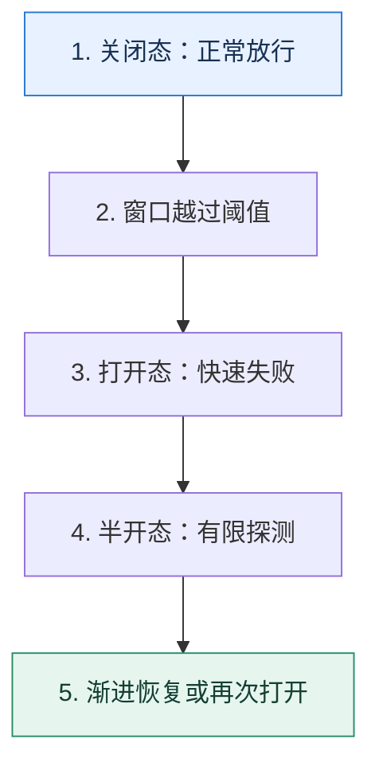

# 熔断器｜让失败依赖先休息，再用小流量确认恢复

> 本课只回答一个问题：下游持续失败时，调用方怎样避免把线程、连接和重试继续耗在无效请求上？

这是一份独立学习稿。来源资料用于核对知识范围；下面的解释、推演、边界和图示均按工程学习路径重新组织，不依赖原页面也能完整阅读。

## 先补齐：建立正确的心智模型

熔断器是带记忆的状态机，不是一次失败就永久禁用。关闭态正常放行；达到失败条件进入打开态并快速失败；冷却后进入半开态，只允许少量探测。

读这一课时，始终把“组件名字”换成三个可追踪对象：**谁发起动作、状态存在哪里、失败后由谁收敛**。这样遇到不同产品或版本，仍能用同一套模型判断。

## 本节精讲：机制是怎样一步步工作的

判定条件可用连续失败数、滑动窗口失败率或慢调用比例。打开态保护的是调用方资源和已经过载的下游。半开态必须限制探测并定义恢复门槛，否则大量实例会同时恢复、再次压垮下游，形成“开—关抖动”。冷却时间、最小样本数和半开并发度要依据下游恢复速度调节。

下面这张图只表达本课最重要的状态推进，蓝色是入口，绿色是可验收的终点；任一箭头失败，都要回到上文寻找重试、回退或人工处理的位置。

### 一次带数字的完整推演

最近 100 次调用中 65 次失败，超过 50% 阈值后熔断 10 秒。第 10 秒只放 5 个探测请求：若 5 个都成功，不应瞬间恢复 100% 流量，可以按 5%→20%→50%→100% 逐级放量；任一级再次恶化就退回打开态。

数字的作用不是制造精确感，而是暴露容量和时间关系。把例子中的流量、延迟、分片数或版本号替换成自己的真实数据，方案可能会随之改变。

## 误区与失效边界

熔断不是降级本身。熔断决定“还要不要调用下游”，降级决定“不调用以后返回什么”。熔断也不能修复下游，它只改变流量和失败方式。

判断一个结论是否可靠，可以追问两次：**它依赖什么前提？前提失效后系统留下了什么状态？** 如果回答只能停在“框架会自动处理”，就还没有走到工程边界。

## 按讲解顺序重建知识链

来源稿覆盖的论证主线在这里被重建成四步，保留问题、推导、反例和收束，不沿用原页面措辞：

1. 先用失败计数或失败率判断健康状态，说明最小样本数为何重要。
2. 再解释打开态如何阻止资源继续堆积，并为下游提供恢复空间。
3. 用半开态处理恢复，但限制探测并避免所有调用方同步放量。
4. 把抖动问题归因于阈值、冷却、探测规模和恢复斜率，而不是简单增加等待时间。

把四步连起来后，本课不是一个孤立结论，而是一条可以复演的因果链。需要回查课程覆盖范围时，可打开文末的来源稿；学习时以本页模型为主。

## 工程验证：把理解变成证据

压测时画出四条时间序列：下游错误率、熔断状态、放行 QPS、调用方线程池占用。只有状态变化能对应资源释放，熔断才真正起效。

### 状态检查表

| 步骤 | 状态或动作 | 需要留下的证据 |
| ---: | --- | --- |
| 1 | 关闭态：正常放行 | 记录耗时、结果与异常分支，确认状态能进入下一步 |
| 2 | 窗口越过阈值 | 记录耗时、结果与异常分支，确认状态能进入下一步 |
| 3 | 打开态：快速失败 | 记录耗时、结果与异常分支，确认状态能进入下一步 |
| 4 | 半开态：有限探测 | 记录耗时、结果与异常分支，确认状态能进入下一步 |
| 5 | 渐进恢复或再次打开 | 记录耗时、结果与异常分支，确认状态能进入下一步 |

检查表不是要求生产系统逐字采用这些字段，而是强迫设计者为每一步提供可观测结果。只有入口、没有终态的流程，最终都会形成无法解释的中间状态。

## 自我检查

半开态为什么不能直接恢复全部流量？

少量成功只能说明下游在低负载下可用，不能证明它能承受原流量。渐进放量用反馈验证容量，避免刚恢复就再次过载。

再做一次闭卷练习：不看上文画出状态图，并为其中任意两个箭头注入超时、进程崩溃或重复请求。如果你能预测最终状态和观测信号，这一课才真正从“听懂”变成“会用”。

## 来源与版本校准

- [查看来源稿（20 页资料整理）](../content/03-circuit-breaker.md)

来源稿只用于追溯知识范围，不是本学习稿的正文。具体产品的默认值、命令与内部实现会随版本变化；落地前应使用目标版本官方文档和故障演练再次确认。
