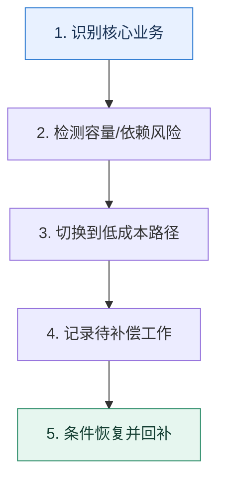

# 服务降级｜资源不足时主动舍弃次要能力

> 本课只回答一个问题：系统容量或依赖不足时，怎样让核心路径继续工作而不是一起崩溃？

这是一份独立学习稿。来源资料用于核对知识范围；下面的解释、推演、边界和图示均按工程学习路径重新组织，不依赖原页面也能完整阅读。

## 先补齐：建立正确的心智模型

降级先要画业务优先级，而不是先选技术。核心路径、可延迟路径、可返回旧数据路径和可关闭路径必须由业务损失决定。

读这一课时，始终把“组件名字”换成三个可追踪对象：**谁发起动作、状态存在哪里、失败后由谁收敛**。这样遇到不同产品或版本，仍能用同一套模型判断。

## 本节精讲：机制是怎样一步步工作的

降级可以发生在功能、数据新鲜度、计算精度或同步方式上。读写服务中可暂停非关键写入，快慢路径中可跳过慢速精确计算，外部依赖中可返回缓存或排队稍后处理。降级开关需要触发信号、审批边界、恢复条件和补偿流程；没有恢复与补偿的“临时关闭”会变成永久数据债务。

下面这张图只表达本课最重要的状态推进，蓝色是入口，绿色是可验收的终点；任一箭头失败，都要回到上文寻找重试、回退或人工处理的位置。

### 一次带数字的完整推演

大促时库存扣减、下单和支付是核心链路，历史报表、个性化推荐和退款进度刷新可延后。若数据库写入达到安全上限，推荐接口返回上一小时缓存；退款请求仍受理并写入队列，页面显示“已受理，稍后处理”，而不是直接丢弃。

数字的作用不是制造精确感，而是暴露容量和时间关系。把例子中的流量、延迟、分片数或版本号替换成自己的真实数据，方案可能会随之改变。

## 误区与失效边界

降级不等于返回成功。无法完成的写操作若伪装成成功，会破坏业务语义；应返回可解释状态并保证后续补偿。它也不同于限流：限流控制进入量，降级缩减单个请求消耗的能力。

判断一个结论是否可靠，可以追问两次：**它依赖什么前提？前提失效后系统留下了什么状态？** 如果回答只能停在“框架会自动处理”，就还没有走到工程边界。

## 按讲解顺序重建知识链

来源稿覆盖的论证主线在这里被重建成四步，保留问题、推导、反例和收束，不沿用原页面措辞：

1. 先区分降级与熔断，明确一个处理替代结果、一个处理下游调用。
2. 从功能关闭、读写拆分、快慢路径和异步化四种形态理解降级。
3. 用退款等可延迟业务说明为什么停的是实时处理而不是业务承诺。
4. 最后补齐开关治理：谁能开启、何时恢复、遗漏数据怎样补偿。

把四步连起来后，本课不是一个孤立结论，而是一条可以复演的因果链。需要回查课程覆盖范围时，可打开文末的来源稿；学习时以本页模型为主。

## 工程验证：把理解变成证据

为每个候选功能写降级卡：`业务损失、节省资源、返回语义、数据补偿、最大持续时间`。节省资源不明确或补偿不可执行的方案不能上线。

### 状态检查表

| 步骤 | 状态或动作 | 需要留下的证据 |
| ---: | --- | --- |
| 1 | 识别核心业务 | 记录耗时、结果与异常分支，确认状态能进入下一步 |
| 2 | 检测容量/依赖风险 | 记录耗时、结果与异常分支，确认状态能进入下一步 |
| 3 | 切换到低成本路径 | 记录耗时、结果与异常分支，确认状态能进入下一步 |
| 4 | 记录待补偿工作 | 记录耗时、结果与异常分支，确认状态能进入下一步 |
| 5 | 条件恢复并回补 | 记录耗时、结果与异常分支，确认状态能进入下一步 |

检查表不是要求生产系统逐字采用这些字段，而是强迫设计者为每一步提供可观测结果。只有入口、没有终态的流程，最终都会形成无法解释的中间状态。

## 自我检查

为什么把写请求统一返回“成功”不是一种安全降级？

因为系统没有建立对应事实，调用方却会按成功继续推进，造成不可修复的不一致。安全降级必须保持语义诚实，并给出受理、排队或失败状态。

再做一次闭卷练习：不看上文画出状态图，并为其中任意两个箭头注入超时、进程崩溃或重复请求。如果你能预测最终状态和观测信号，这一课才真正从“听懂”变成“会用”。

## 来源与版本校准

- [查看来源稿（22 页资料整理）](../content/04-degradation.md)

来源稿只用于追溯知识范围，不是本学习稿的正文。具体产品的默认值、命令与内部实现会随版本变化；落地前应使用目标版本官方文档和故障演练再次确认。
