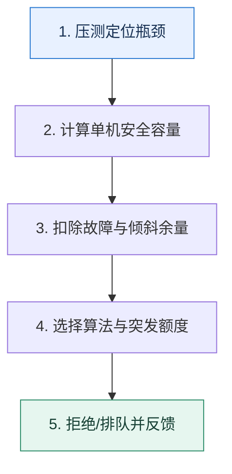

# 限流｜先算安全容量，再决定怎样拒绝流量

> 本课只回答一个问题：限流阈值应该来自什么证据，而不是凭经验写一个整数？

这是一份独立学习稿。来源资料用于核对知识范围；下面的解释、推演、边界和图示均按工程学习路径重新组织，不依赖原页面也能完整阅读。

## 先补齐：建立正确的心智模型

限流算法回答“流量怎样通过”，阈值回答“系统能安全处理多少”。容量要从瓶颈资源、目标延迟、并发模型、请求大小和安全余量推导。

读这一课时，始终把“组件名字”换成三个可追踪对象：**谁发起动作、状态存在哪里、失败后由谁收敛**。这样遇到不同产品或版本，仍能用同一套模型判断。

## 本节精讲：机制是怎样一步步工作的

固定窗口简单但边界处可出现双倍突发；滑动窗口更平滑；漏桶稳定输出；令牌桶允许积累令牌以吸收短时突发。阈值需通过单机压测得到并在集群规模、故障冗余和流量分布下折算。限流后还要明确快速失败、排队、降级或重试提示，避免客户端无退避重试制造更大流量。

下面这张图只表达本课最重要的状态推进，蓝色是入口，绿色是可验收的终点；任一箭头失败，都要回到上文寻找重试、回退或人工处理的位置。

### 一次带数字的完整推演

某接口平均占用 CPU 20ms，4 核机器理论上限约为 `4×1000/20=200 QPS`。压测发现超过 160 QPS 后 P99 急升，因此以 140 QPS 作为单机安全值。10 台集群不能直接设 1400：若要容忍 2 台故障，应按 8 台计算约 1120，并继续为流量倾斜留余量。

数字的作用不是制造精确感，而是暴露容量和时间关系。把例子中的流量、延迟、分片数或版本号替换成自己的真实数据，方案可能会随之改变。

## 误区与失效边界

平均耗时推导的是粗略上限，不包含锁竞争、I/O 排队、GC 和长尾。令牌桶的突发能力也不是额外容量，只是把前一段空闲额度挪到当前使用。

判断一个结论是否可靠，可以追问两次：**它依赖什么前提？前提失效后系统留下了什么状态？** 如果回答只能停在“框架会自动处理”，就还没有走到工程边界。

## 按讲解顺序重建知识链

来源稿覆盖的论证主线在这里被重建成四步，保留问题、推导、反例和收束，不沿用原页面措辞：

1. 从固定窗口、滑动窗口、漏桶和令牌桶区分稳定速率与突发能力。
2. 明确限流对象可以是请求数、并发数、用户、租户或请求大小。
3. 用响应时间和核心数估算阈值，再用压测曲线修正理论值。
4. 最后设计拒绝后的客户端退避和降级，防止限流器外形成重试风暴。

把四步连起来后，本课不是一个孤立结论，而是一条可以复演的因果链。需要回查课程覆盖范围时，可打开文末的来源稿；学习时以本页模型为主。

## 工程验证：把理解变成证据

容量报告至少保存 `QPS、并发、平均/P95/P99、CPU、连接池、错误率` 六组数据，并标出曲线开始非线性上升的位置。阈值来自拐点之前，而不是错误率达到 100% 的极限。

### 状态检查表

| 步骤 | 状态或动作 | 需要留下的证据 |
| ---: | --- | --- |
| 1 | 压测定位瓶颈 | 记录耗时、结果与异常分支，确认状态能进入下一步 |
| 2 | 计算单机安全容量 | 记录耗时、结果与异常分支，确认状态能进入下一步 |
| 3 | 扣除故障与倾斜余量 | 记录耗时、结果与异常分支，确认状态能进入下一步 |
| 4 | 选择算法与突发额度 | 记录耗时、结果与异常分支，确认状态能进入下一步 |
| 5 | 拒绝/排队并反馈 | 记录耗时、结果与异常分支，确认状态能进入下一步 |

检查表不是要求生产系统逐字采用这些字段，而是强迫设计者为每一步提供可观测结果。只有入口、没有终态的流程，最终都会形成无法解释的中间状态。

## 自我检查

令牌桶每秒产生 100 个令牌并最多积累 20 个，为什么某一秒能通过 120 个请求却不能长期保持 120 QPS？

前 20 个来自此前空闲时积累的额度。消耗完后长期补充速率仍是每秒 100 个，持续 120 QPS 会不断被拒绝。

再做一次闭卷练习：不看上文画出状态图，并为其中任意两个箭头注入超时、进程崩溃或重复请求。如果你能预测最终状态和观测信号，这一课才真正从“听懂”变成“会用”。

## 来源与版本校准

- [查看来源稿（25 页资料整理）](../content/05-rate-limiting.md)

来源稿只用于追溯知识范围，不是本学习稿的正文。具体产品的默认值、命令与内部实现会随版本变化；落地前应使用目标版本官方文档和故障演练再次确认。
