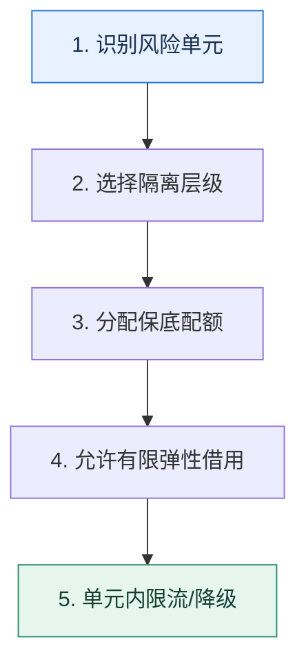

# 隔离｜先画清故障边界，再分配独立资源

> 本课只回答一个问题：一个租户、任务或依赖变慢时，怎样避免耗尽全系统的公共资源？

这是一份独立学习稿。来源资料用于核对知识范围；下面的解释、推演、边界和图示均按工程学习路径重新组织，不依赖原页面也能完整阅读。

## 先补齐：建立正确的心智模型

隔离不是简单多建几个线程池，而是让不同风险单元不能无上限地争抢同一资源。风险单元可按租户、业务、实例、机房、依赖或任务类型划分。

读这一课时，始终把“组件名字”换成三个可追踪对象：**谁发起动作、状态存在哪里、失败后由谁收敛**。这样遇到不同产品或版本，仍能用同一套模型判断。

## 本节精讲：机制是怎样一步步工作的

隔离层级越靠近物理资源，故障边界越清晰但成本越高。机房和实例隔离适合强 SLA；线程池、连接池和信号量隔离成本低但仍共享 CPU、内存和网络。慢任务应独立队列与工作池，第三方依赖应拥有独立连接池和超时预算。隔离容量还要防止一边闲置、一边饥饿，可设置保底配额加可借用的弹性池。

下面这张图只表达本课最重要的状态推进，蓝色是入口，绿色是可验收的终点；任一箭头失败，都要回到上文寻找重试、回退或人工处理的位置。

### 一次带数字的完整推演

普通用户与 VIP 共用 100 个数据库连接。一次普通用户报表把连接占满，VIP 查询也会排队。改为 VIP 保底 20、普通 60、弹性 20：平时双方可借弹性连接；拥塞时 VIP 至少保有 20 个，普通请求在自己的边界内排队或降级。

数字的作用不是制造精确感，而是暴露容量和时间关系。把例子中的流量、延迟、分片数或版本号替换成自己的真实数据，方案可能会随之改变。

## 误区与失效边界

隔离不增加总容量，只控制容量被谁消耗。分出过多小池会降低利用率并增加配置负担；如果所有池最终仍争用同一个已饱和的数据库，隔离只能保护优先级，不能消除瓶颈。

判断一个结论是否可靠，可以追问两次：**它依赖什么前提？前提失效后系统留下了什么状态？** 如果回答只能停在“框架会自动处理”，就还没有走到工程边界。

## 按讲解顺序重建知识链

来源稿覆盖的论证主线在这里被重建成四步，保留问题、推导、反例和收束，不沿用原页面措辞：

1. 从机房、实例、分组到线程池和连接池，比较隔离强度与成本。
2. 用 VIP 与普通流量解释为什么需要独立资源保底。
3. 把慢任务、制作库和线上库、第三方连接分别划入独立故障域。
4. 最后检查共享的底层瓶颈，避免只在上层分池却仍一起压垮数据库。

把四步连起来后，本课不是一个孤立结论，而是一条可以复演的因果链。需要回查课程覆盖范围时，可打开文末的来源稿；学习时以本页模型为主。

## 工程验证：把理解变成证据

列出资源矩阵：行是业务单元，列是 CPU、线程、连接、队列、实例、存储。每个格子标明“独享、保底共享、完全共享”。矩阵能暴露表面隔离、底层仍共用的假边界。

### 状态检查表

| 步骤 | 状态或动作 | 需要留下的证据 |
| ---: | --- | --- |
| 1 | 识别风险单元 | 记录耗时、结果与异常分支，确认状态能进入下一步 |
| 2 | 选择隔离层级 | 记录耗时、结果与异常分支，确认状态能进入下一步 |
| 3 | 分配保底配额 | 记录耗时、结果与异常分支，确认状态能进入下一步 |
| 4 | 允许有限弹性借用 | 记录耗时、结果与异常分支，确认状态能进入下一步 |
| 5 | 单元内限流/降级 | 记录耗时、结果与异常分支，确认状态能进入下一步 |

检查表不是要求生产系统逐字采用这些字段，而是强迫设计者为每一步提供可观测结果。只有入口、没有终态的流程，最终都会形成无法解释的中间状态。

## 自我检查

给 VIP 单独线程池后，为什么仍可能被普通流量拖慢？

如果两个线程池还共享已耗尽的数据库连接、CPU 或下游服务，线程隔离只隔开排队位置。需要沿调用链检查真正的瓶颈资源。

再做一次闭卷练习：不看上文画出状态图，并为其中任意两个箭头注入超时、进程崩溃或重复请求。如果你能预测最终状态和观测信号，这一课才真正从“听懂”变成“会用”。

## 来源与版本校准

- [查看来源稿（22 页资料整理）](../content/06-isolation.md)

来源稿只用于追溯知识范围，不是本学习稿的正文。具体产品的默认值、命令与内部实现会随版本变化；落地前应使用目标版本官方文档和故障演练再次确认。
