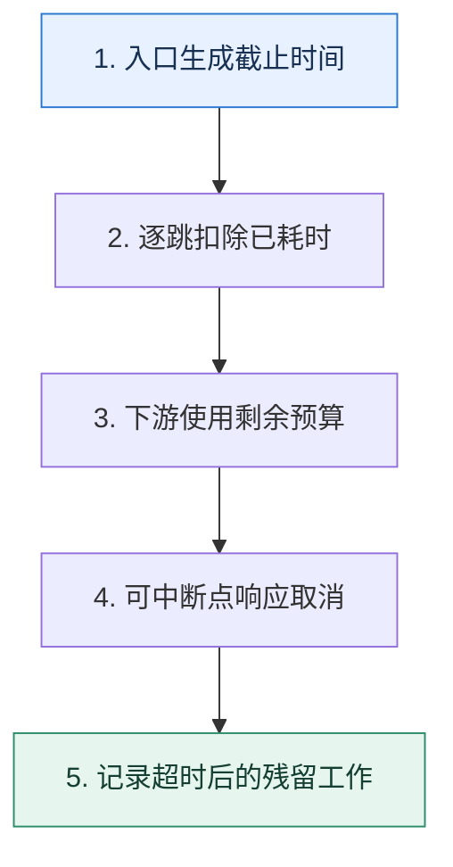

# 超时预算｜把用户的一秒拆成整条调用链的可执行约束

> 本课只解决一个问题：用户要求一秒内得到结果时，各个服务怎样共享而不是各自占满这一秒？

这不是原页面的缩写，也不是一组孤立结论。下面先建立一个能推演的最小世界，再把状态、数字和失败分支摊开，最后按来源讲解顺序覆盖全部知识线索。读完后，你应当能从 `入口生成截止时间` 一直解释到 `记录超时后的残留工作`，并说明中途任意一步失败会留下什么状态。

## 零基础入口：先建立本课的心智画面

超时是调用方停止等待的边界；它不保证被调用方工作已经停止。链路预算要包含网络、排队、重试和序列化，而不只是业务函数耗时。

先不要急着记组件名。只抓住四个问题：**现在手里有什么输入？下一步只做什么动作？哪个状态发生变化？变化后的结果交给谁？** 之后遇到新框架，只要这四个答案不变，核心机制就没有变。

### 放进一个足够小、可以手算的世界

总预算 1000ms：网关与网络预留 100ms，服务 A 本地逻辑 80ms，三次数据库调用各 150ms，Redis 50ms，消息发送 80ms，返回预留 100ms，总计 860ms，还剩 140ms 抖动余量。如果把每次数据库超时都设为 500ms，第一跳就可能耗尽全链路。

这个小世界故意只保留本课必需的对象。生产系统会有更多节点、线程、分片和异常，但数量增加不会改变这里的因果关系。先确认你能手算这个例子，再把数字替换成真实系统数据。

### 先预测，不要马上看结论

**为什么 A 调 B、B 调 C 时，三者都配置 1 秒超时会破坏用户的一秒目标？**

先写下自己的判断，并指出你依赖的前提。文末自我检查会揭示答案；如果答案不同，回到下面的状态表找出第一个分叉点。

## 本节精讲：让机制一步一步发生

入口应携带截止时间，经过一跳就扣除已经消耗的时间，并为返回路径留余量。下游超时必须小于剩余预算，重试也只能使用剩余预算。业务代码需要在可中断点检查取消信号；数据库或第三方如果不支持取消，调用方释放等待后，下游仍可能继续消耗资源。监控应同时观察超时率、实际完成率和超时后残留工作。

### 可见状态推进

| 当前步 | 现在发生的动作 | 下一步拿到什么 |
| ---: | --- | --- |
| 1 | 入口生成截止时间 | 逐跳扣除已耗时 |
| 2 | 逐跳扣除已耗时 | 下游使用剩余预算 |
| 3 | 下游使用剩余预算 | 可中断点响应取消 |
| 4 | 可中断点响应取消 | 记录超时后的残留工作 |
| 5 | 记录超时后的残留工作 | 得到可核对的终态 |

图只承担一个任务：让你看清状态如何向前移动。它不意味着每一步必然成功；网络超时、进程退出、重复执行和数据竞争都可能让箭头停在中间，因此后面必须继续讨论失效边界。

### 一次带数字的完整推演

总预算 1000ms：网关与网络预留 100ms，服务 A 本地逻辑 80ms，三次数据库调用各 150ms，Redis 50ms，消息发送 80ms，返回预留 100ms，总计 860ms，还剩 140ms 抖动余量。如果把每次数据库超时都设为 500ms，第一跳就可能耗尽全链路。

数字不是装饰。它迫使我们回答容量、顺序、时间窗口或版本选择问题。若换一个数字就得出不同结论，真正的设计依据就是那个阈值，而不是某个中间件名称。

## 按讲解顺序重建知识链：完整来源讲解

下面按来源资料的教学顺序重新编排完整内容。转换页码、来源图片、推广信息、水印和个人宣传已经删除；原本围绕求职问答的角色与措辞改写为工程学习、方案评审和故障复盘语境。机制、算法、例子、反例、事故线索、评论补充和限制条件仍然保留。这里的作用是补齐知识覆盖，不取代前面的独立推演。

本节讨论一个非常常见但是经常被忽略的话题——超时控制。

和前面我们讲的熔断、限流、降级和隔离一样，超时控制也是构建高可用系统的一环，因为它能够节省系统资源，提高资源的有效利用率。

一般在工程复盘时，关于超时控制，被问得最多的问题就是调用某个接口时的超时时间是多长，以及你为什么认为这个超时设置是合理的。一般我们都能给出一个差不多的解释，不过如果你能够在超时控制的话题下稍微深入一点，比如聊一聊监听超时时间、链路超时控制，那你绝对能成为所有候选人中最靓的仔。

所以今天我就带你来了解超时控制的方方面面，同时会给出全链路超时控制方案，让你在技术讨论中更加出彩。

### 先把机制拆开

超时控制是一个非常简单的东西，它是指在规定的时间内完成操作，如果不能完成，那么就返回一个超时响应。

和超时控制有关的内容，你需要记住以下几点：

超时控制的目标或者说好处。超时控制的形态。如何确定超时时间？这会是一个技术讨论热点。超时之后能不能中断业务？谁来监听超时时间？

那么我们一个个看。

### 超时控制目标

超时控制有两个目标，一是确保客户端能在预期的时间内拿到响应。这其实是用户体验一个重要理念“坏响应也比没响应好”的体现。

二是及时释放资源。这其中影响最大的是线程和连接两种资源。

释放线程：在超时的情况下，客户端收到了超时响应之后就可以继续往后执行，等执行完毕，这个线程就可以被用于执行别的业务。而如果没有超时控制，那么这个线程就会被一直占有。而像 Go 这种语言，协程会被一直占有。释放连接：连接可以是 RPC 连接，也可以是数据库连接。类似的道理，如果没有拿到响应，客户端会一直占据这个连接。

及时释放资源是提高系统可用性的有效做法，现实中经常遇到的一类事故就是因为缺乏超时控制引起了连接泄露、线程泄露。

### 超时控制形态

超时控制从形态上来看分成两种。

调用超时控制，比如说你在调用下游接口的时候，为这一次调用设置一个超时时间。链路超时控制，是指整条调用链路被一个超时时间控制。比如说你的业务有一条链路是 A调用 B，B 调用 C。如果链路超时时间是 1s，首先 A 调用 B 的超时时间是 1s，如果 B 收到请求的时候已经过去了 200ms，那么 B 调用 C 的超时时间就不能超过 800ms。

链路超时控制在微服务架构里面用得比较多，一般在核心服务或者非常看重响应时间的服务里面采用。

比如说大厂的 App 首页接口响应时间都有硬性规定。就像某司的要求是 50ms，也就是说不管你后端多复杂，不管你后面调用多少个服务，你的响应时间都必须控制在 50ms 以内。我后面会再深入讨论这个问题，它是你刷进阶推导的关键。

### 确定超时时间

确定超时时间是一个我们在技术讨论中经常碰到的问题，常见的 4 种确定超时时间的方式是根据用户体验来确定、根据被调用接口的响应时间来确定、根据压测结果来确定、根据代码来确定。

超时时间要设置合理，过长可能会因为资源释放不及时而出事故，过短可能调用者会频繁超时，业务几乎没有办法执行。

根据用户体验一般的做法就是根据用户体验来决定超时时间。比如说产品经理认为这个用户最多只能在这里等待 300ms，那么你的超时时间就最多设置为 300ms。

但如果仅仅依靠用户体验来决定超时时间也是不现实的，比如说当你去问产品经理某个接口对性能要求的时候，他让你看着办。那么这个时候你就要选择下一种策略了。

根据响应时间在实践中，大多数时候都是根据被调用接口的响应时间来确定超时时间。一般情况下，你可以选择使用 99 线或者 999 线来作为超时时间。

所谓的 99 线是指 99% 的请求，响应时间都在这个值以内。比如说 99 线为 1s，那么意味着99% 的请求响应时间都在 1s 以内。999 线也是类似的含义。

但是使用这种方式要求这个接口已经接入了类似 Prometheus 之类的可观测性工具，能够算出 99 线或者 999 线。如果一个接口是新接口，你要调用它，而这时候根本没有 99 线或者999 线的数据。那么你可以考虑使用压力测试。

压力测试简单来说，你可以通过压力测试来找到被调用接口的 99 线和 999 线。而且压力测试应该尽可能在和线上一样的环境下进行。但是就像我在限流里面提到的，很多公司其实内部没有什么压测环境，也不可能让你停下新功能开发去做压力测试。那么就无法采用压力测试来采集到响应时间数据。

所以你就只剩下最后一个手段，根据代码来计算。

根据代码计算根据代码计算和我在限流里面讲的差不多。假如说你现在有一个接口，里面有三次数据库操作，还有一次访问 Redis 的操作和一次发送消息的操作，那么你接口的响应时间就应该这样计算：

### 接口的响应时间 = 数据库响应时间 × 3 + Redis响应时间 + 发送消息的响应

如果你觉得不保险，那么你可以在计算出来的结果上再加一点作为余量。比如说你通过分析代码认为响应时间应该在 200ms，那么你完全可以加上 100ms 作为余量。你可以告诉这个接口的调用者，将超时时间设置为 300ms。

### 超时中断业务

在工程复盘时，还有一个值得和技术评审者深入讨论的问题——超时中断业务。所谓的中断业务是指，当调用一个服务超时之后，这个服务还会继续执行吗？

答案是基本上会继续执行，除非服务端自己主动检测一下本次收到的请求是否已经超时了。

举例来说，如果你的业务逻辑有 A、B、C 三个步骤。假如说你执行到 B 的时候超时了，如果你的代码里面没有检测到，那么还是会继续执行 C。但是如果你主动检测了超时，那么你就可以在 B 执行之后就返回。

但是正常在实践中，我们是不会写这种手动检测的繁琐代码的。所以经常出现一个问题，就是客户端虽然超时了，但是实际上服务端已经执行成功了。

你可以看一下我给出的这张示意图，用户第一次提交注册的时候拿到了超时响应，但是实际上他注册成功了，数据库写入了注册信息。所以当他第二次尝试重试的时候，立刻遇到了重复手机号码的错误。

不过如果中间件监听超时时间部分设计得好，它可以帮我们中断一些步骤。

### 监听超时时间

在微服务框架里面，一般都是微服务框架客户端来监听超时时间。在一些特殊的微服务框架里面，框架服务端也会同步监听超时时间。

框架客户端监听超时时间的情况下，如果在发起请求之前，就已经超时了，那么框架客户端根本不会发起请求，而是直接返回超时响应。这等于直接帮我们中断了业务的后续步骤。

如果框架客户端已经发出了请求，之后触发了超时时间，那么框架客户端就会直接返回一个超时错误给应用代码。后续服务端返回了响应，框架客户端会直接丢弃。

而框架服务端监听超时的情况下，如果在收到请求的时候就已经超时了，那么框架服务端根本不会调用服务端应用代码，而是直接给框架客户端返回一个超时响应。

而如果在等待业务响应的时候触发了超时，框架服务端会立刻释放连接，继续处理下一个请求。那么当应用返回响应的时候，它会直接丢弃，不会再回写响应。

所以你可以看出来不管是客户端根本不发请求，还是服务端根本不把请求转交给业务，都能够避免把资源花在没有意义的超时请求上。为什么超时请求没有意义呢？因为用户都已经看到超时的页面了，所以后端继续处理已经没有意义了。

总体来说，监听超时时间这个知识点技术评审者还是不太容易能想到的，所以在工程复盘时如果你能深入讨论一下这个问题，应该可以增加一些进阶推导。

### 把知识转成可验证的工程判断

前面我们讲到的超时控制的目标、两种形态以及确定超时时间的方法你都要记住。此外你要弄清楚公司内是怎么使用超时时间的，你可以收集一些资料。

你所在公司的核心业务，尤其是 App 首页之类的，公司层面上的性能要求是什么？也就是说响应时间必须控制在多少以内，然后进一步了解有没有采用链路超时控制。你自己维护的服务调用下游的时候有没有设置超时时间，超时时间都是多长？数据库查询有没有设置超时时间？跟任何第三方中间件打交道的代码有没有设置超时时间？例如查询 Redis，发送消息到Kafka 等。

然后你要注意在公司里面收集一些跟超时控制相关的事故报告。例如因为没有设置超时时间，导致数据库连接耗尽或者线程数量飙升等事故报告。这些事故报告你可以在技术讨论的过程中用来解释超时控制的必要性，或者用来凸显你解决事故的能力。

在技术讨论前我们也需要提前设想一下，关于超时控制，技术评审者会问到哪些问题？我整理了一下最常见的几个问题，你也可以借助这几个问题回忆一下前面的几个知识点。

如果你现在调用别的服务、第三方接口、中间件都没有设置任何超时时间，或者使用的是默认超时时间，那么你就可以尝试自己先手动设置一下超时时间。这也是为了加深你的印象，更好地把控细节。

### 基本思路

大多数时候技术评审者可能就是随便问一下你在调用别的服务的时候有没有设置超时时间，那么你可以简单解释，关键词是超时控制目标。

我会设置超时时间，一般来说设置超时时间是为了用户体验和及时释放资源。比如说我有一个接口是提供给首页使用的，整个接口要求的超时时间是不超过 100ms。这个 100ms 就是公司规定的，是从用户体验出发确定的超时时间。

这一步，我们只是说了一个硬性规定 100ms 的例子，换句话说是从用户体验出发确定的100ms。那么技术评审者就可能会追问：“如果公司没这种规定你怎么确定合理的超时时间呢？”。这时候你就可以解释前置知识里面提到的四种手段。

没有规定的话，最好的办法就是从用户体验的角度出发确定超时时间，这个可以考虑咨询一下产品经理。如果这个方式不行的话，就可以考虑根据被调用接口的响应时间，来确定调用者的超时时间。比如说我要调用 A 接口，如果 A 接口的 999 线是 200ms，那么我就可以把我这一次调用的超时时间设置成 200ms。除了 999 线，99 线也可以作为超时时间。

如果我要调用的是一个新接口，没有性能数据，那么就可以考虑执行压测，然后根据结果选用 99 线或者 999 线。压测的结果也不仅仅可以用在这里，也可以用在限流那里。实在没办法，我们还可以根据代码里面的复杂操作来计算一个时间。

在这个解释里面，技术评审者可能从两个角度继续深挖。第一个是 99 线和 999 线究竟选哪个比较好。那么你可以抓住关键词可用性来解释。

原则上是看公司的可用性要求，要求几个 9 就要几个 9。如果没有硬性规定，那么看 99 线和 999 线相差多不多。不多的话就用 999 线，多的话就用 99 线。

第二个是技术评审者可能会把问题切换到限流相关的内容上，因为你这里提到了限流，所以需要做好被提问的心理准备。

紧接着，你可以补一个因为超时控制设置不合理而出现的事故。这里我用一个数据库超时的例子，你可以参考，关键词是数据库连接。

正常来说，对任何第三方的调用我都会设置超时时间。如果没有设置超时时间或者超时时间过长，都可能引起资源泄露。比如说早期某个线上系统就出现过一个事故，某个同事的数据库查询超时时间设置得过长，在数据库性能出现抖动的时候，客户端的所有查询都被长时间阻塞，导致连接池中的连接耗尽。

你可以把这个案例替换成实际工作中发生的事故，它能够进一步说明超时控制在保障系统可用性中的作用。

如果想要尽量避免这样的事故发生，更好地用超时保护我们的系统，那就需要一个更加周全的方案了，就是为我们的系统接入链路超时控制，这样做用户体验会更好。

### 链路超时控制

链路超时控制就是我们今天的进阶推导方案，本身链路超时就是一个非常适合“一杆子”打到底的话题。也就是说从链路超时控制本身可以延伸出许多问题，所以你千万要记得做好话术引导。当技术评审者问你链路超时控制是什么的时候，你就可以先简单介绍链路超时的基本特征，关键词是链路。

链路超时控制和普通超时控制最大的区别是链路超时控制会作用于整条链路上的任何一环。例如在 A 调用 B，B 调用 C 的链路中，如果 A 设置了超时时间 1s，那么 A 调用 B 不能超过 1s。然后当 B 收到请求之后，如果已经过去了 200ms，那么 B 调用 C 的超时时间就不能超过 800ms。因此链路超时的关键是在链路中传递超时时间。

在最后一句话里面，你提到了传递超时时间，但是并没有说怎么传递超时时间，这就是给技术评审者追问的机会。如果技术评审者追问了，你可以这么解释，关键词是协议头。

大部分情况下，链路超时时间在网络中传递是放在协议头的。如果是 RPC 协议，那么就放在 RPC 协议头，比如说 Dubbo 的头部；如果是 HTTP 那么就是放在 HTTP 头部。比较特殊的是 gRPC 这种基于 HTTP 的 RPC 协议，它是利用 HTTP 头部作为 RPC 的头部，所以也是放在 HTTP 头部的。至于放的是什么东西，就取决于不同的协议是如何设计的了。

gRPC 官网对超时字段的说明在最后一句，你依旧留了一个小尾巴。这句话是引导向超时时间传递的值究竟是什么的问题。正常来说，在链路中传递的可以是剩余超时时间，也可以是超时时间戳。

这两者是各有优缺点的。目前来说剩余超时时间用得比较多，一般是以毫秒作为单位传递一个数值。它的缺点是服务端收到请求之后需要减去网络传输时间，得到真正的超时时间。

而超时时间戳则涉及到时钟同步的问题，不过大多数情况下时钟之间的差值都很小，和超时时间动辄几百毫秒比起来，不值一提。所以如果技术评审者感兴趣，你就继续解释，关键词是剩余超时时间或超时时间戳。

一般超时时间传递的就两种：剩余超时时间或者超时时间戳。比如说剩余 1s，那么就用毫秒作为单位，数值是 1000。这种做法的缺陷就是服务端收到请求之后，要减去请求在网络中传输的时间。比如说 C 收到请求，剩余超时时间是 500ms，如果它知道 B 到 C 之间请求传输要花去 10ms，那么 C 应该用 500ms 减去 10 ms 作为真实的剩余超时时间。不过现实中比较难知道网络传输花了 10ms 这件事。

而传递超时时间戳，那么就会受到时钟同步影响。假如说此时此刻，A 的时钟是00:00:00，而 B 的时钟是 00:00:01，也就是 A 的时钟比 B 的时钟慢了一秒。那么如果 A传递的超时时间戳是 00:00:01，那么 B 一收到请求，就会认为这个请求已经超时了。

当然，正常来说时钟同步不至于出现那么大的偏差，大多数时钟偏差几乎可以忽略不计。不过在时钟回拨的场景下，还是会有问题。我之前听说不同云服务商之间的时钟同步问题比较严重，可能也需要注意。

在这个解释里面，你提到了难以知道 10ms 的问题，那么技术评审者自然就会问你该怎么知道网络传输耗时 10ms。换句话来说，你怎么计算请求的网络传输时间。可以这样解释：

计算网络传输时间最好的方式就是使用性能测试。在模拟线上环境的情况下，让客户端发送平均大小的请求到服务端，采集传输时间，取一个平均值作为网络传输时间。另外一个方式就是不管。比如说正常情况下，A 调用 B，A 和 B 都在同一个机房，网络传输连 1ms 都不用。相比我们超时时间动辄设置为几百毫秒，这一点时间完全可以忽略不计。不过万一服务涉及到了跨机房，尤其是那种机房在两个城市的，城市还离得远的，这部分时间就要计算在内。

你还可以额外强调一下，性能测试要完全模拟线上环境，否则计算就会有偏差。

性能测试一定要尽可能模拟线上环境，尤其是线上环境可能会有更加复杂的网关和防火墙设置，这部分也会影响传输速率。

链路超时还有一个弊端，也是技术评审者经常问的，就是如果 A 调用 B，B 调用 C 的这条链路的超时时间设置为 1s，但是 B 这个服务的提供者就说自己是不可能在 1s 内返回响应的，那么该怎么办？

这时候你要坚持最正确的做法，要求 B 优化性能。

这个时候最好的做法是强制要求 B 优化它的性能。比如说产品经理明确说这条链路就是要在 1s 内返回，那么 B 就应该去优化性能，而不是在这里抱怨不可能在 1s 内返回。不过要是 A 本身超时时间可以妥协的话，那么 A 调大一点也可以。

最后的妥协话术，就是想表达你并不是完全不通人情的。如果技术讨论你的人是 CTO 之类的领导，那么他们可能会看重软技能，就会问你如何推动 B 优化性能。这方面你按照你们公司的跨部门合作流程来解释就可以。

不过我还有一个不那么正统充满了人情世故的解决方案，你可以参考。

可以考虑请 B 的维护者喝杯奶茶，吃顿小烧烤，基本上都能解决问题。实在不行，就只能走官方渠道，找领导和产品经理出面，去找 B 的维护者的上级。不过闹到这一步关系就会比较僵，还是优先考虑请奶茶小烧烤的方案。

### 本节原始知识线索收束

现在我再来问你，怎么保证用户能够在 1 秒内拿到响应，你应该对答案了然于胸了吧？这也是我们这节课的主题超时控制的目标之一，也就是确保客户端能在预期的时间内拿到响应，保证用户的体验。此外超时控制还能通过在客户端或服务端监听超时时间来感应到系统超时，及时释放线程和连接，保证系统的可用性。

而这个 1 秒又是怎么算出来的呢？实际上我们可以通过用户体验、响应时间、压力测试和根据代码计算这四种方式来确定具体的超时时间，不宜过长或过短，过长，会浪费客户端资源；过短，可能导致客户端无法处理响应。

在实际的工作场景中，超时控制有调用超时控制和链路超时控制两种形态，而在微服务架构中链路超时控制比较常用。所以我们在进阶推导方案部分对链路超时控制进行了深入的讨论，你需要记住里面的几个关键词：链路、协议头、剩余超时时间与超时时间戳。你可以从这几个关键词出发，整理自己的思路。

在最后，我同样给出了这节课的思维导图，你可以参考。

### 继续推演

最后你来思考几个问题。

在根据被调用接口的响应时间来确定超时时间里面，我说可以使用 99 线或者 999 线来作为超时时间。那么平均响应时间和响应时间中位数，能不能作为超时时间？在监听超时那里，能不能只在服务端那边监听超时，而客户端完全不管？

### 补充讨论与边界校准

补充讨论：

1. 在根据被调用接口的响应时间来确定超时时间里面，提到可以使用 99 线或 999 线来作为超时时间。那么平均响应时间和响应时间的中位数，能不能作为超时时间？不能，这意味着一半的请求都会超时，业务基本处于不可用的状态了。
2. 在监听超时那里，能不能只在服务端那边监听超时，而客户端完全不管？我觉得不行，客户端不能保证所有服务端都是做了超时控制的，也不能保证请求就一定就能到服务端那边。假如发生了网络故障，服务端根本收不到请求，客户端本地没做超时控制的话，就会发生线程泄露。
讲解补充：赞，解释得很对！

6补充讨论：

讲解补充：没有，我用的不是老外思维中的 Down stream up stream 的说法，就是比较符合中文语境下的那种说法。如果你不习惯的话，你可以自动在脑海里面替换一下，问题也不大。

补充讨论：

讲解补充：赞。问题二还涉及到一个问题，那就是即便服务端返回了超时响应，但是客户端也有可能收不到，因为网络通信总是不稳定的。又或者收到了超时的时候，已经过去了很久了，远大于超时时间。

补充讨论：

1. 不能，这里需要考虑的是最差的情况；2.不行，客户端需要在超时展示相应的处理方案。
讲解补充：赞！2 主要是因为，服务端的超时响应，客户端可能完全收不到，比如说网络出现了问题。

补充讨论： s很高，超时时间太长，就容易把自己系统的线程打爆讲解补充：是的，对于客户端来说，超时控制能够释放自己的资源；对于服务端来说，就要考虑限流之类的措施了。

补充讨论：

讲解补充：我这里用的都是服务 A 调用服务 B 的例子。如果你是浏览器那边过来，那么只能是浏览器那边设置超时。

补充讨论： 9 就要几个 9。如果没有硬性规定，那么看 99 线和999 线相差多不多。不多的话就用 999 线，多的话就用 99 线。

这里为什么99线和999线差的多的话用99线呢？如果两者差距比较大，不是应该选999线更好吗，这样超时报错会少很多讲解补充：如果相差很多话，有点不太值得选 999 线。我举个例子，比如说有些系统会有很明显的长尾请求。假设说 99 线可能是 1s，结果 999 线是 3s。正常来说这种时候我都不会考虑 999 线。

补充讨论：

讲解补充：实际上，超时是在 RPC 协议上做的。如果 RPC 协议设计了超时字段，那么基本上服务端都会处理，比如说 gRPC 就做了补充讨论：

1. 感觉不论是客户端监听，还是客户端和服务端都监听（比如，服务端执行完了，但恰好在传输结果时，客户端发生超时，返回了失败响应），都可能发生这种现象？
2. 站在用户的角度来说，很confusing，明明看到失败，但第二次说已经有人注册。这种情况一般要怎么处理呢？
讲解补充：1. 你说得对，因为你做不到彻底中断业务。比如插入这个例子，你在等待 MySQL 返回响应，那么你肯定没办法让 MySQL 插入一半之后就不插入了

2. 并没有什么好的手段，你只能提示一下用户，然后让用户跳转登录。

补充讨论：

下面是02课的问题，因为我阅读的晚，所以也发的晚，这里补上：Q1：“客户端”并不是指终端，对吗？本课中用到的“客户端”，我理解并不是通常意义上的网页或APP，而是相对于“服务端”的客户端；从后面的内容来看，也不是指Nginx或网关。那在微服务架构中，具体是指什么？Q2：哈希算法怎么保证均匀吗？文中“所以要尽可能保证哈希值计算出来的结果是均匀的”，有什么具体方法来保证哈希的均匀性？Q3：负载均衡有多种算法，对于一个公司来说，是确定用其中的某一种吗？或者是不同的子系统可能采用不同的算法？或者有多种算法，会根据情况动态选用其中的某一种？Q4：“响应+元数据”这种，消息是怎么发送的？响应是给用户的，通常就是HTTP消息，元数据是内部用的，这两种怎么处理？定义一个内部消息，包含这两种，Nginx收到后取出元数据然后将响应发给用户吗？

讲解补充：1. 有的，但是要少一点。比如说你服务端处理一个异步任务，然后发现执行超过了预期时间，你强制杀掉，也算是释放资源。

2. 如果 A 调用了 B，那么 A 就是 B 的客户端，B 就是 A 的服务端。一般我们说的客户端都不会指用户的那个终端，后面也是这样。
后面三个问题我都回过你了，只不过那时候我还不太熟练，所以用的不是作者身份回你。你可以回去看看。

## 把完整讲解收束成一条因果链

1. 先从单接口依赖耗时计算超时，而不是统一写死一个常量。
2. 再把预算扩展到调用链，要求每一跳传递截止时间。
3. 解释为什么取消信号无法自动终止任意业务代码，需要协作式中断。
4. 最后把重试放回预算：没有剩余时间就不应重试。

把这几步连接起来时，不要省略“为什么”。最终结论只有在前提、状态变化和失败代价都说得清楚时才可靠。

## 误区与失效边界

设置 1 秒客户端超时不等于用户一定 1 秒拿到成功结果，只能保证调用方最多等待到边界。超时也不自动回滚外部副作用，写操作需要幂等与状态查询。

再加一条通用但必须落实到本课对象上的边界：机制只能处理它看得见的信号。若输入指标失真、状态没有持久化、错误被吞掉，或者补偿没有幂等保护，再成熟的框架也只能基于错误证据作决定。

### 三种故障注入方式

| 故障 | 要观察什么 | 不能接受的解释 |
| --- | --- | --- |
| 在第 2 步前让依赖超时 | 是否停在可重试状态，是否消耗完上游预算 | “框架稍后会处理” |
| 在状态写入后让进程退出 | 重启后能否识别已完成与待继续动作 | “再执行一次应该没事” |
| 对同一输入并发执行两次 | 是否出现重复副作用、顺序颠倒或覆盖 | “概率很低” |

## 工程验证：把理解变成可以复查的证据

在追踪系统中给每个 span 记录 `deadline、remaining_budget、cancel_seen、actual_finish`。若调用方已超时但下游大量继续运行，说明系统只有等待超时，没有真正传播取消。

| 步骤 | 状态或动作 | 最少应留下的证据 |
| ---: | --- | --- |
| 1 | 入口生成截止时间 | 开始时间、结束时间、输入标识、结果状态、异常原因 |
| 2 | 逐跳扣除已耗时 | 开始时间、结束时间、输入标识、结果状态、异常原因 |
| 3 | 下游使用剩余预算 | 开始时间、结束时间、输入标识、结果状态、异常原因 |
| 4 | 可中断点响应取消 | 开始时间、结束时间、输入标识、结果状态、异常原因 |
| 5 | 记录超时后的残留工作 | 开始时间、结束时间、输入标识、结果状态、异常原因 |

验证时同时记录成功路径和失败路径。只证明“正常时能跑通”不能说明设计可靠；至少要让一次超时、一次进程退出和一次重复请求可重现，并能根据日志或指标解释最后状态。

## 学完检查：闭卷画出本课

你现在应该能独立完成四件事：

1. 用自己的话说出本课唯一问题，不使用产品名也能解释。
2. 复算上面的具体例子，并指出哪个输入改变会让结论改变。
3. 沿 Mermaid 图注入一次失败，预测系统停在哪里以及由谁收敛。
4. 说出本课机制不保证什么，并给出一个反例。

## 自我检查

为什么 A 调 B、B 调 C 时，三者都配置 1 秒超时会破坏用户的一秒目标？

每一跳都可能各等一秒，且忽略了前面已经消耗的时间。应传递同一个截止时间，由后续节点只使用剩余预算。

怎样证明自己不是只记住了名词？

把 `入口生成截止时间` 的一个真实输入写出来，逐步记录到 `记录超时后的残留工作`。然后在中间任意一步制造失败；如果你能解释当前状态、下一责任方、可观测证据和恢复边界，就已经拥有可以迁移的工程模型。

## 来源与事实校准

- [查看完整来源稿（本地 24 页资料）](../content/07-timeout-control.md)

### 当前事实校准

TimeLimiter 可以对 Future 或 CompletionStage 设置等待边界，并可配置是否调用取消；但发出 cancel 不代表任意网络、数据库或业务代码都已停止。真实系统仍需把截止时间和取消信号传给下游，并验证超时后的残留工作。

- [Resilience4j · TimeLimiter](https://resilience4j.readme.io/docs/timeout)

来源稿用于核对覆盖范围，不随公开站点发布。产品默认值和具体内部行为可能随版本变化；落地时应使用目标版本的官方文档、可运行实验和故障演练校准。本学习稿中的零基础入口、状态推演、故障矩阵和工程验证属于编辑补充，不冒充来源讲解者的原话。
