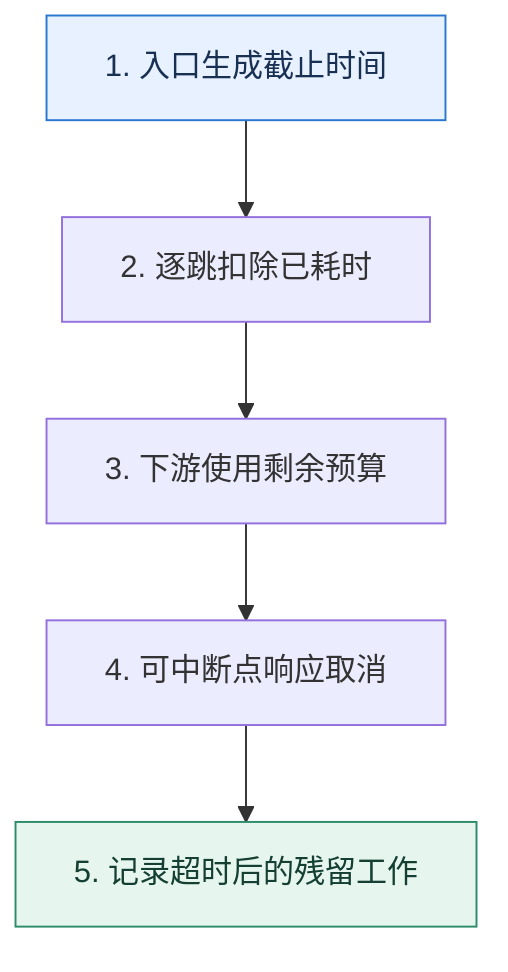

# 超时预算｜把用户的一秒拆成整条调用链的可执行约束

> 本课只回答一个问题：用户要求一秒内得到结果时，各个服务怎样共享而不是各自占满这一秒？

这是一份独立学习稿。来源资料用于核对知识范围；下面的解释、推演、边界和图示均按工程学习路径重新组织，不依赖原页面也能完整阅读。

## 先补齐：建立正确的心智模型

超时是调用方停止等待的边界；它不保证被调用方工作已经停止。链路预算要包含网络、排队、重试和序列化，而不只是业务函数耗时。

读这一课时，始终把“组件名字”换成三个可追踪对象：**谁发起动作、状态存在哪里、失败后由谁收敛**。这样遇到不同产品或版本，仍能用同一套模型判断。

## 本节精讲：机制是怎样一步步工作的

入口应携带截止时间，经过一跳就扣除已经消耗的时间，并为返回路径留余量。下游超时必须小于剩余预算，重试也只能使用剩余预算。业务代码需要在可中断点检查取消信号；数据库或第三方如果不支持取消，调用方释放等待后，下游仍可能继续消耗资源。监控应同时观察超时率、实际完成率和超时后残留工作。

下面这张图只表达本课最重要的状态推进，蓝色是入口，绿色是可验收的终点；任一箭头失败，都要回到上文寻找重试、回退或人工处理的位置。

### 一次带数字的完整推演

总预算 1000ms：网关与网络预留 100ms，服务 A 本地逻辑 80ms，三次数据库调用各 150ms，Redis 50ms，消息发送 80ms，返回预留 100ms，总计 860ms，还剩 140ms 抖动余量。如果把每次数据库超时都设为 500ms，第一跳就可能耗尽全链路。

数字的作用不是制造精确感，而是暴露容量和时间关系。把例子中的流量、延迟、分片数或版本号替换成自己的真实数据，方案可能会随之改变。

## 误区与失效边界

设置 1 秒客户端超时不等于用户一定 1 秒拿到成功结果，只能保证调用方最多等待到边界。超时也不自动回滚外部副作用，写操作需要幂等与状态查询。

判断一个结论是否可靠，可以追问两次：**它依赖什么前提？前提失效后系统留下了什么状态？** 如果回答只能停在“框架会自动处理”，就还没有走到工程边界。

## 按讲解顺序重建知识链

来源稿覆盖的论证主线在这里被重建成四步，保留问题、推导、反例和收束，不沿用原页面措辞：

1. 先从单接口依赖耗时计算超时，而不是统一写死一个常量。
2. 再把预算扩展到调用链，要求每一跳传递截止时间。
3. 解释为什么取消信号无法自动终止任意业务代码，需要协作式中断。
4. 最后把重试放回预算：没有剩余时间就不应重试。

把四步连起来后，本课不是一个孤立结论，而是一条可以复演的因果链。需要回查课程覆盖范围时，可打开文末的来源稿；学习时以本页模型为主。

## 工程验证：把理解变成证据

在追踪系统中给每个 span 记录 `deadline、remaining_budget、cancel_seen、actual_finish`。若调用方已超时但下游大量继续运行，说明系统只有等待超时，没有真正传播取消。

### 状态检查表

| 步骤 | 状态或动作 | 需要留下的证据 |
| ---: | --- | --- |
| 1 | 入口生成截止时间 | 记录耗时、结果与异常分支，确认状态能进入下一步 |
| 2 | 逐跳扣除已耗时 | 记录耗时、结果与异常分支，确认状态能进入下一步 |
| 3 | 下游使用剩余预算 | 记录耗时、结果与异常分支，确认状态能进入下一步 |
| 4 | 可中断点响应取消 | 记录耗时、结果与异常分支，确认状态能进入下一步 |
| 5 | 记录超时后的残留工作 | 记录耗时、结果与异常分支，确认状态能进入下一步 |

检查表不是要求生产系统逐字采用这些字段，而是强迫设计者为每一步提供可观测结果。只有入口、没有终态的流程，最终都会形成无法解释的中间状态。

## 自我检查

为什么 A 调 B、B 调 C 时，三者都配置 1 秒超时会破坏用户的一秒目标？

每一跳都可能各等一秒，且忽略了前面已经消耗的时间。应传递同一个截止时间，由后续节点只使用剩余预算。

再做一次闭卷练习：不看上文画出状态图，并为其中任意两个箭头注入超时、进程崩溃或重复请求。如果你能预测最终状态和观测信号，这一课才真正从“听懂”变成“会用”。

## 来源与版本校准

- [查看来源稿（24 页资料整理）](../content/07-timeout-control.md)

来源稿只用于追溯知识范围，不是本学习稿的正文。具体产品的默认值、命令与内部实现会随版本变化；落地前应使用目标版本官方文档和故障演练再次确认。
