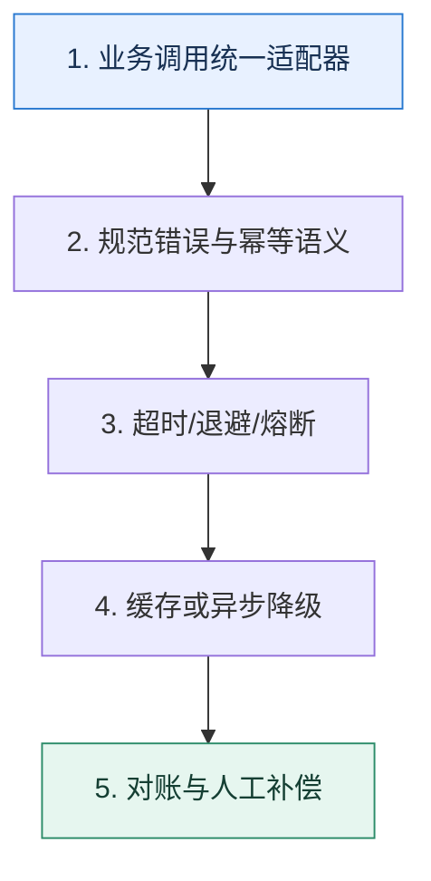

# 外部依赖｜把不可控接口包进可治理的边界

> 本课只回答一个问题：第三方接口慢、错、变更或不可压测时，自己的核心流程怎样保持可控？

这是一份独立学习稿。来源资料用于核对知识范围；下面的解释、推演、边界和图示均按工程学习路径重新组织，不依赖原页面也能完整阅读。

## 先补齐：建立正确的心智模型

第三方能力属于外部故障域。第一步是用适配器统一协议和错误语义，让业务代码不直接依赖供应商字段；第二步才是超时、重试、熔断和降级。

读这一课时，始终把“组件名字”换成三个可追踪对象：**谁发起动作、状态存在哪里、失败后由谁收敛**。这样遇到不同产品或版本，仍能用同一套模型判断。

## 本节精讲：机制是怎样一步步工作的

客户端适配层应统一鉴权、序列化、错误码、幂等键和观测。只对明确可重试且幂等的失败做带抖动退避；对非关键结果可同步转异步，通过任务表或消息系统补偿。多供应商切换必须先解决语义差异、数据对账和切换条件。压测时用可配置桩模拟慢响应、错误比例和字段变更，不能直接冲击真实供应商。

下面这张图只表达本课最重要的状态推进，蓝色是入口，绿色是可验收的终点；任一箭头失败，都要回到上文寻找重试、回退或人工处理的位置。

### 一次带数字的完整推演

地址校验供应商 P99 为 800ms，而下单预算只有 500ms。可先使用本地规则完成基础校验并受理订单，把精确校验写入任务表异步执行；若发现异常再进入人工复核。这样不是假装第三方变快，而是重定义主流程对结果的依赖时机。

数字的作用不是制造精确感，而是暴露容量和时间关系。把例子中的流量、延迟、分片数或版本号替换成自己的真实数据，方案可能会随之改变。

## 误区与失效边界

重试不是默认安全动作。支付、发券等写接口如果没有幂等键，超时后重试可能重复执行。自动切换供应商也不保证结果等价，必须验证字段、精度和合规边界。

判断一个结论是否可靠，可以追问两次：**它依赖什么前提？前提失效后系统留下了什么状态？** 如果回答只能停在“框架会自动处理”，就还没有走到工程边界。

## 按讲解顺序重建知识链

来源稿覆盖的论证主线在这里被重建成四步，保留问题、推导、反例和收束，不沿用原页面措辞：

1. 先建立一致性抽象，把不同供应商包装成稳定的内部契约。
2. 在客户端侧加入超时、限流、重试和熔断，但只对安全操作启用。
3. 补齐调用量、延迟、错误类型和业务结果的观测，不只看 HTTP 成功率。
4. 用同步转异步、多供应商和压测桩处理不可控依赖，同时保留对账与回补。

把四步连起来后，本课不是一个孤立结论，而是一条可以复演的因果链。需要回查课程覆盖范围时，可打开文末的来源稿；学习时以本页模型为主。

## 工程验证：把理解变成证据

故障注入矩阵：延迟 2 秒、连续 500、响应成功但字段缺失、请求超时但实际成功、供应商配额耗尽。逐项写出主流程结果、重试行为、补偿入口和告警。

### 状态检查表

| 步骤 | 状态或动作 | 需要留下的证据 |
| ---: | --- | --- |
| 1 | 业务调用统一适配器 | 记录耗时、结果与异常分支，确认状态能进入下一步 |
| 2 | 规范错误与幂等语义 | 记录耗时、结果与异常分支，确认状态能进入下一步 |
| 3 | 超时/退避/熔断 | 记录耗时、结果与异常分支，确认状态能进入下一步 |
| 4 | 缓存或异步降级 | 记录耗时、结果与异常分支，确认状态能进入下一步 |
| 5 | 对账与人工补偿 | 记录耗时、结果与异常分支，确认状态能进入下一步 |

检查表不是要求生产系统逐字采用这些字段，而是强迫设计者为每一步提供可观测结果。只有入口、没有终态的流程，最终都会形成无法解释的中间状态。

## 自我检查

为什么第三方返回超时后立即重试，可能比直接失败更危险？

超时意味着结果未知，不代表操作未执行。若接口有副作用且缺少幂等键，重试会产生重复支付、重复发券等问题。

再做一次闭卷练习：不看上文画出状态图，并为其中任意两个箭头注入超时、进程崩溃或重复请求。如果你能预测最终状态和观测信号，这一课才真正从“听懂”变成“会用”。

## 来源与版本校准

- [查看来源稿（21 页资料整理）](../content/08-third-party-calls.md)

来源稿只用于追溯知识范围，不是本学习稿的正文。具体产品的默认值、命令与内部实现会随版本变化；落地前应使用目标版本官方文档和故障演练再次确认。
