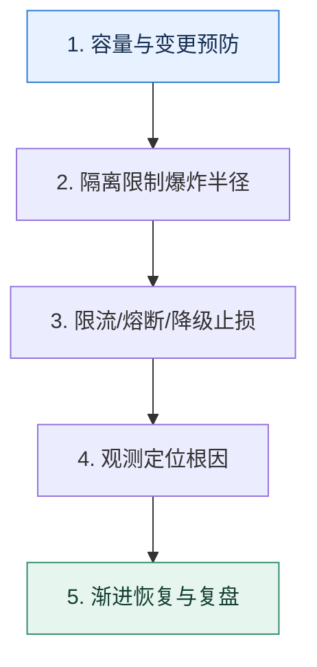

# 服务治理全景｜从预防、止损到恢复构建闭环

> 本课只解决一个问题：单个限流或熔断器都能工作，为什么系统仍可能在流量突增时整体失效？

这不是原页面的缩写，也不是一组孤立结论。下面先建立一个能推演的最小世界，再把状态、数字和失败分支摊开，最后按来源讲解顺序覆盖全部知识线索。读完后，你应当能从 `容量与变更预防` 一直解释到 `渐进恢复与复盘`，并说明中途任意一步失败会留下什么状态。

## 零基础入口：先建立本课的心智画面

治理不是功能清单，而是闭环：先知道容量和依赖，再限制故障范围；故障发生时快速失败并保护核心链路；随后定位、恢复、补偿并把经验固化进变更流程。

先不要急着记组件名。只抓住四个问题：**现在手里有什么输入？下一步只做什么动作？哪个状态发生变化？变化后的结果交给谁？** 之后遇到新框架，只要这四个答案不变，核心机制就没有变。

### 放进一个足够小、可以手算的世界

活动开始后请求从 2k 升到 10k QPS：网关先按已验证容量限流；推荐服务走缓存降级；订单服务与报表连接池隔离；支付依赖错误率超过阈值后熔断；告警定位到供应商后切换备用通道；恢复时按 5% 梯度放量并对账异步订单。

这个小世界故意只保留本课必需的对象。生产系统会有更多节点、线程、分片和异常，但数量增加不会改变这里的因果关系。先确认你能手算这个例子，再把数字替换成真实系统数据。

### 先预测，不要马上看结论

**为什么已经有熔断器，仍然需要限流和隔离？**

先写下自己的判断，并指出你依赖的前提。文末自我检查会揭示答案；如果答案不同，回到下面的状态表找出第一个分叉点。

## 本节精讲：让机制一步一步发生

预防层包含容量评估、隔离、超时预算和变更门禁；止损层包含限流、熔断和降级；恢复层包含探测、渐进放量、重放与对账；证据层贯穿指标、日志、追踪和事件记录。每个手段都要对应明确风险，例如限流处理进入量过大，熔断处理下游持续失败，隔离处理资源争抢，不能互相替代。

### 可见状态推进

| 当前步 | 现在发生的动作 | 下一步拿到什么 |
| ---: | --- | --- |
| 1 | 容量与变更预防 | 隔离限制爆炸半径 |
| 2 | 隔离限制爆炸半径 | 限流/熔断/降级止损 |
| 3 | 限流/熔断/降级止损 | 观测定位根因 |
| 4 | 观测定位根因 | 渐进恢复与复盘 |
| 5 | 渐进恢复与复盘 | 得到可核对的终态 |

图只承担一个任务：让你看清状态如何向前移动。它不意味着每一步必然成功；网络超时、进程退出、重复执行和数据竞争都可能让箭头停在中间，因此后面必须继续讨论失效边界。

### 一次带数字的完整推演

活动开始后请求从 2k 升到 10k QPS：网关先按已验证容量限流；推荐服务走缓存降级；订单服务与报表连接池隔离；支付依赖错误率超过阈值后熔断；告警定位到供应商后切换备用通道；恢复时按 5% 梯度放量并对账异步订单。

数字不是装饰。它迫使我们回答容量、顺序、时间窗口或版本选择问题。若换一个数字就得出不同结论，真正的设计依据就是那个阈值，而不是某个中间件名称。

## 按讲解顺序重建知识链：完整来源讲解

下面按来源资料的教学顺序重新编排完整内容。转换页码、来源图片、推广信息、水印和个人宣传已经删除；原本围绕求职问答的角色与措辞改写为工程学习、方案评审和故障复盘语境。机制、算法、例子、反例、事故线索、评论补充和限制条件仍然保留。这里的作用是补齐知识覆盖，不取代前面的独立推演。

本节讨论一个综合性的话题：给你一个微服务应用，你怎么保证它的高可用？

在技术讨论互联网相关岗位的时候，大部分公司都会看重高并发、高可用和大数据相关的经验。不过有没有高并发和大数据的项目经验有点儿看命。因为如果你不是在大厂的核心部门，你是很难遇到真正的高并发和大数据场景的。

高可用不一样，即便你维护的系统月活只有一万人，依旧可以把自己的系统做成高可用的。所以相比之下，高可用就可以成为我们技术讨论的主要发力点。

当然你也需要意识到，一个类似淘宝那种量级的系统的高可用和一个简单的后台管理系统的高可用，含金量是不一样的。但还是那句话，又有几个人真的有机会接触到淘宝那种项目呢？所以如果你真的不知道怎么把自己平凡的项目说得比较有特色，那么就可以参考这节课的内容。

### 先把机制拆开

一般衡量可用性，我们都是用 SLA（Service Level Aggrement）指标，通常用 N 个九来说明。例如，当我们说微服务的可用性是三个九，是指系统在一段时间内（一般是一年）正常提供服务的时间超过了 99.9%。

那么高可用究竟有多高？一般是指可用性需要达到三个九。当然有些人会认为需要达到四个九，这并没有硬性的标准。那么怎么做到高可用呢？

核心有四点：

容错；限制故障影响范围；

出现故障可以快速发现，快速修复；规范变更流程。

### 容错

容错是指不管发生了什么，你的系统都能正常提供服务，也就是所谓的 Design for Failure。用一句俗语来说，就是凑合用。

系统中可能出问题的组件包括你的服务本身、你依赖的服务，还包括你依赖的硬件基础设施和软件基础设施。

在工程复盘时，最重要的是描述怎么保证自己的服务即便在遇到了一些故障的情况下，整个系统也能继续为用户提供服务。

其次是软件基础设施如果出问题了，你是否能保证你的服务还能正常运作。如果你的服务不能正常运作，系统整体也要能运作，这主要考虑两个点。

1. 在公司内使用软件基础设施的高可用方案。比如说在使用 Redis 的时候就不再是使用单机Redis，而是改成 Redis Cluster 或者直接使用云厂商的 Redis 服务。
2. 做好万一软件崩溃的容错手段。比如说前面我提到如果 Redis 崩溃了，你可以使用限流来保护数据库。
剩余的内容除了依赖第三方这一个特殊的场景外，在技术讨论中出现得很少，这里我们就不展开说了。

容错的问题就是不管你怎么容错，最终都有可能出错，所以到了真出错的时候，你就要考虑限制故障影响范围。

### 限制故障影响范围

限制故障影响范围是指万一真的出现了故障，也要尽可能减轻它的影响范围。影响范围可以从三个角度来考虑，尽可能使故障造成的业务损失更小、被影响的用户更少，还有被影响的其他组件更少。

限制影响范围的最佳策略就是隔离。一个复杂的系统被划分成独立的不同的服务，服务内部再进一步细分模块、核心服务与非核心服务，尽量降低相互之间的影响。

但是普遍来说，想要缩小影响范围总是面临两个难点。

服务互相依赖，这种依赖一部分源自业务本身的复杂度，另外一部分则源自设计不合理。我们可以通过改进设计来降低服务之间的依赖，但是不可能做到彻底没有依赖。比如说后面提到的解耦方案，就是通过改进设计来降低服务之间依赖的一个例子。服务共享一部分基础设施。理论上只要你有足够多的钱，能够为每一个服务提供完全独立的基础设施，就可以彻底解决这个问题。但是实际中大部分公司连部署两套 Redis 都舍不得，所以我们经常听到某某公司因为共享基础设施导致系统崩溃的事故。

在限制了故障影响范围后，你就要考虑快速发现和快速修复故障。

### 快速发现和快速修复故障

快速发现强调的是完备的观测和告警系统。观测不仅要观测服务本身，也要对各种基础设施、第三方依赖进行观测。尤其是在你核心链路上依赖的东西，你都需要进行全方位地观测。有了观测之后，还要设置合理的告警。没有告警的观测是没有灵魂的。

快速恢复则是尽可能减少服务不可用的时间。快速修复与其说是一个工程技术问题，不如说是一个组织建设问题。它实际上要求每一个组都需要安排人 24 小时值班，并且每个值班的人都

需要了解整个组所维护的项目的细节，否则出了故障都没人响应，或者不知道怎么响应。

所以要想真正做到快速修复，不能依赖于研发个人的自觉性，而是要依赖于自动处理故障的机制，后面我们再详细介绍这一机制。

### 规范变更流程

规范变更流程是指任何一个人都不能随意发布新版本，也不能随意修改配置。任何一个变更都要经过 review，并且做好回退的准备。

实际上，我们在实践中最害怕的就是发布新版本或者新配置。因为原本系统都运作得非常好，但是一旦上线新功能或者变更配置，就很容易出现线上故障。特别是有些时候因为急着修Bug，根本没有测试就直接发布新代码或者配置，导致不仅已有的 Bug 没修好，还造成了新的问题。

因此变更流程是一定要搞好的，搞好了变更流程，可用性就能大幅提升。不过这一点和快速修复一样，都是一个组织问题而不是一个工程技术问题。

### 把知识转成可验证的工程判断

在技术讨论前，你需要准备一个从前端到后端全方位的、完整的高可用方案，而且要仔细思考其中的几个环节。

所有面向前端用户的接口有没有限流之类的措施，防止攻击者伪造大量请求把你的系统搞崩。你所依赖的第三方组件，包括缓存（如 Redis）、数据库（如 MySQL）、消息队列（如Kafka）是否启用了高可用方案。如果你依赖的某个第三方组件崩溃了，你维护的服务会发生什么事情，整个系统是否还能正常提供服务。你的所有服务是否选择了合适的负载均衡算法，是否有熔断、降级、限流和超时控制等治理措施。你所在公司的上线流程、配置变更流程等和研发息息相关的流程，或者说你认为会对系统可用性产生影响的各种流程。

我在接下来的内容里给出了一个非常全面的高可用方案，你要做的就是根据你的真实项目经历来改造一下，并且重新组织一下语言。

我在这里使用的都是一些比较普适的例子，也就是说即便你在中小企业也能用上这些例子。但是如果你在大厂，有机会接触到一些更加高级的高可用方案，此时你应该优先使用那些高级高可用方案。我建议你在技术讨论前将整个内容写出来。技术讨论讲究的是有备无患，千万别考验自己的临机应变能力。

最佳的技术讨论策略就是在自我介绍的时候提到自己在高可用微服务架构方面的经历，然后在介绍项目的时候，展示自己在入职之后大幅度提高了系统可用性的成果。之后技术评审者大概率会详细问你这个项目，以及你是怎么提高可用性的。这时候你就可以用到下面的话术了。

### 基本思路

整个思路可以拆解成几个部分，分别是发现问题、计划方案、落地实施、取得效果、后续改进。而且发现问题和取得效果这两个步骤可以通过前后对比来凸显你在这个过程中起到的作用。

### 发现问题

第一个部分发现问题由项目的核心困难、困难的具体体现、具体难点三个部分组成。

某某业务是某个线上系统的核心业务，它的核心困难是需要保证高可用。在我刚入职的时候，这个系统的可用性还是比较低的。比如说我刚入职的第一个月就出了一个比较严重的线上故障，别的业务组突然上线了一个功能，带来了非常多的 Redis 大对象操作，以至于 Redis响应非常慢，把我们的核心服务搞超时了。

后面经过调研，我总结下来，系统可用性不高主要是这三个原因导致的。

1. 缺乏监控和告警，导致我们难以发现问题，难以定位问题，难以解决问题。
2. 缺乏服务治理，导致某一个服务出现故障的时候，整个系统都不可用了。

3. 缺乏合理的变更流程。我们每次复盘 Bug 时候，都觉得如果有更加合理的变更流程的话，那么大部分事故都是可以避免的。
### 计划方案

这里有一个常见的误区，就是你在现实中可能做过类似的事情，但是都是东一榔头西一棒槌，也就是说想到了啥就做啥。但是技术讨论的时候，你一定要将这些内容组织得非常有条理、有计划。

你要给技术评审者留下的印象不仅仅是你能解决问题，更是你能够有计划地解决问题。所以你一定要有一个非常清晰的、可执行性高的计划。

针对这些具体的点，我的可用性改进计划分成了几个步骤。

1. 引入全方位的监控与告警，这一步是为了快速发现问题和定位问题。
2. 引入各种服务治理措施，这一步是为了提高服务本身的可用性，并且降低不同服务相互之间的影响。
3. 为所有第三方依赖引入高可用方案，这一步是为了提高第三方依赖的可用性。
4. 拆分核心业务与非核心业务的共同依赖。这一步是为了进一步提高核心业务的可用性。
5. 规范变更流程，降低因为变更而引入 Bug 的可能性。
如果你们公司有非常完善的基础设施和强大的技术实力，那么你可以加上像全链路压测、混沌工程、故障演练等高端方案，作为你整个计划中的一部分。

### 落地实施

然后你再讲落地实施。落地实施的时候你要补充细节，同时也可以掺杂一些落地过程中的痛点。

在第一个步骤里面，就监控来说，既要为业务服务添加监控和告警，又要为第三方依赖增加监控，比如说监控数据库、Redis 和消息队列。而告警则要综合考虑告警频率、告警方式以及告警信息的内容是否足够充足，减少误报和谎报。本身这个东西并不是很难，就是非常琐碎，要一个个链路捋过去，一个个业务查漏补缺。

就第二个步骤来说，服务治理包括的范围比较广，我使用过的方案也比较多，比如说限流熔断等等。

第三个步骤遇到了比较大的阻力，主要是大部分第三方依赖的高可用方案都需要资金投入。比如说最开始我们使用的 Redis 就是一个单机 Redis，那么后面我尝试引入 Redis Cluster的时候，就需要部署更多的实例。

第四个步骤也是执行得不彻底。现在的策略就是新的核心业务会启用新的第三方依赖集群，比如说 Redis 集群，但是老的核心业务就保持不动。

你可能发现了，我在上面的解释中，谈到第三点和第四点的时候都说执行得不太好。这会不会给技术评审者留下不好的印象呢？

其实不会。因为我陈述的基本上都是事实，这些困难都是实打实的，而且也是技术评审者能理解的。另一方面，一个方案不可能十全十美，适当地暴露一些问题能够增强说服力。

第五个步骤有点特殊，取决于你在公司的地位。如果你在公司很有话语权，甚至本身就在带团队，那么你可以直接说你推行了新的变更流程。如果你是一个纯粹的“搬砖”工程师，那么可以参考这个解释，关键词是建议。

第五个步骤是我在公司站稳脚跟之后跟领导建议过几次，后来领导就制定了新的规范，主要是上线规范，包括上线流程、回滚计划等内容。

### 取得效果

既然我们这里讨论的是可用性，那么你取得的效果肯定就是可用性方面有多大的改进。一般来说，我建议你说可用性达到了三个九，而不是四个九，毕竟四个九的可用性有点过于夸张了。

经过我的改进之后，现在我维护的服务的可用性从原来不足两个九提升到了三个九。

你也可以比较幽默地解释。

现在 Bug 数量也减少了。Bug 复盘的时候我已经不再是那个挨骂的人了，变成了看别人挨骂的人。

同时你还可以强调一下，系统中超出你影响力范围的部分，可用性还是比较差。

不过我的服务还依赖于一些同事提供的服务，而他们的服务可用性就还是比较差。我这边只能是说尽量做到容错，比如说提供有损服务。后面要想进一步提高可用性，还是得推动同事去提高可用性。

如果技术评审者质疑你为什么三个九也敢说是高可用，你要怎么解释呢？

其实不用慌，你可以解释一下，也可以理解为认怂，关键词是影响力有限。

我也一直在想办法进一步提高可用性，但是整个系统要做到四个九还是非常难的，需要整个公司技术人员一起努力才能达到。我在公司的影响力还局限在我们部门，困难比较多，暂时做不到那么高的可用性。

### 后续改进

最后你要补充一下你的改进计划。一般来说，改进计划都是针对已有方案的缺点，所以你要先讲已有方案的缺点。

目前我的服务，尤其是一些老服务，相互之间还是在共享一些基础设施。一个出问题就很容易牵连其他服务，所以我还需要进一步将这些老服务解耦。

然后你可以再举一个非常具体的改进措施，来增强说服力。

比如说，我一定要让我的全部服务都使用我自己所在组的数据库实例，省得因为别组的同事搞崩了数据库，牵连到我的业务。大家一起用一个东西，出了事别人死不认账，甩锅都甩不出去。

讲改进方案有一个好处，就是它还没实施，你就可以随便讲，什么高大上你就讲什么。

### 进一步推导：怎样把机制用进真实系统

掌握了技术讨论的基本思路之后，实际上你在这次技术讨论中就基本上能给技术评审者留下一个不错的印象了。这里我再额外补充一些方案，你可以选择其中一两个来进一步强化你在技术评审者心目中的形象。

### 异步 / 解耦

这个方案适用于什么情况呢？就是你的某一个业务可以分成两部分。一部分是必须要同步执行成功的关键步骤，另外一部分则是可以异步执行的非关键步骤。

比如说在一个简单的创建订单的场景中，创建订单、支付是必须要同步执行成功的。但是另外一些部分，比如说发邮件通知你下单成功、为你增加积分这种就不是一定要立刻执行成功的。

因此在设计高可用微服务的时候有一个技巧或者说原则，就是能够异步执行的绝对异步执行，能够解耦的必须解耦。

这种理念用一句话来形容就是多做多错，少做少错，不做不错。

因此你可以用这个话术来介绍你的方案，关键词是异步 / 解耦。

我还全面推行了异步 / 解耦。我将核心业务的逻辑一个个捋过去，再找产品经理确认，最终将所有的核心业务中能够异步执行的都异步执行，能够解耦的都解耦。这样在我的业务里面，需要同步执行的步骤就大大减少了。而后续异步执行的动作，即便失败了也可以引入重试机制，所以整个可用性都大幅度提升了。

比如说在某个场景下，整个逻辑可以分成很明显的两部分，必须要同步执行的 A 步骤和可以异步执行的 B 步骤。那么在 A 步骤成功之后，再发一条消息到消息队列。另外一边消费消息，执行 B 步骤。

### 自动故障处理

严格来说，熔断、限流和降级也算是自动故障处理。不过我这里说的是有一个独立的系统来处理业务系统发生的故障。

一个问题从发现到找出临时应对方案、再到付诸实施，一不留神一个小时就过去了。所以在达成三个九以后，如果你还想进一步提升可用性，那就要么降低出事故的概率，要么提高反应速度。

人本身做不到长时间精神紧绷 24 小时待命，并且同一个项目组的项目也很难说了如指掌，所以自动故障处理机制的重要性不言而喻。甚至可以说，如果没有自动故障处理机制，是不可能达到四个九的可用性的。

这里我给你一个例子：微服务集群自动扩容。它是指对整个微服务集群进行监控，如果发现集群负载过高那么就会自动扩容。

所以你可以这么解释，关键词是自动扩容。

为了进一步提高整个集群服务的可用性，我跟运维团队进行密切合作，让他们支持了自动扩容。整个设计方案是允许不同的业务方设置不同的扩容条件，满足条件之后运维就会自动扩容。比如说我为我的服务设置了 CPU 90% 的指标。如果我这个服务所有节点的 CPU 使用率都已经超过了 90%，并且持续了一段时间，那么就会触发自动扩容，每次扩容会新增一个节点。

这里我用的例子比较简单，决策的理由也比较简单。

CPU 使用率长期处于高位，基本上代表节点处于高负载状态。并且我强调的是集群里面的节点都超过了这个指标，防止单一节点超过该指标之后引起不必要的扩容。比如说，万一某个节点非常不幸，处理的都是复杂的请求，那么它就会处于高负载的状态，但是其他节点其实负载还很低。那么这个时候扩容，并没有什么效果。

还有一些常见的方案，你可以参考。

自动修复数据，最常见的就是有一个定时任务比对不同的业务数据，如果数据不一致，就会发出告警，同时触发自动修复动作。自动补发消息，也是通过定时任务等机制来比对业务数据，如果发现某条消息还没发，就会触发告警，同时触发补发消息动作。

但凡你的业务有很多需要人手工介入处理的数据问题，你都可以考虑设计一个自动恢复程序，去自动地发现和修复不一致的数据。

### 本节原始知识线索收束

我要强调一下，这里给出的整个话术和方案，你要根据你的实际经验来做调整。业界有非常多的高可用方案，你可以多学几个，纳入你的技术讨论方案里面。

你不需要掌握全部的高可用方案，因为实在太多学不过来。你只需要重点掌握几种，然后在工程复盘时注重引导和把控技术讨论节奏，将技术讨论内容限制在你所了解的那几种上就可以。

### 继续推演

1. 四个九代表全年不可用时间不超过 53 分钟，那么你知道三个九和五个九又各自代表多少时间吗？从你个人经历出发，你认为四个九的可用性，究竟难不难达成？
2. 除了我这里提到的各种措施以外，你自己有没有做过其他提高可用性的事情？你怎么把它整合进你的技术讨论方案里面？

### 补充讨论与边界校准

补充讨论：

1. 每个公司对不可用时长的标准似乎不同，像我们搞sass的，标准是某个功能达到一定量的租户反馈有问题，则可算进SLA的不可用时长内。说句大实话，随着服务的增多（目前已经有上千个微服务了），几十个产品，业务的增多，人员的变动，人员能力的参差不齐，线上事故肯定还是会有的，但是我们有完善的复盘机制，也有奖罚机制，每次出问题QA都要拉人复盘，给出各种后续措施，还要全公司通报，因此管理层对服务的稳定性是十分看重，我们目前的目标也是3个9，其实只要有一个组拖后腿，这个目标就很难达成。我们目前用的很多东西都是阿里云的，没有自己搞机房，所以运维基本也都是靠阿里云的工程师来协助处理。2、其他高可用方案：多环境验证（开发、测试、予发布、生产），灰度环境验证（G0、G1、G 2），代码灰度上线（根据租户力度），配置项或者数据库的执行需要管理层审核，测试来执行，服务支持跨云部署（阿里云、华为云），南北流量分发，开发流程规范，代码CR，发布回滚机制，数据库监控告警，网关流量告警，服务自动扩容，业务error日志监控告警，数据库按服务拆库隔离，按租户分库，SQL慢日志监控等等。
讲解补充：大佬！还是说实话的大佬。哈哈哈，其实可用性这个东西就是出去吹牛逼的时候就会拼命吹，但是私底下自己搞的时候就知道，三个九都难，有任何一个环节掉链子就直接寄了。

所以，我也觉得，追求高可用的时候，管理难度大于技术难度；与其说是技术问题，不如说是组织问题。

补充讨论：

讲解补充：这种就是业务手动修复了，你没办法解决。只有那种非业务错误，系统错误是比较容易自动修复的，比如说同步数据部分失败。

1

补充讨论：

讲解补充：赞！

1

补充讨论：

讲解补充：正常来说，嗯，理论上来说，这个是设计的时候要给出的系统运行指标。而后在系统设计与实现的过程就要达成这个指标。

现实中是，随便评估的。

不是我乱说，是很多公司的评定就是乱说，PPT 上随便写。现在还没有准确的方法来评估这个可用性。

补充讨论：

1. 想要达到4个9还是非常难的
2. 老师提到的高可用措施已经涵盖大部分了，在做高可用改造时，第一步就是要梳理完整的调用链路，如LVS-RS-KONG-后端服务-数据库，缓存，消息中间件，第三方服务等，每个组件都必须是高可用的。另外，可能还要考虑多机房部署，一个机房挂了，其他机房还可以正常提供服务，甚至是多大区部署。 在实际落地中，比如缓存组件，依赖于基础组件团队提供集群，在客户端需要熔断的机制，对服务进行健康的探测，自动摘除不可用的实例，通常就是一个定时任务不断的探测，及时摘除。

讲解补充：赞！

补充讨论：

讲解补充：哈哈，难倒我了，我个人是倾向于认为只要用户没有感知，就算正常提供服务，个人。

所以比如说即便触发降级了，但是用户感觉不到，那么你也可以站在整个系统的角度认为服务是正常的。

补充讨论：

讲解补充：确实，我个人甚至觉得三个九就不是一个人能解决的问题，就需要上下游的团队都通力合作。

补充讨论：

讲解补充：1. 混沌工程你可以读这个系列的文章 https://www.infoq.cn/article/jjp0c2bR4*Ulld0wb88 r。简单说就是主动、故意注入一些故障，并且是随机的故障，然后看系统的反应。

2. 故障演练这个说起来就很复杂了，一般来说其实就是要针对被测试的系统，你认为搞出来一些故障。比如业界多活的演练，就是直接把一个机房干趴下，看多活有没有生效。
3. 一般都是有一个控制中心，它需要采集各种数据，然后判断要不要扩容，并且写法扩容质量，
4. 是的，别的服务不允许直接访问数据库，只能通过这个服务来访问。

补充讨论：

1. 3个9代表8.76小时，4个9代表52.6分钟，5个9代表5.26分钟。我自己做过高可用的系统，在我的系统里可用性是3个9到4个9之间接近4个9，从我的实际落地看，要达到4个9还是很有挑战的，不可用的来源主要是几个方面：程序bug、线上变更失误或方案考虑不周、机器宕机、网络故障、机房故障，前两个属于人为，后几个属于非人为，理论上说，非人为不可用自动恢复的速度是比较快的，只要机器网络不是特别烂，4个9比较容易达成，但前提是没有人为引起不可用，可实际这是很难的。
2. 其他高可用方案：机房自动切换，异地多活，规范流程（虽然文中提到了，但是还是想说，太重要了）
讲解补充：规范流程：我想到一个梗，变更不规范，同事两行泪。

我很赞同你说的，都是卡在人这一个环节里面，机器能解决的问题都好解决。

补充讨论：

1. 3个9不可用时间是365*（1-0.999）= 0.365天=8.76h，同理5个9不可用时间是5.265min。4个9不可用时间是1.241h，一般要定位问题是不是最近变更引起，能不能通过回滚解决。所以上线方案中回滚方案很重要，但是要是遇到不能回滚：如变更表字段为虚拟列，redis value包路径变更等，这种情况还要和领导，业务汇报决定，然后就要看服务重新发布的时长，基本上快的话也要30min，慢一点就是1个小时，所以这个难度还是挺高的。
2. 高可用其他措施：发布流程支持灰度发布；云平台发布时长；应用启动时长；异地多活等。

讲解补充：赞！回滚方案在实践中真是太重要了，所谓的没有后悔药就别动手。可惜的是，实践中我觉得真的看重回滚方案的人不多，多数都是嘴上说说。比如说我就遇到过同事表结构不兼容变更，居然没有回滚方案，直接通宵修 BUG、修数据的经历。

我这里稍微吐槽一句异地多活，就是大厂都会说自家做得很好，结果还是年年崩溃。

## 把完整讲解收束成一条因果链

1. 先按容错、故障范围、发现与修复、变更规范四个维度整理治理目标。
2. 用一次真实问题按发现、计划、落地、效果和改进复盘，而不是罗列组件。
3. 把异步解耦和自动处理放进闭环，说明它们何时触发、失败后怎样回退。
4. 最终用业务 SLO 和故障演练验证组合方案，而不是以“接入中间件”作为完成标准。

把这几步连接起来时，不要省略“为什么”。最终结论只有在前提、状态变化和失败代价都说得清楚时才可靠。

## 误区与失效边界

“高可用”不是所有请求都成功，而是在故障和容量约束下保持约定的核心服务、明确失败语义并可恢复。自动化治理如果没有边界，错误规则也会自动扩大事故。

再加一条通用但必须落实到本课对象上的边界：机制只能处理它看得见的信号。若输入指标失真、状态没有持久化、错误被吞掉，或者补偿没有幂等保护，再成熟的框架也只能基于错误证据作决定。

### 三种故障注入方式

| 故障 | 要观察什么 | 不能接受的解释 |
| --- | --- | --- |
| 在第 2 步前让依赖超时 | 是否停在可重试状态，是否消耗完上游预算 | “框架稍后会处理” |
| 在状态写入后让进程退出 | 重启后能否识别已完成与待继续动作 | “再执行一次应该没事” |
| 对同一输入并发执行两次 | 是否出现重复副作用、顺序颠倒或覆盖 | “概率很低” |

## 工程验证：把理解变成可以复查的证据

建立治理控制表：每一行一个风险，每列填写 `检测信号、自动动作、人工确认、恢复条件、补偿任务、最大影响范围`。空白列就是事故发生时的未知行为。

| 步骤 | 状态或动作 | 最少应留下的证据 |
| ---: | --- | --- |
| 1 | 容量与变更预防 | 开始时间、结束时间、输入标识、结果状态、异常原因 |
| 2 | 隔离限制爆炸半径 | 开始时间、结束时间、输入标识、结果状态、异常原因 |
| 3 | 限流/熔断/降级止损 | 开始时间、结束时间、输入标识、结果状态、异常原因 |
| 4 | 观测定位根因 | 开始时间、结束时间、输入标识、结果状态、异常原因 |
| 5 | 渐进恢复与复盘 | 开始时间、结束时间、输入标识、结果状态、异常原因 |

验证时同时记录成功路径和失败路径。只证明“正常时能跑通”不能说明设计可靠；至少要让一次超时、一次进程退出和一次重复请求可重现，并能根据日志或指标解释最后状态。

## 学完检查：闭卷画出本课

你现在应该能独立完成四件事：

1. 用自己的话说出本课唯一问题，不使用产品名也能解释。
2. 复算上面的具体例子，并指出哪个输入改变会让结论改变。
3. 沿 Mermaid 图注入一次失败，预测系统停在哪里以及由谁收敛。
4. 说出本课机制不保证什么，并给出一个反例。

## 自我检查

为什么已经有熔断器，仍然需要限流和隔离？

熔断处理的是依赖失败；流量可能在依赖健康时就超过容量，且不同业务会争抢公共资源。限流控制进入量，隔离限制争抢边界，三者处理不同风险。

怎样证明自己不是只记住了名词？

把 `容量与变更预防` 的一个真实输入写出来，逐步记录到 `渐进恢复与复盘`。然后在中间任意一步制造失败；如果你能解释当前状态、下一责任方、可观测证据和恢复边界，就已经拥有可以迁移的工程模型。

## 来源与事实校准

- [查看完整来源稿（本地 21 页资料）](../content/09-service-governance.md)

### 当前事实校准

熔断、重试、限流、超时和隔离可以叠加，但执行顺序会改变统计口径、资源消耗和最终错误语义。框架注解的默认顺序属于具体实现事实；架构设计必须先明确希望谁包住谁，再用测试和指标验证。

- [Resilience4j · Getting Started](https://resilience4j.readme.io/docs/getting-started)
- [Resilience4j · Spring Boot configuration](https://resilience4j.readme.io/docs/getting-started-3)

来源稿用于核对覆盖范围，不随公开站点发布。产品默认值和具体内部行为可能随版本变化；落地时应使用目标版本的官方文档、可运行实验和故障演练校准。本学习稿中的零基础入口、状态推演、故障矩阵和工程验证属于编辑补充，不冒充来源讲解者的原话。
