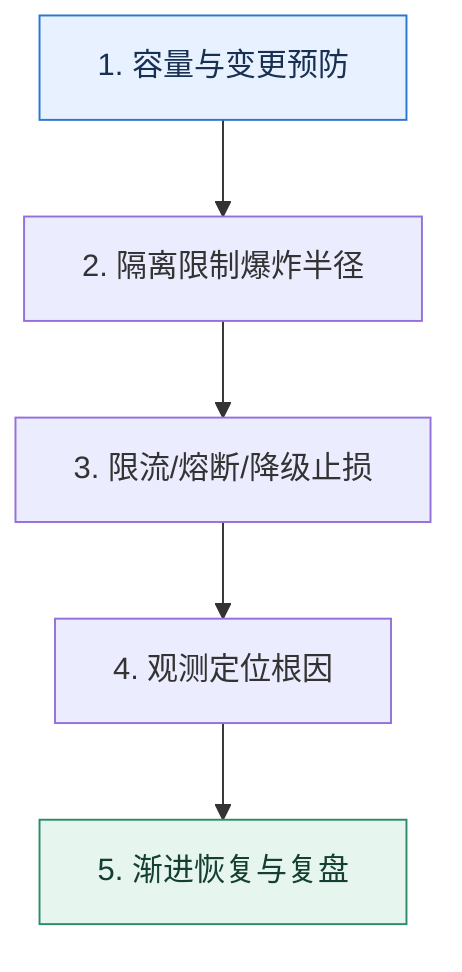

# 服务治理全景｜从预防、止损到恢复构建闭环

> 本课只回答一个问题：单个限流或熔断器都能工作，为什么系统仍可能在流量突增时整体失效？

这是一份独立学习稿。来源资料用于核对知识范围；下面的解释、推演、边界和图示均按工程学习路径重新组织，不依赖原页面也能完整阅读。

## 先补齐：建立正确的心智模型

治理不是功能清单，而是闭环：先知道容量和依赖，再限制故障范围；故障发生时快速失败并保护核心链路；随后定位、恢复、补偿并把经验固化进变更流程。

读这一课时，始终把“组件名字”换成三个可追踪对象：**谁发起动作、状态存在哪里、失败后由谁收敛**。这样遇到不同产品或版本，仍能用同一套模型判断。

## 本节精讲：机制是怎样一步步工作的

预防层包含容量评估、隔离、超时预算和变更门禁；止损层包含限流、熔断和降级；恢复层包含探测、渐进放量、重放与对账；证据层贯穿指标、日志、追踪和事件记录。每个手段都要对应明确风险，例如限流处理进入量过大，熔断处理下游持续失败，隔离处理资源争抢，不能互相替代。

下面这张图只表达本课最重要的状态推进，蓝色是入口，绿色是可验收的终点；任一箭头失败，都要回到上文寻找重试、回退或人工处理的位置。

### 一次带数字的完整推演

活动开始后请求从 2k 升到 10k QPS：网关先按已验证容量限流；推荐服务走缓存降级；订单服务与报表连接池隔离；支付依赖错误率超过阈值后熔断；告警定位到供应商后切换备用通道；恢复时按 5% 梯度放量并对账异步订单。

数字的作用不是制造精确感，而是暴露容量和时间关系。把例子中的流量、延迟、分片数或版本号替换成自己的真实数据，方案可能会随之改变。

## 误区与失效边界

“高可用”不是所有请求都成功，而是在故障和容量约束下保持约定的核心服务、明确失败语义并可恢复。自动化治理如果没有边界，错误规则也会自动扩大事故。

判断一个结论是否可靠，可以追问两次：**它依赖什么前提？前提失效后系统留下了什么状态？** 如果回答只能停在“框架会自动处理”，就还没有走到工程边界。

## 按讲解顺序重建知识链

来源稿覆盖的论证主线在这里被重建成四步，保留问题、推导、反例和收束，不沿用原页面措辞：

1. 先按容错、故障范围、发现与修复、变更规范四个维度整理治理目标。
2. 用一次真实问题按发现、计划、落地、效果和改进复盘，而不是罗列组件。
3. 把异步解耦和自动处理放进闭环，说明它们何时触发、失败后怎样回退。
4. 最终用业务 SLO 和故障演练验证组合方案，而不是以“接入中间件”作为完成标准。

把四步连起来后，本课不是一个孤立结论，而是一条可以复演的因果链。需要回查课程覆盖范围时，可打开文末的来源稿；学习时以本页模型为主。

## 工程验证：把理解变成证据

建立治理控制表：每一行一个风险，每列填写 `检测信号、自动动作、人工确认、恢复条件、补偿任务、最大影响范围`。空白列就是事故发生时的未知行为。

### 状态检查表

| 步骤 | 状态或动作 | 需要留下的证据 |
| ---: | --- | --- |
| 1 | 容量与变更预防 | 记录耗时、结果与异常分支，确认状态能进入下一步 |
| 2 | 隔离限制爆炸半径 | 记录耗时、结果与异常分支，确认状态能进入下一步 |
| 3 | 限流/熔断/降级止损 | 记录耗时、结果与异常分支，确认状态能进入下一步 |
| 4 | 观测定位根因 | 记录耗时、结果与异常分支，确认状态能进入下一步 |
| 5 | 渐进恢复与复盘 | 记录耗时、结果与异常分支，确认状态能进入下一步 |

检查表不是要求生产系统逐字采用这些字段，而是强迫设计者为每一步提供可观测结果。只有入口、没有终态的流程，最终都会形成无法解释的中间状态。

## 自我检查

为什么已经有熔断器，仍然需要限流和隔离？

熔断处理的是依赖失败；流量可能在依赖健康时就超过容量，且不同业务会争抢公共资源。限流控制进入量，隔离限制争抢边界，三者处理不同风险。

再做一次闭卷练习：不看上文画出状态图，并为其中任意两个箭头注入超时、进程崩溃或重复请求。如果你能预测最终状态和观测信号，这一课才真正从“听懂”变成“会用”。

## 来源与版本校准

- [查看来源稿（21 页资料整理）](../content/09-service-governance.md)

来源稿只用于追溯知识范围，不是本学习稿的正文。具体产品的默认值、命令与内部实现会随版本变化；落地前应使用目标版本官方文档和故障演练再次确认。
