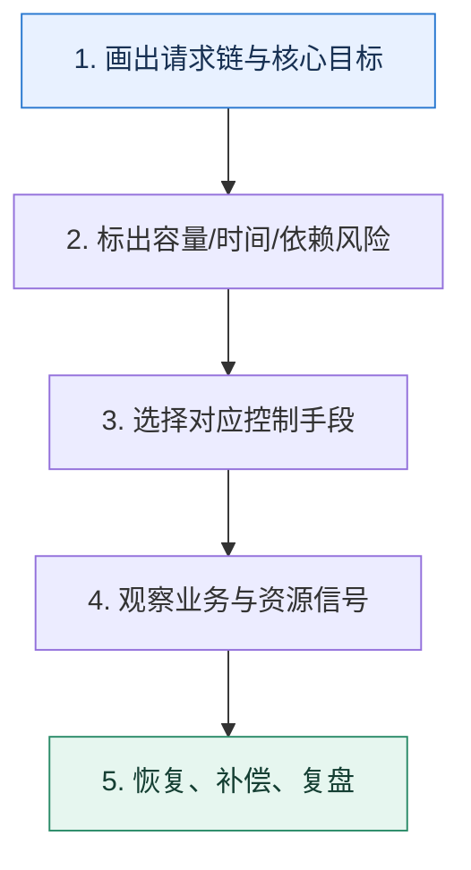

# 服务治理专题复盘｜从一次故障串起九个控制手段

> 本课只回答一个问题：面对一次“流量突增叠加下游抖动”的事故，怎样按因果顺序选择治理手段？

这是一份独立学习稿。来源资料用于核对知识范围；下面的解释、推演、边界和图示均按工程学习路径重新组织，不依赖原页面也能完整阅读。

## 先补齐：建立正确的心智模型

复盘时不要按组件名字逐个背。先画请求从入口到依赖的路径，再标出流量、时间、资源和状态四种约束，治理动作自然会落在对应位置。

读这一课时，始终把“组件名字”换成三个可追踪对象：**谁发起动作、状态存在哪里、失败后由谁收敛**。这样遇到不同产品或版本，仍能用同一套模型判断。

## 本节精讲：机制是怎样一步步工作的

入口过量由限流控制；不同租户争抢由隔离控制；每跳等待由超时预算控制；下游连续失败由熔断止损；核心路径资源不足由降级释放；节点变化由服务发现同步；节点选择由负载均衡反馈；外部供应商由适配层和补偿包围。所有动作最后汇入观测、恢复和变更治理。

下面这张图只表达本课最重要的状态推进，蓝色是入口，绿色是可验收的终点；任一箭头失败，都要回到上文寻找重试、回退或人工处理的位置。

### 一次带数字的完整推演

假设营销活动使流量涨 5 倍，第三方风控同时 P99 升到 3 秒。先按可承载 QPS 拒绝超额流量；VIP 与普通流量分池；风控调用 300ms 截止，超时订单进入人工复核；错误窗口触发熔断；恢复后半开探测；整个过程用订单受理率而不是 HTTP 200 率评估。

数字的作用不是制造精确感，而是暴露容量和时间关系。把例子中的流量、延迟、分片数或版本号替换成自己的真实数据，方案可能会随之改变。

## 误区与失效边界

专题串联不是“一次接入所有治理组件”。若没有明确风险，额外中间层会增加延迟和故障点。每个动作都要能指向一个已观察或已演练的失败模式。

判断一个结论是否可靠，可以追问两次：**它依赖什么前提？前提失效后系统留下了什么状态？** 如果回答只能停在“框架会自动处理”，就还没有走到工程边界。

## 按讲解顺序重建知识链

来源稿覆盖的论证主线在这里被重建成四步，保留问题、推导、反例和收束，不沿用原页面措辞：

1. 先回答系统的核心可用目标和允许牺牲的功能。
2. 沿请求链检查节点发现与选择，避免流量继续进入坏节点。
3. 再检查限流、隔离、超时、熔断、降级能否形成互补而非重复。
4. 最后把第三方、恢复放量、数据补偿和变更流程纳入同一份事故时间线。

把四步连起来后，本课不是一个孤立结论，而是一条可以复演的因果链。需要回查课程覆盖范围时，可打开文末的来源稿；学习时以本页模型为主。

## 工程验证：把理解变成证据

复盘练习：画一张时间线，至少标出 `流量变化、第一条告警、第一次自动动作、核心指标最低点、恢复开始、补偿完成`。每个治理手段必须能落到一个时间点。

### 状态检查表

| 步骤 | 状态或动作 | 需要留下的证据 |
| ---: | --- | --- |
| 1 | 画出请求链与核心目标 | 记录耗时、结果与异常分支，确认状态能进入下一步 |
| 2 | 标出容量/时间/依赖风险 | 记录耗时、结果与异常分支，确认状态能进入下一步 |
| 3 | 选择对应控制手段 | 记录耗时、结果与异常分支，确认状态能进入下一步 |
| 4 | 观察业务与资源信号 | 记录耗时、结果与异常分支，确认状态能进入下一步 |
| 5 | 恢复、补偿、复盘 | 记录耗时、结果与异常分支，确认状态能进入下一步 |

检查表不是要求生产系统逐字采用这些字段，而是强迫设计者为每一步提供可观测结果。只有入口、没有终态的流程，最终都会形成无法解释的中间状态。

## 自我检查

事故中数据库连接池已满，为什么先调大网关超时通常会让情况更差？

更长等待会让更多请求和线程滞留，继续占用连接及内存。应先减少进入量、隔离或降级，再定位并扩展真实瓶颈。

再做一次闭卷练习：不看上文画出状态图，并为其中任意两个箭头注入超时、进程崩溃或重复请求。如果你能预测最终状态和观测信号，这一课才真正从“听懂”变成“会用”。

## 来源与版本校准

- [查看来源稿（9 页资料整理）](../content/09a-mock-service-governance.md)

来源稿只用于追溯知识范围，不是本学习稿的正文。具体产品的默认值、命令与内部实现会随版本变化；落地前应使用目标版本官方文档和故障演练再次确认。
