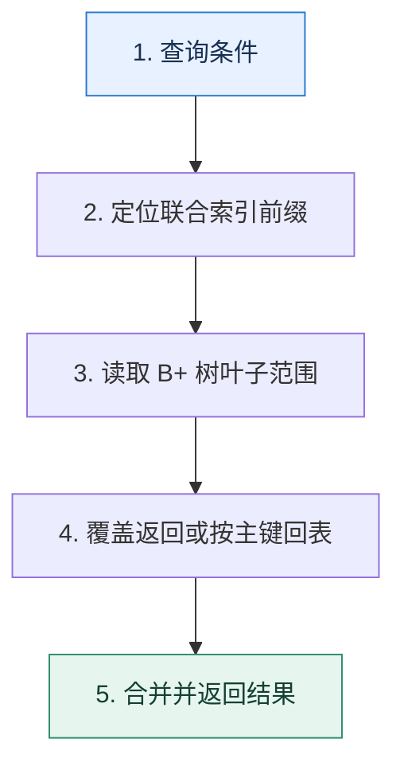

# InnoDB 索引｜从磁盘页、B+ 树到回表成本

> 本课只回答一个问题：为什么一个合适的索引能把全表扫描变成少量页访问？

这是一份独立学习稿。来源资料用于核对知识范围；下面的解释、推演、边界和图示均按工程学习路径重新组织，不依赖原页面也能完整阅读。

## 先补齐：建立正确的心智模型

数据库以页为 I/O 单位。B+ 树内部节点主要保存键和子页指针，叶子节点保存有序记录并相连，因此较高扇出降低树高，叶子链适合范围扫描。

读这一课时，始终把“组件名字”换成三个可追踪对象：**谁发起动作、状态存在哪里、失败后由谁收敛**。这样遇到不同产品或版本，仍能用同一套模型判断。

## 本节精讲：机制是怎样一步步工作的

InnoDB 聚簇索引叶子保存整行，二级索引叶子保存索引列和主键。通过二级索引找非覆盖列需要拿主键回聚簇索引，这就是回表。联合索引按键顺序排序，只有能确定前缀范围的条件才能连续定位；覆盖索引则让所需列都在索引中。优化器是否使用索引还取决于选择性、估算成本和返回比例。

下面这张图只表达本课最重要的状态推进，蓝色是入口，绿色是可验收的终点；任一箭头失败，都要回到上文寻找重试、回退或人工处理的位置。

### 一次带数字的完整推演

表有一亿行，页大小假设 16KiB，内部节点平均可容纳约 500 个键。三级树理论上可覆盖约 `500³=1.25 亿` 个叶子位置，定位只需沿根—中间—叶子读取少量页。查询 `(tenant_id, created_at)` 时，先等值锁定租户再扫描时间范围，比只建 `created_at` 更能缩小区间。

数字的作用不是制造精确感，而是暴露容量和时间关系。把例子中的流量、延迟、分片数或版本号替换成自己的真实数据，方案可能会随之改变。

## 误区与失效边界

B+ 树不是所有数据库和所有场景的唯一选择；哈希、倒排、LSM 等结构有不同目标。“有索引”也不等于一定快：返回大比例数据、频繁回表或统计信息失真时，全表扫描可能更便宜。

判断一个结论是否可靠，可以追问两次：**它依赖什么前提？前提失效后系统留下了什么状态？** 如果回答只能停在“框架会自动处理”，就还没有走到工程边界。

## 按讲解顺序重建知识链

来源稿覆盖的论证主线在这里被重建成四步，保留问题、推导、反例和收束，不沿用原页面措辞：

1. 从页和 B+ 树结构解释树高、扇出与范围扫描，而不是只说“层数少”。
2. 区分聚簇与二级索引，理解二级索引为什么携带主键。
3. 用覆盖索引和最左前缀分析回表、排序和过滤成本。
4. 最后讨论写放大、空间和优化器选择，索引并非越多越好。

把四步连起来后，本课不是一个孤立结论，而是一条可以复演的因果链。需要回查课程覆盖范围时，可打开文末的来源稿；学习时以本页模型为主。

## 工程验证：把理解变成证据

检查查询时记录 `possible_keys、key、key_len、rows、filtered、Extra`，再用真实执行统计验证估算。若扫描行数远大于返回行数，先检查索引前缀和过滤位置。

### 状态检查表

| 步骤 | 状态或动作 | 需要留下的证据 |
| ---: | --- | --- |
| 1 | 查询条件 | 记录耗时、结果与异常分支，确认状态能进入下一步 |
| 2 | 定位联合索引前缀 | 记录耗时、结果与异常分支，确认状态能进入下一步 |
| 3 | 读取 B+ 树叶子范围 | 记录耗时、结果与异常分支，确认状态能进入下一步 |
| 4 | 覆盖返回或按主键回表 | 记录耗时、结果与异常分支，确认状态能进入下一步 |
| 5 | 合并并返回结果 | 记录耗时、结果与异常分支，确认状态能进入下一步 |

检查表不是要求生产系统逐字采用这些字段，而是强迫设计者为每一步提供可观测结果。只有入口、没有终态的流程，最终都会形成无法解释的中间状态。

## 自我检查

联合索引 `(tenant_id, created_at)` 为什么适合“某租户最近订单”，却未必适合只按 `created_at` 查所有租户？

索引先按 tenant_id 排序。缺少前缀条件时，不同租户的时间段分散，无法直接形成一个连续的小范围。

再做一次闭卷练习：不看上文画出状态图，并为其中任意两个箭头注入超时、进程崩溃或重复请求。如果你能预测最终状态和观测信号，这一课才真正从“听懂”变成“会用”。

## 来源与版本校准

- [查看来源稿（21 页资料整理）](../content/10-mysql-index.md)

来源稿只用于追溯知识范围，不是本学习稿的正文。具体产品的默认值、命令与内部实现会随版本变化；落地前应使用目标版本官方文档和故障演练再次确认。

本课涉及的产品行为以这些官方资料为校准入口：

- [MySQL 8.4 · InnoDB 存储引擎](https://dev.mysql.com/doc/refman/8.4/en/innodb-storage-engine.html)
- [MySQL 8.4 · 锁定读](https://dev.mysql.com/doc/refman/8.4/en/innodb-locking-reads.html)
- [MySQL 8.4 · Redo Log](https://dev.mysql.com/doc/refman/8.4/en/innodb-redo-log.html)
