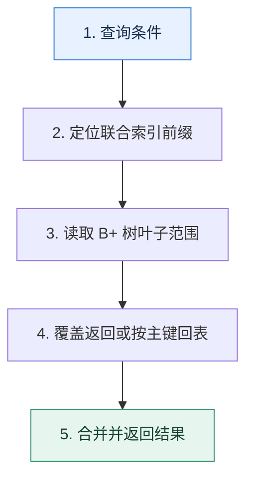

# InnoDB 索引｜从磁盘页、B+ 树到回表成本

> 本课只解决一个问题：为什么一个合适的索引能把全表扫描变成少量页访问？

这不是原页面的缩写，也不是一组孤立结论。下面先建立一个能推演的最小世界，再把状态、数字和失败分支摊开，最后按来源讲解顺序覆盖全部知识线索。读完后，你应当能从 `查询条件` 一直解释到 `合并并返回结果`，并说明中途任意一步失败会留下什么状态。

## 零基础入口：先建立本课的心智画面

数据库以页为 I/O 单位。B+ 树内部节点主要保存键和子页指针，叶子节点保存有序记录并相连，因此较高扇出降低树高，叶子链适合范围扫描。

先不要急着记组件名。只抓住四个问题：**现在手里有什么输入？下一步只做什么动作？哪个状态发生变化？变化后的结果交给谁？** 之后遇到新框架，只要这四个答案不变，核心机制就没有变。

### 放进一个足够小、可以手算的世界

表有一亿行，页大小假设 16KiB，内部节点平均可容纳约 500 个键。三级树理论上可覆盖约 `500³=1.25 亿` 个叶子位置，定位只需沿根—中间—叶子读取少量页。查询 `(tenant_id, created_at)` 时，先等值锁定租户再扫描时间范围，比只建 `created_at` 更能缩小区间。

这个小世界故意只保留本课必需的对象。生产系统会有更多节点、线程、分片和异常，但数量增加不会改变这里的因果关系。先确认你能手算这个例子，再把数字替换成真实系统数据。

### 先预测，不要马上看结论

**联合索引 `(tenant_id, created_at)` 为什么适合“某租户最近订单”，却未必适合只按 `created_at` 查所有租户？**

先写下自己的判断，并指出你依赖的前提。文末自我检查会揭示答案；如果答案不同，回到下面的状态表找出第一个分叉点。

## 本节精讲：让机制一步一步发生

InnoDB 聚簇索引叶子保存整行，二级索引叶子保存索引列和主键。通过二级索引找非覆盖列需要拿主键回聚簇索引，这就是回表。联合索引按键顺序排序，只有能确定前缀范围的条件才能连续定位；覆盖索引则让所需列都在索引中。优化器是否使用索引还取决于选择性、估算成本和返回比例。

### 可见状态推进

| 当前步 | 现在发生的动作 | 下一步拿到什么 |
| ---: | --- | --- |
| 1 | 查询条件 | 定位联合索引前缀 |
| 2 | 定位联合索引前缀 | 读取 B+ 树叶子范围 |
| 3 | 读取 B+ 树叶子范围 | 覆盖返回或按主键回表 |
| 4 | 覆盖返回或按主键回表 | 合并并返回结果 |
| 5 | 合并并返回结果 | 得到可核对的终态 |

图只承担一个任务：让你看清状态如何向前移动。它不意味着每一步必然成功；网络超时、进程退出、重复执行和数据竞争都可能让箭头停在中间，因此后面必须继续讨论失效边界。

### 一次带数字的完整推演

表有一亿行，页大小假设 16KiB，内部节点平均可容纳约 500 个键。三级树理论上可覆盖约 `500³=1.25 亿` 个叶子位置，定位只需沿根—中间—叶子读取少量页。查询 `(tenant_id, created_at)` 时，先等值锁定租户再扫描时间范围，比只建 `created_at` 更能缩小区间。

数字不是装饰。它迫使我们回答容量、顺序、时间窗口或版本选择问题。若换一个数字就得出不同结论，真正的设计依据就是那个阈值，而不是某个中间件名称。

## 按讲解顺序重建知识链：完整来源讲解

下面按来源资料的教学顺序重新编排完整内容。转换页码、来源图片、推广信息、水印和个人宣传已经删除；原本围绕求职问答的角色与措辞改写为工程学习、方案评审和故障复盘语境。机制、算法、例子、反例、事故线索、评论补充和限制条件仍然保留。这里的作用是补齐知识覆盖，不取代前面的独立推演。

从这节课开始，我们将进入数据库这一章。在实际工作中，数据库设计得好不好、SQL 写得好不好将极大程度影响系统性能。而且，即便是再小的公司，也不可能说没有数据库，所以如果你担忧自己因为没有微服务架构经验难以通过技术讨论，那么数据库就可以成为你反败为胜的一个点。

所以本节讨论数据库中的第一个话题——索引。

索引在数据库技术讨论中占据了相当大的比重。但是大部分人技术讨论索引的时候都非常机械，所以难以在技术评审者心中留下深刻印象。索引是一个理论和实践的结合，今天这节课我先带你分析索引的基本原理，下节课我再在 SQL 优化这一个大主题下进一步带你分析索引设计和优化的实战案例。

索引的内容还是非常多的，尤其是有很多非常细碎的、不成体系的点，记起来非常难。所以这一节课我就会尽量用非常简单的话，以及一些奇妙的比喻来帮助你记忆和索引有关的内容。

### 先把机制拆开

索引是用来加速查找的数据结构。绝大多数跟存储、查找有关的中间件都有索引功能，但是它们的原理不尽相同。

我们先来了解一下 B+ 树的定义与特征。

### B+ 树

B+ 树是一种多叉树，一棵 m 阶的 B+ 树定义如下：

1. 每个节点最多有 m 个子女。
2. 除根节点外，每个节点至少有 [m/2] 个子女，根节点至少有两个子女。
3. 有 k 个子女的节点必有 k 个关键字。
这里的关键字你可以直观地理解为就是索引全部列的值。B+ 树还有两个特征。

叶子存放了数据，而非叶子节点只是存放了关键字。叶子节点被链表串联起来了。

前面 B+ 树的定义你记不住没关系，但是这两个特征你一定要记住。为了帮助你理解和记忆，我给你打个比方。

一棵 B+ 树就像是一个部门。部门分成管理人员（非叶子节点）和基层员工（叶子节点），而管理人员只是负责传达命令（只放索引关键字），具体的事务（存放数据）都是由基层员工来执行的。

基层员工之间为了合作顺畅，私底下互相都有联系，对应到 B+ 树上就是叶子节点被链表连在一起。

B+ 树用于数据库索引有 3 大优势。

1. B+ 树的高度和二叉树之类的比起来更低，树的高度代表了查询的耗时，所以查询性能更好。
2. B+ 树的叶子节点都被串联起来了，适合范围查询。
3. B+ 树的非叶子节点没有存放数据，所以适合放入内存中。
很多人都能记住 B+ 树的前两个优势，但是很容易忽略第三个优势。事实上，我们在讨论使用索引提高查询性能的时候，一个默认的前提就是索引本身会全部装进内存中，只有真实的数据行会放在磁盘上。否则，索引也放在磁盘上的话，使用索引的效果也就不明显了。

### 索引分类

这算是你在学习索引过程中一个非常容易迷惘的点，因为 MySQL 的索引站在不同的角度，就有不同的说法。

根据叶子节点是否存储数据来划分，可以分成聚簇索引和非聚簇索引。如果某个索引包含某个查询的所有列，那么这个索引就是覆盖索引。如果索引的值必须是唯一的，不能重复，那么这个索引就是唯一索引。如果索引的某个列，只包含该列值的前一部分，那么这个索引就是前缀索引。比如说在一个类型是 varchar(128) 的列上，选择前 64 个字符作为索引。如果某个索引由多个列组成，那么这个索引就是组合索引，也叫做联合索引。全文索引是指用于支持文本模糊查询的索引。哈希索引是指使用哈希算法的索引，但是 MySQL 的 InnoDB 引擎并不支持这种索引。

一个索引可以同时是覆盖索引、唯一索引、前缀索引和组合索引，你站在不同的角度去看待索引就会有不同的说法。

### 聚簇索引和非聚簇索引

如果索引叶子节点存储的是数据行，那么它就是聚簇索引，否则就是非聚簇索引。

简单来说，某个数据表本身你就可以看作是一棵使用主键搭建起来 B+ 树，这棵树的叶子节点放着表的所有行。而其他索引也是 B+ 树，不同的是它们的叶子节点存放的是主键。

有了这种区分，你就能理解所谓的回表了。如果你查询一张表，用到了索引，那么数据库就会先在索引里面找到主键，然后再根据主键去聚簇索引中查找，最终找出数据。

如图所示，查询的时候先沿着绿色的线条在非聚簇索引中找到主键。然后拿着主键再去下面沿着黄色的线条找到数据行。这个数据行存放在磁盘里，所以触发磁盘 IO 之后能够读取出来。磁盘 IO 是非常慢的，因此回表性能极差，你在实践中要尽可能避免回表。

### 覆盖索引

如果你查询的列全部都在某个索引里面，那么数据库可以直接把索引存储的这些列的值给你，而不必回表。

比如说你有一个用户表 user_tab，在上面的 id 和 name 两列上创建了一个组合索引 <id,name>，那么对于这个查询来说 SELECT id, name FROM user_tab WHERE id = 123,SELECT 关键字后面的 id 和 name 两列都在这个索引里，那么就可以直接用索引的数据，不必回表查询了。

那么，这个索引在这个查询下就是一个覆盖索引。所以覆盖索引并不是一个独立的索引，而是某个索引相对于某个查询而言的。

针对这个特性，优化 SQL 性能里面有两种常见的说法。

1. 只查询需要的列。
2. 针对最频繁的查询来设计覆盖索引。
这两种说法本质上都是为了避免回表。

### 索引的最左匹配原则

索引在查询中是按照最左匹配原则来使用的，细究起来这个原则还是有点难以理解。我用一个例子来给你解释最左匹配原则的运行机制。比如说你创建了一个在 A、B、C 三个列上的组合索引 <A, B, C>。我用一个表格来展示一下索引列的值的关系。

我们可以看到：A 是绝对有序的；在 A 确定的情况下，B 是有序的；在 A 和 B 都确定的情况下，C 是有序的。

那么反过来说：

如果 A 的值不确定，那么 B 和 C 都是无序的。例如当 A 取值可能为 1 或者 2 的时候，B的取值可能是 (23, 44, 31)。如果 A 的值确定，但是 B 的值不确定，那么 C 是无序的。例如当 A=1 而 B 可能是 44 或者 31 的时候，C 的值可能是 (122, 132, 109)。

所以执行一个 WHERE A=a1 AND B=b1 AND C=c1 的查询就类似于：

复制代码1 for a in A {2 if a == a1 {3 for b in B {4 if b == b1 {5 for c in C {6 if c == c1 {7 // 这就是你要的数据，拿到主键之后去磁盘里面加载出来8 }9 }10 }11 }12 }13 }

你从这个角度出发，就能理解其他最左匹配原则的情况了。

如果查询条件是 WHERE A = a1 AND B = b1，那么你可以推断出来，数据库只会应用外层的两重循环，不会对 C 进行过滤。

复制代码1 for a in A {2 if a == a1 {3 for b in B {4 if b == b1 {5 // 这就是你要的结果，去磁盘里面读取6 }7 }8 }9 }

如果查询条件是 WHERE A = a1 OR B = b1，那么这个查询并不会使用这个索引。

复制代码1 for a in A {2 if a == a1 {3 as = append(as, a)4 }5 }6 for b in B {7 if b == b1 {8 bs = append(bs, b)9 }10 }11 // as 和 bs 的并集就是你要的结果

如果查询条件是 WHERE A=a1 AND B > b1 AND C = c1，那么这个查询只会使用索引的 A 和 B 两列。

复制代码1 for a in A {2 if a == a1 {3 for b in B {

4 if b > b1 {5 // C 是无序的，所以用不了。你可以从前面的表格里面看出来6 // 比如说 b > 23 之后，对应的 C 是乱序的7 // 这就是你要的结果，去磁盘里面读取8 }9 }10 }11 }

如果查询条件是 WHERE A !=a1，那么这个查询也不会使用索引。

我给你整理了一个简单的口诀用于判断会不会使用索引。按照组成索引的列的顺序，从左往右：AND 用 OR 不用，正用反不用，范围则中断。

这个口诀是一个简化之后的版本，还有一些意外情况是不符合这个口诀描述的规律的。比如说M = 1 OR N = 2，如果单列 M 上有一个索引，并且单列 N 上也有一个索引，那么还是可能会使用 M 和 N 上的两个索引。

在实践中，用索引还是不用索引，就一个原则：看 EXPLAIN 命令的输出。

### 索引的代价

索引并不是没有代价的，它会消耗很多的系统资源。

1. 索引本身需要存储起来，消耗磁盘空间。
2. 在运行的时候，索引会被加载到内存里面，消耗内存空间。
3. 在增删改的时候，数据库还需要同步维护索引，引入额外的消耗。

这部分内容你也需要记住，因为现在有一些技术评审者的套路就是突然问你违反直觉的问题。例如正常我们都认为索引非常好，有很多优点，那么技术评审者就可能突然问你“使用索引有什么问题”“索引有什么坏处”等问题。

### 把知识转成可验证的工程判断

首先你要弄清楚公司内使用索引的情况，或者你所在公司使用过的各种索引，以及有没有出现索引设计不当引发的线上故障。

如果你有意为自己打造掌握了高性能架构的人设，那么你技术讨论索引的最佳策略就是在自我介绍或者介绍项目的时候提及索引和索引优化。

在技术讨论中有一种情况是比较棘手的，即技术评审者给出一个表定义，然后手写一个 SQL，要你判断这个 SQL 会不会使用索引。你平时要刻意练习一下，省得技术讨论的时候被打个措手不及。遇到这种题目，你还要注意强调一点，就是你的解释都是建立在一般情况下。因为有些技术评审者会故意不告诉你表中数据大小，有没有其他索引等情况。

在你解释完之后，他可能会批评你没有考虑到数据库压根不使用索引的可能性。所以解释完他的问题之后，你加一段话。

我刚才的分析都是基于一般情况，但是如果说数据库还有别的索引，或者查询条件过滤效果不好导致数据库压根不使用索引的情况，那就是另外一个问题了。

这个“免责声明”也能够将技术评审者引导到后面的进阶进阶推导“为什么数据库不使用索引”中。

如果技术评审者问到了这些问题，那么你可以将话题引导到索引下。

你有没有做过性能优化？你是否了解 B 树、B+ 树？你知道聚簇索引、覆盖索引吗？数据库一定会使用索引吗？使用索引性能一定好吗？这个问题你要综合考虑索引本身的开销，以及数据库压根不用索引的情况。

### 基本思路

如果你在简历、自我介绍或者项目介绍任何一个地方提及了自己懂索引原理、索引设计和优化技巧，那么技术评审者肯定就会问你索引有关的东西。

如果技术评审者问索引问得非常细，例如“什么是覆盖索引”这种，只需要按照前置知识里面的内容解释就可以。

如果技术评审者问得比较笼统，你就可以用这里我给你的这个介绍索引的话术，你可以根据自己的需要选择解释全部或者只使用一部分。这个话术由 B+ 树、索引分类、最左匹配原则三个部分组成。

从数据结构上来说，在 MySQL 里面索引主要是 B+ 树索引。它的查询性能更好，适合范围查询，也适合放在内存里。

MySQL 的索引又可以从不同的角度进一步划分。比如说根据叶子节点是否包含数据分成聚簇索引和非聚簇索引，还有包含某个查询的所有列的覆盖索引等等。数据库使用索引遵循最

左匹配原则。但是最终数据库会不会用索引，也是一个比较难说的事情，跟查询有关，也跟数据量有关。在实践中，是否使用索引以及使用什么索引，都要以 EXPLAIN 为准。

在这样一个话术中，我设计了几个可以引导的点，技术评审者是比较有可能进一步追问的。

1. 为什么 MySQL 用了 B+ 树，而没有用 B 树？在这个问题的基础上，技术评审者可能会进一步问，二叉树、红黑树和跳表之类的数据结构用作索引是否合适。
2. 回表以及和回表密切相关的覆盖索引。从这一个问题又可以进一步引申到索引优化和 SQL优化上。这些索引的内容我们下节课会学习。
3. 数据库不使用索引的几种可能。
这些问题我们来一一解决。

### 进阶推导 1：MySQL 为什么使用 B+ 树？

解释这个问题，你就不能仅仅局限在 B+ 树和 B 树上，你要连带着二叉树、红黑树、跳表一起讨论。总结起来，在用作索引的时候，其他数据结构都有一些难以容忍的缺陷。

与 B+ 树相比，平衡二叉树、红黑树在同等数据量下，高度更高，性能更差，而且它们会频繁执行再平衡过程，来保证树形结构平衡。

与 B+ 树相比，跳表在极端情况下会退化为链表，平衡性差，而数据库查询需要一个可预期的查询时间，并且跳表需要更多的内存。与 B+ 树相比，B 树的数据存储在全部节点中，对范围查询不友好。非叶子节点存储了数据，导致内存中难以放下全部非叶子节点。如果内存放不下非叶子节点，那么就意味着查询非叶子节点的时候都需要磁盘 IO。

因此一个数据结构是否适合数据库索引，取决于这种数据结构的增删改查性能。并且在关系型数据库里面，还额外要求对范围查询友好，减少内存消耗。

### 进阶推导 2：为什么数据库不使用索引？

实际上，数据库在一些特殊的情况下可能并不会使用任何索引。例如在前面的索引 <A, B,C> 的例子中，假设 A 的所有值都是正数，然后查询条件 WHERE A > -1，那么这个时候数据库会觉得还不如直接全表扫描，那么虽然有一个索引看起来能用，但是最终并不会用。

我也在工程表达准备那部分提醒过你，要小心技术评审者挖坑让你掉下去。总结起来，数据库可能不使用索引的原因有以下几种：

使用了 !=、LIKE 之类的查询。字段区分度不大。比如说你的 status 列只有 0 和 1 两个值，那么数据库也有可能不用。使用了特殊表达式，包括数学运算和函数调用。数据量太小，或者 MySQL 觉得全表扫描反而更快的时候。

我稍微强调一下，这里说的是“可能不使用索引”，不是说一定不使用索引。比如说 LIKE 查询，如果只是 LIKE abc% 这种前缀查询，那么还是可能用索引的。

你还可以进一步解释 FORCE INDEX（强迫使用索引）、USE INDEX（使用索引）或者IGNORE INDEX（忽略索引）之类的 SQL 提示，关键词是取决于数据库。

虽然很多数据库都支持类似于 FORCE INDEX 、USE INDEX 和 IGNORE INDEX 之类的特性，但是使用这一类功能的时候，要千万注意数据库是怎么支持的。有些数据库是根本不管这些提示，有些则是特定情况下不管。当然最佳实践还是不要用这些东西，逼不得已的时候比如说要优化性能了再考虑使用。

然后你可以以一种比较轻松的语气来引导到下一个进阶推导。

有一种说法是含有 NULL 的列上的索引会失效，不过这个说法并不准确，实际上 MySQL还是会尽可能用索引的。

之所以要让语气比较轻松，是害怕对面的技术评审者就抱有这种错误的观点。你语气轻松比较不容易激起逆反心理。

### 进阶推导 3：索引与 NULL

我们通常用 NULL 来表达“不知道”“不存在”“不合法”等语义。而数据库通常也会针对NULL 来做一些特殊的处理。

MySQL 的索引对 NULL 的支持稍微有点与众不同。首先 MySQL 本身会尽可能使用索引，即便索引的某个列里面有零值，并且 IS NULL 和 IS NOT NULL 都可以使用索引。

其次 MySQL 的唯一索引允许有多行的值都是 NULL。也就是说你可以有很多行唯一索引的列的值都是 NULL。但是不管怎么说，使用 NULL 都是一个比较差的实践。

### 本节原始知识线索收束

这一节课我们主要学习了索引的基本原理。你需要重点掌握索引的数据结构、B+ 树原理、索引分类、回表，以及索引在查询中的运行原理。

此外如果想要在技术讨论中给出有证据的判断，你需要从下面几个方向去努力。

MySQL 为什么使用 B+ 树？你要综合对比不同的数据结构的特性。为什么数据库不使用索引？索引与 NULL 的特殊之处。

我在前面还提到了一个有趣的技术讨论场景。即技术评审者会问你某个具体场景的问题，但是不会告诉你细节和约束。比如说给你一个查询语句，让你判断会不会走索引。

虽然我不太喜欢这种技术讨论套路，但是不得不说很多技术评审者就喜欢这样搞。他们的出发点是希望考察候选人思维是否缜密，能不能考虑到各种异常情况、边缘场景。

但是很多时候技术评审者出题根本没有考虑到候选人的技术背景。比如说你本职是做支付相关的，而他出的题是订单相关的。那么在这种专业不对口的情况下，你基本上不可能答好。这也是我认为这种技术讨论套路实际上并不太能考察出候选人真实水平的核心原因。

应付这种技术讨论套路也很简单，你只需要保持警惕。当技术评审者问你一个具体问题的时候，你先尽可能问清楚一些约束条件，最常见的就是并发量有多高、数据量有多大、可用性要求多高、一致性要求多高。

如果技术评审者不告诉你，让你考虑。或者你自己不打算问，那么你可以采用防御性的技术讨论策略，在解释具体方案的时候先自己交代清楚这个方案的约束。

### 继续推演

你有没有遇到过索引设计不合理引发的线上故障？如果有，当时你是怎么定位问题、怎么解决问题的？你有没有因为 NULL 而出现过奇奇怪怪的问题？

### 补充讨论与边界校准

补充讨论： mongodb用的wiredTiger就是B+树，建议这篇修改下，不要误人子弟

讲解补充：感谢指正，我重新写一下相关论述。

补充讨论：

讲解补充：是的，就是这种索引用起来效果不太好，因为区分度太低了。当然，如果你主要查询都是查 failed 的，那么就还挺好用的。

6

补充讨论：

讲解补充：感谢指正，我调整一下！

补充讨论： id, name FROM user_tab WHERE id = 123，这个SQL中需要强调id不是作为主键，因为id如果是主键，就会直接走主键索引，无法体现覆盖索引中只查询索引中的字段的过程，另外联合索引<id，name>中如果SQL改成SELECT id, name，age FROM user_tab WHE RE id = 123就无法实现覆盖索引的效果

讲解补充：赞！说得很准确！

1

补充讨论：

讲解补充：如果我是技术评审者，我就会杠，如果不能停掉服务呢？阁下该如何应对？

Singin in the Rai...2023-08-25 来自北京关于哈希索引，文中提到『但是 MySQL 的 InnoDB 引擎并不支持这种索引。』这一段表述不是很精确。哈希索引确实用在MEMORY存储引擎中，但是这种索引存在一个变种，自适应哈希索引，InnoDB引擎通过innodb_adaptive_hash_index参数控制在其内部使用。

讲解补充：赞赞赞。我这里是指我们作为一个用户，是没办法说创建一个哈希索引的。

补充讨论： IO 之后能够读取出来。磁盘 IO 是非常慢的，因此回表性能极差，你在实践中要尽可能避免回表"这句话说回表的性能差的原因，但是前面"一个默认的前提就是索引本身会全部装进内存中，只有真实的数据行会放在磁盘上"，那使用主键索引也需要走磁盘，性能差别就是拿到主键之后再去拿数据的性能差吗？

讲解补充：不是的，聚簇索引的非叶子部分是可以直接放在内存的。

话又说回来，如果整个内存不够的话，那么索引还是有可能一直在磁盘上的。

江 Nina 2023-08-04 来自北京“如果查询条件是 WHERE A = a1 OR B = b1，那么这个查询并不会使用这个索引。” 这个是为什么呢 明白b不会走索引 但是感觉前一个A会走索引啊

讲解补充：严格来说，它走不走索引，不一定。也就是说，如果 MySQL 用 A 索引能加速查询，也就是扫描的行数少，那么它就用；如果用 A 索引，但是 OR 后面的查询条件比起来，B = b1 命中了很多行，那么就不会用 A 的索引，而是直接扫描。

简单来说，就是 OR 两边的条件，MySQL 认为命中的数据越少，就越倾向于用索引。反过来，就不会用索引。

补充讨论：

能通过主键直接查吗？是不是因为这个索引用的不是聚簇索引。存的是主键，只好通过主键去查了。Q2：聚簇索引和非聚簇索引，可以人为的去干预吗？全部用聚簇，是不是就不会产生回表了。

讲解补充：1. 我这里说的是普通索引。普通索引的叶子节点存储的是主键，所以你需要用主键再去回表。

2. 不能干预。这是 MySQL 的内部机制。

补充讨论：

讲解补充：啊！这么神奇！是删除过程不能插入吧？

## 把完整讲解收束成一条因果链

1. 从页和 B+ 树结构解释树高、扇出与范围扫描，而不是只说“层数少”。
2. 区分聚簇与二级索引，理解二级索引为什么携带主键。
3. 用覆盖索引和最左前缀分析回表、排序和过滤成本。
4. 最后讨论写放大、空间和优化器选择，索引并非越多越好。

把这几步连接起来时，不要省略“为什么”。最终结论只有在前提、状态变化和失败代价都说得清楚时才可靠。

## 误区与失效边界

B+ 树不是所有数据库和所有场景的唯一选择；哈希、倒排、LSM 等结构有不同目标。“有索引”也不等于一定快：返回大比例数据、频繁回表或统计信息失真时，全表扫描可能更便宜。

再加一条通用但必须落实到本课对象上的边界：机制只能处理它看得见的信号。若输入指标失真、状态没有持久化、错误被吞掉，或者补偿没有幂等保护，再成熟的框架也只能基于错误证据作决定。

### 三种故障注入方式

| 故障 | 要观察什么 | 不能接受的解释 |
| --- | --- | --- |
| 在第 2 步前让依赖超时 | 是否停在可重试状态，是否消耗完上游预算 | “框架稍后会处理” |
| 在状态写入后让进程退出 | 重启后能否识别已完成与待继续动作 | “再执行一次应该没事” |
| 对同一输入并发执行两次 | 是否出现重复副作用、顺序颠倒或覆盖 | “概率很低” |

## 工程验证：把理解变成可以复查的证据

检查查询时记录 `possible_keys、key、key_len、rows、filtered、Extra`，再用真实执行统计验证估算。若扫描行数远大于返回行数，先检查索引前缀和过滤位置。

| 步骤 | 状态或动作 | 最少应留下的证据 |
| ---: | --- | --- |
| 1 | 查询条件 | 开始时间、结束时间、输入标识、结果状态、异常原因 |
| 2 | 定位联合索引前缀 | 开始时间、结束时间、输入标识、结果状态、异常原因 |
| 3 | 读取 B+ 树叶子范围 | 开始时间、结束时间、输入标识、结果状态、异常原因 |
| 4 | 覆盖返回或按主键回表 | 开始时间、结束时间、输入标识、结果状态、异常原因 |
| 5 | 合并并返回结果 | 开始时间、结束时间、输入标识、结果状态、异常原因 |

验证时同时记录成功路径和失败路径。只证明“正常时能跑通”不能说明设计可靠；至少要让一次超时、一次进程退出和一次重复请求可重现，并能根据日志或指标解释最后状态。

## 学完检查：闭卷画出本课

你现在应该能独立完成四件事：

1. 用自己的话说出本课唯一问题，不使用产品名也能解释。
2. 复算上面的具体例子，并指出哪个输入改变会让结论改变。
3. 沿 Mermaid 图注入一次失败，预测系统停在哪里以及由谁收敛。
4. 说出本课机制不保证什么，并给出一个反例。

## 自我检查

联合索引 `(tenant_id, created_at)` 为什么适合“某租户最近订单”，却未必适合只按 `created_at` 查所有租户？

索引先按 tenant_id 排序。缺少前缀条件时，不同租户的时间段分散，无法直接形成一个连续的小范围。

怎样证明自己不是只记住了名词？

把 `查询条件` 的一个真实输入写出来，逐步记录到 `合并并返回结果`。然后在中间任意一步制造失败；如果你能解释当前状态、下一责任方、可观测证据和恢复边界，就已经拥有可以迁移的工程模型。

## 来源与事实校准

- [查看完整来源稿（本地 21 页资料）](../content/10-mysql-index.md)

### 当前事实校准

MySQL 8.4 官方文档仍明确复合索引可用于其最左前缀，但是否真正选择该索引由优化器根据代价决定。“符合最左前缀”只表示具备索引查找能力，不等于一定零回表、一定覆盖查询或一定比全表扫描快。

- [MySQL 8.4 · Multiple-Column Indexes](https://dev.mysql.com/doc/refman/8.4/en/multiple-column-indexes.html)
- [MySQL 8.4 · Clustered and Secondary Indexes](https://dev.mysql.com/doc/refman/8.4/en/innodb-index-types.html)

来源稿用于核对覆盖范围，不随公开站点发布。产品默认值和具体内部行为可能随版本变化；落地时应使用目标版本的官方文档、可运行实验和故障演练校准。本学习稿中的零基础入口、状态推演、故障矩阵和工程验证属于编辑补充，不冒充来源讲解者的原话。
