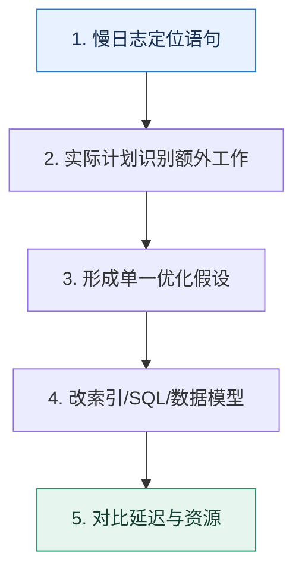

# SQL 优化｜先定位多做了什么，再减少扫描、排序与回表

> 本课只回答一个问题：一条 SQL 很慢时，怎样从证据而不是猜测开始优化？

这是一份独立学习稿。来源资料用于核对知识范围；下面的解释、推演、边界和图示均按工程学习路径重新组织，不依赖原页面也能完整阅读。

## 先补齐：建立正确的心智模型

SQL 延迟由解析、等待、访问路径、行处理、排序/聚合、网络返回共同组成。执行计划是优化器的估算，慢日志和实际执行统计才是结果。

读这一课时，始终把“组件名字”换成三个可追踪对象：**谁发起动作、状态存在哪里、失败后由谁收敛**。这样遇到不同产品或版本，仍能用同一套模型判断。

## 本节精讲：机制是怎样一步步工作的

先确认慢在数据库还是连接等待；再看扫描行数、返回行数、索引、临时表和排序；随后只改变一个变量，比较执行时间与资源。常见优化包括把过滤条件推到更早位置、建立覆盖索引、让排序顺序匹配索引、用游标替代深 offset、缩小返回列。COUNT、HAVING 和索引提示都应根据语义与数据分布验证，不能机械改写。

下面这张图只表达本课最重要的状态推进，蓝色是入口，绿色是可验收的终点；任一箭头失败，都要回到上文寻找重试、回退或人工处理的位置。

### 一次带数字的完整推演

订单表查询某商户最近 20 条已支付订单：`WHERE merchant_id=? AND status='paid' ORDER BY created_at DESC LIMIT 20`。索引只有 `merchant_id` 时要读取大量行再过滤排序；建立 `(merchant_id,status,created_at DESC)` 后可直接从小范围按序取 20 条。若还返回大字段，可能仍需回表。

数字的作用不是制造精确感，而是暴露容量和时间关系。把例子中的流量、延迟、分片数或版本号替换成自己的真实数据，方案可能会随之改变。

## 误区与失效边界

EXPLAIN 显示用了索引不代表性能已经好；扫描 500 万个索引项仍然很慢。强制索引可能短期修复统计误判，也可能在数据分布变化后变成新的问题。

判断一个结论是否可靠，可以追问两次：**它依赖什么前提？前提失效后系统留下了什么状态？** 如果回答只能停在“框架会自动处理”，就还没有走到工程边界。

## 按讲解顺序重建知识链

来源稿覆盖的论证主线在这里被重建成四步，保留问题、推导、反例和收束，不沿用原页面措辞：

1. 先用慢日志和执行计划找证据，重点比较扫描与返回行数。
2. 按选择性、联合索引顺序和覆盖需求设计访问路径。
3. 分别处理 ORDER BY、COUNT、HAVING、深分页和大表变更，不把它们混成一个技巧。
4. 优化后在相同数据量与缓存状态下复测，并观察写入成本。

把四步连起来后，本课不是一个孤立结论，而是一条可以复演的因果链。需要回查课程覆盖范围时，可打开文末的来源稿；学习时以本页模型为主。

## 工程验证：把理解变成证据

优化记录必须包含优化前后 SQL、数据规模、执行计划、P50/P95、扫描行数、返回行数和新增索引大小。只有延迟下降但写入变慢时，也要写出是否接受这个交换。

### 状态检查表

| 步骤 | 状态或动作 | 需要留下的证据 |
| ---: | --- | --- |
| 1 | 慢日志定位语句 | 记录耗时、结果与异常分支，确认状态能进入下一步 |
| 2 | 实际计划识别额外工作 | 记录耗时、结果与异常分支，确认状态能进入下一步 |
| 3 | 形成单一优化假设 | 记录耗时、结果与异常分支，确认状态能进入下一步 |
| 4 | 改索引/SQL/数据模型 | 记录耗时、结果与异常分支，确认状态能进入下一步 |
| 5 | 对比延迟与资源 | 记录耗时、结果与异常分支，确认状态能进入下一步 |

检查表不是要求生产系统逐字采用这些字段，而是强迫设计者为每一步提供可观测结果。只有入口、没有终态的流程，最终都会形成无法解释的中间状态。

## 自我检查

为什么 `type=range` 且 `key` 非空仍可能是一条坏计划？

因为它可能扫描很大的索引范围、做大量回表或额外排序。访问类型和用了哪个索引只是线索，必须继续看实际扫描量与算子成本。

再做一次闭卷练习：不看上文画出状态图，并为其中任意两个箭头注入超时、进程崩溃或重复请求。如果你能预测最终状态和观测信号，这一课才真正从“听懂”变成“会用”。

## 来源与版本校准

- [查看来源稿（18 页资料整理）](../content/11-sql-optimization.md)

来源稿只用于追溯知识范围，不是本学习稿的正文。具体产品的默认值、命令与内部实现会随版本变化；落地前应使用目标版本官方文档和故障演练再次确认。

本课涉及的产品行为以这些官方资料为校准入口：

- [MySQL 8.4 · InnoDB 存储引擎](https://dev.mysql.com/doc/refman/8.4/en/innodb-storage-engine.html)
- [MySQL 8.4 · 锁定读](https://dev.mysql.com/doc/refman/8.4/en/innodb-locking-reads.html)
- [MySQL 8.4 · Redo Log](https://dev.mysql.com/doc/refman/8.4/en/innodb-redo-log.html)
