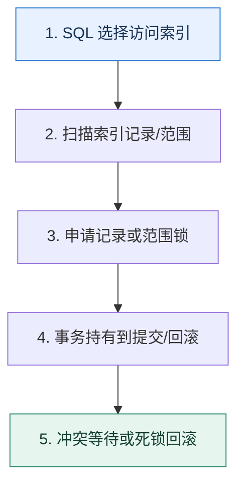

# InnoDB 锁｜锁住的是索引范围，不是抽象的一行数据

> 本课只回答一个问题：同样一条更新语句，为什么有时只影响一条记录，有时却阻塞一大片范围？

这是一份独立学习稿。来源资料用于核对知识范围；下面的解释、推演、边界和图示均按工程学习路径重新组织，不依赖原页面也能完整阅读。

## 先补齐：建立正确的心智模型

InnoDB 通过索引定位并加锁。记录锁针对索引记录，间隙锁针对记录之间的范围，临键锁组合二者；具体行为还受隔离级别、唯一索引和扫描范围影响。

读这一课时，始终把“组件名字”换成三个可追踪对象：**谁发起动作、状态存在哪里、失败后由谁收敛**。这样遇到不同产品或版本，仍能用同一套模型判断。

## 本节精讲：机制是怎样一步步工作的

普通一致性读通常走 MVCC，锁定读和更新会申请锁。没有合适索引时，为找到目标需要扫描更多索引范围，也就可能持有更多锁。意向锁让表级操作快速知道行级锁状态。死锁来自事务以不同顺序等待资源，数据库会选择一个事务回滚；应用必须捕获并重试整个事务。乐观锁用版本条件检测冲突，适合冲突较少且可重试的场景。

下面这张图只表达本课最重要的状态推进，蓝色是入口，绿色是可验收的终点；任一箭头失败，都要回到上文寻找重试、回退或人工处理的位置。

### 一次带数字的完整推演

索引 `(tenant_id,score)` 上执行 `SELECT ... WHERE tenant_id=7 AND score BETWEEN 60 AND 80 FOR UPDATE`，锁定的不是“业务上 60 到 80 的几行”这么简单，而是实际扫描的索引记录及可能的间隙。另一个事务插入 score=70 可能等待；换成唯一等值查询时范围通常更窄。

数字的作用不是制造精确感，而是暴露容量和时间关系。把例子中的流量、延迟、分片数或版本号替换成自己的真实数据，方案可能会随之改变。

## 误区与失效边界

“行锁数据库”不代表任何 SQL 都只锁一行。锁范围取决于实际访问路径。乐观锁也不是不加锁，它把并发冲突检测推迟到写入条件，并可能需要重试。

判断一个结论是否可靠，可以追问两次：**它依赖什么前提？前提失效后系统留下了什么状态？** 如果回答只能停在“框架会自动处理”，就还没有走到工程边界。

## 按讲解顺序重建知识链

来源稿覆盖的论证主线在这里被重建成四步，保留问题、推导、反例和收束，不沿用原页面措辞：

1. 先理解锁与索引的关系，再区分共享、排它、意向、记录、间隙和临键锁。
2. 说明锁通常在事务结束时释放，长事务会放大阻塞。
3. 用临键锁与不同加锁顺序推演死锁，并准备重试策略。
4. 最后比较悲观锁与版本号乐观锁，按冲突概率和副作用选择。

把四步连起来后，本课不是一个孤立结论，而是一条可以复演的因果链。需要回查课程覆盖范围时，可打开文末的来源稿；学习时以本页模型为主。

## 工程验证：把理解变成证据

用两个会话手工复现：会话 A 开事务并执行范围锁定读；会话 B 分别尝试更新已有行、插入间隙和插入范围外记录。记录哪些阻塞，再用 `performance_schema.data_locks` 对照锁对象。

### 状态检查表

| 步骤 | 状态或动作 | 需要留下的证据 |
| ---: | --- | --- |
| 1 | SQL 选择访问索引 | 记录耗时、结果与异常分支，确认状态能进入下一步 |
| 2 | 扫描索引记录/范围 | 记录耗时、结果与异常分支，确认状态能进入下一步 |
| 3 | 申请记录或范围锁 | 记录耗时、结果与异常分支，确认状态能进入下一步 |
| 4 | 事务持有到提交/回滚 | 记录耗时、结果与异常分支，确认状态能进入下一步 |
| 5 | 冲突等待或死锁回滚 | 记录耗时、结果与异常分支，确认状态能进入下一步 |

检查表不是要求生产系统逐字采用这些字段，而是强迫设计者为每一步提供可观测结果。只有入口、没有终态的流程，最终都会形成无法解释的中间状态。

## 自我检查

为什么给查询补上高选择性索引，可能同时改善性能和并发？

它减少需要扫描的记录与范围，既少读页，也可能缩小加锁范围和持锁时间，从而降低等待。

再做一次闭卷练习：不看上文画出状态图，并为其中任意两个箭头注入超时、进程崩溃或重复请求。如果你能预测最终状态和观测信号，这一课才真正从“听懂”变成“会用”。

## 来源与版本校准

- [查看来源稿（24 页资料整理）](../content/12-database-locks.md)

来源稿只用于追溯知识范围，不是本学习稿的正文。具体产品的默认值、命令与内部实现会随版本变化；落地前应使用目标版本官方文档和故障演练再次确认。

本课涉及的产品行为以这些官方资料为校准入口：

- [MySQL 8.4 · InnoDB 存储引擎](https://dev.mysql.com/doc/refman/8.4/en/innodb-storage-engine.html)
- [MySQL 8.4 · 锁定读](https://dev.mysql.com/doc/refman/8.4/en/innodb-locking-reads.html)
- [MySQL 8.4 · Redo Log](https://dev.mysql.com/doc/refman/8.4/en/innodb-redo-log.html)
