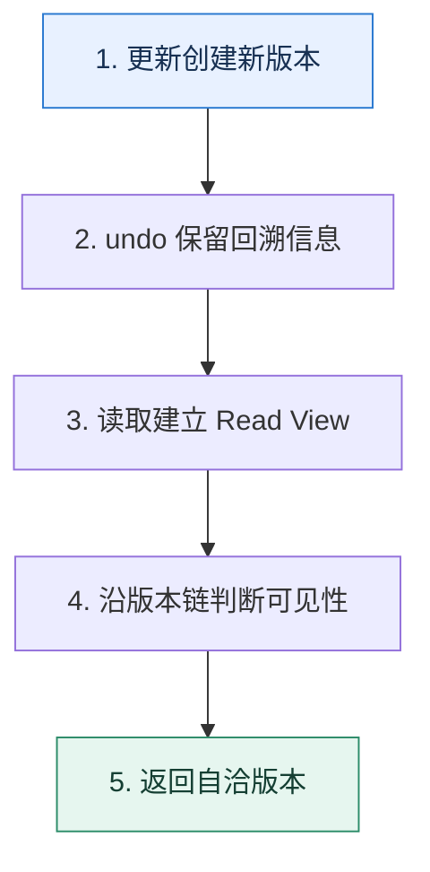

# MVCC｜让读取选择可见版本，而不是和写入互相等待

> 本课只回答一个问题：一行正在被修改时，普通查询为什么还能读到一个自洽的结果？

这是一份独立学习稿。来源资料用于核对知识范围；下面的解释、推演、边界和图示均按工程学习路径重新组织，不依赖原页面也能完整阅读。

## 先补齐：建立正确的心智模型

MVCC 把“当前值”扩展成版本链。undo 信息能够重建旧版本；Read View 描述当前读取允许看见哪些事务版本。可见性判断选择版本，而不是把写锁去掉。

读这一课时，始终把“组件名字”换成三个可追踪对象：**谁发起动作、状态存在哪里、失败后由谁收敛**。这样遇到不同产品或版本，仍能用同一套模型判断。

## 本节精讲：机制是怎样一步步工作的

事务更新记录时产生新版本并保留回溯信息。普通一致性读根据事务 ID、活跃事务集合和可见性边界沿版本链寻找可见版本。已提交读通常每条语句建立新的视图，因此同一事务后续语句可见新提交；可重复读通常在首次一致性读时建立视图并复用。锁定读读取较新的状态并参与锁竞争，和快照读不是一回事。

下面这张图只表达本课最重要的状态推进，蓝色是入口，绿色是可验收的终点；任一箭头失败，都要回到上文寻找重试、回退或人工处理的位置。

### 一次带数字的完整推演

余额最初 100。事务 T1 开始并读到 100；T2 把余额改成 80 后提交。若 T1 使用可重复读并复用旧视图，第二次普通读取仍可沿版本链看到 100；若使用已提交读，第二条语句的新视图可看到 80。T1 若执行 `FOR UPDATE`，则按锁定读语义处理。

数字的作用不是制造精确感，而是暴露容量和时间关系。把例子中的流量、延迟、分片数或版本号替换成自己的真实数据，方案可能会随之改变。

## 误区与失效边界

MVCC 不等于没有锁，也不保证所有查询都不阻塞。更新、删除、锁定读仍需要锁。长事务长期持有旧视图会阻碍旧版本清理并增加存储压力。

判断一个结论是否可靠，可以追问两次：**它依赖什么前提？前提失效后系统留下了什么状态？** 如果回答只能停在“框架会自动处理”，就还没有走到工程边界。

## 按讲解顺序重建知识链

来源稿覆盖的论证主线在这里被重建成四步，保留问题、推导、反例和收束，不沿用原页面措辞：

1. 先从读写互斥的性能问题引出多版本。
2. 用版本链解释旧值从哪里来，而不是把 MVCC 当成内存快照。
3. 再比较已提交读与可重复读创建 Read View 的时机。
4. 最后区分快照读与锁定读，并讨论长事务对版本清理的影响。

把四步连起来后，本课不是一个孤立结论，而是一条可以复演的因果链。需要回查课程覆盖范围时，可打开文末的来源稿；学习时以本页模型为主。

## 工程验证：把理解变成证据

用两个连接记录事务时间线：开始事务、第一次读、另一事务更新提交、第二次读、锁定读。分别在 READ COMMITTED 与 REPEATABLE READ 下执行，把结果写成可见性表。

### 状态检查表

| 步骤 | 状态或动作 | 需要留下的证据 |
| ---: | --- | --- |
| 1 | 更新创建新版本 | 记录耗时、结果与异常分支，确认状态能进入下一步 |
| 2 | undo 保留回溯信息 | 记录耗时、结果与异常分支，确认状态能进入下一步 |
| 3 | 读取建立 Read View | 记录耗时、结果与异常分支，确认状态能进入下一步 |
| 4 | 沿版本链判断可见性 | 记录耗时、结果与异常分支，确认状态能进入下一步 |
| 5 | 返回自洽版本 | 记录耗时、结果与异常分支，确认状态能进入下一步 |

检查表不是要求生产系统逐字采用这些字段，而是强迫设计者为每一步提供可观测结果。只有入口、没有终态的流程，最终都会形成无法解释的中间状态。

## 自我检查

为什么说 MVCC 解决的是“读哪个版本”，而不是“彻底取消并发控制”？

写写冲突和锁定读仍需锁；MVCC 只让普通读取在版本链上选择一个可见版本，从而减少读写互阻。

再做一次闭卷练习：不看上文画出状态图，并为其中任意两个箭头注入超时、进程崩溃或重复请求。如果你能预测最终状态和观测信号，这一课才真正从“听懂”变成“会用”。

## 来源与版本校准

- [查看来源稿（25 页资料整理）](../content/13-mvcc.md)

来源稿只用于追溯知识范围，不是本学习稿的正文。具体产品的默认值、命令与内部实现会随版本变化；落地前应使用目标版本官方文档和故障演练再次确认。

本课涉及的产品行为以这些官方资料为校准入口：

- [MySQL 8.4 · InnoDB 存储引擎](https://dev.mysql.com/doc/refman/8.4/en/innodb-storage-engine.html)
- [MySQL 8.4 · 锁定读](https://dev.mysql.com/doc/refman/8.4/en/innodb-locking-reads.html)
- [MySQL 8.4 · Redo Log](https://dev.mysql.com/doc/refman/8.4/en/innodb-redo-log.html)
