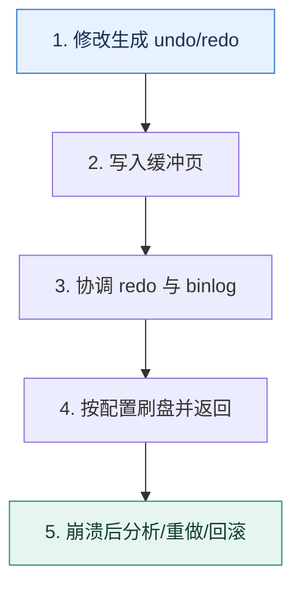

# 事务持久性｜提交成功背后经过了哪些日志与刷盘边界

> 本课只回答一个问题：数据库返回提交成功后，哪些故障可以恢复，哪些仍取决于配置和复制策略？

这是一份独立学习稿。来源资料用于核对知识范围；下面的解释、推演、边界和图示均按工程学习路径重新组织，不依赖原页面也能完整阅读。

## 先补齐：建立正确的心智模型

事务的原子性、持久性和复制不是同一层承诺。undo 支持回滚与旧版本，redo 记录页修改用于崩溃恢复，binlog 服务于复制和时间点恢复；它们有不同职责。

读这一课时，始终把“组件名字”换成三个可追踪对象：**谁发起动作、状态存在哪里、失败后由谁收敛**。这样遇到不同产品或版本，仍能用同一套模型判断。

## 本节精讲：机制是怎样一步步工作的

更新先修改缓冲页并生成日志。提交路径要协调 InnoDB redo 与 server 层 binlog，具体持久边界受刷盘参数和存储栈影响。WAL 的关键是先保证恢复所需日志稳定，再允许脏页稍后写回。主库本地提交也不等于副本已确认；如果业务要求跨节点耐久，需要明确同步确认或多数派语义及其延迟代价。

下面这张图只表达本课最重要的状态推进，蓝色是入口，绿色是可验收的终点；任一箭头失败，都要回到上文寻找重试、回退或人工处理的位置。

### 一次带数字的完整推演

订单状态从 pending 改为 paid。数据页尚未刷回表空间时机器断电，只要对应 redo 已按配置持久化，重启可重放恢复；若日志只停留在易失缓存中，突然掉电可能丢失。即使主库恢复无误，异步副本若尚未收到记录，主库永久损坏后的切换仍可能丢数据。

数字的作用不是制造精确感，而是暴露容量和时间关系。把例子中的流量、延迟、分片数或版本号替换成自己的真实数据，方案可能会随之改变。

## 误区与失效边界

“COMMIT 返回”不是跨所有硬件、所有副本和所有备份的绝对不丢。也不要为了加载数据在生产实例随意关闭 redo；那会改变崩溃恢复能力。

判断一个结论是否可靠，可以追问两次：**它依赖什么前提？前提失效后系统留下了什么状态？** 如果回答只能停在“框架会自动处理”，就还没有走到工程边界。

## 按讲解顺序重建知识链

来源稿覆盖的论证主线在这里被重建成四步，保留问题、推导、反例和收束，不沿用原页面措辞：

1. 先区分 undo、redo、binlog 的目的和生命周期。
2. 按事务执行顺序理解 WAL 与脏页延迟写回。
3. 把提交、操作系统缓存、磁盘持久化和副本确认拆成不同边界。
4. 最后用故障注入验证配置：进程崩溃、操作系统重启、主机掉电和主库永久丢失不是同一种故障。

把四步连起来后，本课不是一个孤立结论，而是一条可以复演的因果链。需要回查课程覆盖范围时，可打开文末的来源稿；学习时以本页模型为主。

## 工程验证：把理解变成证据

建立耐久矩阵：行是 `mysqld 崩溃、OS 重启、主机断电、磁盘损坏、机房丢失`，列是 `redo、binlog、副本、备份`。逐格写出是否能恢复和最大数据损失窗口。

### 状态检查表

| 步骤 | 状态或动作 | 需要留下的证据 |
| ---: | --- | --- |
| 1 | 修改生成 undo/redo | 记录耗时、结果与异常分支，确认状态能进入下一步 |
| 2 | 写入缓冲页 | 记录耗时、结果与异常分支，确认状态能进入下一步 |
| 3 | 协调 redo 与 binlog | 记录耗时、结果与异常分支，确认状态能进入下一步 |
| 4 | 按配置刷盘并返回 | 记录耗时、结果与异常分支，确认状态能进入下一步 |
| 5 | 崩溃后分析/重做/回滚 | 记录耗时、结果与异常分支，确认状态能进入下一步 |

检查表不是要求生产系统逐字采用这些字段，而是强迫设计者为每一步提供可观测结果。只有入口、没有终态的流程，最终都会形成无法解释的中间状态。

## 自我检查

为什么数据页尚未落盘，事务仍可能在重启后恢复？

WAL 允许先持久化描述修改的 redo，脏页稍后写入。重启时根据日志把已提交修改重做到数据页。

再做一次闭卷练习：不看上文画出状态图，并为其中任意两个箭头注入超时、进程崩溃或重复请求。如果你能预测最终状态和观测信号，这一课才真正从“听懂”变成“会用”。

## 来源与版本校准

- [查看来源稿（26 页资料整理）](../content/14-database-transactions.md)

来源稿只用于追溯知识范围，不是本学习稿的正文。具体产品的默认值、命令与内部实现会随版本变化；落地前应使用目标版本官方文档和故障演练再次确认。

本课涉及的产品行为以这些官方资料为校准入口：

- [MySQL 8.4 · InnoDB 存储引擎](https://dev.mysql.com/doc/refman/8.4/en/innodb-storage-engine.html)
- [MySQL 8.4 · 锁定读](https://dev.mysql.com/doc/refman/8.4/en/innodb-locking-reads.html)
- [MySQL 8.4 · Redo Log](https://dev.mysql.com/doc/refman/8.4/en/innodb-redo-log.html)
