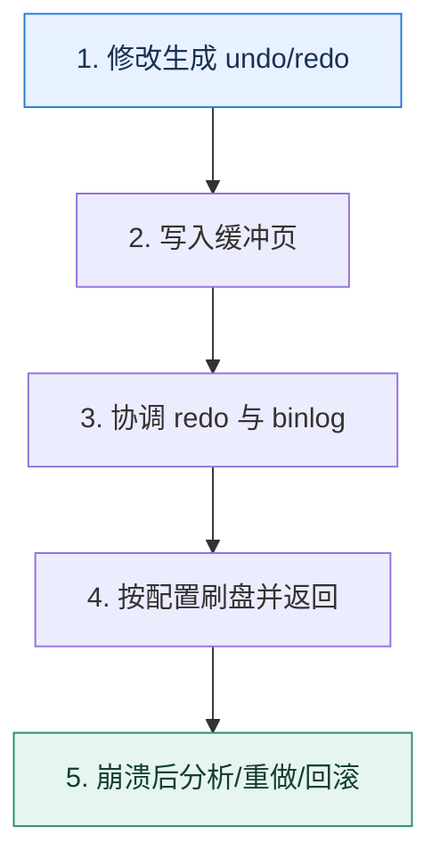

# 事务持久性｜提交成功背后经过了哪些日志与刷盘边界

> 本课只解决一个问题：数据库返回提交成功后，哪些故障可以恢复，哪些仍取决于配置和复制策略？

这不是原页面的缩写，也不是一组孤立结论。下面先建立一个能推演的最小世界，再把状态、数字和失败分支摊开，最后按来源讲解顺序覆盖全部知识线索。读完后，你应当能从 `修改生成 undo/redo` 一直解释到 `崩溃后分析/重做/回滚`，并说明中途任意一步失败会留下什么状态。

## 零基础入口：先建立本课的心智画面

事务的原子性、持久性和复制不是同一层承诺。undo 支持回滚与旧版本，redo 记录页修改用于崩溃恢复，binlog 服务于复制和时间点恢复；它们有不同职责。

先不要急着记组件名。只抓住四个问题：**现在手里有什么输入？下一步只做什么动作？哪个状态发生变化？变化后的结果交给谁？** 之后遇到新框架，只要这四个答案不变，核心机制就没有变。

### 放进一个足够小、可以手算的世界

订单状态从 pending 改为 paid。数据页尚未刷回表空间时机器断电，只要对应 redo 已按配置持久化，重启可重放恢复；若日志只停留在易失缓存中，突然掉电可能丢失。即使主库恢复无误，异步副本若尚未收到记录，主库永久损坏后的切换仍可能丢数据。

这个小世界故意只保留本课必需的对象。生产系统会有更多节点、线程、分片和异常，但数量增加不会改变这里的因果关系。先确认你能手算这个例子，再把数字替换成真实系统数据。

### 先预测，不要马上看结论

**为什么数据页尚未落盘，事务仍可能在重启后恢复？**

先写下自己的判断，并指出你依赖的前提。文末自我检查会揭示答案；如果答案不同，回到下面的状态表找出第一个分叉点。

## 本节精讲：让机制一步一步发生

更新先修改缓冲页并生成日志。提交路径要协调 InnoDB redo 与 server 层 binlog，具体持久边界受刷盘参数和存储栈影响。WAL 的关键是先保证恢复所需日志稳定，再允许脏页稍后写回。主库本地提交也不等于副本已确认；如果业务要求跨节点耐久，需要明确同步确认或多数派语义及其延迟代价。

### 可见状态推进

| 当前步 | 现在发生的动作 | 下一步拿到什么 |
| ---: | --- | --- |
| 1 | 修改生成 undo/redo | 写入缓冲页 |
| 2 | 写入缓冲页 | 协调 redo 与 binlog |
| 3 | 协调 redo 与 binlog | 按配置刷盘并返回 |
| 4 | 按配置刷盘并返回 | 崩溃后分析/重做/回滚 |
| 5 | 崩溃后分析/重做/回滚 | 得到可核对的终态 |

图只承担一个任务：让你看清状态如何向前移动。它不意味着每一步必然成功；网络超时、进程退出、重复执行和数据竞争都可能让箭头停在中间，因此后面必须继续讨论失效边界。

### 一次带数字的完整推演

订单状态从 pending 改为 paid。数据页尚未刷回表空间时机器断电，只要对应 redo 已按配置持久化，重启可重放恢复；若日志只停留在易失缓存中，突然掉电可能丢失。即使主库恢复无误，异步副本若尚未收到记录，主库永久损坏后的切换仍可能丢数据。

数字不是装饰。它迫使我们回答容量、顺序、时间窗口或版本选择问题。若换一个数字就得出不同结论，真正的设计依据就是那个阈值，而不是某个中间件名称。

## 按讲解顺序重建知识链：完整来源讲解

下面按来源资料的教学顺序重新编排完整内容。转换页码、来源图片、推广信息、水印和个人宣传已经删除；原本围绕求职问答的角色与措辞改写为工程学习、方案评审和故障复盘语境。机制、算法、例子、反例、事故线索、评论补充和限制条件仍然保留。这里的作用是补齐知识覆盖，不取代前面的独立推演。

今天我们来学习数据库中非常重要的一部分——数据库事务。这节课的内容和前面 MVCC 的内容联系很紧密，你要结合在一起学习。

数据库事务在技术讨论中占据了比较重的分量。如果你面的是非常初级的岗位，那么可能就是问问事务的 ACID 特性。不然的话，基本上都要深入 redo log 和 undo log 这种事务实现机制上去。所以这一节课我会带你深入分析 redo log 和 undo log。同时我也会告诉你，哪些知识是比较基础的，你一定要掌握；哪些知识是比较高级的，你尽量记住，技术讨论时作为进阶推导来展示。

最后我会给出两个比较高级的方案，一个是侧重理论的写入语义大讨论，一个是侧重实践的调整 MySQL 参数。我们先从上一节课已经初步接触过的 undo log 开始说起。

### 先把机制拆开

### undo log

上一节课，我说过版本链是存放在的 undo log 里面的。那么 undo log 到底是什么呢？

undo log 是指回滚日志，用一个比喻来说，就是后悔药，它记录着事务执行过程中被修改的数据。当事务回滚的时候，InnoDB 会根据 undo log 里的数据撤销事务的更改，把数据库恢复到原来的状态。

既然 undo log 是用来回滚的，那么不同的语句对应的 undo log 形态会不一样。

对于 INSERT 来说，对应的 undo log 应该是 DELETE。对于 DELETE 来说，对应的 undo log 应该是 INSERT。对于 UPDATE 来说，对应的 undo log 也应该是 UPDATE。比如说有一个数据的值原本是3，要把它更新成 5。那么对应的 undo log 就是把数据更新回 3。

但是实际上 undo log 的实现机制要更复杂一点，我这里简化一下模型帮助你记忆。对于INSERT 来说，对应的 undo log 记录了该行的主键。那么后续只需要根据 undo log 里面的主键去原本的聚簇索引里面删掉记录，就可以实现回滚效果。

对于 DELETE 来说，对应的 undo log 记录了该行的主键。因为在事务执行 DELETE 的时候，实际上并没有真的把记录删除，只是把原记录的删除标记位设置成了 true。所以这里 undo log 记录了主键之后，在回滚的时候就可以根据 undo log 找到原本的记录，然后再把删除标记位设置成 false。

对于 UPDATE 来说，要更加复杂一些。分为两种情况，如果没有更新主键，那么 undo log里面就记录原记录的主键和被修改的列的原值。

如果更新了主键，那么可以看作是删除了原本的行，然后插入了一个新行。因此 undo log 可以看作是一个 DELETE 原数据的 undo log 再加上插入一个新行的 undo log。

从上面你大概也能看出来，undo log 和 MVCC 中版本链的关系。

这部分知识有些难，如果你不是数据库岗位或者专家岗，了解这部分就可以了。接下来我们看一个和事务有关的另外一个日志 redo log。

### redo log

InnoDB 引擎在数据库发生更改的时候，把更改操作记录在 redo log 里，以便在数据库发生崩溃或出现其他问题的时候，能够通过 redo log 来重做。

常见疑问是奇怪，InnoDB 引擎不是直接修改了数据吗？为什么需要 redo log？答案是InnoDB 引擎读写都不是直接操作磁盘的，而是读写内存里的 buffer pool，后面再把 buffer pool 里面修改过的数据刷新到磁盘里面。这是两个步骤，所以就可能会出现 buffer pool 中的数据修改了，但是还没来得及刷新到磁盘数据库就崩溃了的情况。

为了解决这个问题，InnoDB 引擎就引入了 redo log。相当于 InnoDB 先把 buffer pool 里面的数据更新了，再写一份 redo log。等到事务结束之后，就把 buffer pool 的数据刷新到磁盘里面。万一事务提交了，但是 buffer pool 的数据没写回去，就可以用 redo log 来恢复。

你可能会困惑，redo log 不需要写磁盘吗？如果 redo log 也要写磁盘，干嘛不直接修改数据呢？redo log 是需要写磁盘的，但是 redo log 是顺序写的，所以也是 WAL（write-ahead-log） 的一种。也就是说，不管你要修改什么数据，一会修改这条数据，一会修改另外一条数据，redo log 在磁盘上都是紧挨着的。

这是中间件设计里常用的技巧——顺序写取代随机写。顺序写的性能比随机写要好很多，即便是在 SSD 上，顺序写也能比随机写速度快上一个数量级。但是还要考虑一点：redo log 是直接一步到位写到磁盘的吗？

并不是的，redo log 本身也是先写进 redo log buffer，后面再刷新到操作系统的 page cache，或者一步到位刷新到磁盘。

InnoDB 引擎本身提供了参数 innodb_flush_log_at_trx_commit 来控制写到磁盘的时机，里面有三个不同值。

0：每秒刷新到磁盘，是从 redo log buffer 到磁盘。1：每次提交的时候刷新到磁盘上，也就是最安全的选项，InnoDB 的默认值。2：每次提交的时候刷新到 page cache 里，依赖于操作系统后续刷新到磁盘。

这时候你就应该意识到这样一个问题，除非把 innodb_flush_log_at_trx_commit 设置成 1，否则其他两个都有丢失的风险。

0：你提交之后，InnoDB 还没把 redo log buffer 中的数据刷新到磁盘，就宕机了。2：你提交之后，InnoDB 把 redo log 刷新到了 page cache 里面，紧接着宕机了。

在这两个场景下，你的业务都认为事务提交成功了，但是数据库实际上丢失了这个事务。但是并不是说 InnoDB 引擎会严格遵循参数说明的那样来刷新磁盘，还有两种例外情况。

1. 如果 redo log buffer 快要满了，也会触发把 redo log 刷新到磁盘里这个动作。一般来说，默认放一半了就会刷新。
2. 如果某个事务提交的时候触发了刷新到磁盘的动作，那么当下所有事务的 redo log 也会一并刷新。毕竟大家的 redo log 都是放在 redo log buffer 里，有人需要刷新了，就顺手一起刷新了。类似于你去买奶茶，顺手帮你同事带一杯。
现在你已经了解了 undo log 和 redo log 的用法和机制，那么我们来总结一下 InnoDB 是如何综合利用它们来实现事务的。

### 事务执行过程

这里我用一个 UPDATE 语句执行的例子来向你介绍事务执行过程。假如说原本 a = 3，现在要执行 UPDATE tab SET a = 5 WHERE id = 1。

1. 事务开始，在执行 UPDATE 语句之前会先查找到目标行，加上锁，然后写入到 buffer pool 里面。

2. 写 undo log。
3. InnoDB 引擎在内存上更新值，实际上就是把 buffer pool 的值更新为目标值 5。

4. 写 redo log。
5. 提交事务，根据 innodb_flush_log_at_trx_commit 决定是否刷新 redo log。

6. 刷新 buffer pool 到磁盘。
上面这个是最正常的流程。那么它还有两个比较重要的子流程。

1. 如果在 redo log 已经刷新到磁盘，然后数据库宕机了，buffer pool 丢失了修改，那么在MySQL 重启之后就会回放这个 redo log，从而纠正数据库里的数据。
2. 如果都没有提交，中途回滚，就可以利用 undo log 去修复 buffer pool 和磁盘上的数据。因为有时，buffer pool 脏页会在事务提交前刷新磁盘，所以 undo log 也可以用来修复磁盘数据。
实际上，事务执行过程有很多细节，也要比这里描述得复杂很多。如果你感兴趣，可以再继续深挖下去。不过如果是为了在技术讨论中展示，上面的这些内容也够用了。

### binlog

binlog 是一个看起来和 redo log、undo log 很像的东西，但是它们之间的差异还是挺大的。binlog 是用于存储 MySQL 中二进制日志（Binary Log）的操作日志文件，它是 MySQL Server 级别的日志，也就是说所有引擎都有。它记录了 MySQL 中数据库的增删改操作，因此 binlog 主要有两个用途，一是在数据库出现故障时恢复数据。二是用于主从同步，即便是Canal 这一类的中间件本质上也是把自己伪装成一个从节点。

在事务执行过程中，写入 binlog 的时机有点巧妙。它和 redo log 的提交过程结合在一起称为 MySQL 的两阶段提交。

第一阶段：redo log Prepare（准备）第二阶段：redo log Commit（提交）

如果 redo log Prepare 执行完毕后，binlog 已经写成功了，那么即便 redo log 提交失败，MySQL 也会认为事务已经提交了。如果 binlog 没写成功，那么 MySQL 就认为提交失败了。比较简单的记忆方式就是看 binlog 写成功了没有。binlog 本身有一些完整性校验的规则，所以在 MySQL 看来，写 binlog 要么成功，要么失败，不存在中间状态。

我用正统的两阶段提交图来说明一下，在这个图里我把写入 binlog 拆成了 Prepare 和Commit 两个阶段。

从图里面，你就可以看出来，之所以以 binlog 为判断标准，是因为在两阶段提交里面，两个参与方 binlog 和 redo log 中，binlog 已经提交成功了，那么 redo log 自然可以认为也提交成功了。但是我要强调，这只是为了方便你理解，实际上 binlog 没有显式的 Prepare 和Commit 两个阶段。

binlog 也有刷新磁盘的问题，不过你可以通过 sync_binlog 参数来控制它。

0：由操作系统决定，写入 page cache 就认为成功了。0 也是默认值，这个时候数据库的性能最好。

N：每 N 次提交就刷新到磁盘，N 越小性能越差。如果 N = 1，那么就是每次事务提交都把 binlog 刷新到磁盘。

你可以对比一下 sync_binlog 和 redo log 的 innodb_flush_log_at_trx_commit 参数，加深印象。最后我再补充一点非常基础的事务的 ACID 特性。

### ACID 特性

事务的 ACID 特性是指原子性（Atomicity）、一致性 （Consistency）、隔离性（Isolation）还有持久性（Durability）。

原子性：事务是一个不可分割的整体，它在执行过程中不能被中断或推迟，它的所有操作都必须一次性执行，要么都成功，要么都失败。一致性：事务执行的结果必须满足数据约束条件，不会出现矛盾的结果。注意这里的一致性和我们讨论的分布式环境下的一致性语义有所差别，后者强调的是不同数据源之间数据一致。隔离性：事务在执行的时候可以隔离其他事务的干扰，也就是不同事务之间不会相互影响。持久性：事务执行的结果必须保证在数据库里永久保存，即使系统出现故障或者数据库被删除，事务的结果也不会丢失。

这个知识点就比较基础，是你一定要记住的。

### 把知识转成可验证的工程判断

你需要弄清楚自己公司内部的一些配置。

有没有修改过 sync_binlog、innodb_flush_log_at_trx_commit 的值？如果修改过，为什么修改？你使用过的中间件有没有类似 redo log、binlog 的刷盘机制？

因为事务的机制比较复杂，涉及 redo log 和 undo log 的各种配合，所以你要提前思考一下事务执行过程的各种异常情况，就是当中途某个操作执行成功了，万一数据库宕机，数据库恢

复过来之后会怎么处理这个事务。

我这里给你一个极简版口令，非常好记。

在 redo log 刷新到磁盘之前，都是回滚。如果 redo log 刷新到了磁盘，那么就是重放 redo log。

进一步结合 binlog，就是如果 binlog 都已经提交成功了，那么就重放，确保事务一定成功了，否则回滚。而回滚就是一句话：用 undo log 来恢复数据。

上面这些极简描述，是不管怎样你都要记住的。但是如果你有时间的话最好记住前置知识里面提到的所有细节。

此外，你要对 undo log、redo log 的必要性有深刻理解。因为技术评审者可能会问出一些反直觉的问题。

没有 undo log 会怎样？没有 undo log 就没有后悔药，没有办法回滚。没有 redo log 会怎样？没有 redo log 的话，写到 buffer pool，宕机了就会丢失数据。为什么非得引入 redo log，干嘛不直接修改数据？直接修改数据就是随机写，性能极差。

在技术讨论过程中，如果技术评审者聊起了操作系统中的写入操作，谈到了 page cache 等内容，那么你就可以谈 redo log、undo log 和 binlog 的写入语义，还可以直接把话题引到后面的写入语义进阶推导上。如果聊到了其他中间件的刷盘问题，那么你就可以用 redo log 和 binlog 作为例子来说明。如果他提到了两阶段提交协议，那么你可以把话题引导到 redo log 和 binlog的两阶段提交协议上。

### 基本思路

事务的技术讨论可以说是方向多、细节多。比较常见的是问你 ACID 中四个基本特性。这里你其实可以抓住机会来展示一个进阶推导，关键词是隔离级别。

ACID 中的隔离性是比较有意思的，它和数据库的隔离级别概念密切相关。我个人认为隔离级别中未提交读和已提交读看起来不太符合这里隔离性的定义。按理来说，可重复读也不满足。但是 MySQL InnoDB 引擎的可重复读解决了幻读问题，所以我认为 MySQL 的可重复读和串行化才算是满足了这里隔离性的要求。

这里大概率会把话题引到隔离级别上，这一部分内容我们上一节课已经学过了，这里不再重复。

有些时候技术评审者就会直接问你 undo log、redo log，或者直接问你 InnoDB 的事务实现机制。

那么你就可以先介绍 undo log，然后可以进一步补充，聊一聊 undo log 在 INSERT、DELETE 和 UPDATE 下是如何运作的，这算是一个小进阶推导。其次介绍 redo log，这里你可以进一步介绍 redo log 的刷盘问题，也算是一个小进阶推导。大体上来说你能够解释清楚 undo log 和 redo log 就可以了。如果技术评审者此时还没有打断你的意思，你就继续介绍事务执行过程，可以用我给出的那个 UPDATE 例子来说明。

就事务执行而言，到这一步你基本上已经把核心知识都交代清楚了。剩下的就是技术评审者会根据你的解释中的一些进行深挖。一般的技术讨论不太可能超出前置知识的范畴，你做好心理准备就可以。至于 binlog，你完全可以等后续继续追问。如果你能记住 binlog 和 redo log 的两阶段提交协议，那么也算是解释中的一个小进阶推导。

### 进一步推导：怎样把机制用进真实系统

其实如果你能在工程复盘时把前置知识都用上，那么你至少能够得到一个 MySQL 基础扎实的评价。不过你还是可以进一步展示更加高级的进阶推导。这里我给出了两个，第一个是写入语义，第二个调整刷盘时机。

### 写入语义

在前面的分析中你已经知道了，当我们说写入 redo log 成功的时候，实际上有不同的含义。比如说可能只是写到了 redo log buffer，也可能是写到了 page cache，还可能是一步到位写到了磁盘上。

综合来说，中间件的写入语义可能是以下 3 种。

中间件写到自身的日志中或者缓冲区，就认为写入成功了。中间件发起了系统调用，写到了操作系统的 page cache 里面，就认为写入成功了。中间件强制发起刷盘，数据被持久化到了磁盘上，才认为写入成功了。

除了一步到位直接写到磁盘，其他两种都要考虑一个问题，就是最终什么时候把数据刷到磁盘呢？思路也有两个，一个是定时，比如说每秒刷到磁盘。另一个是定量，这个就很灵活了，比如说在事务这里基本都是按照提交次数。而在消息队列里面，就可以按照消息条数。

但是这里并没有考虑到另外一个问题，即在分布式环境下，写入一份数据，往往是指要写入主节点，也要写入从节点。

所以在分布式环境下的写入语义更加含糊。

主节点写入成功，就认为写入成功了。主节点写入成功，至少有一个从节点写入成功了，就认为写入成功了。主节点写入成功，大多数从节点写入成功了，就认为写入成功了。主节点写入成功，特定数量的从节点写入成功了，就认为写入成功了。一般来说，这个“特定数量”是可配置的。主节点写入成功，全部从节点也写入成功了，才认为写入成功了。

那么不管是主节点还是从节点的“写入成功”，都要考虑前面说到的刷盘问题。所以你就可以在谈到刷盘的时候进一步引申到这里。

redo log 和 binlog 的刷盘问题，在中间件里面经常遇到。一般来说，中间件的写入语义可能是中间件写入到自身的日志中或者缓冲区、中间件发起了系统调用，写入操作系统的page cache、中间件强制发起刷盘，数据被持久化到了磁盘上这 3 种。如果不是直接写到磁盘，那么中间件就会考虑定时或者定量刷新数据到磁盘。

在分布式环境下，写入语义会更加复杂，因为要考虑是否写从节点，以及写多少个从节点的问题。比如说在 Kafka 里面 acks 机制，就是控制写入的时候要不要同步写入到从分区里面，或者 Redis 里面控制 AOF 刷盘时机。

我在最后举了 Kafka 和 Redis 的例子，这里你可以考虑换成你自己了解的其他例子。

### 调整刷盘时机

这类似于你在上一节课刷进阶推导的技巧，也就是要结合公司的实际情况，考虑调整 redo log 和binlog 的刷盘时机。那么基本方向有两个。第一个是对数据不丢失、一致性要求高的业务，你可以考虑调整 sync_binlog 的值为 1。

在我的系统里面，有一个业务对数据不丢失，一致性要求非常高。因此我们尝试调整sync_binlog 为 1。但是代价就是数据库的性能比较差，因为每次提交都需要刷新 binlog到磁盘上。当然这时候 innodb_flush_log_at_trx_commit 也要使用默认值 1。

另外一个是性能优先，能够容忍一定数据丢失的。那么你可以考虑将innodb_flush_log_at_trx_commit 调整为 0 或者 2，同时还可以把 sync_binlog 调整为比较大的值，比如说调到 100。

我们有一个对性能非常敏感，但是对数据丢失容忍度比较高的业务，那么我就尝试将innodb_flush_log_at_trx_commit 设置为 2，让操作系统来决定什么时候刷新 redo log。同时还把 sync_binlog 的值调整为 100，进一步提高数据库的性能。

或者你综合两者。

之前我们有一个数据库，给两类业务使用。一类业务对数据不丢失，一致性要求极高，另外一类对性能敏感，但是可以容忍一定程度的数据丢失。后来我将这两类业务的表分开，放在两个数据库上。

然后再分别阐述对应的调整策略就好了。当然，这个方案和数据库的性能有关，也可以做成你MySQL 性能调优方案中的一环。

### 本节原始知识线索收束

这一节课的思路要难一些，下面列举的这些知识点是你一定要记住的。

undo log、redo log 的原理、作用。事务执行过程。binlog，尽量结合 redo log 一起理解两阶段提交协议。ACID 特性，绝对不能忘的基本功。

此外我还给出了两个你在技术讨论中可以展示的进阶推导。一个是写入语义，我们要综合考虑单机写到哪里、分布式写不写从节点、写多少从节点的问题。另一个是调整刷盘时机，看重数据的就调小 sync_binlog，看重性能的就调大 sync_binlog 以及调整innodb_flush_log_at_trx_commit。

我在写入语义这个进阶推导给你演示了在技术讨论中刷进阶推导的另外一种思路：充分地横向对比。简单来说就是我们计算机行业里面其实很多设计理念、解决方法都是充满了套路的。你要做的就是找出这个套路，然后在技术讨论中说出来，并且举不同中间件作为例子佐证。

### 继续推演

最后你来思考两个问题。

你用过的中间件是怎么处理刷盘的？如果有主从结构，如何控制写入到从节点？

在聊到隔离性和隔离级别的时候我说到一个个人观点，即未提交读和已提交读，不能看作完全实现了隔离性，你怎么看待这两者？

### 补充讨论与边界校准

补充讨论： buffer pool 的数据刷新到磁盘里面"这里buffer pool刷盘一般是由于redo log 日志满了、Buffer Pool 空间不足或者MySQL空闲时候，才进行的刷盘吧。事务提交的其中一个操作是，由于innodb_flush_log_at_trx_commit=1，此时事务提交之后，需要将redo log进行刷盘

讲解补充：是的，我在这个上下文里面只是想表达这里还有一个刷盘的动作。后续的内容也是讨论了刷盘的具体参数问题。

2

补充讨论：

讲解补充：赞！哈哈哈，这就是一个辩经问题，我也比较赞同你的观点。

1

补充讨论： SSD 上，顺序写也能比随机写速度快上一个数量级。” 这里想说的是机械硬盘HD D？

讲解补充：是的，HDD。

补充讨论： "redo log 本身也是先写进 redo log buffer，后面再刷新到操作系统的 pa ge cache，或者一步到位刷新到磁盘。" 请问在什么情况下可以从 redo log buffer 一步刷到位的刷到磁盘？

讲解补充：一步到位的意思，并不是说绕过了 page cache，而是说刷新到 page cache 之后立刻又刷新到磁盘。倒是不能直接绕开 page cache。

补充讨论： log中的最后一个图中，数据的隐藏字段ROLL_PTR的指向是不是当前数据行的undo log的信息？您图中所述的第一个是指最新的一个undo log 还是最旧的一个undo log？

讲解补充：是指向当前行的，应该是最新的。

补充讨论：

之所以以 binlog 为判断标准，是因为在两阶段提交里面，两个参与方 binlog 和 redo log 中，binlog 已经提交成功了，那么 redo log 自然可以认为也提交成功了

redo log的Commit不是在binlog的后边吗 为什么binlog提交成功了就可以认为redo log也提交成功了？

讲解补充：核心就是你得有一个标准，要么用 binlog，要么用 redolog。但是你考虑到，MySQL 的引擎，不是所有的都有 redolog，因此考虑不同引擎，并且考虑语义的话，还是只能以 binlog 为准。binlog 标记提交了，redolog 就要利用已有的信息修复数据。

补充讨论： log文件和真实库表数据文件idb可不是一个文件，redo log是为了故障恢复用的，里面记录的是内存页的修改物理内容，比如修改了第5号表空间中页号为100的页上偏移量20字节的位置上由3改为1 这样一句话，redolog从log Buffer中刷盘是顺序刷盘的，只是记录日志，并不会修改真实库表文件idb的。库表数据修改了是在内存Buffer pool中记录的，会有IO线程定期刷盘Buffer pool到库表idb文件中的，这个刷盘是随机IO的。

讲解补充：是的，只有真实修改那一步是随机，毕竟你数据放哪里这是一个难以转成顺序写的事情。只是说你不修改配置的话，在提交的时候不一定触发了刷盘，那么你就相当于只是顺序写了 log，所以性能比较好。

补充讨论： log可能是在事务执行过程中(也就是事务提交之前)就已经被后台线程持久化硬盘了，但可能这个事务此时还没有执行完，Mysql就崩溃了。重启恢复的时候回放redo log，是能读到这个事务前半段的redo log的，这个时候数据应该回滚吧。那Mysql是怎么判断redo lo g中这些日志，哪些要回滚哪些要提交呢？Q2：在两阶段提交中，是需要用XID来关联redo log和bin log的吧。这样才能在故障恢复的时候识别出redo log存在的记录在bin log中是否页存在。那这个XID是在什么时候生成的呢，又是在什么时候写入redo log和bin log中的呢。是在事务开启时就生成好了，并在两种log写入的过程中一直伴随着log到buffer、到硬盘的吗？还是在事务提交阶段才开启内部事务，并生成的XID呢？如果是后者，那又回到了Q1，redo log在事务提交之前可能已经持久化到硬盘，这个时候是没有XID的，怎么和bin log关联呢？🙏求老师解惑，谢谢

讲解补充：1. 看 redo log 中有没有 commit 这一条 log，严格来说应该是看和 redo log 配对的那个 b in log 里面有没有 commit 这一条，如果是 row，就会有一个 XID 的 event。

2. 这个地方我给你看一段它 binlog_recover 的原文注释：After a crash, storage engines may contain transactions that are prepared but not committed (in theory any engine, in practice InnoDB). This function uses the binary log as the source of truth to determine which of these transactions should be committed and which should be rolled back.
The function collects the XIDs of all transactions that are completely written to the binary log into a hash, and passes this hash to the storage engines through the ha_recover function in the handler interface. This tells the storage engines to commit all prepared transactions that are in the set, and to roll back all prepared transactions that are not in the set.

补充讨论：

讲解补充：你说的是 binlog 里面的 XID 吗？貌似不讲它也不影响理解这篇文章。

补充讨论： dolog进行恢复。对吗？2）有没有可能，事务在更新的时候，在写redolog的时候就崩溃啦，这时候岂不是恢复不了啦？

讲解补充：1. 可以这么理解。

2. redo log 崩溃了肯定是啥也做不了

## 把完整讲解收束成一条因果链

1. 先区分 undo、redo、binlog 的目的和生命周期。
2. 按事务执行顺序理解 WAL 与脏页延迟写回。
3. 把提交、操作系统缓存、磁盘持久化和副本确认拆成不同边界。
4. 最后用故障注入验证配置：进程崩溃、操作系统重启、主机掉电和主库永久丢失不是同一种故障。

把这几步连接起来时，不要省略“为什么”。最终结论只有在前提、状态变化和失败代价都说得清楚时才可靠。

## 误区与失效边界

“COMMIT 返回”不是跨所有硬件、所有副本和所有备份的绝对不丢。也不要为了加载数据在生产实例随意关闭 redo；那会改变崩溃恢复能力。

再加一条通用但必须落实到本课对象上的边界：机制只能处理它看得见的信号。若输入指标失真、状态没有持久化、错误被吞掉，或者补偿没有幂等保护，再成熟的框架也只能基于错误证据作决定。

### 三种故障注入方式

| 故障 | 要观察什么 | 不能接受的解释 |
| --- | --- | --- |
| 在第 2 步前让依赖超时 | 是否停在可重试状态，是否消耗完上游预算 | “框架稍后会处理” |
| 在状态写入后让进程退出 | 重启后能否识别已完成与待继续动作 | “再执行一次应该没事” |
| 对同一输入并发执行两次 | 是否出现重复副作用、顺序颠倒或覆盖 | “概率很低” |

## 工程验证：把理解变成可以复查的证据

建立耐久矩阵：行是 `mysqld 崩溃、OS 重启、主机断电、磁盘损坏、机房丢失`，列是 `redo、binlog、副本、备份`。逐格写出是否能恢复和最大数据损失窗口。

| 步骤 | 状态或动作 | 最少应留下的证据 |
| ---: | --- | --- |
| 1 | 修改生成 undo/redo | 开始时间、结束时间、输入标识、结果状态、异常原因 |
| 2 | 写入缓冲页 | 开始时间、结束时间、输入标识、结果状态、异常原因 |
| 3 | 协调 redo 与 binlog | 开始时间、结束时间、输入标识、结果状态、异常原因 |
| 4 | 按配置刷盘并返回 | 开始时间、结束时间、输入标识、结果状态、异常原因 |
| 5 | 崩溃后分析/重做/回滚 | 开始时间、结束时间、输入标识、结果状态、异常原因 |

验证时同时记录成功路径和失败路径。只证明“正常时能跑通”不能说明设计可靠；至少要让一次超时、一次进程退出和一次重复请求可重现，并能根据日志或指标解释最后状态。

## 学完检查：闭卷画出本课

你现在应该能独立完成四件事：

1. 用自己的话说出本课唯一问题，不使用产品名也能解释。
2. 复算上面的具体例子，并指出哪个输入改变会让结论改变。
3. 沿 Mermaid 图注入一次失败，预测系统停在哪里以及由谁收敛。
4. 说出本课机制不保证什么，并给出一个反例。

## 自我检查

为什么数据页尚未落盘，事务仍可能在重启后恢复？

WAL 允许先持久化描述修改的 redo，脏页稍后写入。重启时根据日志把已提交修改重做到数据页。

怎样证明自己不是只记住了名词？

把 `修改生成 undo/redo` 的一个真实输入写出来，逐步记录到 `崩溃后分析/重做/回滚`。然后在中间任意一步制造失败；如果你能解释当前状态、下一责任方、可观测证据和恢复边界，就已经拥有可以迁移的工程模型。

## 来源与事实校准

- [查看完整来源稿（本地 26 页资料）](../content/14-database-transactions.md)

### 当前事实校准

redo、binlog、数据页和副本确认是不同耐久边界。MySQL 返回提交成功后能承受哪些故障，取决于日志刷盘参数、存储栈和复制确认策略；不能把一次 COMMIT 泛化成跨主机、跨机房和跨备份的绝对不丢。

- [MySQL 8.4 · Redo Log](https://dev.mysql.com/doc/refman/8.4/en/innodb-redo-log.html)
- [MySQL 8.4 · Binary Log](https://dev.mysql.com/doc/refman/8.4/en/binary-log.html)

来源稿用于核对覆盖范围，不随公开站点发布。产品默认值和具体内部行为可能随版本变化；落地时应使用目标版本的官方文档、可运行实验和故障演练校准。本学习稿中的零基础入口、状态推演、故障矩阵和工程验证属于编辑补充，不冒充来源讲解者的原话。
