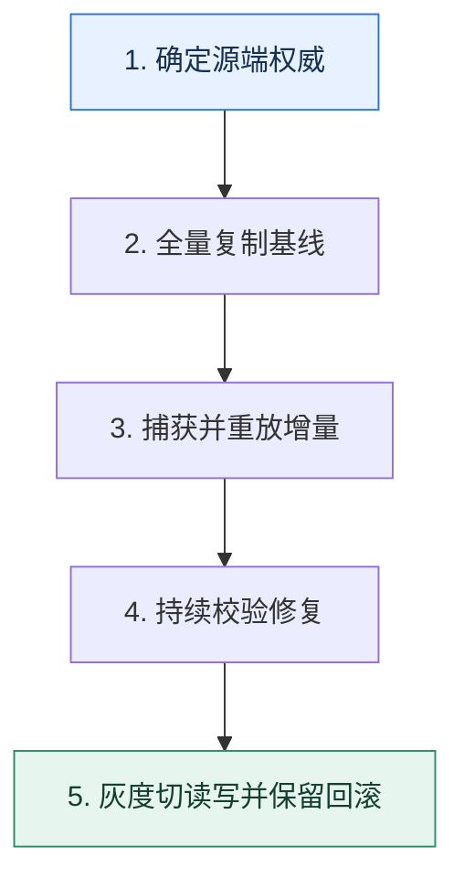

# 不停机迁移｜让全量复制、增量追平和切流组成状态机

> 本课只回答一个问题：业务持续写入时，怎样把数据迁到新表或新库而不丢更新？

这是一份独立学习稿。来源资料用于核对知识范围；下面的解释、推演、边界和图示均按工程学习路径重新组织，不依赖原页面也能完整阅读。

## 先补齐：建立正确的心智模型

迁移不是一次复制命令，而是新旧两个数据面之间的状态机。需要明确权威源、变更捕获、校验、切换门槛和回滚方向。

读这一课时，始终把“组件名字”换成三个可追踪对象：**谁发起动作、状态存在哪里、失败后由谁收敛**。这样遇到不同产品或版本，仍能用同一套模型判断。

## 本节精讲：机制是怎样一步步工作的

先初始化目标数据，再通过 CDC 或双写追增量。全量期间发生的修改必须有可重放的变更序列。校验不能只比总行数，应按主键区间比较哈希、关键字段和缺失记录。切流前冻结状态转换：先让读流量灰度到目标，再改变写权威；双写顺序变化必须配合幂等和修复任务。迁移完成后仍要保留观察期和反向回滚通道。

下面这张图只表达本课最重要的状态推进，蓝色是入口，绿色是可验收的终点；任一箭头失败，都要回到上文寻找重试、回退或人工处理的位置。

### 一次带数字的完整推演

源表有 10 亿行，复制需要 6 小时。第 2 小时订单 42 从金额 100 改为 120。全量任务可能先复制旧值；CDC 记录随后把目标改为 120。切流前按主键分片比较版本号和字段哈希，发现差异就从权威源重放，而不是人工改一条算完成。

数字的作用不是制造精确感，而是暴露容量和时间关系。把例子中的流量、延迟、分片数或版本号替换成自己的真实数据，方案可能会随之改变。

## 误区与失效边界

双写本身不保证原子一致；一次写成功、另一次失败仍会分叉。校验也不是只在切换前做一次，切换过程和观察期都需要持续增量校验。

判断一个结论是否可靠，可以追问两次：**它依赖什么前提？前提失效后系统留下了什么状态？** 如果回答只能停在“框架会自动处理”，就还没有走到工程边界。

## 按讲解顺序重建知识链

来源稿覆盖的论证主线在这里被重建成四步，保留问题、推导、反例和收束，不沿用原页面措辞：

1. 从全量初始化开始，明确复制期间的写入由增量通道承接。
2. 第一次校验修复建立可比较基线，再开启有顺序的双写或 CDC。
3. 切换读写权威时保持增量校验，避免一个开关同时改变所有流量。
4. 最后保留观察与回滚窗口，直到旧系统不再承担恢复职责。

把四步连起来后，本课不是一个孤立结论，而是一条可以复演的因果链。需要回查课程覆盖范围时，可打开文末的来源稿；学习时以本页模型为主。

## 工程验证：把理解变成证据

迁移看板显示 `全量进度、CDC 延迟、差异条数、修复成功率、目标读流量、目标写流量、回滚开关状态`。任一差异无法解释时都不进入下一阶段。

### 状态检查表

| 步骤 | 状态或动作 | 需要留下的证据 |
| ---: | --- | --- |
| 1 | 确定源端权威 | 记录耗时、结果与异常分支，确认状态能进入下一步 |
| 2 | 全量复制基线 | 记录耗时、结果与异常分支，确认状态能进入下一步 |
| 3 | 捕获并重放增量 | 记录耗时、结果与异常分支，确认状态能进入下一步 |
| 4 | 持续校验修复 | 记录耗时、结果与异常分支，确认状态能进入下一步 |
| 5 | 灰度切读写并保留回滚 | 记录耗时、结果与异常分支，确认状态能进入下一步 |

检查表不是要求生产系统逐字采用这些字段，而是强迫设计者为每一步提供可观测结果。只有入口、没有终态的流程，最终都会形成无法解释的中间状态。

## 自我检查

为什么全量复制结束并且两边行数相同，仍不能立即切流？

行数相同不代表字段值和版本相同，全量期间的更新也可能尚未追平。需要确认增量延迟归零并完成内容级校验。

再做一次闭卷练习：不看上文画出状态图，并为其中任意两个箭头注入超时、进程崩溃或重复请求。如果你能预测最终状态和观测信号，这一课才真正从“听懂”变成“会用”。

## 来源与版本校准

- [查看来源稿（26 页资料整理）](../content/15-data-migration.md)

来源稿只用于追溯知识范围，不是本学习稿的正文。具体产品的默认值、命令与内部实现会随版本变化；落地前应使用目标版本官方文档和故障演练再次确认。

本课涉及的产品行为以这些官方资料为校准入口：

- [MySQL 8.4 · InnoDB 存储引擎](https://dev.mysql.com/doc/refman/8.4/en/innodb-storage-engine.html)
- [MySQL 8.4 · 锁定读](https://dev.mysql.com/doc/refman/8.4/en/innodb-locking-reads.html)
- [MySQL 8.4 · Redo Log](https://dev.mysql.com/doc/refman/8.4/en/innodb-redo-log.html)
