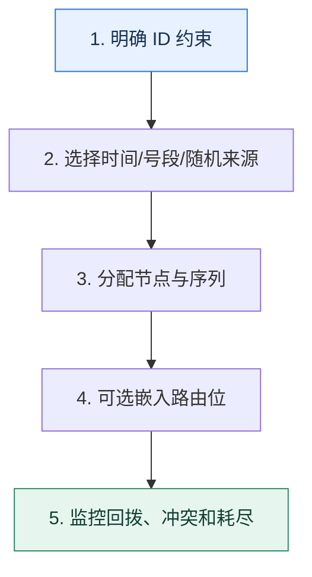

# 全局 ID｜在唯一、趋势递增和路由信息之间做取舍

> 本课只回答一个问题：分库分表后，怎样生成跨节点唯一且满足查询与写入需求的主键？

这是一份独立学习稿。来源资料用于核对知识范围；下面的解释、推演、边界和图示均按工程学习路径重新组织，不依赖原页面也能完整阅读。

## 先补齐：建立正确的心智模型

ID 生成器要同时回答唯一性、可用性、排序性、吞吐、时钟依赖和信息暴露。没有一种格式在所有维度都最好。

读这一课时，始终把“组件名字”换成三个可追踪对象：**谁发起动作、状态存在哪里、失败后由谁收敛**。这样遇到不同产品或版本，仍能用同一套模型判断。

## 本节精讲：机制是怎样一步步工作的

UUID 去中心化但随机写入会降低局部性且体积大；数据库号段可趋势递增，但依赖号段服务；雪花类方案把时间、节点和序列编码进整数，需要处理节点号冲突与时钟回拨。若高频查询按租户分片，可在 ID 中嵌入稳定的路由位，避免额外查映射表。批量预取号段提高吞吐，但进程崩溃会留下空洞；空洞通常不影响唯一性。

下面这张图只表达本课最重要的状态推进，蓝色是入口，绿色是可验收的终点；任一箭头失败，都要回到上文寻找重试、回退或人工处理的位置。

### 一次带数字的完整推演

设计 64 位 ID：41 位毫秒时间、10 位节点、12 位序列，理论上单节点每毫秒 4096 个。若需要按 32 个库路由，可从业务键哈希取 5 位嵌入约定位置。看到 ID 就能定位库，但也会暴露时间和规模，需要评估安全性。

数字的作用不是制造精确感，而是暴露容量和时间关系。把例子中的流量、延迟、分片数或版本号替换成自己的真实数据，方案可能会随之改变。

## 误区与失效边界

趋势递增不等于全局连续，唯一也不等于不可猜。依赖机器时钟的算法若回拨而没有防护，可能重复或暂停发号。不要把业务分片键直接裸露在外部标识中而忽略隐私。

判断一个结论是否可靠，可以追问两次：**它依赖什么前提？前提失效后系统留下了什么状态？** 如果回答只能停在“框架会自动处理”，就还没有走到工程边界。

## 按讲解顺序重建知识链

来源稿覆盖的论证主线在这里被重建成四步，保留问题、推导、反例和收束，不沿用原页面措辞：

1. 比较 UUID、数据库自增、号段和雪花类算法的中心化与有序性。
2. 逐位解释时间、节点、序列分别解决什么，计算峰值容量。
3. 把分片路由信息纳入 ID，但说明安全和迁移代价。
4. 用批量取、提前取、singleflight 和局部分发降低号段服务压力。

把四步连起来后，本课不是一个孤立结论，而是一条可以复演的因果链。需要回查课程覆盖范围时，可打开文末的来源稿；学习时以本页模型为主。

## 工程验证：把理解变成证据

验算表必须写出每个字段位数、最大值、单位和耗尽时间。例如 12 位序列是 0–4095；若一毫秒内超过 4096 个请求，生成器要等待下一毫秒或扩展位宽。

### 状态检查表

| 步骤 | 状态或动作 | 需要留下的证据 |
| ---: | --- | --- |
| 1 | 明确 ID 约束 | 记录耗时、结果与异常分支，确认状态能进入下一步 |
| 2 | 选择时间/号段/随机来源 | 记录耗时、结果与异常分支，确认状态能进入下一步 |
| 3 | 分配节点与序列 | 记录耗时、结果与异常分支，确认状态能进入下一步 |
| 4 | 可选嵌入路由位 | 记录耗时、结果与异常分支，确认状态能进入下一步 |
| 5 | 监控回拨、冲突和耗尽 | 记录耗时、结果与异常分支，确认状态能进入下一步 |

检查表不是要求生产系统逐字采用这些字段，而是强迫设计者为每一步提供可观测结果。只有入口、没有终态的流程，最终都会形成无法解释的中间状态。

## 自我检查

号段模式中出现 ID 空洞，为什么通常不是数据错误？

生成器只承诺唯一和一定顺序，不承诺每个号码都被业务使用。进程拿到号段后崩溃会浪费号码，但不会产生重复记录。

再做一次闭卷练习：不看上文画出状态图，并为其中任意两个箭头注入超时、进程崩溃或重复请求。如果你能预测最终状态和观测信号，这一课才真正从“听懂”变成“会用”。

## 来源与版本校准

- [查看来源稿（22 页资料整理）](../content/16-sharding-id.md)

来源稿只用于追溯知识范围，不是本学习稿的正文。具体产品的默认值、命令与内部实现会随版本变化；落地前应使用目标版本官方文档和故障演练再次确认。

本课涉及的产品行为以这些官方资料为校准入口：

- [MySQL 8.4 · InnoDB 存储引擎](https://dev.mysql.com/doc/refman/8.4/en/innodb-storage-engine.html)
- [MySQL 8.4 · 锁定读](https://dev.mysql.com/doc/refman/8.4/en/innodb-locking-reads.html)
- [MySQL 8.4 · Redo Log](https://dev.mysql.com/doc/refman/8.4/en/innodb-redo-log.html)
