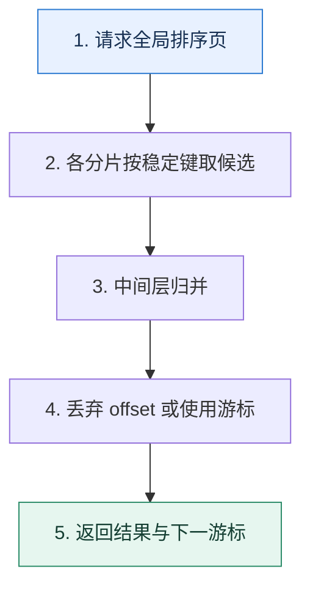

# 跨分片分页｜为什么越往后翻，重复扫描和丢弃越多

> 本课只回答一个问题：排序数据分散在多个分片时，怎样得到全局第 N 页而不让成本随页码爆炸？

这是一份独立学习稿。来源资料用于核对知识范围；下面的解释、推演、边界和图示均按工程学习路径重新组织，不依赖原页面也能完整阅读。

## 先补齐：建立正确的心智模型

单库 offset 已经需要跳过前面的记录；跨分片还要从每个分片取候选、在中间层归并并再次丢弃。全局排序键必须稳定且能处理相同值。

读这一课时，始终把“组件名字”换成三个可追踪对象：**谁发起动作、状态存在哪里、失败后由谁收敛**。这样遇到不同产品或版本，仍能用同一套模型判断。

## 本节精讲：机制是怎样一步步工作的

朴素方案让每个分片取 `offset+limit` 条，再归并前 N 条，深页会放大网络和内存。游标分页携带上一页的 `(sort_key,id)`，各分片只查询其后的数据，再做小规模归并；它不支持任意跳页但成本稳定。若产品必须跳页，可限制最大页、预计算中间结果、维护全局索引或交给更适合检索的系统。

下面这张图只表达本课最重要的状态推进，蓝色是入口，绿色是可验收的终点；任一箭头失败，都要回到上文寻找重试、回退或人工处理的位置。

### 一次带数字的完整推演

4 个分片查询第 1001 页，每页 20 条。朴素方式每片最多取 20020 条，共约 80080 条，只返回 20 条。若使用上一页最后的 `(created_at,id)` 作为游标，每片只取 20 个候选，最多归并 80 条。

数字的作用不是制造精确感，而是暴露容量和时间关系。把例子中的流量、延迟、分片数或版本号替换成自己的真实数据，方案可能会随之改变。

## 误区与失效边界

平均分页把 offset 平均分给各分片只在数据均匀且排序分布可预测时勉强成立，通常会漏数据或顺序错误。游标分页也要求排序键不可变或能接受变化带来的跳动。

判断一个结论是否可靠，可以追问两次：**它依赖什么前提？前提失效后系统留下了什么状态？** 如果回答只能停在“框架会自动处理”，就还没有走到工程边界。

## 按讲解顺序重建知识链

来源稿覆盖的论证主线在这里被重建成四步，保留问题、推导、反例和收束，不沿用原页面措辞：

1. 先推导全局查询为何需要每个分片提供候选。
2. 比较全量取 offset、平均分页和禁止深翻页的正确性与成本。
3. 用二次查询或中间表降低回表和归并数据量。
4. 最后根据产品需求选择游标、最大页限制或外部检索系统。

把四步连起来后，本课不是一个孤立结论，而是一条可以复演的因果链。需要回查课程覆盖范围时，可打开文末的来源稿；学习时以本页模型为主。

## 工程验证：把理解变成证据

对每种方案记录复杂度：分片数 S、页偏移 O、页大小 L。朴素候选量上界约为 `S×(O+L)`；游标方案约为 `S×L`，这两个式子能直接解释扩分片和深分页的成本。

### 状态检查表

| 步骤 | 状态或动作 | 需要留下的证据 |
| ---: | --- | --- |
| 1 | 请求全局排序页 | 记录耗时、结果与异常分支，确认状态能进入下一步 |
| 2 | 各分片按稳定键取候选 | 记录耗时、结果与异常分支，确认状态能进入下一步 |
| 3 | 中间层归并 | 记录耗时、结果与异常分支，确认状态能进入下一步 |
| 4 | 丢弃 offset 或使用游标 | 记录耗时、结果与异常分支，确认状态能进入下一步 |
| 5 | 返回结果与下一游标 | 记录耗时、结果与异常分支，确认状态能进入下一步 |

检查表不是要求生产系统逐字采用这些字段，而是强迫设计者为每一步提供可观测结果。只有入口、没有终态的流程，最终都会形成无法解释的中间状态。

## 自我检查

为什么给每个分片分配 `offset/S` 不能保证得到正确的全局第 N 页？

各分片在目标排序区间内的数据量并不相等。平均跳过会在某些分片跳过过多、另一些过少，归并后位置就不再是全局第 N 页。

再做一次闭卷练习：不看上文画出状态图，并为其中任意两个箭头注入超时、进程崩溃或重复请求。如果你能预测最终状态和观测信号，这一课才真正从“听懂”变成“会用”。

## 来源与版本校准

- [查看来源稿（25 页资料整理）](../content/17-sharding-pagination.md)

来源稿只用于追溯知识范围，不是本学习稿的正文。具体产品的默认值、命令与内部实现会随版本变化；落地前应使用目标版本官方文档和故障演练再次确认。

本课涉及的产品行为以这些官方资料为校准入口：

- [MySQL 8.4 · InnoDB 存储引擎](https://dev.mysql.com/doc/refman/8.4/en/innodb-storage-engine.html)
- [MySQL 8.4 · 锁定读](https://dev.mysql.com/doc/refman/8.4/en/innodb-locking-reads.html)
- [MySQL 8.4 · Redo Log](https://dev.mysql.com/doc/refman/8.4/en/innodb-redo-log.html)
