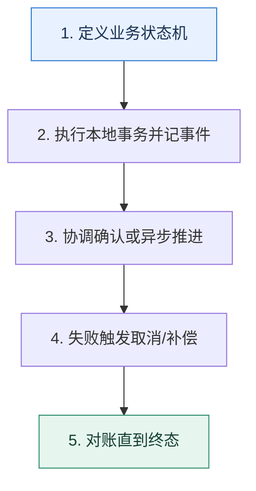

# 跨服务一致性｜在强协调、业务补偿和可用性之间选择

> 本课只回答一个问题：一个业务动作跨越多个数据库或服务时，怎样处理部分成功？

这是一份独立学习稿。来源资料用于核对知识范围；下面的解释、推演、边界和图示均按工程学习路径重新组织，不依赖原页面也能完整阅读。

## 先补齐：建立正确的心智模型

本地事务只能覆盖一个资源管理器的提交边界。跨资源后需要协调协议或把流程建模成可恢复状态机；选择取决于能否长时间锁资源、业务是否可补偿和一致性窗口。

读这一课时，始终把“组件名字”换成三个可追踪对象：**谁发起动作、状态存在哪里、失败后由谁收敛**。这样遇到不同产品或版本，仍能用同一套模型判断。

## 本节精讲：机制是怎样一步步工作的

XA/两阶段提交用准备与提交协调多个资源，提供较强原子语义但协调器和锁持有影响可用性。TCC 把预留、确认、取消暴露给业务，侵入性高但控制清晰；Saga 把长事务拆成本地事务和补偿，接受中间状态；事务消息/Outbox 让本地数据与待发送事件同事务写入，再异步投递。所谓三阶段提交更多是理论扩展，不是常见业务默认方案。

下面这张图只表达本课最重要的状态推进，蓝色是入口，绿色是可验收的终点；任一箭头失败，都要回到上文寻找重试、回退或人工处理的位置。

### 一次带数字的完整推演

创建订单需要锁库存、扣余额、生成订单。TCC 可先 Try 预留库存与余额，再 Confirm；失败则 Cancel 释放。Saga 可先建待支付订单、预占库存、扣款，某一步失败按逆序补偿。补偿不是数据库回滚：退款可能产生新流水并需要人工处理。

数字的作用不是制造精确感，而是暴露容量和时间关系。把例子中的流量、延迟、分片数或版本号替换成自己的真实数据，方案可能会随之改变。

## 误区与失效边界

最终一致不等于随便异步。每一步仍需幂等、可重试、可观测和人工兜底。补偿也不一定能完全还原现实世界副作用，例如已经发送的短信无法“撤回”。

判断一个结论是否可靠，可以追问两次：**它依赖什么前提？前提失效后系统留下了什么状态？** 如果回答只能停在“框架会自动处理”，就还没有走到工程边界。

## 按讲解顺序重建知识链

来源稿覆盖的论证主线在这里被重建成四步，保留问题、推导、反例和收束，不沿用原页面措辞：

1. 先用两阶段提交理解协调者、准备和阻塞成本。
2. 再比较 XA、TCC、Saga、AT/代理模式的侵入性和一致性。
3. 说明某些高性能场景可以禁止跨库事务，改用分片内聚合。
4. 最后用延迟执行或 Outbox 把短本地事务与长业务流程分开。

把四步连起来后，本课不是一个孤立结论，而是一条可以复演的因果链。需要回查课程覆盖范围时，可打开文末的来源稿；学习时以本页模型为主。

## 工程验证：把理解变成证据

为业务状态画转移表：`当前状态、允许事件、幂等键、下一状态、补偿动作、超时动作、人工入口`。如果某个中间状态没有出路，就存在永久悬挂风险。

### 状态检查表

| 步骤 | 状态或动作 | 需要留下的证据 |
| ---: | --- | --- |
| 1 | 定义业务状态机 | 记录耗时、结果与异常分支，确认状态能进入下一步 |
| 2 | 执行本地事务并记事件 | 记录耗时、结果与异常分支，确认状态能进入下一步 |
| 3 | 协调确认或异步推进 | 记录耗时、结果与异常分支，确认状态能进入下一步 |
| 4 | 失败触发取消/补偿 | 记录耗时、结果与异常分支，确认状态能进入下一步 |
| 5 | 对账直到终态 | 记录耗时、结果与异常分支，确认状态能进入下一步 |

检查表不是要求生产系统逐字采用这些字段，而是强迫设计者为每一步提供可观测结果。只有入口、没有终态的流程，最终都会形成无法解释的中间状态。

## 自我检查

Saga 的补偿操作为什么不能简单理解成数据库 ROLLBACK？

前面的本地事务已经提交，补偿是一个新的业务动作，可能失败、重试并留下审计记录，也可能无法完全撤销外部副作用。

再做一次闭卷练习：不看上文画出状态图，并为其中任意两个箭头注入超时、进程崩溃或重复请求。如果你能预测最终状态和观测信号，这一课才真正从“听懂”变成“会用”。

## 来源与版本校准

- [查看来源稿（24 页资料整理）](../content/18-distributed-transactions.md)

来源稿只用于追溯知识范围，不是本学习稿的正文。具体产品的默认值、命令与内部实现会随版本变化；落地前应使用目标版本官方文档和故障演练再次确认。

本课涉及的产品行为以这些官方资料为校准入口：

- [MySQL 8.4 · InnoDB 存储引擎](https://dev.mysql.com/doc/refman/8.4/en/innodb-storage-engine.html)
- [MySQL 8.4 · 锁定读](https://dev.mysql.com/doc/refman/8.4/en/innodb-locking-reads.html)
- [MySQL 8.4 · Redo Log](https://dev.mysql.com/doc/refman/8.4/en/innodb-redo-log.html)
