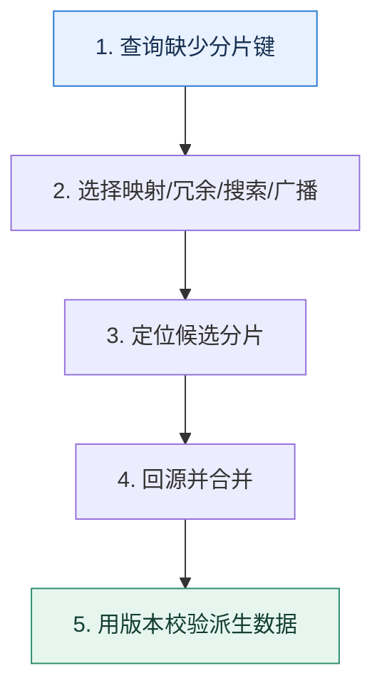

# 非分片键查询｜把路由缺失的成本放到写入、存储还是查询

> 本课只解决一个问题：数据按买家分片后，卖家、订单号和客服条件怎样定位记录？

这不是原页面的缩写，也不是一组孤立结论。下面先建立一个能推演的最小世界，再把状态、数字和失败分支摊开，最后按来源讲解顺序覆盖全部知识线索。读完后，你应当能从 `查询缺少分片键` 一直解释到 `用版本校验派生数据`，并说明中途任意一步失败会留下什么状态。

## 零基础入口：先建立本课的心智画面

分片键决定数据放在哪里。查询不包含分片键时，路由层不知道目标分片，只能广播或依赖额外索引。解决方案是在不同成本之间移动工作，而不是凭空消除它。

先不要急着记组件名。只抓住四个问题：**现在手里有什么输入？下一步只做什么动作？哪个状态发生变化？变化后的结果交给谁？** 之后遇到新框架，只要这四个答案不变，核心机制就没有变。

### 放进一个足够小、可以手算的世界

订单按 buyer_id 分 32 库。卖家后台按 seller_id 查询：写订单时同时写 `seller_order_index(seller_id,order_id,buyer_shard,version)`；查询先从索引表得到目标分片和主键，再批量回源。若索引消息延迟，页面要显示数据新鲜度并提供回查。

这个小世界故意只保留本课必需的对象。生产系统会有更多节点、线程、分片和异常，但数量增加不会改变这里的因果关系。先确认你能手算这个例子，再把数字替换成真实系统数据。

### 先预测，不要马上看结论

**为什么新增卖家维度的冗余表后，查询问题解决了，一致性问题却变难了？**

先写下自己的判断，并指出你依赖的前提。文末自我检查会揭示答案；如果答案不同，回到下面的状态表找出第一个分叉点。

## 本节精讲：让机制一步一步发生

全局映射表用订单号定位分片，查询快但映射表成为关键依赖；按卖家冗余一份数据，读快但双写与一致性复杂；搜索系统支持多条件，但存在同步延迟；广播实现简单但成本随分片数增长。主键中嵌入路由信息适合按主键访问。所有派生副本都应携带版本或事件序号，以便重放与修复乱序更新。

### 可见状态推进

| 当前步 | 现在发生的动作 | 下一步拿到什么 |
| ---: | --- | --- |
| 1 | 查询缺少分片键 | 选择映射/冗余/搜索/广播 |
| 2 | 选择映射/冗余/搜索/广播 | 定位候选分片 |
| 3 | 定位候选分片 | 回源并合并 |
| 4 | 回源并合并 | 用版本校验派生数据 |
| 5 | 用版本校验派生数据 | 得到可核对的终态 |

图只承担一个任务：让你看清状态如何向前移动。它不意味着每一步必然成功；网络超时、进程退出、重复执行和数据竞争都可能让箭头停在中间，因此后面必须继续讨论失效边界。

### 一次带数字的完整推演

订单按 buyer_id 分 32 库。卖家后台按 seller_id 查询：写订单时同时写 `seller_order_index(seller_id,order_id,buyer_shard,version)`；查询先从索引表得到目标分片和主键，再批量回源。若索引消息延迟，页面要显示数据新鲜度并提供回查。

数字不是装饰。它迫使我们回答容量、顺序、时间窗口或版本选择问题。若换一个数字就得出不同结论，真正的设计依据就是那个阈值，而不是某个中间件名称。

## 按讲解顺序重建知识链：完整来源讲解

下面按来源资料的教学顺序重新编排完整内容。转换页码、来源图片、推广信息、水印、角色化问答和只服务于技术讨论场景的话术已经删除；机制、算法、例子、反例、事故线索、评论补充和限制条件仍然保留。这里的作用是补齐知识覆盖，不取代前面的独立推演。

今天我和你来聊一聊分库分表下的一种特殊的查询——无分库分表键查询。

在很多业务里面，分库分表键都是根据主要查询筛选出来的。那么就会有这样一个问题，那些不怎么重要的查询怎么解决呢？

比如说大多数电商的订单都是按照买家 ID 来进行分库分表的，那么商家该怎么查询订单呢？又或者买家找客服，客服要找到对应的订单，又该怎么找？在技术讨论分库分表的过程中，这也算是一个常见的问题。

如果你对分库分表不是很熟悉，可能根本想不到这里面会有什么难点。那么今天我就带你看看怎么解决这个问题，以及如何将多个解决方案整合在一起打造一个复杂的进阶推导方案。

### 分库分表键选择

分库分表键是指你选择进行分库分表的业务字段，有些时候会有多个字段。那怎么选择合适的字段呢？

一句话：根据查询来选择。例如在订单里面，最常见的是按照买家进行分库分表。理由很简单，买家查询自己的订单是最主要的场景。既然买家查得多，买家的服务体验也更加重要，所以选择买家 ID 进行分库分表收益最大。

你也可以看到这个完全是业务驱动的。最常用的分库分表键有主键、外键、索引列。如果是范围分库分表，那么日期类型的列也很常用。

有些人喜欢把分库分表键的选择说得仿佛非常艰难，实践中根本不是这样的，因为事实上你根本没有多少个候选项。再结合业务，很快你就能选出合适的分库分表键。

### 重试方案

设计一个重试方案要考虑 3 个方面的内容。

重试次数：一般来说设置无限重试是没有多大意义的。如果一个东西重试很多次都没有成功，说明大概率永远没办法重试成功了。重试间隔：无非是等间隔重试或者指数退避重试。指数退避重试是指重试间隔的时间是在增长的，一般是按照两倍增长。当然技术讨论的时候你可以设计一些更加灵活的重试间隔策略，比如说最开始按照两倍增长，再按照 50% 增长，最后保持最大重试间隔不断重试。是否允许跨进程重试：如果我本身在 A 进程里面触发了重试，但是在重试了一次之后，我是否可以在 B 进程上重试第二次？在分布式环境下，这往往意味着是否可以在不同的机器上重试。

从理论上来说，重试就是为了避开前一次失败的原因。比如说数据库因为偶发的网络抖动失败了，那么重试就是希望能够避开这次偶发性的网络抖动，再次查询成功。

有些时候技术评审者可能会问为什么要设计指数退避的重试策略，道理也在于此。通过不断延长重试间隔时间，有更大的概率避开引发失败的因素。

### 把知识转成可验证的工程判断

在技术讨论前，你需要在公司内搞清楚以下情况。

分库分表的主键生成策略，主要看看他们有没有使用在主键生成那一节课提到的内嵌分库分表键的方案。如果使用了后续提到的引入中间表、二次分库分表和使用其他中间件支持查询中的任何一个方案，你就要搞清楚数据同步是怎么做的，怎么保证数据一致性。换句话说，如果数据不一致，那么多久会发现，以及最终要多久才能达成一致。

当你在简历里面提到了分库分表的时候，可以主动提起你是如何解决这个问题的。又或者在你谈分库分表方案设计的时候，主动提起你的方案是如何解决这个问题的。

如果技术评审者问到了下面这些问题，那么你就可以把话题引导到这个主题下面。

技术评审者问到了主键生成策略，那么你可以说主键生成会影响分库分表的中间表设计。

技术评审者问到了从其他维度怎么查询数据的问题。例如在订单这里问到了客服怎么查、运营怎么查等。技术评审者问到了数据同步和数据一致性，你可以用这里面谈到的场景来展示你是如何解决这些问题的。技术评审者问到了如何选择合适的分库分表键，那么你就可以强调非分库分表键的查询更加复杂，需要额外的支持。

### 基本思路

正常情况下，技术评审者都是直接问类似的问题，比如说在你介绍了你的分库分表方案，提到了订单表是按照买家 ID 来进行分库分表的之后，他就会顺势问你如果卖家要查询 ID 应该怎么办。

那么你可以按照这个模板来介绍不同的方案。

这一类没有按照分库分表键来筛选数据的查询，是需要一些额外的手段来支持的。目前来说主流的就是引入中间表、二次分库分表或者使用其他中间件。当然，广播作为一个兜底的解决方案，逼不得已的时候也可以使用。并且，如果自己的主键生成策略比较特殊的话，也能部分支持这一类查询。

显然这个解释里面，你已经提到了足够的关键词，那么技术评审者很大可能就会按照这个关键词一个一个地问。

### 主键生成策略

在主键生成那部分我们介绍过一种策略，就是在主键里面带上分库分表的列，如果你能够拿到主键，就应该知道去哪个数据库上的哪个数据表里面查找。

比如说在订单 ID 里面带上了买家 ID，那么在根据订单 ID 来查询数据的时候，就可以通过解析订单 ID 来判断订单的数据在哪个库哪个表上面。

这是一种非常优雅的解决方案，因为它完全不需要任何第三方工具的帮助，也不需要额外存储数据。

但是 ID 这个方案只能解决一部分问题，而且大多数时候主键都不是采用这种策略来生成的，那么就只能考虑其他方案了，比如说引入中间表。

### 引入中间表

引入中间表这个思路你在上一节课的分页查询里面已经见过了。那么在这里，你依旧可以继续引入中间表。在前面的例子里面，你想要支持按照卖家来搜索，那么完全可以引入一个中间表，这个中间表记录了 ID、卖家 ID、买家 ID 三个数据。

当然你可以考虑将买家 ID 换成目标库和目标表，这样就不用再根据买家 ID 来定位目标库和目标表了。

所以查询的基本步骤也很清晰。

先在中间表中根据卖家 ID 找到想要的订单 ID 和买家 ID。再根据买家 ID 和订单号找到具体的订单数据。

你抓住关键词中间表，来介绍你的方案。

我们用了一个比较简单的方案，就是引入了中间表来解决卖家查询的问题。这个中间表主要就是根据卖家找到对应的订单，并且根据订单表中的买家 ID 来确定目标库、目标表，再去对应的数据表里把所有的数据都查询出来。

在介绍了这个基本方案之后，你可以从两个角度刷一下进阶推导。第一个角度是结合第一个主键生成策略，优化中间表的设计。

如果在设计订单主键的时候，将买家 ID 编码放到了订单 ID 里面，那么你在这里可以考虑删掉买家 ID 列。

如果你们在前面已经聊到了主键内嵌分库分表键的方案，那么你在这里展示进阶推导就非常合适。或者你也可以反过来在主键生成技术讨论的时候提到它会间接影响中间表的设计。

第二个角度是讨论中间表的缺陷，它最大的缺陷是性能瓶颈。

这个方案的一个重大缺陷是中间表就是性能瓶颈。如果中间表的数据只插入，不存在更新的话，主要就是读瓶颈，那么多加几个从库就可以了。但是如果中间表里面有一些列是需要频繁被更新的，那么中间表本身就扛不住写压力。但是本身中间表是不能分库分表的，因为分库分表之后你又面临同样的问题：你怎么知道该查询哪张中间表。

中间表最让人害怕的是写瓶颈，所以你可以考虑提供一个解决方案。

一般来说，在设计中间表的时候应该包含尽可能少的列，而且这些列的值应该尽可能不变，会频繁更新的列就不要放了。类似于订单 ID 这种 ID 类的基本不会变，那就可以随便放，而状态这种经常变更就还是不要放了。

中间表还有两个明显的缺陷，一个是难以适应灵活多变的查询场景。

中间表的一个缺陷就是表结构很固定，如果将来需要支持新的查询场景，那么就必须修改中间表的表结构，大多数情况下会是增加新的列。但是另外一方面，中间表本身往往又是一个大表，大表修改表结构是一个非常危险的事情。当然也可以考虑增加新的中间表，但都是治标不治本。中间表越多越难维护，数据一致性越难保证。

在这个解释里面，你又提到了大表修改表结构这个点，我们在前面讲过这个内容，你需要做好被问的准备。另外一个缺陷就是上一段解释里面最后提到的数据一致性问题，那么你可以参考总结部分。

如果你进一步思考，中间表要想解决写瓶颈问题，是不是也可以分库分表？这种思路实际上是下一个方案，二次分库分表。

### 二次分库分表

二次分库分表指复制出来一份数据，然后尝试再进行分库分表。所以你的系统里面就会有两份数据，分别按照不同的分库分表规则存储。

不同的人会有不同的叫法，比如说也有人把它叫做冗余分库分表、冗余 sharding，但是指的都是这个方案。比如说，卖家也需要查询订单，那么就可以再一次按照卖家 ID 来进行分库分表。

原本订单表是按照买家的 ID 来进行的，但是这种情况下，卖家查询订单就很困难。比如说卖家查询自己当日成交的订单量，就难以支持。而且本身卖家查询订单也不能算是一个低频行为，所以我尝试把数据复制了一份出去，然后按照卖家 ID 进行分库分表。这种方案的主要缺陷就是数据一致性问题，以及数据复制一份需要很多存储空间。

在这里你提到的两个缺点，自然是为了进一步展示进阶推导的。这里我重点讲第二个缺点，第一个缺陷数据一致性你可以参考后面的小结部分。

数据复制一份的问题要解决起来也很简单：其实你没必要全部复制一遍，你只需要复制关键表以及关键表的关键字段就可以了。部分表你是不需要复制的，比如说订单详情表你完全不需要复制，你可以在拿到订单 ID 之后再次查询订单详情表。

即便复制表，也不是所有的字段都需要复制，一些 BLOB、TEXT 字段占存储，还不会出现在查询条件里面，根本不需要复制。真需要这些字段的时候，依旧可以拿着主键和分库分表键来二次查询。

于是查询也分成了两个步骤。但不同的是，尽量做到大部分查询只需要查询卖家库，只有少部分查询需要回归到买家库。

所以你要抓住减轻存储压力这个关键词。

实际上，为了减轻数据复制带来的存储压力，我们可以考虑只复制一部分表，或者某个表的一部分字段。比如在同步的时候，就不需要同步订单详情表，而是拿到订单基本信息之后再去原本的买家库里面查询订单详情。

在这里你可以进一步讨论两次查询引入的问题，以及可行的优化方案。

在这种机制之下，如果有一个查询 QPS 比较高，但是它又经常需要回原表查询，那么可以考虑两个优化方案。首先要考虑的是在查询的 SELECT 部分去除一些用不上的列，避免回原表。如果这个措施不行，那么就考虑将查询所需的列全部复制过去，避免回原表。这种优化就类似平时用覆盖索引来优化查询的思路。

### 使用其他中间件支持查询

前面三种策略，始终存在一些缺陷，就是它们都难以适应变幻莫测的业务。比如，在引入中间表里我已经提到了，中间表里面就必须包含你的查询条件，不然你也查不出来。如果业务变化了，需要新的查询，那么你也需要修改表结构。因此，为了支持复杂多样的查询，可以尝试使用别的中间件，比如说 Elasticsearch。

在这里引入 Elasticsearch 也可以采用引入中间件方案中的一个优化措施，即只同步部分跟搜索相关的字段。

为了减轻 Elasticsearch 的压力，我们选择了只同步部分字段。一些非常庞大的字段，比如说 TEXT 或者 BLOB 本身我们是不会同步过去的。

如果你选了同步部分数据到 Elasticsearch，那么你最终就会面临一个问题：总有一些业务的查询，你完全没办法支持。那这个时候你就只剩下最后一个手段了：广播。

### 广播

所谓的广播就是，如果你不能断定数据可能出现在哪一张表上，那么就直接在全部表上都查询一遍。

在订单这个例子里面，当卖家想要知道自己究竟卖了多少单的时候，就可以在所有的表上都问一遍，汇总之后就是卖家的所有订单。

你基本上一眼就可以看出来这种做法的缺陷：对数据库的压力实在太大。这个方案现实中真的很少用，只有在上面这些方案都用不了的时候，你才可以考虑使用，关键词兜底。

我们还有一些兜底措施，也就是如果一个查询确实没办法使用前面那些方案的时候，那就可以考虑使用广播。也就是说直接把所有的请求发送到所有的候选节点里面，然后收集到的数据就是查询的结果。不过这种方式的缺陷就是对数据库压力很大，很多数据库上的表根本不可能有数据，但是都会收到请求，白白浪费资源。尤其是如果这些查询还会触发锁，那么性能就会更差。

最后你特意强调了锁，也是为了把话题引到锁那边。

### 引入中间表和二次分库分表

实际上，你也可以认为这两种方案之间的差距并不大，或者说二次分库分表是中间表的升级加强版。

中间表是性能瓶颈，害怕维护写频繁的字段。二次分库分表没有这种担忧。中间表本身的字段会很少，往往需要回归原表再次查询数据。二次分库分表成本要更高，因为它需要复制更多的字段。

一般来说，优先考虑使用中间表，其次考虑只复制部分数据的二次分库分表方案，逼得不得已再考虑全量复制数据的二次分库分表方案。

### 数据同步问题

在引入中间表、二次分库分表和使用其他中间件三个解决方案里面，都面临一个同样的问题：你怎么进行数据同步？

在中间表里面是你怎么把数据从业务表同步到中间表。在二次分库分表里面是你怎么把数据同步到二次分库分表。在使用其他中间件里面是你怎么把数据同步到你选择的中间件。

数据同步之前我们介绍过一些方案，一般来说有两种思路。

1. 双写，就是在写入源数据表的时候，同时写到另外一个地方。这个可以通过改造 ORM 或者分库分表中间件来达成。但是如果你的分库分表中间件是 Proxy 形态或者 Sidecar 形态的，那么改起来的难度就比较大。

2. 利用 Canal 之类的框架监听 binlog，然后异步地把数据库同步到其他地方。
不管是双写，还是监控 binlog，都绕不开失败这个话题。那失败的时候怎么办呢？无非就是各种重试，在重试都失败之后，就人手工介入处理。

在实践中，双写方案用得不多。高端一点的做法就是在重试失败之后，加上一个异步修复程序进一步尝试修复。如果修复程序本身也失败了，那确确实实就只能人手工介入了。这些内容之前我反复提到过，你需要记住。

### 进一步推导：怎样把机制用进真实系统

这是一个结合了在基本思路中提到的四种措施的综合方案。这个方案就凸显你考虑到了不同的情况，做出了一个比较复杂的架构设计。

你可以综合介绍这个方案。

在分库分表之后，为了充分满足不同情况下的查询需求，某个线上系统综合使用了三种方案：引入中间表、二次分库分表和 Elasticsearch。对于卖家查询来说，我们直接复制了一份数据，按照卖家 ID 分库分表。对于一些复杂的查询来说，就是利用 Elasticsearch。还有一些查询是通过建立中间表来满足，比如说商品 ID 和订单 ID 的映射关系。

因为你在解释里面提到了不同的做法，那么技术评审者就会进一步问这些方案的细节，你解释我在基本思路里面讲到的就可以了，要注意将每一个方案里面的进阶推导展示出来。

如果技术评审者问到了数据同步和数据一致性的问题，那么你就介绍你的同步方案。

我们的数据同步方案是使用监听 binlog 的方案。买家库插入数据之后，就会同步一份到卖家库和 Elasticsearch 上。这个过程是有可能失败的，那么在失败之后会有重试机制，如果重试都失败了，那么就只能人手工介入处理了。

如果技术评审者足够敏锐的话，他就会发现这个架构里面的另外一个问题：卖家库的数据需要反向同步到买家库吗？

第一个解释是如果你允许卖家修改卖家库的数据，那就需要。架构这个时候就变成了图里展示的这样。

我们是允许卖家直接修改数据的，所以实际上我们卖家库的修改也会同步到其他数据源。因为卖家和买家都可能同时修改各自的库。这里我举一个订单状态修改的例子。

如果买家发起取消订单，然后卖家那边要把状态修改成已发货。那么可能出现买家先修改，然后被卖家覆盖的情况，结果就是两边都是已发货；也有可能出现卖家先修改，然后被买家覆盖的情况，那么结果就是两边都是已取消。

所以类似的场景最好是采用分布式锁和双写方案。比如买家修改状态的时候，要先拿到分布式锁，然后同时修改买家库和卖家库。当然，要是覆盖数据也没关系，那么就还是可以继续采用 Canal 的同步方案。

所以综合来看，允许卖家直接修改卖家库是比较危险的事情，数据一致性问题更加严重。

最后一句话提到了数据一致性问题更加严重，这也是为了引出第二个解释，就是除了买家库，其他库都是只读的。

也可以考虑只允许从买家库进去修改数据，也就是说，不允许直接修改卖家库的数据。举个例子，如果卖家想要修改某个订单的数据，那么他需要在卖家库查到订单的信息，但是在修改的时候要拿着订单信息去买家库修改。

最后总结这种做法的好处。

这种做法最大的优点就是简单，没有那么多数据同步和数据一致性方面的问题。缺点就是性能比较差，而且写压力始终都在买家库上。

### 本节原始知识线索收束

最后我们来总结一下无分库分表键查询的技术讨论要点。

1. 分库分表键的选择要注意根据候选项和业务需求来筛选，这在实践中比较容易。
2. 在设计一个重试方案时我们要考虑重试次数、重试间隔以及是否允许跨进程重试这三方面内容。
3. 此外我们还讨论了引入中间表、二次分库分表、使用其他中间件三个基础方案。并且讨论了主键生成策略对查询的影响，以及对中间表、二次分库分表两个方案的影响。
4. 广播则是兜底方案，也就是说如果你什么都不做，那么解决非分库分表键查询就可以依赖广播，但是它的性能问题也是非常突出的。
最后我综合了所有方案给出了一个比较复杂的架构设计。正常来说，如果技术讨论初中级研发岗位，你应该只是负责整个架构中的某一环节。那么你能说清楚整个架构就是一个比较不错的加分项。如果你已经在大厂了，那么你可以用你所在公司的架构来替换。但是身居大厂，你出去技术讨论的时候，对你的要求也会更高，所以你要对架构有更加深入地理解。

### 继续推演

最后，请你来思考几个问题。

要想做到允许跨进程重试，一般都要借助第三方中间件来完成。比如说消息队列、分布式任务调度等。那么你是如何实现跨进程重试的？在讲到允许卖家修改卖家库再同步回买家库的时候，我说到两种覆盖的场景，那么有没有可能出现买家库是已发货，但是卖家库反而是已取消的情况？

### 补充讨论与边界校准

#### 全部留言 (6)

补充讨论： "比如说大多数电商的订单都是按照买家 ID 来进行分库分表的，那么商家该怎么查询订单呢？又或者买家找客服，客服要找到对应的订单，又该怎么找"，这里查询对应订单的话，一般都是用订单id直接去查的吧，然后订单id中如果夹带买家ID信息，不就可以定位到对应库和表了么？那这里担忧的是什么个场景呢（难道是订单id可能不是通过夹带买家ID这种情况？也就是订单id内啥用户信息都没有的情况？），可以展开sql说一下咩(2) “引入中间表”这里，"记录了 ID、卖家 ID、买家 ID 三个数据"，这里第一个ID指的是订单i d？(3) ES用来解决分库分表中间件解决不了的问题，那MongoDB也同样可以使用吧？

讲解补充：1. 我商家上来，要拉出我今天成交的订单，你去哪里找订单 ID？就有点像是你点开某宝的订单中心，你也不知道你有啥订单。

2. 是的
3. 是，而且我一般都是觉得如果没有很复杂的关系型运算的话，还不如用 mongodb，自己分库分表麻烦死了。

补充讨论： d去构建另外一个分表，当然存储的字段比较少，这个是代理proxy做的，空间换时间

讲解补充：嘿嘿，反正没有完美的解决方案，业务能接受就可以。

Jason Ding 2023-09-01 来自上海技术讨论的时候被问到这个问题我都会加一个解释，公司有实时数仓，对 TO B实时性要求不高的查询 我们都会基于数仓做成宽表，再基于es提供查询。

讲解补充：赞！然后你就可以接着数仓或者 ES 使劲吹嘘了

补充讨论：

讲解补充：1. 嘿嘿，我做过分库分表中间件，所以什么样的分库分表规则我都见到过，因为做过分库分表，所以我建议你选shardsingsphere，它还是很强的。

2. 显然……而且越是复杂的业务，查询越是脑洞大。
3. 不是用来充当分库分表中间件，而是用来解决分库分表中间件解决不了的问题。

补充讨论： arch会发现在创建索引的时候，要制定刷盘的时间，一般都是设置的1s，为了减少压力，此时就会出现用户在插入es后，然后进行查询，并没有获取到，作者有遇到过吗

讲解补充：哈哈哈，我自己没遇到过，但是听别人提到过。我遇到过类似的场景，但是基本上都是要么缓存的问题，要么数据同步的问题。

补充讨论：

1. 我们目前主要是使用分布式任务调度对失败的任务进行重试
2. 有可能，造成原因是商家服务，订单服务收到的事件的时序不一样造成
3. 老师有没有什么好的方法解决分库分表在扩容或者缩容或者节点故障造成数据迁移的方案？
讲解补充：数据迁移是一个很麻烦的事情……你可以看我专栏另外一篇讲数据迁移的，没有开箱即用点开即用的工具，都很麻烦。

## 把完整讲解收束成一条因果链

1. 从分片键选择和主查询模式开始，承认一个键无法优化所有访问。
2. 比较主键内嵌路由、中间映射表、二次分片和搜索系统。
3. 分析广播成本随分片数线性增长，确定低频场景是否可接受。
4. 最后处理双写、乱序、重试和校验，避免索引副本长期漂移。

把这几步连接起来时，不要省略“为什么”。最终结论只有在前提、状态变化和失败代价都说得清楚时才可靠。

## 误区与失效边界

广播不是一定错误，小规模分片、低频运维查询可能足够经济。冗余副本也不能依靠“最终会一致”而没有版本和校验；乱序事件会让旧值覆盖新值。

再加一条通用但必须落实到本课对象上的边界：机制只能处理它看得见的信号。若输入指标失真、状态没有持久化、错误被吞掉，或者补偿没有幂等保护，再成熟的框架也只能基于错误证据作决定。

### 三种故障注入方式

| 故障 | 要观察什么 | 不能接受的解释 |
| --- | --- | --- |
| 在第 2 步前让依赖超时 | 是否停在可重试状态，是否消耗完上游预算 | “框架稍后会处理” |
| 在状态写入后让进程退出 | 重启后能否识别已完成与待继续动作 | “再执行一次应该没事” |
| 对同一输入并发执行两次 | 是否出现重复副作用、顺序颠倒或覆盖 | “概率很低” |

## 工程验证：把理解变成可以复查的证据

决策表列出四种方案的 `读放大、写放大、存储、延迟、一致性、故障依赖`。例如映射表读两跳、写多一份；广播写零放大但读放大等于分片数。

| 步骤 | 状态或动作 | 最少应留下的证据 |
| ---: | --- | --- |
| 1 | 查询缺少分片键 | 开始时间、结束时间、输入标识、结果状态、异常原因 |
| 2 | 选择映射/冗余/搜索/广播 | 开始时间、结束时间、输入标识、结果状态、异常原因 |
| 3 | 定位候选分片 | 开始时间、结束时间、输入标识、结果状态、异常原因 |
| 4 | 回源并合并 | 开始时间、结束时间、输入标识、结果状态、异常原因 |
| 5 | 用版本校验派生数据 | 开始时间、结束时间、输入标识、结果状态、异常原因 |

验证时同时记录成功路径和失败路径。只证明“正常时能跑通”不能说明设计可靠；至少要让一次超时、一次进程退出和一次重复请求可重现，并能根据日志或指标解释最后状态。

## 学完检查：闭卷画出本课

你现在应该能独立完成四件事：

1. 用自己的话说出本课唯一问题，不使用产品名也能解释。
2. 复算上面的具体例子，并指出哪个输入改变会让结论改变。
3. 沿 Mermaid 图注入一次失败，预测系统停在哪里以及由谁收敛。
4. 说出本课机制不保证什么，并给出一个反例。

## 自我检查

为什么新增卖家维度的冗余表后，查询问题解决了，一致性问题却变难了？

同一业务事实出现两个可独立写入的副本。部分失败、重试和事件乱序都可能让它们分叉，需要版本、幂等、对账和修复。

怎样证明自己不是只记住了名词？

把 `查询缺少分片键` 的一个真实输入写出来，逐步记录到 `用版本校验派生数据`。然后在中间任意一步制造失败；如果你能解释当前状态、下一责任方、可观测证据和恢复边界，就已经拥有可以迁移的工程模型。

## 来源与事实校准

- [查看完整来源稿（本地 23 页资料）](../content/19-sharding-secondary-query.md)

### 当前事实校准

没有分片键的查询无法凭空定位唯一分片。额外映射、全局二级索引、数据冗余和搜索系统都是在写放大、读延迟、一致性窗口与运维成本之间换取路由能力。

- [Vitess · Vindexes](https://vitess.io/docs/reference/features/vindexes/)

来源稿用于核对覆盖范围，不随公开站点发布。产品默认值和具体内部行为可能随版本变化；落地时应使用目标版本的官方文档、可运行实验和故障演练校准。本学习稿中的零基础入口、状态推演、故障矩阵和工程验证属于编辑补充，不冒充来源讲解者的原话。
