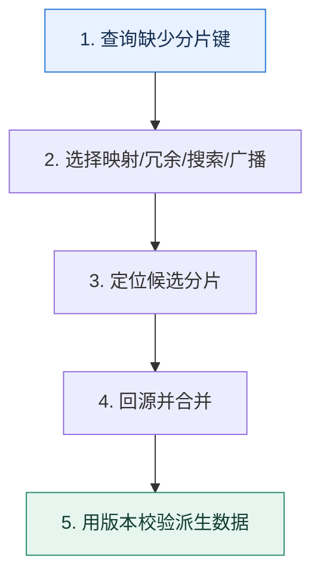

# 非分片键查询｜把路由缺失的成本放到写入、存储还是查询

> 本课只回答一个问题：数据按买家分片后，卖家、订单号和客服条件怎样定位记录？

这是一份独立学习稿。来源资料用于核对知识范围；下面的解释、推演、边界和图示均按工程学习路径重新组织，不依赖原页面也能完整阅读。

## 先补齐：建立正确的心智模型

分片键决定数据放在哪里。查询不包含分片键时，路由层不知道目标分片，只能广播或依赖额外索引。解决方案是在不同成本之间移动工作，而不是凭空消除它。

读这一课时，始终把“组件名字”换成三个可追踪对象：**谁发起动作、状态存在哪里、失败后由谁收敛**。这样遇到不同产品或版本，仍能用同一套模型判断。

## 本节精讲：机制是怎样一步步工作的

全局映射表用订单号定位分片，查询快但映射表成为关键依赖；按卖家冗余一份数据，读快但双写与一致性复杂；搜索系统支持多条件，但存在同步延迟；广播实现简单但成本随分片数增长。主键中嵌入路由信息适合按主键访问。所有派生副本都应携带版本或事件序号，以便重放与修复乱序更新。

下面这张图只表达本课最重要的状态推进，蓝色是入口，绿色是可验收的终点；任一箭头失败，都要回到上文寻找重试、回退或人工处理的位置。

### 一次带数字的完整推演

订单按 buyer_id 分 32 库。卖家后台按 seller_id 查询：写订单时同时写 `seller_order_index(seller_id,order_id,buyer_shard,version)`；查询先从索引表得到目标分片和主键，再批量回源。若索引消息延迟，页面要显示数据新鲜度并提供回查。

数字的作用不是制造精确感，而是暴露容量和时间关系。把例子中的流量、延迟、分片数或版本号替换成自己的真实数据，方案可能会随之改变。

## 误区与失效边界

广播不是一定错误，小规模分片、低频运维查询可能足够经济。冗余副本也不能依靠“最终会一致”而没有版本和校验；乱序事件会让旧值覆盖新值。

判断一个结论是否可靠，可以追问两次：**它依赖什么前提？前提失效后系统留下了什么状态？** 如果回答只能停在“框架会自动处理”，就还没有走到工程边界。

## 按讲解顺序重建知识链

来源稿覆盖的论证主线在这里被重建成四步，保留问题、推导、反例和收束，不沿用原页面措辞：

1. 从分片键选择和主查询模式开始，承认一个键无法优化所有访问。
2. 比较主键内嵌路由、中间映射表、二次分片和搜索系统。
3. 分析广播成本随分片数线性增长，确定低频场景是否可接受。
4. 最后处理双写、乱序、重试和校验，避免索引副本长期漂移。

把四步连起来后，本课不是一个孤立结论，而是一条可以复演的因果链。需要回查课程覆盖范围时，可打开文末的来源稿；学习时以本页模型为主。

## 工程验证：把理解变成证据

决策表列出四种方案的 `读放大、写放大、存储、延迟、一致性、故障依赖`。例如映射表读两跳、写多一份；广播写零放大但读放大等于分片数。

### 状态检查表

| 步骤 | 状态或动作 | 需要留下的证据 |
| ---: | --- | --- |
| 1 | 查询缺少分片键 | 记录耗时、结果与异常分支，确认状态能进入下一步 |
| 2 | 选择映射/冗余/搜索/广播 | 记录耗时、结果与异常分支，确认状态能进入下一步 |
| 3 | 定位候选分片 | 记录耗时、结果与异常分支，确认状态能进入下一步 |
| 4 | 回源并合并 | 记录耗时、结果与异常分支，确认状态能进入下一步 |
| 5 | 用版本校验派生数据 | 记录耗时、结果与异常分支，确认状态能进入下一步 |

检查表不是要求生产系统逐字采用这些字段，而是强迫设计者为每一步提供可观测结果。只有入口、没有终态的流程，最终都会形成无法解释的中间状态。

## 自我检查

为什么新增卖家维度的冗余表后，查询问题解决了，一致性问题却变难了？

同一业务事实出现两个可独立写入的副本。部分失败、重试和事件乱序都可能让它们分叉，需要版本、幂等、对账和修复。

再做一次闭卷练习：不看上文画出状态图，并为其中任意两个箭头注入超时、进程崩溃或重复请求。如果你能预测最终状态和观测信号，这一课才真正从“听懂”变成“会用”。

## 来源与版本校准

- [查看来源稿（23 页资料整理）](../content/19-sharding-secondary-query.md)

来源稿只用于追溯知识范围，不是本学习稿的正文。具体产品的默认值、命令与内部实现会随版本变化；落地前应使用目标版本官方文档和故障演练再次确认。

本课涉及的产品行为以这些官方资料为校准入口：

- [MySQL 8.4 · InnoDB 存储引擎](https://dev.mysql.com/doc/refman/8.4/en/innodb-storage-engine.html)
- [MySQL 8.4 · 锁定读](https://dev.mysql.com/doc/refman/8.4/en/innodb-locking-reads.html)
- [MySQL 8.4 · Redo Log](https://dev.mysql.com/doc/refman/8.4/en/innodb-redo-log.html)
