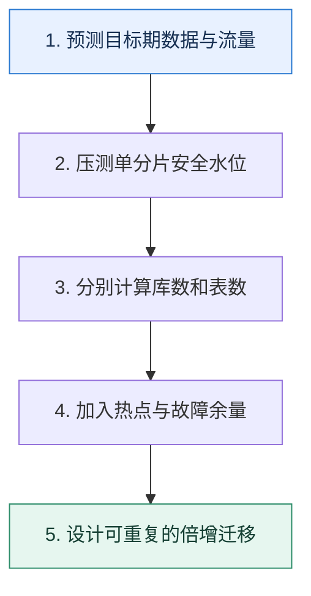

# 分片容量规划｜从增长、峰值与扩容成本反推库表数量

> 本课只回答一个问题：应该分多少库、多少表，才能既承受未来规模又不过早付出复杂度？

这是一份独立学习稿。来源资料用于核对知识范围；下面的解释、推演、边界和图示均按工程学习路径重新组织，不依赖原页面也能完整阅读。

## 先补齐：建立正确的心智模型

容量规划至少包含数据容量和请求容量两个维度，还要考虑热点、索引放大、副本、备份窗口与故障冗余。只按总行数除以单表上限会漏掉吞吐瓶颈。

读这一课时，始终把“组件名字”换成三个可追踪对象：**谁发起动作、状态存在哪里、失败后由谁收敛**。这样遇到不同产品或版本，仍能用同一套模型判断。

## 本节精讲：机制是怎样一步步工作的

先预测目标周期内的记录数与字节数，再用压测确定单分片安全 QPS 和存储水位。选择 2 的幂常让哈希掩码和倍增扩容更方便，但不是业务定律。库解决连接、CPU 和实例吞吐，表解决单表数据与维护成本；二者不必同比增长。扩容应预先定义旧分片到新分片的映射和在线迁移步骤。

下面这张图只表达本课最重要的状态推进，蓝色是入口，绿色是可验收的终点；任一箭头失败，都要回到上文寻找重试、回退或人工处理的位置。

### 一次带数字的完整推演

当前每天新增 5000 万条，每条连索引约 600B，计划 3 年：原始增量约 32.9TB；考虑副本、空间水位和临时迁移空间后需求更高。若单表目标 5000 万行，至少约 1095 张表；再按单库安全写 QPS 与连接数决定每库放多少表，而不是直接做 1024 库。

数字的作用不是制造精确感，而是暴露容量和时间关系。把例子中的流量、延迟、分片数或版本号替换成自己的真实数据，方案可能会随之改变。

## 误区与失效边界

容量预测不是精确预言。过度分片会增加连接、元数据、跨片查询和运维成本；不足时扩容昂贵。目标是让下一次扩容有可执行路径，而不是一次性设计到永远。

判断一个结论是否可靠，可以追问两次：**它依赖什么前提？前提失效后系统留下了什么状态？** 如果回答只能停在“框架会自动处理”，就还没有走到工程边界。

## 按讲解顺序重建知识链

来源稿覆盖的论证主线在这里被重建成四步，保留问题、推导、反例和收束，不沿用原页面措辞：

1. 先明确为什么分片：容量、吞吐、维护窗口对应不同手段。
2. 区分分库和分表，避免把两个数字绑在一起。
3. 用增长率、记录大小、索引、副本和安全水位计算容量。
4. 最后推演扩容映射、数据迁移和回滚，2 的幂只是便利条件之一。

把四步连起来后，本课不是一个孤立结论，而是一条可以复演的因果链。需要回查课程覆盖范围时，可打开文末的来源稿；学习时以本页模型为主。

## 工程验证：把理解变成证据

容量表按月份记录 `数据行数、字节、索引比、峰值 QPS、热点比例、备份时长、预计到达 70% 水位日期`。提前量应大于一次完整扩容演练和审批所需时间。

### 状态检查表

| 步骤 | 状态或动作 | 需要留下的证据 |
| ---: | --- | --- |
| 1 | 预测目标期数据与流量 | 记录耗时、结果与异常分支，确认状态能进入下一步 |
| 2 | 压测单分片安全水位 | 记录耗时、结果与异常分支，确认状态能进入下一步 |
| 3 | 分别计算库数和表数 | 记录耗时、结果与异常分支，确认状态能进入下一步 |
| 4 | 加入热点与故障余量 | 记录耗时、结果与异常分支，确认状态能进入下一步 |
| 5 | 设计可重复的倍增迁移 | 记录耗时、结果与异常分支，确认状态能进入下一步 |

检查表不是要求生产系统逐字采用这些字段，而是强迫设计者为每一步提供可观测结果。只有入口、没有终态的流程，最终都会形成无法解释的中间状态。

## 自我检查

为什么“预计三年 32TB，所以平均分到 32 个库每库 1TB”仍不是完整规划？

它没有验证每库读写 QPS、连接数、热点、索引与副本空间、备份和迁移水位；存储平均值也掩盖分布倾斜。

再做一次闭卷练习：不看上文画出状态图，并为其中任意两个箭头注入超时、进程崩溃或重复请求。如果你能预测最终状态和观测信号，这一课才真正从“听懂”变成“会用”。

## 来源与版本校准

- [查看来源稿（17 页资料整理）](../content/20-sharding-capacity.md)

来源稿只用于追溯知识范围，不是本学习稿的正文。具体产品的默认值、命令与内部实现会随版本变化；落地前应使用目标版本官方文档和故障演练再次确认。

本课涉及的产品行为以这些官方资料为校准入口：

- [MySQL 8.4 · InnoDB 存储引擎](https://dev.mysql.com/doc/refman/8.4/en/innodb-storage-engine.html)
- [MySQL 8.4 · 锁定读](https://dev.mysql.com/doc/refman/8.4/en/innodb-locking-reads.html)
- [MySQL 8.4 · Redo Log](https://dev.mysql.com/doc/refman/8.4/en/innodb-redo-log.html)
