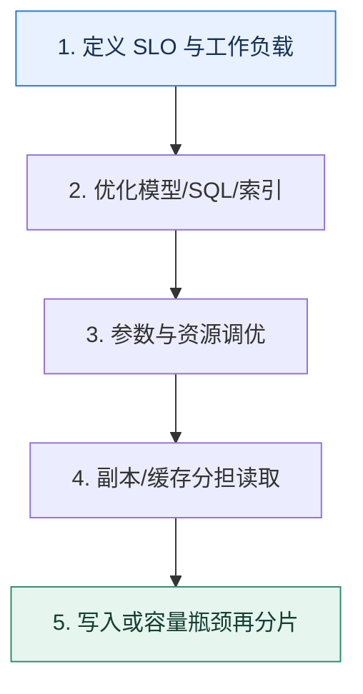

# 数据库架构全景｜把性能、可用性和一致性拆成可验证目标

> 本课只回答一个问题：面对读写增长和故障要求，怎样组合参数、索引、复制、缓存与分片？

这是一份独立学习稿。来源资料用于核对知识范围；下面的解释、推演、边界和图示均按工程学习路径重新组织，不依赖原页面也能完整阅读。

## 先补齐：建立正确的心智模型

架构设计先写 SLO 和工作负载：读写比例、事务边界、数据量、热点、允许延迟和可接受数据损失。没有这些条件，“读写分离还是分库分表”没有答案。

读这一课时，始终把“组件名字”换成三个可追踪对象：**谁发起动作、状态存在哪里、失败后由谁收敛**。这样遇到不同产品或版本，仍能用同一套模型判断。

## 本节精讲：机制是怎样一步步工作的

第一层先修查询和数据模型，避免用更多机器掩盖低效 SQL；第二层调缓冲池、日志和连接等参数，并用指标证明；第三层用副本提供故障切换和可选读扩展，同时处理延迟；第四层才考虑缓存与分片。MySQL 8.0 已移除旧式 server query cache，因此“查询缓存”通常应指应用或代理层缓存，不应套用旧版本机制。

下面这张图只表达本课最重要的状态推进，蓝色是入口，绿色是可验收的终点；任一箭头失败，都要回到上文寻找重试、回退或人工处理的位置。

### 一次带数字的完整推演

业务峰值 20k QPS，读写 9:1。先发现 60% 读取集中在商品详情，可应用缓存削峰；剩余查询通过覆盖索引降低扫描；只读报表路由到可接受延迟的副本；核心写留在主库。若主库写 QPS 仍接近安全上限，再按租户分片，而不是一开始就拆库。

数字的作用不是制造精确感，而是暴露容量和时间关系。把例子中的流量、延迟、分片数或版本号替换成自己的真实数据，方案可能会随之改变。

## 误区与失效边界

副本读扩展不等于读到最新数据；分片不自动提高单事务性能；缓存不修复慢写。每层方案都会新增一致性和运维成本，必须用瓶颈证据决定是否进入下一层。

判断一个结论是否可靠，可以追问两次：**它依赖什么前提？前提失效后系统留下了什么状态？** 如果回答只能停在“框架会自动处理”，就还没有走到工程边界。

## 按讲解顺序重建知识链

来源稿覆盖的论证主线在这里被重建成四步，保留问题、推导、反例和收束，不沿用原页面措辞：

1. 先用工作负载说明整体方案，而不是从某个中间件开始。
2. 按证据调 buffer pool、日志和连接参数，区分容量与延迟目标。
3. 引入读写分离时明确复制延迟和读一致性。
4. 只有单机写入或容量无法继续扩展时再分片，并准备跨片查询与迁移。

把四步连起来后，本课不是一个孤立结论，而是一条可以复演的因果链。需要回查课程覆盖范围时，可打开文末的来源稿；学习时以本页模型为主。

## 工程验证：把理解变成证据

架构评审必须回答：`主库永久丢失会丢多少数据（RPO）？多久恢复（RTO）？读副本多旧可接受？容量水位多少触发扩容？`。没有数字的“高可用、高性能”不能验收。

### 状态检查表

| 步骤 | 状态或动作 | 需要留下的证据 |
| ---: | --- | --- |
| 1 | 定义 SLO 与工作负载 | 记录耗时、结果与异常分支，确认状态能进入下一步 |
| 2 | 优化模型/SQL/索引 | 记录耗时、结果与异常分支，确认状态能进入下一步 |
| 3 | 参数与资源调优 | 记录耗时、结果与异常分支，确认状态能进入下一步 |
| 4 | 副本/缓存分担读取 | 记录耗时、结果与异常分支，确认状态能进入下一步 |
| 5 | 写入或容量瓶颈再分片 | 记录耗时、结果与异常分支，确认状态能进入下一步 |

检查表不是要求生产系统逐字采用这些字段，而是强迫设计者为每一步提供可观测结果。只有入口、没有终态的流程，最终都会形成无法解释的中间状态。

## 自我检查

为什么读写分离可能降低主库读压力，却让业务正确性变复杂？

副本异步复制会产生延迟。刚写完立即读副本可能看不到新值，因此需要主读、会话粘滞、版本等待或接受陈旧数据。

再做一次闭卷练习：不看上文画出状态图，并为其中任意两个箭头注入超时、进程崩溃或重复请求。如果你能预测最终状态和观测信号，这一课才真正从“听懂”变成“会用”。

## 来源与版本校准

- [查看来源稿（15 页资料整理）](../content/21-database-architecture.md)

来源稿只用于追溯知识范围，不是本学习稿的正文。具体产品的默认值、命令与内部实现会随版本变化；落地前应使用目标版本官方文档和故障演练再次确认。

本课涉及的产品行为以这些官方资料为校准入口：

- [MySQL 8.4 · InnoDB 存储引擎](https://dev.mysql.com/doc/refman/8.4/en/innodb-storage-engine.html)
- [MySQL 8.4 · 锁定读](https://dev.mysql.com/doc/refman/8.4/en/innodb-locking-reads.html)
- [MySQL 8.4 · Redo Log](https://dev.mysql.com/doc/refman/8.4/en/innodb-redo-log.html)
