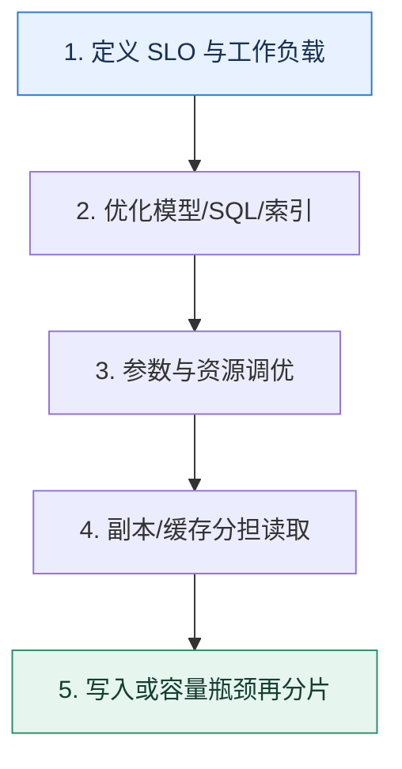

# 数据库架构全景｜把性能、可用性和一致性拆成可验证目标

> 本课只解决一个问题：面对读写增长和故障要求，怎样组合参数、索引、复制、缓存与分片？

这不是原页面的缩写，也不是一组孤立结论。下面先建立一个能推演的最小世界，再把状态、数字和失败分支摊开，最后按来源讲解顺序覆盖全部知识线索。读完后，你应当能从 `定义 SLO 与工作负载` 一直解释到 `写入或容量瓶颈再分片`，并说明中途任意一步失败会留下什么状态。

## 零基础入口：先建立本课的心智画面

架构设计先写 SLO 和工作负载：读写比例、事务边界、数据量、热点、允许延迟和可接受数据损失。没有这些条件，“读写分离还是分库分表”没有答案。

先不要急着记组件名。只抓住四个问题：**现在手里有什么输入？下一步只做什么动作？哪个状态发生变化？变化后的结果交给谁？** 之后遇到新框架，只要这四个答案不变，核心机制就没有变。

### 放进一个足够小、可以手算的世界

业务峰值 20k QPS，读写 9:1。先发现 60% 读取集中在商品详情，可应用缓存削峰；剩余查询通过覆盖索引降低扫描；只读报表路由到可接受延迟的副本；核心写留在主库。若主库写 QPS 仍接近安全上限，再按租户分片，而不是一开始就拆库。

这个小世界故意只保留本课必需的对象。生产系统会有更多节点、线程、分片和异常，但数量增加不会改变这里的因果关系。先确认你能手算这个例子，再把数字替换成真实系统数据。

### 先预测，不要马上看结论

**为什么读写分离可能降低主库读压力，却让业务正确性变复杂？**

先写下自己的判断，并指出你依赖的前提。文末自我检查会揭示答案；如果答案不同，回到下面的状态表找出第一个分叉点。

## 本节精讲：让机制一步一步发生

第一层先修查询和数据模型，避免用更多机器掩盖低效 SQL；第二层调缓冲池、日志和连接等参数，并用指标证明；第三层用副本提供故障切换和可选读扩展，同时处理延迟；第四层才考虑缓存与分片。MySQL 8.0 已移除旧式 server query cache，因此“查询缓存”通常应指应用或代理层缓存，不应套用旧版本机制。

### 可见状态推进

| 当前步 | 现在发生的动作 | 下一步拿到什么 |
| ---: | --- | --- |
| 1 | 定义 SLO 与工作负载 | 优化模型/SQL/索引 |
| 2 | 优化模型/SQL/索引 | 参数与资源调优 |
| 3 | 参数与资源调优 | 副本/缓存分担读取 |
| 4 | 副本/缓存分担读取 | 写入或容量瓶颈再分片 |
| 5 | 写入或容量瓶颈再分片 | 得到可核对的终态 |

图只承担一个任务：让你看清状态如何向前移动。它不意味着每一步必然成功；网络超时、进程退出、重复执行和数据竞争都可能让箭头停在中间，因此后面必须继续讨论失效边界。

### 一次带数字的完整推演

业务峰值 20k QPS，读写 9:1。先发现 60% 读取集中在商品详情，可应用缓存削峰；剩余查询通过覆盖索引降低扫描；只读报表路由到可接受延迟的副本；核心写留在主库。若主库写 QPS 仍接近安全上限，再按租户分片，而不是一开始就拆库。

数字不是装饰。它迫使我们回答容量、顺序、时间窗口或版本选择问题。若换一个数字就得出不同结论，真正的设计依据就是那个阈值，而不是某个中间件名称。

## 按讲解顺序重建知识链：完整来源讲解

下面按来源资料的教学顺序重新编排完整内容。转换页码、来源图片、推广信息、水印和个人宣传已经删除；原本围绕求职问答的角色与措辞改写为工程学习、方案评审和故障复盘语境。机制、算法、例子、反例、事故线索、评论补充和限制条件仍然保留。这里的作用是补齐知识覆盖，不取代前面的独立推演。

我很早就注意到，很多人在平时工作中就是设计一下表结构和索引。好一点的可能还会有一些查询优化的经验，也有少数人做了很多跟数据库有关的事情，但是没办法把它们系统组织起来，给技术评审者留下深刻印象。

现在我们有了前面几节课的基础之后，就可以把这些知识串联起来，做成一整个提高数据库性能和可用性的方案。在这之前，为了方便你理解后面的方案，我们先来学习一下查询缓存相关的知识。

### 查询缓存

在 MySQL 里面，允许用户开启查询缓存。你可以理解这个缓存就是用 SQL 作为键，而对应的查询结果集就是值。如果下次过来的还是同一个查询，那么就直接返回缓存起来的查询结果集。

但是查询缓存不一定带来查询性能提升。如果你的查询每一次对应的 SQL 都不一样，那么查询缓存反而会降低查询性能。

在实践中查询缓存的效果的确不怎么好。按照设计者的想法，查询缓存的最佳使用场景是一些特别复杂的查询，它们会扫描很多行，但是只有一小部分行满足条件。所以 MySQL 在 8.0 的时候移除了这个功能。

### 把知识转成可验证的工程判断

为了面好数据库这部分内容，你还需要在公司内部搞清楚一些数据和信息。

我后面提到的各种参数是否有改进的空间，记住公司里每一个使用了非默认值的参数。如果你所在公司有 DBA，那么可以请教一下 DBA，有没有针对公司的业务做过什么优化，包括数据库自身的优化，也包括数据库所在的操作系统的优化。如果你和他们的私人关系够好，那么可以请教一下他们之前遇到过的各种数据库问题，然后把这些问题整理成案例，在技术讨论中使用。如果你所在公司的文档比较齐全，那么可以了解一下数据库架构的演进。

同时，你要为后面的查询优化、参数调优、读写分离和分库分表准备一些案例。查询优化部分你要多准备案例，案例要覆盖不同的优化方向，比如说有优化索引的案例，也有优化锁的案例。在整个数据库技术讨论环节有机会用就抓住机会用上。

参数调优部分在实践中是根据业务特征来选择优化方向，但是在工程复盘时你可以根据你准备的解释来找业务特征，论证自身优化的合理性。读写分离部分就是看看你所在的公司有没有使用读写分离。如果有读写分离，那么主从切换是手动还是自动。如果是自动的，那么弄清楚怎么自动切换。

还有分库分表，如果有机会亲身参与分库分表那自然是最好的。要是没有的话，就看看你所在公司是如何从单库演进到分库分表的。如果公司本身也没有分库分表，那么你就可以看看别的大厂发布出来的案例，从各个大厂的技术公众号里就能找到。

技术评审者问到哪些问题，你可以用这节课的内容来解释呢？

1. 你是如何提升系统可用性或者性能的？
2. MVCC 相关的问题，你可以说你调整过 redo log 的刷盘时机，然后进一步引申到你对数据库调优的其他方案。
3. 读写分离或者分库分表相关问题，也和这节课的内容强相关。
最佳的技术讨论策略，是把提高数据库可用性、性能作为你提高整个系统的可用性、性能的一环。

### 整体方案

为了更好地引导这个话题，你要在三个地方主动提起你在数据库上的深厚积累。

首先是在简历上。比如说在个人优势里面这样写：

我擅长数据库，包括查询优化、MySQL 和 InnoDB 引擎优化，熟练掌握 MySQL 高可用和高性能方案。

然后在自我介绍的时候，要注意强调一下自己在数据库这方面的竞争优势。

我在数据库方面有比较多的积累，比如说我长期负责公司的查询优化，提高 MySQL 的可用性和性能。也在公司推动过读写分离和分库分表，实践经验丰富。

在具体的项目里面，要注意提起自己在数据库上做的事情。比如说当你在介绍某个项目的时候可以这样说：

这个项目是某个线上系统的核心业务，我主要负责性能优化和提高系统可用性。在数据库上，我通过查询优化、参数优化和读写分离，提高了 20% 的查询性能。同时参与了一个核心业务数据库的分库分表，主要负责的是数据迁移和主键生成部分。

技术评审者自然就会对你的工作感兴趣，那么你就可以用这一章的内容来应对技术评审者的提问。

查询优化在第 17 讲就已经讲过了，这里就不赘述了。这里我们主要看参数调优、读写分离和分库分表这三方面。

### 参数调优

我之前讲过几个可以调优的参数，我们这里复习一下。

这里 innodb_flush_log_at_trx_commit 这个参数非常重要，你一定要记住，此外我再介绍一个能够提升数据库性能，并且适合在技术讨论中使用的参数 innodb_buffer_pool_size。

innodb_buffer_pool_size

简单说就是 innodb 缓冲池的大小，用于缓存表和索引，也包括插入数据缓冲，增加这个值可以减少磁盘 IO。

在实践中应该尽可能调大这个参数。如果数据库所在的机器内存比较大，那么可以调整到整个内存的 70% 或者 75%。但是也要小心这个参数过大，物理内存不足，容易触发操作系统swap。

你可以把这个东西包装一下，变成你解决的一个 Bug。

最开始我会想到调整 innodb_buffer_pool_size 是因为我发现数据库上的 swap 非常高。经过排查我发现是因为 innodb_buffer_pool_size 设置得偏大了。在内存不足的时候，操作系统就会触发 swap。

解决思路自然是调小一点，但是这样做要小心对业务的影响。实际上innodb_buffer_pool_size 是逐步调整的，最后调整到原本数值的 70%，swap 就大幅减少了，而且查询性能也没什么变化。

这里你还可以进一步说明另外一个相关的参数 innodb_buffer_pool_instances。从图里由此可以看到，要是整个 MySQL InnoDB 引擎内部只有一个缓冲池，所有查询都访问它，那么并发竞争会十分厉害。

在这种情况下，可以考虑启动多个缓冲池实例，具体多少个就由innodb_buffer_pool_instances 这个参数指定。显然这个数字越大，并发竞争就越小。

可惜 MySQL 有一些额外的限制，它要求在 innodb_buffer_pool_instances 大于 1 的情况下，innodb_buffer_pool_size 不能小于 1G。一般我建议在 8G 以内设置成 2 就可以，如果大于 8G 那么可以设置成 4。

你可以把 innodb_buffer_pool_size 和 innodb_buffer_pool_instances 放到一起说。

在解决了 innodb_buffer_pool_size 的 Bug 之后，我负责的系统数据库的相关设置，又发现了一个问题。我们有一个核心数据库，innodb_buffer_pool_size 超过了 8G，但是innodb_buffer_pool_instances 居然还保持着 1，这显然是不合理的。所以这个我就把它调整成了 4，减少数据库 buffer pool 的并发竞争。

query_cache_min_res_unit

前面我们提到了查询缓存相关的知识，你可以从两个相反的角度来使用查询缓存案例。第一个角度是你认为查询缓存效果不好，所以你关掉了。

某个线上系统有一个数据库，用的是比较古老的 MySQL 版本。在这个版本上开启了查询缓存。但是实际上效果不太好，因为这里存储的数据其实经常变动，所以缓存命中率一直很低。我索性就关掉了这个查询缓存，后来查询性能也基本没有什么损失。

第二个角度是你赞同使用查询缓存。这里可以用两个案例来说明，第一个案例是你开启了查询缓存。

我们在业务里面有一个关键查询，这个查询比较复杂，执行的时候会非常慢。但是我注意到这个查询对应的数据是很少变动的，于是我尝试开启了查询缓存。果然开启缓存之后，这个查询大部分情况下都命中了缓存，性能得到了很大的提升。

第二个案例是你调整了查询缓存的相关参数，最为常见的是调整query_cache_min_res_unit。这个参数的默认值是 4KB。大部分情况下，4KB 都太大了，所以会有很多内存浪费。比如说结果集可能就一行，总共不到 1KB，它都给你分配了 4KB。

所以可以把方案整理为：

我们有一个数据库是开启了查询缓存的，但是 query_cache_min_res_unit 一直使用的是默认值 4KB。后来我仔细评估了一下相关业务的查询结果集大小，4KB 显然太大了，浪费了很多内存。所以我后面把它调整成了 1KB，还是能够满足大多数查询的需求。这样就能缓存更多查询的结果集，查询性能得到了提升。

在这个角度之下，你要小心技术评审者问你为什么 MySQL 8.0 移除了这个功能。答案也很简单，因为缓存功能适合那种耗时并且重复执行的查询，而实际上这一类的查询并不多。另外一个理由是，数据库本身就容易成为性能瓶颈，那么完全可以让应用自己去做缓存，减轻数据库的负担。

### 读写分离

如果你在小公司工作的话，这部分内容会比较适合你，因为正常中大型公司基本上都已经完成了读写分离。你可以这样介绍你的读写分离方案。

最开始我进公司的时候，就发现他们居然连读写分离都还没做，包括我们的核心数据库都没有，而且当我去看观测数据的时候就感觉核心数据库已经快要触及性能瓶颈了。于是我就在公司里面引入了从库。虽然只是准备了一个从库，但是大部分读请求落到从库上，主库的压力就小多了。引入读写分离机制，一方面可以提高了数据库的可用性，另一方面也提高了查询的性能。

有些时候技术评审者可能会追问你具体是怎么做的，这里我给出简要步骤。

1. 准备一个从库。
2. 改造业务，允许业务动态切换读主库还是读从库。
3. 切换到读从库，看看是否有问题，如果有问题就立刻回滚。
解释的时候你就可以介绍这个简单方案，同时提出一个主从延迟问题。

单库引入读写分离，并不是特别复杂。不过这个过程中要小心主从延迟问题。比如说原本有一个业务是在更新之后立刻读数据，那么就会读到更新后的值。但是如果修改成读从库，就可能还是会读到更新前的值，导致业务出错。在改造业务的过程中要小心这种场景。

你可以利用主从自动切换进一步刷进阶推导。主从自动切换是指当主库出现问题的时候，能够自动把某个从库提升成主库。

当然如果你们公司本身已经有了读写分离，那么你也可以直接使用这个进阶推导。

在实施了读写分离之后，最开始我们都是手动切换主库或者从库。但是万一主库在半夜出现了故障，那就不一定能够及时发现并且切换了。所以我们用 KeepAlived 做了一个简单的自动主从切换机制，然后在测试环境做过几次演练。

或者你说：

我了解到云服务本身就提供了这种自动切换功能，所以接入了一下。

你应该还记得，我在讲微服务高可用的时候就说过，如果没有自动故障处理机制，是很难达到非常高的可用性的。这个进阶推导你可以看作是这种理念在数据库这边的应用。

### 分库分表

这算是一张王牌，就我个人经验来说，如果你在公司里面主导过一次单库拆分分库分表，那么出去技术讨论，数据库这一关就不会有任何问题。

你在介绍自己的分库分表方案时，要包含以下几个方面：

1. 为什么要分库分表？
2. 分库分表中间件选型，你只需要解释你们公司使用的分库分表中间件的优缺点就可以了。如果你对分库分表中间件没有任何了解，那么无脑使用 ShardingSphere 也行。
3. 容量规划，也是上节课的内容。
4. 数据迁移，是前面第 15 讲的内容。
5. 分库分表键选择，前面第 19 讲学过。
6. 主键生成策略，并且要能解释清楚这种决策的理由。
7. 分库分表之后的事务问题，前面第 14 讲我们也讨论过，包括在服务层面上解决事务，例如 TCC、SAGA，又或者依赖于分库分表中间件提供的策略，比如说延迟事务。
8. 分库分表中一些特殊查询的处理，最主要的就是分页查询，你在前面第 17 讲也学过了。技术讨论开始的时候你就可以聊聊你实际参与过里面的某个步骤。

我进某个线上系统的时候，刚好遇上了数据库性能瓶颈，所以我实际参与了某个线上系统的核心数据库的分库分表，我主要负责的是分库分表中的数据迁移和主键生成部分。

你根据自己实际情况和前面学习的成果来选择。这里说数据迁移和主键生成，是因为单纯从技术上来说它们俩更有竞争优势。不过要注意一点，你要做到对自己负责的部分了如指掌。

### 本节原始知识线索收束

在前置知识里面我介绍了查询缓存。其实查询缓存已经差不多过时了，如果不是因为技术讨论会问的话，可能我们也不太会地去讲这个部分，这里你有一个基本的了解就可以了。

我们整个高性能高可用的方案主要落在了四个方面：查询优化、参数优化、读写分离还有分库分表。如果你在大厂工作，那么我相信你们公司可能还有一些更加复杂的高可用方案，比如说异地多活。如果你有机会能接触到的话，可以深入了解一下。

这里的技术讨论内容都是针对 MySQL，不过就算你使用的是其他数据库，也还是可以用类似的思路去自己整理的。只要把这里面提到的各种参数，替换成对应的数据库的参数就好了。

### 继续推演

最后，请你来思考 2 个问题。

在查询缓存里面还有一个参数 query_cache_limit，现在我要你准备两段话来技术讨论，一段话是调大 query_cache_limit，一段话是调小 query_cache_limit，你会怎么说？参数调优里面我额外补充了两个参数，但是还有别的参数。你有什么更加适合技术讨论的参数调优案例吗？

### 补充讨论与边界校准

#### 全部留言 (6)

补充讨论： pool之间存的都是不一样的数据吧？

讲解补充：是的。

补充讨论： tps://baijiahao.baidu.com/s?id=1714292603624190772&wfr=spider&for=pc

讲解补充：赞！我记得，阿里云好像也可以调吧？嘿嘿，就看你敢不敢了。

补充讨论：

讲解补充：你可以认为每个 buffer pool 里面都有一大堆的数据结构，这些数据结构都需要用锁保护起来。如果只有一个，那么就大家都在等一个锁；如果有两个，那么就可以有两个查询同时拿到锁。

虽然每一页的数据都是分开的，没什么竞争。但是你找到这个页，把这个页放进去缓存的过程，是需要竞争的。

补充讨论： 留言里一位朋友说设置了六千，可能吗？难道机器硬件配置非常高吗？Q2：tomcat连接数与CPU核数的矛盾问题。tomcat服务器一般能够支持500个连接，一个连接一个线程，那就是500个线程。但一般服务器的CPU核数也就是10个左右。线程的数量一般是核数的2倍，也就是20个，怎么会开启500个线程呢？

讲解补充：1. 都跟你机器性能有关的，也跟你的查询有关。所以最好就还是自己先测试一下，当然这些数据都是 DBA 配置好的，你直接问他们就行。

2. tomcat 已经很久没研究了，超纲了。

补充讨论： query_cache_limit 参数可以在一些情况下提升查询缓存的效果。增加 query_cache_l imit 可能会增加缓存的利用率2）调小 query_cache_limit 参数，适当减小 query_cache_limit 可以减少缓存内碎片的产生，提高缓存的效率也就是说针对你的业务场景数据，如果业务数据大，适当调大些，如果都是平均，调的太大会出现内存碎片，浪费内存空间第二问：innodb_log_file_size 和 innodb_log_buffer_size： 存储引擎的事务日志，存储更大的事务日志max_connections： 最大并发连接数，我们当时最早涉及的一个数据库，因为是老项目，涉及的业务比较多，机器也比较多，所以我们配置的最大连接数特别高，当时记得是6000

讲解补充：震惊！6000！我好像还没见过调到这么大的。长见识了

补充讨论：

我们有一个数据库开启了查询缓存限制query_cache_limit，一开始默认大小是1MB，发现存储了很多没用的缓存，还导致缓存较满，利用效果不佳，后来仔细排查了几个需要缓存的sql数据，看了下返回结果，调整到128KB之后，有很高效利用到缓存效果

讲解补充：厉害！

## 把完整讲解收束成一条因果链

1. 先用工作负载说明整体方案，而不是从某个中间件开始。
2. 按证据调 buffer pool、日志和连接参数，区分容量与延迟目标。
3. 引入读写分离时明确复制延迟和读一致性。
4. 只有单机写入或容量无法继续扩展时再分片，并准备跨片查询与迁移。

把这几步连接起来时，不要省略“为什么”。最终结论只有在前提、状态变化和失败代价都说得清楚时才可靠。

## 误区与失效边界

副本读扩展不等于读到最新数据；分片不自动提高单事务性能；缓存不修复慢写。每层方案都会新增一致性和运维成本，必须用瓶颈证据决定是否进入下一层。

再加一条通用但必须落实到本课对象上的边界：机制只能处理它看得见的信号。若输入指标失真、状态没有持久化、错误被吞掉，或者补偿没有幂等保护，再成熟的框架也只能基于错误证据作决定。

### 三种故障注入方式

| 故障 | 要观察什么 | 不能接受的解释 |
| --- | --- | --- |
| 在第 2 步前让依赖超时 | 是否停在可重试状态，是否消耗完上游预算 | “框架稍后会处理” |
| 在状态写入后让进程退出 | 重启后能否识别已完成与待继续动作 | “再执行一次应该没事” |
| 对同一输入并发执行两次 | 是否出现重复副作用、顺序颠倒或覆盖 | “概率很低” |

## 工程验证：把理解变成可以复查的证据

架构评审必须回答：`主库永久丢失会丢多少数据（RPO）？多久恢复（RTO）？读副本多旧可接受？容量水位多少触发扩容？`。没有数字的“高可用、高性能”不能验收。

| 步骤 | 状态或动作 | 最少应留下的证据 |
| ---: | --- | --- |
| 1 | 定义 SLO 与工作负载 | 开始时间、结束时间、输入标识、结果状态、异常原因 |
| 2 | 优化模型/SQL/索引 | 开始时间、结束时间、输入标识、结果状态、异常原因 |
| 3 | 参数与资源调优 | 开始时间、结束时间、输入标识、结果状态、异常原因 |
| 4 | 副本/缓存分担读取 | 开始时间、结束时间、输入标识、结果状态、异常原因 |
| 5 | 写入或容量瓶颈再分片 | 开始时间、结束时间、输入标识、结果状态、异常原因 |

验证时同时记录成功路径和失败路径。只证明“正常时能跑通”不能说明设计可靠；至少要让一次超时、一次进程退出和一次重复请求可重现，并能根据日志或指标解释最后状态。

## 学完检查：闭卷画出本课

你现在应该能独立完成四件事：

1. 用自己的话说出本课唯一问题，不使用产品名也能解释。
2. 复算上面的具体例子，并指出哪个输入改变会让结论改变。
3. 沿 Mermaid 图注入一次失败，预测系统停在哪里以及由谁收敛。
4. 说出本课机制不保证什么，并给出一个反例。

## 自我检查

为什么读写分离可能降低主库读压力，却让业务正确性变复杂？

副本异步复制会产生延迟。刚写完立即读副本可能看不到新值，因此需要主读、会话粘滞、版本等待或接受陈旧数据。

怎样证明自己不是只记住了名词？

把 `定义 SLO 与工作负载` 的一个真实输入写出来，逐步记录到 `写入或容量瓶颈再分片`。然后在中间任意一步制造失败；如果你能解释当前状态、下一责任方、可观测证据和恢复边界，就已经拥有可以迁移的工程模型。

## 来源与事实校准

- [查看完整来源稿（本地 15 页资料）](../content/21-database-architecture.md)

### 当前事实校准

复制、读写分离、分库分表和缓存解决的是不同瓶颈。副本读可能受复制延迟影响，分片提高横向容量却增加跨分片查询和迁移成本；任何组合方案都要写清权威写入点、读一致性要求和故障切换边界。

- [MySQL 8.4 · Replication](https://dev.mysql.com/doc/refman/8.4/en/replication.html)
- [MySQL 8.4 · Group Replication](https://dev.mysql.com/doc/refman/8.4/en/group-replication.html)

来源稿用于核对覆盖范围，不随公开站点发布。产品默认值和具体内部行为可能随版本变化；落地时应使用目标版本的官方文档、可运行实验和故障演练校准。本学习稿中的零基础入口、状态推演、故障矩阵和工程验证属于编辑补充，不冒充来源讲解者的原话。
