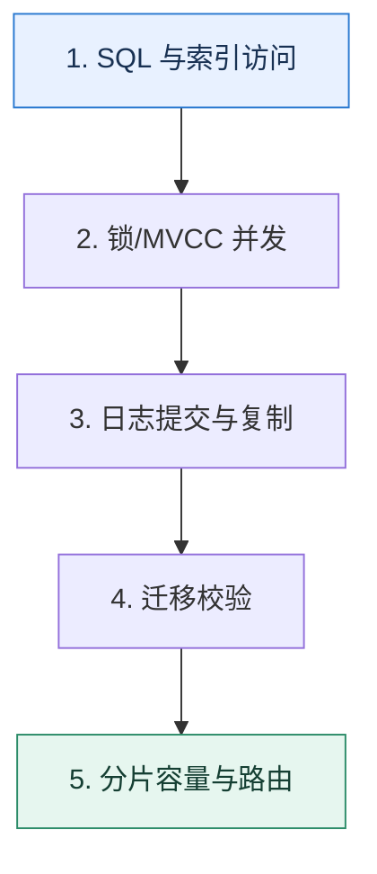

# 数据库专题复盘｜从一条慢查询走到容量与恢复设计

> 本课只回答一个问题：如何把索引、锁、MVCC、日志、迁移和分片放进同一条数据生命周期？

这是一份独立学习稿。来源资料用于核对知识范围；下面的解释、推演、边界和图示均按工程学习路径重新组织，不依赖原页面也能完整阅读。

## 先补齐：建立正确的心智模型

数据库知识不应按术语分割。一次请求从 SQL 进入优化器，经索引访问、并发控制、日志提交、复制，再走向备份与扩容；每一层都有性能和正确性边界。

读这一课时，始终把“组件名字”换成三个可追踪对象：**谁发起动作、状态存在哪里、失败后由谁收敛**。这样遇到不同产品或版本，仍能用同一套模型判断。

## 本节精讲：机制是怎样一步步工作的

读慢先检查扫描、排序与回表；并发异常检查访问路径和锁范围；快照读结果由版本可见性决定；提交耐久由日志和刷盘边界决定；复制与读写分离引入新鲜度；迁移与分片改变路由并需要校验。复盘时沿一条订单数据的写入、查询、修改、复制、迁移和归档逐层追踪。

下面这张图只表达本课最重要的状态推进，蓝色是入口，绿色是可验收的终点；任一箭头失败，都要回到上文寻找重试、回退或人工处理的位置。

### 一次带数字的完整推演

订单表从 1 亿增长到 20 亿：先用联合覆盖索引修复查询；热点更新发生死锁时统一加锁顺序；报表走延迟可接受的副本；主库写入接近上限后按租户分片；迁移使用全量+CDC+校验；全程定义提交、复制和备份各自能承受的丢失窗口。

数字的作用不是制造精确感，而是暴露容量和时间关系。把例子中的流量、延迟、分片数或版本号替换成自己的真实数据，方案可能会随之改变。

## 误区与失效边界

专题复盘不是把所有技术一起上。每引入一层都要指出它解决的瓶颈、引入的状态和回退方式；否则复杂度会超过收益。

判断一个结论是否可靠，可以追问两次：**它依赖什么前提？前提失效后系统留下了什么状态？** 如果回答只能停在“框架会自动处理”，就还没有走到工程边界。

## 按讲解顺序重建知识链

来源稿覆盖的论证主线在这里被重建成四步，保留问题、推导、反例和收束，不沿用原页面措辞：

1. 用执行计划确认访问路径，再解释它如何影响锁范围。
2. 用版本链区分快照读和锁定读，连接到事务隔离。
3. 把 redo、binlog、复制和备份拆成不同耐久层。
4. 最后以容量证据触发迁移与分片，并设计非分片键查询和扩容。

把四步连起来后，本课不是一个孤立结论，而是一条可以复演的因果链。需要回查课程覆盖范围时，可打开文末的来源稿；学习时以本页模型为主。

## 工程验证：把理解变成证据

画一条订单生命周期：创建时写了哪些日志；查询用了哪个索引；并发修改拿什么锁；副本何时可见；迁移事件怎样重放；分片后如何用订单号路由。任一问答不出就回到对应课程。

### 状态检查表

| 步骤 | 状态或动作 | 需要留下的证据 |
| ---: | --- | --- |
| 1 | SQL 与索引访问 | 记录耗时、结果与异常分支，确认状态能进入下一步 |
| 2 | 锁/MVCC 并发 | 记录耗时、结果与异常分支，确认状态能进入下一步 |
| 3 | 日志提交与复制 | 记录耗时、结果与异常分支，确认状态能进入下一步 |
| 4 | 迁移校验 | 记录耗时、结果与异常分支，确认状态能进入下一步 |
| 5 | 分片容量与路由 | 记录耗时、结果与异常分支，确认状态能进入下一步 |

检查表不是要求生产系统逐字采用这些字段，而是强迫设计者为每一步提供可观测结果。只有入口、没有终态的流程，最终都会形成无法解释的中间状态。

## 自我检查

一条 SQL 已经通过索引变快，为什么仍要检查它在事务中的加锁范围？

性能与并发正确性相关但不等价。访问路径决定扫描及可能加锁的索引范围，范围查询仍可能阻塞插入或与其他事务形成死锁。

再做一次闭卷练习：不看上文画出状态图，并为其中任意两个箭头注入超时、进程崩溃或重复请求。如果你能预测最终状态和观测信号，这一课才真正从“听懂”变成“会用”。

## 来源与版本校准

- [查看来源稿（9 页资料整理）](../content/21a-mock-database.md)

来源稿只用于追溯知识范围，不是本学习稿的正文。具体产品的默认值、命令与内部实现会随版本变化；落地前应使用目标版本官方文档和故障演练再次确认。

本课涉及的产品行为以这些官方资料为校准入口：

- [MySQL 8.4 · InnoDB 存储引擎](https://dev.mysql.com/doc/refman/8.4/en/innodb-storage-engine.html)
- [MySQL 8.4 · 锁定读](https://dev.mysql.com/doc/refman/8.4/en/innodb-locking-reads.html)
- [MySQL 8.4 · Redo Log](https://dev.mysql.com/doc/refman/8.4/en/innodb-redo-log.html)
