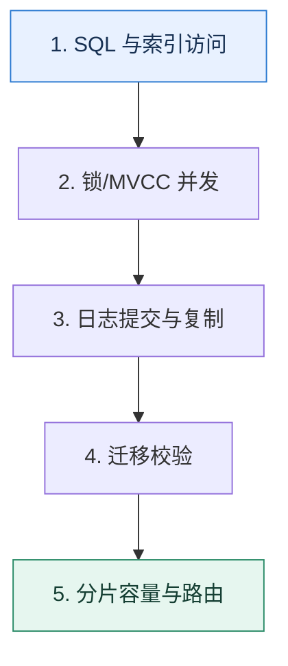

# 数据库专题复盘｜从一条慢查询走到容量与恢复设计

> 本课只解决一个问题：如何把索引、锁、MVCC、日志、迁移和分片放进同一条数据生命周期？

这不是原页面的缩写，也不是一组孤立结论。下面先建立一个能推演的最小世界，再把状态、数字和失败分支摊开，最后按来源讲解顺序覆盖全部知识线索。读完后，你应当能从 `SQL 与索引访问` 一直解释到 `分片容量与路由`，并说明中途任意一步失败会留下什么状态。

## 零基础入口：先建立本课的心智画面

数据库知识不应按术语分割。一次请求从 SQL 进入优化器，经索引访问、并发控制、日志提交、复制，再走向备份与扩容；每一层都有性能和正确性边界。

先不要急着记组件名。只抓住四个问题：**现在手里有什么输入？下一步只做什么动作？哪个状态发生变化？变化后的结果交给谁？** 之后遇到新框架，只要这四个答案不变，核心机制就没有变。

### 放进一个足够小、可以手算的世界

订单表从 1 亿增长到 20 亿：先用联合覆盖索引修复查询；热点更新发生死锁时统一加锁顺序；报表走延迟可接受的副本；主库写入接近上限后按租户分片；迁移使用全量+CDC+校验；全程定义提交、复制和备份各自能承受的丢失窗口。

这个小世界故意只保留本课必需的对象。生产系统会有更多节点、线程、分片和异常，但数量增加不会改变这里的因果关系。先确认你能手算这个例子，再把数字替换成真实系统数据。

### 先预测，不要马上看结论

**一条 SQL 已经通过索引变快，为什么仍要检查它在事务中的加锁范围？**

先写下自己的判断，并指出你依赖的前提。文末自我检查会揭示答案；如果答案不同，回到下面的状态表找出第一个分叉点。

## 本节精讲：让机制一步一步发生

读慢先检查扫描、排序与回表；并发异常检查访问路径和锁范围；快照读结果由版本可见性决定；提交耐久由日志和刷盘边界决定；复制与读写分离引入新鲜度；迁移与分片改变路由并需要校验。复盘时沿一条订单数据的写入、查询、修改、复制、迁移和归档逐层追踪。

### 可见状态推进

| 当前步 | 现在发生的动作 | 下一步拿到什么 |
| ---: | --- | --- |
| 1 | SQL 与索引访问 | 锁/MVCC 并发 |
| 2 | 锁/MVCC 并发 | 日志提交与复制 |
| 3 | 日志提交与复制 | 迁移校验 |
| 4 | 迁移校验 | 分片容量与路由 |
| 5 | 分片容量与路由 | 得到可核对的终态 |

图只承担一个任务：让你看清状态如何向前移动。它不意味着每一步必然成功；网络超时、进程退出、重复执行和数据竞争都可能让箭头停在中间，因此后面必须继续讨论失效边界。

### 一次带数字的完整推演

订单表从 1 亿增长到 20 亿：先用联合覆盖索引修复查询；热点更新发生死锁时统一加锁顺序；报表走延迟可接受的副本；主库写入接近上限后按租户分片；迁移使用全量+CDC+校验；全程定义提交、复制和备份各自能承受的丢失窗口。

数字不是装饰。它迫使我们回答容量、顺序、时间窗口或版本选择问题。若换一个数字就得出不同结论，真正的设计依据就是那个阈值，而不是某个中间件名称。

## 按讲解顺序重建知识链：完整来源讲解

下面按来源资料的教学顺序重新编排完整内容。转换页码、来源图片、推广信息、水印和个人宣传已经删除；原本围绕求职问答的角色与措辞改写为工程学习、方案评审和故障复盘语境。机制、算法、例子、反例、事故线索、评论补充和限制条件仍然保留。这里的作用是补齐知识覆盖，不取代前面的独立推演。

恭喜你学完第二章的内容，又到了要验收成果的时刻了。数据库这一章的内容很多，而且知识点都很重要，所以为了帮助你更好地掌握这部分内容，我们在这里设置了工程问题。

你在解释的时候，最好是能够写成一个个文档，至少也要口头上说一遍。千万不要仅仅在脑海里面回忆一遍。因为在真正技术讨论的时候，脑海中的记忆到嘴里说出的话，还需要一个转换。

### 10｜数据库索引：为什么 MySQL 用 B+ 树而不用 B 树？

1. 什么是覆盖索引？
2. 什么是聚簇索引 / 非聚簇索引？
3. 什么是哈希索引？MySQL InnoDB 引擎怎么创建一个哈希索引？
4. 什么回表？如何避免回表？
5. 树的高度和查询性能是什么关系？

6. 什么是索引最左匹配原则？
7. 范围查询、Like 之类的查询怎么影响数据库使用索引？
8. 索引是不是越多越好？
9. 使用索引有什么代价？
10. 如何选择合适的索引列？组合索引里面怎么确定列的顺序？状态类的列是否适合作为索引的列？
11. 为什么 MySQL 使用 B+ 树作为索引的数据结构？为什么不用 B 树？为什么不用红黑树？为什么不用二叉平衡树？为什么不用跳表？
12. NULL 对索引有什么影响？
13. 唯一索引是否允许多个 NULL 值？
### 11｜SQL 优化：如何发现 SQL 中的问题？

1. 请你解释一下 EXPALIN 命令。
2. 你有优化过 SQL 吗？具体是怎么优化的？
3. 你有没有优化过索引？怎么优化的？
4. 怎么优化 COUNT 查询？
5. 怎么优化 ORDER BY？
6. 怎么优化 LIMIT OFFSET 查询？
7. 为什么要尽量把条件写到 WHERE 而不是写到 HAVING 里面？
8. 怎么给一张表添加新的索引 / 修改表结构？如果我的数据量很大呢？
9. USE INDEX/FORCE INDEX/IGNORE INDEX 有什么效果？
### 12｜数据库锁：明明有行锁，怎么突然就加了表锁？

1. 什么是行锁、表锁？什么时候加表锁？怎么避免？
2. 什么是乐观锁？怎么在 MySQL 里面实现一个乐观锁？

3. 什么是意向锁？可以举一个例子吗？
4. 什么是共享锁和排它锁？它们有什么特性？
5. 什么是两阶段加锁？
6. 什么是记录锁、间隙锁和临键锁？
7. RC 级别有间隙锁和临键锁吗？
8. MySQL 是怎么在 RR 级别下解决幻读的？
9. 什么情况下会加临键锁？什么情况下会加间隙锁？什么时候加记录锁？
10. 唯一索引和普通索引会怎么影响锁？
11. 你遇到过什么死锁问题吗？怎么排查的？最终又是怎么解决的？
12. 你有没有优化过锁？怎么优化的？
### 13｜MVCC 协议：MySQL 修改数据时，还能不能读到这条数据？

1. 什么是 MVCC？为什么需要 MVCC？
2. 什么是隔离级别？隔离级别有哪几种？
3. 什么是脏读、不可重复读、幻读？它们与隔离级别的关系是怎样的？
4. 隔离级别是不是越高越好？
5. 你们公司用的是什么隔离级别？为什么使用这个隔离级别？能不能使用别的隔离级别？
6. 你有没有改过隔离级别？为什么改？
### 14｜数据库事务：事务提交了，你的数据就一定不会丢吗？

1. 什么是 undo log？为什么需要 undo log？
2. 什么是 redo log？为什么需要 redo log？
3. 什么是 binlog？它有几种模式？用来做什么？
4. 事务是如何执行的？

5. 什么是 ACID？隔离性和隔离级别是什么关系？你觉得哪个隔离级别满足这里的隔离性要求？
6. redo log 的刷盘时机有哪些？该如何选择？你们公司用的是哪个配置？为什么用这个配置？
7. binlog 的刷盘时机有哪些？该如何选择？你们公司用的是哪个配置？为什么用这个配置？
8. 我的事务提交了，就一定不会丢吗？怎么确保一定不会丢？
9. 什么是 page cache？为什么不直接写到磁盘？
10. 在分布式环境下，当服务器告诉我写入成功的时候，一定写入成功了吗？如果服务器宕机了了可能发生什么？
### 15｜数据迁移：如何在不停机的情况下保证迁移数据的一致性？

1. 你们单库拆分的时候是如何做数据迁移的 / 你们修改大表结构的时候是怎么做数据迁移的？怎么在保持应用不停机的情况下做数据迁移？
2. 什么是双写？为什么要引入双写？
3. 如果双写的过程中，有一边写失败了，怎么办？
4. 你可以用本地事务来保证双写要么都成功，要么都失败吗？分布式事务呢？
5. 为什么有一个阶段是双写，但是以目标表为准？干嘛不直接切换到单写目标表？
6. 你们有什么容错方案？比如说如果在迁移过程中出错了，你们的应用会怎么办？
7. 你们是怎么校验数据的？
8. 增量数据校验你们是怎么做的？
9. 数据迁移你能够做到数据绝对不出错吗？
10. 如果数据出错了你们怎么修复？怎么避免并发问题？
11. 让你迁移一个 2000 万行的表，你的方案大概要多久？
12. 你用过 mysqldump/XtraBackup 吗？它有什么缺点？
### 16｜分库分表主键生成：如何设计一个主键生成算法？

1. 你们分库分表怎么生成主键的？
2. 使用 UUID/ 数据库自增 / 雪花算法有什么优缺点？
3. 雪花算法是如何实现的？
4. 雪花算法是怎么做到全局唯一的？
5. 怎么解决雪花算法的序列号耗尽问题?
6. 怎么解决雪花算法的数据堆积问题？
7. 你有没有优化过主键生成的性能？怎么优化的？效果如何？
8. 你的主键生成的 ID 是严格递增的吗？不是递增有什么问题？
9. 为什么我们一般使用自增主键？
10. 什么是页分裂？有什么缺点？
### 17｜分库分表分页查询：为什么你的分页查询又慢又耗费内存？

1. 你们公司是怎么解决分页查询的？平均查询性能如何？
2. 为什么分页查询那么慢？
3. 全局查询有什么优缺点？对于一个查询 LIMIT X OFFSET Y 来说，如果我命中了三张表，会取来多少数据？
4. 怎么提高分页查询的速度？
5. 什么是二次查询？它的步骤是什么样的？
6. 怎么在二次查询里面计算全局的偏移量？
7. 二次查询有什么优缺点？
8. 代理形态的分库分表中间件有什么优缺点？怎么解决或者改进它的缺点？
9. 使用中间表来进行分库分表，有什么优缺点？怎么设计中间表？
10. 在使用中间表的时候，你怎么保证数据一致性？你能保证强一致吗？如果不能，不一致的时间最差是多久？
11. 你们公司有没有考虑使用别的中间件来解决分页查询？你选择哪一个？为什么？

### 18｜分库分表事务：如何同时保证分库分表、ACID 及高性能？

1. 你们公司在分库分表之后，如何解决事务问题？
2. 什么是两阶段提交协议？有什么缺点？
3. 什么是三阶段提交协议？相比两阶段，改进点在哪里？
4. 什么是 XA 事务？
5. 你觉得 XA 事务是否满足 ACID？为什么？
6. 什么是 TCC？
7. 什么是 SAGA？
8. 什么是 AT 事务？
9. 什么是延迟事务？延迟事务失败了怎么办？为什么分库分表中间件喜欢用延迟事务？
10. 你们公司是否允许跨库事务？为什么？有什么场景是必须要使用跨库事务的？
### 19｜分库分表无分库分表键查询：按买家分库分表，卖家怎么查？

1. 你们公司的分库分表是怎么分的？一般情况下怎么选择分库分表键？
2. 假设说现在我的订单表是按照买家 ID 来分库分表的，现在我卖家要查询，怎么办？
3. 利用中间表来支持无分库分表键查询的时候，怎么设计中间表？
4. 为什么在买家分库分表的时候，按照 4832，但是同样的数据，按照卖家分库分表的时候，就只需要按照 2816？
5. 广播有什么缺点？
6. 可以使用什么中间件来支持复杂查询？你们公司用了什么？
### 20｜分库分表容量预估：分库分表时怎么计算所需库、表的数量？

1. 你是怎么估计容量的？考虑了什么因素？
2. 你怎么知道数据未来增长会有多快？
3. 你这容量是预估了几年的数据量？为什么？

4. 你是怎么利用流量录制和重放来验证数据的？
5. 在流量录制之后，重放之前，如果数据修改了，你的数据校验还能正常运行吗？
6. 你公司用的是 HTTPS 协议吗？使用 HTTPS 协议你怎么录制流量？
7. 为什么大家都喜欢用 2 的幂来作为容量？
8. 怎么扩容？有哪些步骤？
9. 如果你发现之前分库分表分太多了，能不能缩容？假如要你缩容，你怎么办？
### 21｜数据库综合应用：怎么保证数据库高可用、高性能？

1. 你们有没有做过数据库优化？有没有做过 InnoDB 引擎优化？
2. 你调过什么数据库相关的参数？为什么要调？
3. InnoDB 引擎的 buffer pool 是拿来做什么的？怎么优化它的性能？
4. buffer pool 是不是越大越好？过大或者过小都有什么问题？怎么确定合适的大小？
5. 数据库里面有很多刷盘相关的参数，你都了解吗？调过吗？根据什么来调？
6. 你有没有做过主从分离？主从延迟是什么？怎么解决主从延迟？
7. 你们公司的数据库主节点宕机了会发生什么？
8. 什么是查询缓存？你们公司有没有用查询缓存？
### 数据库技术讨论一图懂

### 补充讨论与边界校准

#### 全部留言 (2)

补充讨论： 群里一个人周五(8月4号)说：一个用户的28条数据都让我改了，mysql事务已经提交的数据怎么能把找个事务对数据的修改恢复到没提交之前的？Q2：阿里这种级别的公司，其入口是怎么做的？用户访问一个网站，肯定是先到这个网站的一个入口，再由此入口转发给后端的服务器。网站最外面的入口，是怎么实现的？现有的外部网关，比如F5、Nginx、LVS等，处理速度都是有限的，对于阿里这种规模的公司，假如只有一个入口，肯定是处理不过来的。那怎么解决这个问题？

讲解补充：Q1：找不回来了，你只能说找到历史的备份数据来恢复。Q2：这种是通过边缘节点接入的，已经超过我们这个专栏的范畴了，我对此研究不多，因为没做过相关的事情。

1

补充讨论：

1. 误操作数据后，可能一段时间后才发觉，这时可能有大量binlog，如何快速找到自己误操作的那几条binlog，只能手动一条条binlog的找吗？
2. 找到binlog时，可能已经有新的操作修改了这条数据，这种情况下该怎么办？
3. 老师能否出一节关于误删数据如何补救的标准流程操作

讲解补充：坦白说，我没遇过这种误删除，然后要借助历史 binlog 来恢复的场景。一方面来说，之前待的公司都是软删除，并没有实际的硬删除。

不过之前遇到过误更新的问题，但是当时我们是通过别的业务数据来推断出来正确的值，修复了数据。你也可以考虑借助类似的手段。

2 这种情况，要是更新的操作已经把数据更新对了，就不用管了。

## 把完整讲解收束成一条因果链

1. 用执行计划确认访问路径，再解释它如何影响锁范围。
2. 用版本链区分快照读和锁定读，连接到事务隔离。
3. 把 redo、binlog、复制和备份拆成不同耐久层。
4. 最后以容量证据触发迁移与分片，并设计非分片键查询和扩容。

把这几步连接起来时，不要省略“为什么”。最终结论只有在前提、状态变化和失败代价都说得清楚时才可靠。

## 误区与失效边界

专题复盘不是把所有技术一起上。每引入一层都要指出它解决的瓶颈、引入的状态和回退方式；否则复杂度会超过收益。

再加一条通用但必须落实到本课对象上的边界：机制只能处理它看得见的信号。若输入指标失真、状态没有持久化、错误被吞掉，或者补偿没有幂等保护，再成熟的框架也只能基于错误证据作决定。

### 三种故障注入方式

| 故障 | 要观察什么 | 不能接受的解释 |
| --- | --- | --- |
| 在第 2 步前让依赖超时 | 是否停在可重试状态，是否消耗完上游预算 | “框架稍后会处理” |
| 在状态写入后让进程退出 | 重启后能否识别已完成与待继续动作 | “再执行一次应该没事” |
| 对同一输入并发执行两次 | 是否出现重复副作用、顺序颠倒或覆盖 | “概率很低” |

## 工程验证：把理解变成可以复查的证据

画一条订单生命周期：创建时写了哪些日志；查询用了哪个索引；并发修改拿什么锁；副本何时可见；迁移事件怎样重放；分片后如何用订单号路由。任一问答不出就回到对应课程。

| 步骤 | 状态或动作 | 最少应留下的证据 |
| ---: | --- | --- |
| 1 | SQL 与索引访问 | 开始时间、结束时间、输入标识、结果状态、异常原因 |
| 2 | 锁/MVCC 并发 | 开始时间、结束时间、输入标识、结果状态、异常原因 |
| 3 | 日志提交与复制 | 开始时间、结束时间、输入标识、结果状态、异常原因 |
| 4 | 迁移校验 | 开始时间、结束时间、输入标识、结果状态、异常原因 |
| 5 | 分片容量与路由 | 开始时间、结束时间、输入标识、结果状态、异常原因 |

验证时同时记录成功路径和失败路径。只证明“正常时能跑通”不能说明设计可靠；至少要让一次超时、一次进程退出和一次重复请求可重现，并能根据日志或指标解释最后状态。

## 学完检查：闭卷画出本课

你现在应该能独立完成四件事：

1. 用自己的话说出本课唯一问题，不使用产品名也能解释。
2. 复算上面的具体例子，并指出哪个输入改变会让结论改变。
3. 沿 Mermaid 图注入一次失败，预测系统停在哪里以及由谁收敛。
4. 说出本课机制不保证什么，并给出一个反例。

## 自我检查

一条 SQL 已经通过索引变快，为什么仍要检查它在事务中的加锁范围？

性能与并发正确性相关但不等价。访问路径决定扫描及可能加锁的索引范围，范围查询仍可能阻塞插入或与其他事务形成死锁。

怎样证明自己不是只记住了名词？

把 `SQL 与索引访问` 的一个真实输入写出来，逐步记录到 `分片容量与路由`。然后在中间任意一步制造失败；如果你能解释当前状态、下一责任方、可观测证据和恢复边界，就已经拥有可以迁移的工程模型。

## 来源与事实校准

- [查看完整来源稿（本地 9 页资料）](../content/21a-mock-database.md)

### 当前事实校准

数据库方案复盘必须从具体慢查询、锁等待、事务边界和容量证据出发。仅罗列 B+ 树、MVCC、分库分表等术语，不能证明问题定位与方案选择成立。

- [MySQL 8.4 · Optimization](https://dev.mysql.com/doc/refman/8.4/en/optimization.html)
- [MySQL 8.4 · InnoDB](https://dev.mysql.com/doc/refman/8.4/en/innodb-storage-engine.html)

来源稿用于核对覆盖范围，不随公开站点发布。产品默认值和具体内部行为可能随版本变化；落地时应使用目标版本的官方文档、可运行实验和故障演练校准。本学习稿中的零基础入口、状态推演、故障矩阵和工程验证属于编辑补充，不冒充来源讲解者的原话。
