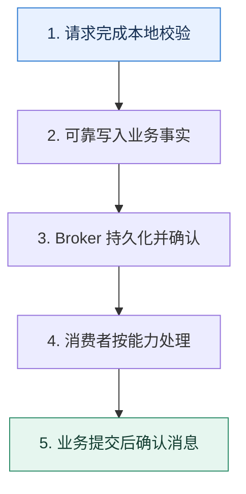

# 消息队列入门｜把生产速度与处理速度解耦

> 本课只回答一个问题：什么时候应该让请求直接调用下游，什么时候应该先写入消息队列？

这是一份独立学习稿。来源资料用于核对知识范围；下面的解释、推演、边界和图示均按工程学习路径重新组织，不依赖原页面也能完整阅读。

## 先补齐：建立正确的心智模型

同步调用让上游同时等待下游的容量、延迟和可用性。消息队列在两者之间保存事实，使生产者先完成自己的提交，消费者按自身速度处理；代价是系统多了消息状态和最终一致窗口。

读这一课时，始终把“组件名字”换成三个可追踪对象：**谁发起动作、状态存在哪里、失败后由谁收敛**。这样遇到不同产品或版本，仍能用同一套模型判断。

## 本节精讲：机制是怎样一步步工作的

队列主要提供三种能力：异步缩短前台等待、削峰把瞬时流量摊平、解耦让多个消费者独立演进。生产者应发送已经发生的业务事实或明确命令，并拿到可解释的确认；消费者处理后再提交消费位置。失败会重试，因此业务不能假定一条消息只出现一次。

下面这张图只表达本课最重要的状态推进，蓝色是入口，绿色是可验收的终点；任一箭头失败，都要回到上文寻找重试、回退或人工处理的位置。

### 一次带数字的完整推演

秒杀入口 10 秒收到 20 万个请求，订单库稳定能力为每秒 8000 次写入。入口先做资格与库存令牌校验，再把 12 万个有效请求写入队列；消费者以每秒 7000 个的安全速率创建订单，约 18 秒处理完。用户看到的是“排队中”状态，而不是让 20 万个连接一起压垮数据库。

数字的作用不是制造精确感，而是暴露容量和时间关系。把例子中的流量、延迟、分片数或版本号替换成自己的真实数据，方案可能会随之改变。

## 误区与失效边界

队列不能增加下游的真实处理能力，只能暂存差速。若平均生产速度长期高于消费速度，积压仍会无限增长。异步也不适合必须立即得到强一致结果的步骤，例如只有扣款成功后才能当场交付的高风险资产。

判断一个结论是否可靠，可以追问两次：**它依赖什么前提？前提失效后系统留下了什么状态？** 如果回答只能停在“框架会自动处理”，就还没有走到工程边界。

## 按讲解顺序重建知识链

来源稿覆盖的论证主线在这里被重建成四步，保留问题、推导、反例和收束，不沿用原页面措辞：

1. 从同步链路的等待和级联故障开始，说明解耦的对象其实是时间。
2. 再用秒杀流量解释异步、削峰和解耦分别解决什么。
3. 沿发送确认、Broker 保存、消费确认追踪一条消息的状态。
4. 最后补上重复、乱序、积压和一致性窗口，避免把队列理解成无成本加速器。

把四步连起来后，本课不是一个孤立结论，而是一条可以复演的因果链。需要回查课程覆盖范围时，可打开文末的来源稿；学习时以本页模型为主。

## 工程验证：把理解变成证据

为一条订单消息记录五个时间：业务提交、发送开始、Broker 确认、消费开始、消费完成。用 `消费完成-业务提交` 衡量端到端延迟，用生产与消费速率差预测积压，而不是只看请求接口变快。

### 状态检查表

| 步骤 | 状态或动作 | 需要留下的证据 |
| ---: | --- | --- |
| 1 | 请求完成本地校验 | 记录耗时、结果与异常分支，确认状态能进入下一步 |
| 2 | 可靠写入业务事实 | 记录耗时、结果与异常分支，确认状态能进入下一步 |
| 3 | Broker 持久化并确认 | 记录耗时、结果与异常分支，确认状态能进入下一步 |
| 4 | 消费者按能力处理 | 记录耗时、结果与异常分支，确认状态能进入下一步 |
| 5 | 业务提交后确认消息 | 记录耗时、结果与异常分支，确认状态能进入下一步 |

检查表不是要求生产系统逐字采用这些字段，而是强迫设计者为每一步提供可观测结果。只有入口、没有终态的流程，最终都会形成无法解释的中间状态。

## 自我检查

接口返回很快，为什么仍不能说明引入消息队列后系统吞吐已经提高？

接口只是把工作转移到了队列。若消费者与下游的稳定吞吐没有提高，工作仍在积压；必须同时观察生产速率、消费速率、积压量和最老消息年龄。

再做一次闭卷练习：不看上文画出状态图，并为其中任意两个箭头注入超时、进程崩溃或重复请求。如果你能预测最终状态和观测信号，这一课才真正从“听懂”变成“会用”。

## 来源与版本校准

- [查看来源稿（22 页资料整理）](../content/22-message-queue.md)

来源稿只用于追溯知识范围，不是本学习稿的正文。具体产品的默认值、命令与内部实现会随版本变化；落地前应使用目标版本官方文档和故障演练再次确认。

本课涉及的产品行为以这些官方资料为校准入口：

- [Apache Kafka · 官方文档](https://kafka.apache.org/documentation/)
- [Apache Kafka · Design](https://kafka.apache.org/25/design/design/)
