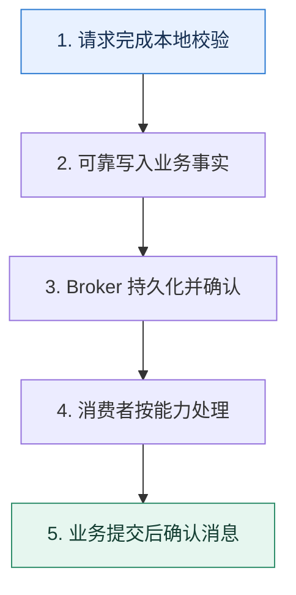

# 消息队列入门｜把生产速度与处理速度解耦

> 本课只解决一个问题：什么时候应该让请求直接调用下游，什么时候应该先写入消息队列？

这不是原页面的缩写，也不是一组孤立结论。下面先建立一个能推演的最小世界，再把状态、数字和失败分支摊开，最后按来源讲解顺序覆盖全部知识线索。读完后，你应当能从 `请求完成本地校验` 一直解释到 `业务提交后确认消息`，并说明中途任意一步失败会留下什么状态。

## 零基础入口：先建立本课的心智画面

同步调用让上游同时等待下游的容量、延迟和可用性。消息队列在两者之间保存事实，使生产者先完成自己的提交，消费者按自身速度处理；代价是系统多了消息状态和最终一致窗口。

先不要急着记组件名。只抓住四个问题：**现在手里有什么输入？下一步只做什么动作？哪个状态发生变化？变化后的结果交给谁？** 之后遇到新框架，只要这四个答案不变，核心机制就没有变。

### 放进一个足够小、可以手算的世界

秒杀入口 10 秒收到 20 万个请求，订单库稳定能力为每秒 8000 次写入。入口先做资格与库存令牌校验，再把 12 万个有效请求写入队列；消费者以每秒 7000 个的安全速率创建订单，约 18 秒处理完。用户看到的是“排队中”状态，而不是让 20 万个连接一起压垮数据库。

这个小世界故意只保留本课必需的对象。生产系统会有更多节点、线程、分片和异常，但数量增加不会改变这里的因果关系。先确认你能手算这个例子，再把数字替换成真实系统数据。

### 先预测，不要马上看结论

**接口返回很快，为什么仍不能说明引入消息队列后系统吞吐已经提高？**

先写下自己的判断，并指出你依赖的前提。文末自我检查会揭示答案；如果答案不同，回到下面的状态表找出第一个分叉点。

## 本节精讲：让机制一步一步发生

队列主要提供三种能力：异步缩短前台等待、削峰把瞬时流量摊平、解耦让多个消费者独立演进。生产者应发送已经发生的业务事实或明确命令，并拿到可解释的确认；消费者处理后再提交消费位置。失败会重试，因此业务不能假定一条消息只出现一次。

### 可见状态推进

| 当前步 | 现在发生的动作 | 下一步拿到什么 |
| ---: | --- | --- |
| 1 | 请求完成本地校验 | 可靠写入业务事实 |
| 2 | 可靠写入业务事实 | Broker 持久化并确认 |
| 3 | Broker 持久化并确认 | 消费者按能力处理 |
| 4 | 消费者按能力处理 | 业务提交后确认消息 |
| 5 | 业务提交后确认消息 | 得到可核对的终态 |

图只承担一个任务：让你看清状态如何向前移动。它不意味着每一步必然成功；网络超时、进程退出、重复执行和数据竞争都可能让箭头停在中间，因此后面必须继续讨论失效边界。

### 一次带数字的完整推演

秒杀入口 10 秒收到 20 万个请求，订单库稳定能力为每秒 8000 次写入。入口先做资格与库存令牌校验，再把 12 万个有效请求写入队列；消费者以每秒 7000 个的安全速率创建订单，约 18 秒处理完。用户看到的是“排队中”状态，而不是让 20 万个连接一起压垮数据库。

数字不是装饰。它迫使我们回答容量、顺序、时间窗口或版本选择问题。若换一个数字就得出不同结论，真正的设计依据就是那个阈值，而不是某个中间件名称。

## 按讲解顺序重建知识链：完整来源讲解

下面按来源资料的教学顺序重新编排完整内容。转换页码、来源图片、推广信息、水印和个人宣传已经删除；原本围绕求职问答的角色与措辞改写为工程学习、方案评审和故障复盘语境。机制、算法、例子、反例、事故线索、评论补充和限制条件仍然保留。这里的作用是补齐知识覆盖，不取代前面的独立推演。

从今天开始我们要学习一个新的主题——消息队列。一直以来，消息队列都是业界用于构建高并发、高可用系统的利器。即便是简单的业务开发，也可以通过消息队列的解耦、异步特性来提高性能和可用性。

消息队列和数据库、缓存并列为技术讨论中最热门的三个中间件。消息队列本身的知识也很多，理论和实践结合紧密，也是技术讨论中的难题。所以在消息队列这个主题下，我会带你学习最热门的技术讨论点，确保你可以在技术讨论中保持竞争优势。今天我们就先来学习第一个技术讨论主题：消息队列的使用场景。

### 先把机制拆开

消息队列最鲜明的特性是异步、削峰、解耦。也有人说这是消息队列的使用场景、用途，并且额外加了几个，比如日志处理和消息通讯。但是实际上，日志处理和消息通讯可以看作是消息

队列的具体落地案例。比如日志处理同时利用了消息队列异步、解耦和削峰的特性。

消息通讯是指即时通讯之类的工具，比如说你使用的微信、QQ 都是通讯工具。通讯工具主要利用的是异步和解耦特性，不过要是你觉得你的通讯工具会有高并发的收发消息场景，也可以看作是削峰。

基本上一切消息队列的应用场景，都是围绕异步、解耦和削峰三个特性来设计的。反过来也可以说，如果你有一些需要异步、解耦和削峰的需求，那么消息队列就是最合适的工具。

此外消息队列还可以用来实现事件驱动架构，这个也是你后面要学习的进阶推导方案。

### 把知识转成可验证的工程判断

在准备消息队列技术讨论的时候，你需要搞清楚下面几点。

你们公司有没有使用消息队列？主要用于解决什么场景的问题？如果使用了消息队列，那么在具体的场景下不使用消息队列是否可行？和使用消息队列的方案比起来，有什么优缺点？你们公司用的是什么消息队列，它有什么优缺点？

在前置知识里面我提到了消息队列的三种特性：异步、解耦和削峰。你可以在公司内部，或者自己的过往工作经验里面各找一个案例。虽然我提到过，一个案例可能同时体现了异步、解耦和削峰三个特性，但是你还是需要多准备几个案例，准备得更充分一些。

技术评审者如果问到了下面这些问题，你都可以直接用这节课的内容解释，或者引导到这里。

你有没有用过消息队列？用来解决什么问题？你是否听过延时队列？怎么实现延时队列？如何设计一个秒杀架构？在解释的时候可以强调一下消息队列的作用。什么是事件驱动架构？

我建议你有机会的话，在遇到一些非常复杂棘手的业务时可以考虑使用事件驱动来解决。我个人认为越复杂的业务系统，应用事件驱动就越有价值。

### 基本思路

首先在简历上你就应该写上自己擅长消息队列或者说自己能够用消息队列解决问题。后续技术评审者在提问的时候就会考虑面消息队列这方面的内容。技术评审者可能会先问你用消息队列解决过什么问题，那么你解释你准备的案例就可以。

在介绍了案例之后，技术评审者大概率会问一个问题，就是在具体的场景下，你为什么非得使用消息队列？

在前置知识里面我已经解释了两个场景：日志处理和消息通讯。我这里再补充几个。这些场景都是那种引导性非常强的场景，也就是说，你可以在这些场景下把话题引导到别的主题下。

### 秒杀场景

秒杀也是技术讨论中的一个大热点。一般秒杀的架构设计中都会使用消息队列，同时利用消息队列三个特性。

你可以看一下一个比较简单的秒杀架构图是怎样的。

在消息队列之前，要对用户请求做一些校验，比如说这个用户是否已经参加过秒杀了。其次要扣库存，扣库存成功才算是抢到了。紧接着就是把这个请求丢到消息队列里，后续异步创建订单，并且完成支付。

那么这种设计的精髓就是利用消息队列把整个秒杀过程分成轻重两个部分。

在进入消息队列之前的操作都是轻量级的，一般也就是内存计算或者访问一些 Redis，所以你可以认为瓶颈基本上取决于 Redis 的性能。

而进入消息队列之后就是非常重量级的操作了，比如说要进一步验证交易的合法性，操作数据库等。

所以你可以这样介绍秒杀方案，关键词是轻重之分。

消息队列还经常被用在秒杀场景里面。最基本的架构是秒杀请求进来之后，会有一个轻量级的服务。这个服务就是做一些限流、请求校验和库存扣减的事情。这些事情差不多都是内存操作，最多操作 Redis。当库存扣减成功之后，就会把秒杀请求丢到一个消息队列。

然后订单服务会从消息队列里面将请求拿出来，真正创建订单，并且提示用户支付。这一部分就是重量级的操作，无法支撑大规模并发。所以，在这个场景里面可以把消息队列看作是一个轻重操作的分界线。

这个场景介绍完，技术评审者就可能会进一步问你和秒杀有关的内容，比如说扣减了库存之后，万一用户没有支付怎么办，于是你就可以用下面这个案例了。

### 订单超时取消

在电商里面，如果用户下单之后一直没有支付，那么这个订单就会被取消，从而释放库存。

订单超时取消在行业内有很多种做法，这里我只介绍使用消息队列的解决方案。要想利用消息队列实现订单超时取消功能，需要使用延时消息。所谓的延时消息，就是发送者在发送之后，要过一段时间，消费者才能消费的消息。

你可以这样介绍你的方案。

消息队列也可以用于订单超时取消这种场景。在这种场景下，我们可以准备一个延时队列，比如说超时时间是 30 分钟，那么延时也是 30 分钟。

但是消费的时候要小心并发问题，就是在 30 分钟这一个时刻，一边用户支付，一边消费者也消费超时消息，就会有并发问题。解决思路有很多，可以使用分布式锁、乐观锁，也可以使用 SELECT FOR UPDATE 锁住订单，防止并发操作。

这里我提到了并发问题，在解决并发问题的思路中我也提到了之前数据库部分我们学过的SELECT FOR UPDATE 和乐观锁，记得复习一下。

这里我再额外解释一下乐观锁方案的关键步骤。乐观锁方案就是在你把订单更新为超时状态的时候，需要确保原始状态还是未支付。

复制代码1 UPDATE `order` SET `status`="超时未支付"2 WHERE `id`=123 AND `status`="未支付"

类似地，在支付那边也需要确保只有在 status 是未支付的时候才能发起支付。

这个场景主要是把话题引导到延时消息，延时消息我们后面会详细分析。目前主流的消息队列中 RocketMQ 是支持延时消息的，它有插件支持。但是 Kafka 不支持，不过后续我也会教你怎么用 Kafka 支持延时消息。所以当技术评审者问你“为什么不用 Kafka”这种问题，你可以把Kafka 不支持延时消息作为理由之一。

### 进一步推导：怎样把机制用进真实系统

这节课我给你准备了一个理论上的进阶推导和一个高级并且复杂的方案。第一个进阶推导是解释为什么一定要使用消息队列。前面我给你讲过消息队列广泛应用于各种场景，那么你有没有深入思考过，为什么你非得使用消息队列呢？

换一句话来说，不用消息队列会怎样？用了又有什么好处呢？

### 为什么一定要使用消息队列？

这个问题本身也是反直觉的。也就是说因为业界一直说消息队列很好很好，那么如果你没有思考过这个问题，技术评审者突如其来问一下，你就不知道怎么解释了。

我们先从创建订单的典型场景看起。在订单创建之后，要通知很多下游，正常做法都是发送一个订单创建的消息，然后关心订单创建的业务方各自去订阅这个消息就可以了。

这里技术评审者就会问，为什么订单服务不直接调用各个业务方呢？

类似的场景还有，在消息通讯里面为什么服务端不直接把消息转发给各个接收者呢？

这一类的问题，本质上都是在问：在这个业务场景下，不异步、不解耦或者不削峰会有什么问题？

那么不用消息队列究竟有什么问题呢？答案是性能差、扩展性差、可用性差。

这里有一个不太好的解释，就是耦合严重。这个解释只能说你答了，但是解释得不到位。毕竟你没有解耦自然就是耦合严重，所以技术评审者希望你深入解释的是耦合严重会带来什么后果。你其实可以这么说：

同步调用方案相比引入消息队列有三个缺陷，分别是性能差、可扩展性差和可用性差。

性能差

性能差是因为你需要停下来等全部调用完成才可以返回响应。

业务方必须停下来等待结果，如果我这里需要通知三个下游，那么就需要发起三次调用，并且等它们各自的结果返回之后才能继续往下执行，或者返回响应，这样性能太差了。

紧接着技术评审者就可能和你抬扛：“如果我并发调用呢？性能也很好啊！”他隐含的意思就是你可以开启多个线程或者协程，并发调用所有的下游。

但是，即便是并发调用性能也比使用消息队列差。

并发调用相比于使用消息队列，性能也更差。在并发调用的情况下，性能取决于最坏的那个同步调用什么时候返回结果。而正常我们丢一个消息到消息中间件上是很快的。

紧接着你可以补充一点，引出扩展性和可用性的话题。

并且，即便并发调用的性能损耗是可以接受的，但是扩展性和可用性还是解决不了。

扩展性

扩展性归根结底就是一句话：如果一个新的下游要接入进来有多难？在使用消息队列的时候，新的下游要接入，只需要自己去订阅消息就可以，完全不需要通知任何人。在公司里，可能就是你丢给下游一个文档，下游自己看看文档，知道订阅哪个 topic，消息生产速率有多高，差不多就能自己独立完成接入了。

但是如果是同步调用，事情就麻烦很多。你需要下游提供 RPC 服务地址（定位信息），根据下游的 API 设计构造请求、处理响应，再一起联调、测试、上线，遇到了 Bug 还得推诿扯皮一番。

所以这里你可以这样解释。

在使用消息队列的情况下，消息发送者完全不关心谁会去消费这些消息。同样地，如果有一个新的业务方要订阅这个消息，它可以自主完成。而同步调用的时候，上游必须知道下游的接口，然后要知道如何构造请求、如何解析响应，还要联调、测试、上线，整个过程都得和下游密切合作，因此效率特别低，可扩展性很差。

但是这里你可以刷一个进阶推导，就是在类似的场景下，如果因为一些业务情况确实不能使用消息队列，那么可以考虑提供一个一致性的抽象来减轻这种接入的负担。

如果在某些场景下确实不能用消息队列，那么这个扩展性问题可以通过一些技术手段来缓解。比如说上游提供一整套的对接规范，包括 API 定义、请求和响应中每个字段的含义。这样下游就对着这个 API 定义来提供实现，上游就不需要适配每一个下游了。

然后你进一步总结。

这是对接众多下游的基本设计，可以充分保障高可扩展性和高研发效率。

可用性

在使用消息队列的方案中，你只需要确保自己把消息发送到了消息队列上，就认为操作已经成功了。

但是，在同步调用方案中，你必须要确保调用所有的下游都成功了才算是成功了。所以你还需要额外考虑部分成功部分失败的问题。

比如说在订单的例子里面，如果同步调用到推荐成功，但是到审计和搜索失败了，那么该怎么办？

所以这样来看，相比使用消息队列的方案，同步调用的方案更加容易出错，并且容错也更难。

### 事件驱动

事件驱动（Event-Driven）可以说是一种软件开发模式，也可以看作是一种架构。它的核心思想是通过把系统看作一系列事件的处理过程，来实现对系统的优化和重构。

你可以直观地理解成，整个系统不同组件之间的通信是通过事件来完成的。也就是组件 1 发送一个事件到消息队列上，然后组件 2 消费这个消息。组件 2 消费完成后再发出一个消息到消息队列。每一个事件就是一个消息。

这些消息可能有不同的 Topic，也可能发送到不同的消息队列集群。但是毫无疑问它们要通过密切合作来解决一个业务问题。

它的优点十分明显。

低耦合性：各个组件只依赖消息队列，组件之间通过消息的定义间接地耦合在一起。换句话来说，组件只需要知道消息的定义，并不需要知道发送消息的组件是哪个。可扩展性：事件驱动的应用程序具有很强的扩展性，可以通过添加新的事件处理程序、组件等来实现系统的扩展和升级。高可用：可以充分利用消息队列的可靠性、可重复消费等特性，来保证消息发送、消费高可用，从而保证整个系统的高可用。

事件驱动适合用来解决一些复杂、步骤繁多、流程冗长的业务问题。在下面的进阶推导方案里面，我用的就是事件驱动结合 SAGA 分布式事务的方案。这个方案足够高级、冷僻、奇异。它原本用在一个大规模的分布式系统里面，是一个高性能和高可用的分布式事务解决方案。

你可以看一下事件驱动和 SAGA 结合之后的形态。

也就是说，当某一个步骤完成之后，就会发出一个或者多个事件，驱动事务中的后续步骤。包括回滚也是这样，比如说发出一个代表某一个步骤执行失败的事件，对应的消费者就会去执行反向补偿步骤。

使用事件驱动的优点是低耦合、高扩展性、异步、高可用。不过在实时性上要比同步调用差一点。我用一个最简单的例子给你解释清楚它的运作。比如说你有一个分布式事务，就是要求先更新 DB，再更新缓存。那么在缓存更新失败的场景下，过程看起来就像图里展示的这样。

其中还原 DB 是指你需要用原始数据更新回去，而不是数据库回滚操作，我之前在 SAGA 分布式事务里面就讲过的。当然，这个例子只是帮助你理解，正常来说这么简单的分布式事务是用不着 SAGA 的。

你可以考虑这样介绍这个方案。

之前某个线上系统用事件驱动实现了 SAGA 的分布式事务解决方案。基于事件驱动的 SAGA 模式就是在每一个步骤结束之后发送事件，不同的步骤会发送一个或者多个事件。然后消费者消费了消息之后，就开始执行下一个步骤。比如说在更新 DB 再更新缓存的场景里就可以这样用。这种形态和一般的事务比起来，优势是低耦合、高扩展、高可用。

在这个方案里面，技术评审者可能追问的方向有两个，一个是分布式事务，这个你第 18 讲已经学过了。另外一个方向是课程后面会讨论的问题，就是怎么做到消息的可靠发送和可靠消费。

### 本节原始知识线索收束

今天这节课的内容还是比较简单的，主要介绍了消息队列的三个用途：解耦、异步、削峰，还有几个使用消息队列的场景，包括日志处理、消息通讯、秒杀场景和订单超时取消。我希望你能够从这些场景里面领悟到消息队列适合解决什么样的问题。

最后在技术讨论的进阶推导部分，我给出了一个基于事件驱动的 SAGA 分布式事务方案。事件驱动是一个解决复杂业务问题的神器，你有机会的话尽可能实践一下，之后有很大可能会用到。

### 继续推演

最后请你来思考 2 个问题。

除了我这里列举的消息队列使用场景，你还见过哪些很有特点的使用消息队列的场景？技术讨论中还有一个比较经典的问题，就是你为什么用 Kafka、RabbitMQ 或 RocketMQ，又或者说你为什么使用某一个中间件，这种问题该怎么解释呢？

### 补充讨论与边界校准

补充讨论：

技术讨论中还有一个比较经典的问题，就是你为什么用 Kafka、RabbitMQ 或 RocketMQ，又或者说你为什么使用某一个中间件，这种问题该怎么解释呢？答：

1. 先大致描述一下各种中间件的优点和缺点，这些基本都是随便搜搜就知道了。
2. 然后结合项目中的业务场景特点，说出自己的看法，比如这个中间件用在自己的业务里面会有什么益处，会有什么弊端等等。
3. 告诉技术评审者，自己在技术选型的时候，写了一些demo，在测试环境跑了下，结果如何如何，最后敲定了其中一个。之后，经过技术评审，大家认可了自己的看法，一致通过。
4. 选好中间件之后，选择一个业务组进行接入，通过充分测试之后，开始上线试运行，结果大致良好。只是中间出了一些小问题，由此可以引出一些你自己对这个中间件的常见问题的解

决思路。比如消息丢失是怎么解决的？消息积压是怎么解决的。

5. 最后收尾的时候，如果可能的话，可以升华一下，自己对这个中间件的高维度认知。比如虽然你只是在这个公司用了消息队列来解决削峰解耦的事情，但是其实消息队列还可以用在很多地方。比如本文中提到的分布式事务。
讲解补充：6666，你是懂技术讨论的！

补充讨论：

讲解补充：协程你终究还是堵在了这台机器上，如果并发高的话，你这里协程就很有问题。

另外一个就是，引入消息队列，你的性能瓶颈就是消息队列的瓶颈，数十万上百万的 QPS 都没问题。但是你一台机器是开不出来数十万上百万的协程的。

补充讨论： 和 创建保存订单这两个操作是位于不同的服务的，那么就涉及到了分布式事务的问题，大体思路是当缓存库存扣减完成之后，就发送事务消息到Broker，这个事务消息执行的业务就是创建并保存订单，事务消息发送成功之后就会执行本地事务，本地事务对应的业务操作就是扣减数据库库存，当本地事务执行完之后，如果成功就COMMIT，否则就ROLLBACK，让Broker真正投递事务消息，订单服务那边创建并保存订单。如果在创建并保存订单的过程中出了问题，那么就需要利用RocketMQ发送一条普通消息到商品服务，商品服务这边要做两个事情：一个是还原缓存库存，一个是还原数据库库存。这样就保证了最终一致性。需要注意的问题：

1. 需要保证扣减商品库存、还原商品库存、创建并保存订单的幂等性
2. 如果订单创建并保存失败后服务就挂了，导致还原库存的消息没发出去，怎么办，针对这种情况可以设计一个异步检测的服务，使用一个下单业务记录表来记录下库存扣减和创建订单

的业务，然后使用这个异步检测服务去定时扫描检查，但凡出现某个业务扣减过库存但是没创建保存过订单，那就将缓存库存和数据库库存还原回来，并记录下这个异常情况，方便后期核查！

讲解补充：可以的，赞！

补充讨论：

讲解补充：创建订单的时候再发一个超时未支付的消息就行。

补充讨论：

1. 使用消息队列来进行削峰，比如某项目就用kafka来缓解往ES插入数据的压力
2. 组内好像没有使用到消息队列，但是了解其他部门有使用，主要是在第三方业务服使用公用ES时候，使用kafka来缓解ES的压力吧，而且kafka的吞吐量会比其他消息队列好很多
讲解补充：对！所以你可以考虑刷个 KPI。

补充讨论：

“订单服务会从消息队列里面将请求拿出来，真正创建订单，并且提示用户支付”。

讲解补充：可以通过回调，也可以再次借助消息队列。我猜测你是指前端怎么知道的吧？这个可以用websocket，而 APP 之类的也可以考虑用 gRPC。

补充讨论： 与 kafka 会选择哪一个？

讲解补充：我一般都是无脑选 Kafka，万一同事喷我，我也可以说我做的是最保守的选择。

补充讨论：

讲解补充：直接用 Redis 来扣减内存的话，不需要分布式锁。

补充讨论：

讲解补充：我认为无脑选 Kafka，哈哈哈哈。就这么说，就是虽然别的 MQ 有一些很方便的功能，但是总的来说并不构成强有力的选型理由。而 Kafka 社区支持，文档都非常成熟。

即便是从混职场的角度来说，选 Kafka 肯定没人敢说你选得不对。

就我个人来说，我其实觉得性能并不是决定性的选型因素，虽然重要，但是也没特别重要。

补充讨论：

讲解补充：我没看懂，啥叫做用户大数据的消息队列？

## 把完整讲解收束成一条因果链

1. 从同步链路的等待和级联故障开始，说明解耦的对象其实是时间。
2. 再用秒杀流量解释异步、削峰和解耦分别解决什么。
3. 沿发送确认、Broker 保存、消费确认追踪一条消息的状态。
4. 最后补上重复、乱序、积压和一致性窗口，避免把队列理解成无成本加速器。

把这几步连接起来时，不要省略“为什么”。最终结论只有在前提、状态变化和失败代价都说得清楚时才可靠。

## 误区与失效边界

队列不能增加下游的真实处理能力，只能暂存差速。若平均生产速度长期高于消费速度，积压仍会无限增长。异步也不适合必须立即得到强一致结果的步骤，例如只有扣款成功后才能当场交付的高风险资产。

再加一条通用但必须落实到本课对象上的边界：机制只能处理它看得见的信号。若输入指标失真、状态没有持久化、错误被吞掉，或者补偿没有幂等保护，再成熟的框架也只能基于错误证据作决定。

### 三种故障注入方式

| 故障 | 要观察什么 | 不能接受的解释 |
| --- | --- | --- |
| 在第 2 步前让依赖超时 | 是否停在可重试状态，是否消耗完上游预算 | “框架稍后会处理” |
| 在状态写入后让进程退出 | 重启后能否识别已完成与待继续动作 | “再执行一次应该没事” |
| 对同一输入并发执行两次 | 是否出现重复副作用、顺序颠倒或覆盖 | “概率很低” |

## 工程验证：把理解变成可以复查的证据

为一条订单消息记录五个时间：业务提交、发送开始、Broker 确认、消费开始、消费完成。用 `消费完成-业务提交` 衡量端到端延迟，用生产与消费速率差预测积压，而不是只看请求接口变快。

| 步骤 | 状态或动作 | 最少应留下的证据 |
| ---: | --- | --- |
| 1 | 请求完成本地校验 | 开始时间、结束时间、输入标识、结果状态、异常原因 |
| 2 | 可靠写入业务事实 | 开始时间、结束时间、输入标识、结果状态、异常原因 |
| 3 | Broker 持久化并确认 | 开始时间、结束时间、输入标识、结果状态、异常原因 |
| 4 | 消费者按能力处理 | 开始时间、结束时间、输入标识、结果状态、异常原因 |
| 5 | 业务提交后确认消息 | 开始时间、结束时间、输入标识、结果状态、异常原因 |

验证时同时记录成功路径和失败路径。只证明“正常时能跑通”不能说明设计可靠；至少要让一次超时、一次进程退出和一次重复请求可重现，并能根据日志或指标解释最后状态。

## 学完检查：闭卷画出本课

你现在应该能独立完成四件事：

1. 用自己的话说出本课唯一问题，不使用产品名也能解释。
2. 复算上面的具体例子，并指出哪个输入改变会让结论改变。
3. 沿 Mermaid 图注入一次失败，预测系统停在哪里以及由谁收敛。
4. 说出本课机制不保证什么，并给出一个反例。

## 自我检查

接口返回很快，为什么仍不能说明引入消息队列后系统吞吐已经提高？

接口只是把工作转移到了队列。若消费者与下游的稳定吞吐没有提高，工作仍在积压；必须同时观察生产速率、消费速率、积压量和最老消息年龄。

怎样证明自己不是只记住了名词？

把 `请求完成本地校验` 的一个真实输入写出来，逐步记录到 `业务提交后确认消息`。然后在中间任意一步制造失败；如果你能解释当前状态、下一责任方、可观测证据和恢复边界，就已经拥有可以迁移的工程模型。

## 来源与事实校准

- [查看完整来源稿（本地 22 页资料）](../content/22-message-queue.md)

### 当前事实校准

消息队列能解耦生产与消费时间，但不能自动保证业务成功。生产确认、Broker 耐久、消费处理、offset 提交和下游副作用是不同边界；必须按业务选择至多一次、至少一次或受限范围的精确一次处理。

- [Apache Kafka · Documentation](https://kafka.apache.org/documentation/)
- [Apache Kafka · Design](https://kafka.apache.org/25/design/design/)

来源稿用于核对覆盖范围，不随公开站点发布。产品默认值和具体内部行为可能随版本变化；落地时应使用目标版本的官方文档、可运行实验和故障演练校准。本学习稿中的零基础入口、状态推演、故障矩阵和工程验证属于编辑补充，不冒充来源讲解者的原话。
