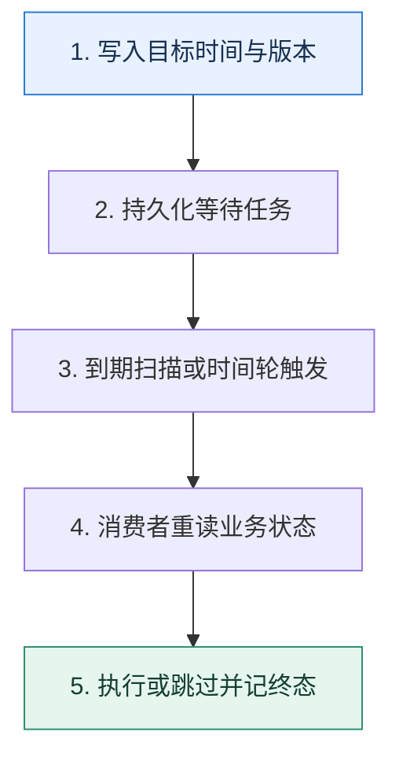

# 延迟任务｜让消息在正确的时间变得可消费

> 本课只回答一个问题：订单 30 分钟未支付自动关闭，怎样做到可恢复、可取消且不会被重复执行？

这是一份独立学习稿。来源资料用于核对知识范围；下面的解释、推演、边界和图示均按工程学习路径重新组织，不依赖原页面也能完整阅读。

## 先补齐：建立正确的心智模型

普通队列表达的是先后顺序，不一定支持任意消息的独立到期时间。延迟任务需要同时保存业务键、目标时间、版本和当前状态；调度器只负责在到期时触发，最终动作仍要回到业务状态机校验。

读这一课时，始终把“组件名字”换成三个可追踪对象：**谁发起动作、状态存在哪里、失败后由谁收敛**。这样遇到不同产品或版本，仍能用同一套模型判断。

## 本节精讲：机制是怎样一步步工作的

可用方案包括：支持延迟能力的专用队列；按延迟档位建立多个主题；数据库时间索引加扫描器；时间轮或有序集合加迁移队列。Kafka 的核心是分区追加日志，不应假定它原生提供任意精度的单消息延迟；常见做法是延迟主题分桶或独立调度服务。无论哪种方案，取消通常不是删除消息，而是到期时检查订单版本和状态后忽略失效任务。

下面这张图只表达本课最重要的状态推进，蓝色是入口，绿色是可验收的终点；任一箭头失败，都要回到上文寻找重试、回退或人工处理的位置。

### 一次带数字的完整推演

订单 O42 在 10:00 创建，目标执行时间 10:30，版本为 3。调度表保存 `(O42, 10:30, 3, WAITING)`；扫描器在 10:30 抢占任务并发出关闭命令。若订单 10:12 已支付并变为版本 4，消费者发现版本不匹配，记录 `SKIPPED` 而不关单。扫描器崩溃后租约到期，另一实例可以重试。

数字的作用不是制造精确感，而是暴露容量和时间关系。把例子中的流量、延迟、分片数或版本号替换成自己的真实数据，方案可能会随之改变。

## 误区与失效边界

到期时间精确到秒不等于一定在该秒完成；积压和下游故障都会带来执行延迟。只把定时任务放进进程内存会在重启时丢失；只依赖删除消息实现取消，也很难覆盖消息已经被投递或复制的情况。

判断一个结论是否可靠，可以追问两次：**它依赖什么前提？前提失效后系统留下了什么状态？** 如果回答只能停在“框架会自动处理”，就还没有走到工程边界。

## 按讲解顺序重建知识链

来源稿覆盖的论证主线在这里被重建成四步，保留问题、推导、反例和收束，不沿用原页面措辞：

1. 先区分投递延迟与业务执行时刻，不把定时器等同于最终动作。
2. 比较延迟主题、数据库扫描、时间轮和专用队列的精度与恢复能力。
3. 用订单版本解释支付后怎样让旧关闭任务自然失效。
4. 最后设计抢占租约、重复触发、积压告警和人工补偿。

把四步连起来后，本课不是一个孤立结论，而是一条可以复演的因果链。需要回查课程覆盖范围时，可打开文末的来源稿；学习时以本页模型为主。

## 工程验证：把理解变成证据

建立延迟误差直方图：`实际开始时间-目标时间`。同时统计 WAITING、RUNNING、DONE、SKIPPED、RETRY 各状态数量，以及最老到期未执行任务，才能区分正常抖动和调度停摆。

### 状态检查表

| 步骤 | 状态或动作 | 需要留下的证据 |
| ---: | --- | --- |
| 1 | 写入目标时间与版本 | 记录耗时、结果与异常分支，确认状态能进入下一步 |
| 2 | 持久化等待任务 | 记录耗时、结果与异常分支，确认状态能进入下一步 |
| 3 | 到期扫描或时间轮触发 | 记录耗时、结果与异常分支，确认状态能进入下一步 |
| 4 | 消费者重读业务状态 | 记录耗时、结果与异常分支，确认状态能进入下一步 |
| 5 | 执行或跳过并记终态 | 记录耗时、结果与异常分支，确认状态能进入下一步 |

检查表不是要求生产系统逐字采用这些字段，而是强迫设计者为每一步提供可观测结果。只有入口、没有终态的流程，最终都会形成无法解释的中间状态。

## 自我检查

为什么支付成功后不一定要从队列中物理删除那条关单消息？

删除可能竞争失败，也可能消息已在途。让任务携带订单版本，到期后重读业务状态并幂等地跳过，通常比依赖精确删除更可靠。

再做一次闭卷练习：不看上文画出状态图，并为其中任意两个箭头注入超时、进程崩溃或重复请求。如果你能预测最终状态和观测信号，这一课才真正从“听懂”变成“会用”。

## 来源与版本校准

- [查看来源稿（20 页资料整理）](../content/23-delayed-messages.md)

来源稿只用于追溯知识范围，不是本学习稿的正文。具体产品的默认值、命令与内部实现会随版本变化；落地前应使用目标版本官方文档和故障演练再次确认。

本课涉及的产品行为以这些官方资料为校准入口：

- [Apache Kafka · 官方文档](https://kafka.apache.org/documentation/)
- [Apache Kafka · Design](https://kafka.apache.org/25/design/design/)
