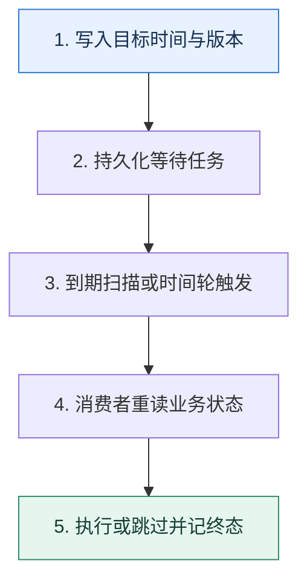

# 延迟任务｜让消息在正确的时间变得可消费

> 本课只解决一个问题：订单 30 分钟未支付自动关闭，怎样做到可恢复、可取消且不会被重复执行？

这不是原页面的缩写，也不是一组孤立结论。下面先建立一个能推演的最小世界，再把状态、数字和失败分支摊开，最后按来源讲解顺序覆盖全部知识线索。读完后，你应当能从 `写入目标时间与版本` 一直解释到 `执行或跳过并记终态`，并说明中途任意一步失败会留下什么状态。

## 零基础入口：先建立本课的心智画面

普通队列表达的是先后顺序，不一定支持任意消息的独立到期时间。延迟任务需要同时保存业务键、目标时间、版本和当前状态；调度器只负责在到期时触发，最终动作仍要回到业务状态机校验。

先不要急着记组件名。只抓住四个问题：**现在手里有什么输入？下一步只做什么动作？哪个状态发生变化？变化后的结果交给谁？** 之后遇到新框架，只要这四个答案不变，核心机制就没有变。

### 放进一个足够小、可以手算的世界

订单 O42 在 10:00 创建，目标执行时间 10:30，版本为 3。调度表保存 `(O42, 10:30, 3, WAITING)`；扫描器在 10:30 抢占任务并发出关闭命令。若订单 10:12 已支付并变为版本 4，消费者发现版本不匹配，记录 `SKIPPED` 而不关单。扫描器崩溃后租约到期，另一实例可以重试。

这个小世界故意只保留本课必需的对象。生产系统会有更多节点、线程、分片和异常，但数量增加不会改变这里的因果关系。先确认你能手算这个例子，再把数字替换成真实系统数据。

### 先预测，不要马上看结论

**为什么支付成功后不一定要从队列中物理删除那条关单消息？**

先写下自己的判断，并指出你依赖的前提。文末自我检查会揭示答案；如果答案不同，回到下面的状态表找出第一个分叉点。

## 本节精讲：让机制一步一步发生

可用方案包括：支持延迟能力的专用队列；按延迟档位建立多个主题；数据库时间索引加扫描器；时间轮或有序集合加迁移队列。Kafka 的核心是分区追加日志，不应假定它原生提供任意精度的单消息延迟；常见做法是延迟主题分桶或独立调度服务。无论哪种方案，取消通常不是删除消息，而是到期时检查订单版本和状态后忽略失效任务。

### 可见状态推进

| 当前步 | 现在发生的动作 | 下一步拿到什么 |
| ---: | --- | --- |
| 1 | 写入目标时间与版本 | 持久化等待任务 |
| 2 | 持久化等待任务 | 到期扫描或时间轮触发 |
| 3 | 到期扫描或时间轮触发 | 消费者重读业务状态 |
| 4 | 消费者重读业务状态 | 执行或跳过并记终态 |
| 5 | 执行或跳过并记终态 | 得到可核对的终态 |

图只承担一个任务：让你看清状态如何向前移动。它不意味着每一步必然成功；网络超时、进程退出、重复执行和数据竞争都可能让箭头停在中间，因此后面必须继续讨论失效边界。

### 一次带数字的完整推演

订单 O42 在 10:00 创建，目标执行时间 10:30，版本为 3。调度表保存 `(O42, 10:30, 3, WAITING)`；扫描器在 10:30 抢占任务并发出关闭命令。若订单 10:12 已支付并变为版本 4，消费者发现版本不匹配，记录 `SKIPPED` 而不关单。扫描器崩溃后租约到期，另一实例可以重试。

数字不是装饰。它迫使我们回答容量、顺序、时间窗口或版本选择问题。若换一个数字就得出不同结论，真正的设计依据就是那个阈值，而不是某个中间件名称。

## 按讲解顺序重建知识链：完整来源讲解

下面按来源资料的教学顺序重新编排完整内容。转换页码、来源图片、推广信息、水印和个人宣传已经删除；原本围绕求职问答的角色与措辞改写为工程学习、方案评审和故障复盘语境。机制、算法、例子、反例、事故线索、评论补充和限制条件仍然保留。这里的作用是补齐知识覆盖，不取代前面的独立推演。

今天我们来讨论一个在消息队列技术讨论中非常热的话题——延迟消息。

延迟消息在 Kafka 技术讨论里面是非常热门的，其他消息队列多少也会问，但是不如 Kafka 问得频繁。因为 Kafka 不支持延迟消息是大家都知道的。但是偏偏 Kafka 又用得多，很多业务场景也要求使用延迟消息，因此技术讨论的时候延迟消息就成了一个重要的考察点。

和之前的技术讨论点不同，能把延迟消息的方案讲得清楚透彻的人就不多，更不要说刷进阶推导了。那么今天我就带你深入延迟消息，并且给出一个非常高级的方案。这个方案会涉及到分库分表，所以能帮助你把这些知识融会贯通。

### 延迟队列和延迟消息

延迟队列是一种特殊的队列。它里面的每个元素都有一个过期时间，当元素还没到过期时间的时候，如果你试图从队列里面获取一个元素，你会被阻塞。当有元素过期的时候，你就会拿到这个过期的元素。你可以这样想，你拿到的永远是最先过期的那个元素。

很多语言本身就提供了延迟队列的实现，比如说在 Java 里面的 DelayQueue。

这节课我们讨论的就是一种特殊形态的延迟队列，或者说是基于消息队列的延迟队列，也叫做延迟消息。具体来说，延迟消息是指消息不是立刻被消费的，而是在经过一段时间之后，才会被消费。在到时间之前，这个消息一直都被存储在消息队列的服务器上。上一节课，我就举了订单超时取消的例子，它就用到了延迟消息。

### 支持延迟消息的其他消息队列

目前，大部分云厂商版本的消息队列都支持了延迟消息，不过我们这里讨论的是原生支持的消息队列。如果你本身使用了今天我们介绍的这些中间件，那么你可以直接使用这些内容来技术讨论。如果你使用的是 Kafka，那么你在工程复盘时要注意结合着这些消息队列，对比着技术讨论。

RabbitMQ 有插件支持延迟消息功能，而 RocketMQ 和 Kafka 则只能自己研发。

### RabbitMQ

RabbitMQ 有一个延迟消息的插件 rabbitmq_delayed_message_exchange，只需要启用这个插件就可以使用延迟消息。这个插件的基本原理也比较简单，就是实现了一个 exchange。这个 exchange 控制住了消息什么时候会被真的投递到队列里。

如上图所示，消息会先暂时存储在 exchange 里面。它使用的是 Mnesia 来存储，如果你不知道 Mnesia 是什么，就直观地把它看作一个基于文件的数据库。

当延迟的时间满足条件之后，这些存储的数据就会被投递到真正的消息队列里面。紧接着消费者就可以消费到这个消息了。你可以从这里得到一个启发，就是如果要实现一个延迟队列，是可以借助数据库的。

那么这个插件本身也是有很多限制的，在它的官网主页里面就有说明，其中有两个最突出的限制。

消息在真的被投递到目标消息队列之前，是存放在接收到了这个消息的服务端本地的Mnesia 里面。也就是说，如果这个时候还没有刷新磁盘，那么消息就会丢失；如果这个节点不可用了，那么消息也同样会丢失。不支持高并发、大数据量。显然，现实中很多场景都是要在高并发大数据量场景下使用延迟消息的，比如说前面说的订单超时取消。因此这个缺点也限制了这个插件被广泛使用。

除了这个插件，开发者也可以自己手动实现延迟消息。这就要利用到 RabbitMQ 的 ttl 功能和所谓的死信队列了。

死信队列是一种逻辑上的概念，也就是说它本身只是一个普通的队列。而死信的意思是指过期的无法被消费的消息，这些消息会被投送到这个死信队列。

简单来说，就是开发者准备一个队列 delay_queue，为这个 delay_queue 设置过期时间，这个 delay_queue 不需要消费者。然后把你真实的业务 biz_queue 绑定到这个delay_queue，作为它的死信队列。

生产者发送消息到 delay_queue，因为没有消费者，所以消息会过期。过期之后的消息被转发到死信队列，也就是 biz_queue 里面。这时候消费者就能拿到消息了。

这种方案并没有插件的那两个缺点。但是 ttl 的设置是在队列级别上，也就是你一个delay_queue 的延时是固定的，不能做到随机。比如说我这一条消息延后三分钟，另外一条消息延后五分钟，这是不可能的。因此，你可能需要创建很多不同 ttl 的 delay_queue 才能满足业务需要。

### 把知识转成可验证的工程判断

在准备延迟消息技术讨论的时候，你需要先弄清楚公司内部的一些情况。

你所在公司有没有使用延迟消息的场景？你所在公司的消息中间件支不支持延迟消息？延迟消息的 QPS 有多高，消息量有多大？延迟时间有多长？

然后，在技术讨论中聊到下面这些话题的时候，你可以尝试把话题引导到这里。

如果你介绍你的业务的时候，提到了需要延迟消息的场景，就像我举的订单超时取消的例子，那么你就可以深入讨论延迟消息是怎么实现的。

如果你聊到了 Kafka，在介绍它的优缺点的时候，你说一说它的缺点，就是不支持延迟队列，那么技术评审者就会问你如果要 Kafka 支持延迟队列应该怎么做。如果你聊到了你们公司使用的消息队列，但并不是 Kafka，那么你同样可以尝试引导到这里，比如说强调当初你们 MQ 技术选型的时候，考虑到 Kafka 不支持延迟消息，所以最终没有选择 Kafka。

### 基础思路

这里我给出了很多比较简单的方案，你可以从这些方案里选择一个作为公司的方案，其他方案你就作为自己了解但是没有实践过的方案。

### 利用定时任务调度

利用定时任务来实现延迟消息是最好、最简单的办法。对于一个延迟消息来说，一个延迟到30 分钟后才可以被消费的消息，也可以认为是 30 分钟后才可以发送。也就是说，你可以设定一个定时任务，这个任务会在 30 分钟后把消息发送到消息服务器上。

所以你可以这么介绍这个方案。

最简单的做法就是利用定时任务，最好是解决了持久化的分布式任务平台。那么业务发送者就相当于注册一个任务，这个任务就是在 30 分钟之后发送一条消息到 Kafka 上。之后业务消费者就能够消费了。

同时你还可以阐述一下这个方案的缺点。

这个方案的最大缺点是支撑不住高并发。这是因为绝大多数定时任务中间件都没办法支撑住高并发、大数据的定时任务调度，所以只有应用规模小，延迟消息也不多的话，才可以考虑使用这个方案。如果想要支持高并发、大数据的延迟方案，还是要考虑利用消息队列。

最后一句话是为了让你把话题重新拉回消息队列这里，并且阐述下面这个方案。

### 分区设置不同延迟时间

这种方案应该算是很简单，而且也很好用的方案。你可以看一下它的基本架构图。

这里关键的角色是 delay_topic 和延迟消费组。

delay_topic 里面的分区被用来接收不同延迟时间的消息。比如说在上图中分成了 p0、p1、p2 三个分区，分别用于接收延迟时间为 1min、3min 和 10min 的消息。延迟消费组会创建出和分区数量一样的消费者，每一个消费者消费一个分区。消费者每次读取一个消息，等延迟足够长的时间之后，就会转发给 biz_topic。

因此对于业务发送者来说，他们需要根据自己的延迟时间来选择正确的分区。而业务消费者则是对整个过程是无感的，也就是说他们并不知道中间有延迟消费者在做转发的事情。

所以你可以简单介绍这个方案。

某个线上系统用的方案是比较简单的，也就是创建了一个 delay_topic，这个 topic 有 N 个分区，每个分区设定了不同的延迟时间。然后我们创建了一个消费组去消费这个delay_topic，每个分区有一个独立的消费者。每个消费者在读取到一条消息之后，就会根据消息里面的延迟时间来等待一段时间。等待完之后，再把消息发送到业务方真正的 topic上。

注意，这个 N 很灵活，我给你两个选择。

5 个分区：延迟时间分别是 1min、3min、5min、10min、30min。10 个分区：延迟时间分别是 1min、3min，5min、10min、15min、30min、60min、90min、120min、180min。

总体来说 N 就是一个根据业务来设计的东西。

接下来就是你刷进阶推导的地方了，第一个就是 rebalance 问题。

rebalance 问题

在这个方案中，因为消费者睡眠了，睡眠期间不会消费消息，所以 Kafka 就会判定这个消费者已经崩溃了，就会触发 rebalance。发生 rebalance 之后，等消费者再恢复过来，就不知道又会被分配到哪个分区，那么之前的睡眠就可以认为是白睡了。

为了避免这个问题，就需要确保在睡眠期间不会触发 rebalance。因此需要利用 Kafka 的暂停（Pause）功能，在睡眠结束之后，再恢复（Resume）。注意，Kafka 的暂停功能相当于拉取 0 条数据，并不是说不拉数据，也就是说还是会发起 Poll 调用。

所以整体逻辑就是这样的：

1. 拉取一条消息，假如说 offset = N，查看剩余的延迟时间 t。
2. 暂停消费，睡眠一段时间 t。
3. 睡眠结束之后，恢复消费，继续从 offset = N 开始消费。
如果技术评审者没有做过类似的事情的话，可能想不到这里还有坑，所以我建议你主动补充说明，关键词是 rebalance。

这个方案里面，要注意一个 rebalance 的问题。因为每次我们拉取到消息之后，都要根据消息的剩余延迟时间，睡眠一段时间。在这段时间之内，Kafka 会认为消费者已经崩溃了，从而触发 rebalance。等睡眠结束之后，重新消费，就不一定还是消费原本的那个分区了。

所以为了避免这个问题，在睡眠之前，要暂停消费，恢复之后重新消费。重新消费的时候，要注意把 offset 重置为之前拉取那个消息的 offset。

这个时候，你还可以进一步刷进阶推导，就是暂停的时候还是会发出 Poll 调用，只不过不会真的把数据从服务端拉到消费者那里。

Kafka 的暂停消费，并不是不再发起 Poll 请求，而是 Poll 了但是不会真的拉消息。这样可以让 Kafka 始终认为消费者还活着。

这个 rebalance 问题还是不太容易想到，但是一致性问题，技术评审者就很容易想到了。

一致性问题

前面说的最后几个步骤是从服务端拉取到消息，然后转发到 biz_topic 里面。那么你应该意识到这里面涉及到了一个关键问题，是先提交消息，还是先转发？

如果是先提交，那么就会出现消息提交了，但是还来不及转发 biz_topic 就宕机的情况，这显然不能容忍。

但是如果先转发 biz_topic，然后提交。那如果提交之前宕机了，后面恢复过来，又会转发一次。好在多发一次并不是什么问题，因为你可以要求业务消费者确保自己的逻辑是幂等的。

其实，即便是非延迟消息，还是需要消费者保证自己的逻辑是幂等的。因为本身发送者就存在重复发送的可能，不然没办法确保消息一定投递到 消息服务器上。

技术评审者很可能会问这个一致性的问题，那么你就可以抓住关键词后提交来解释。

一致性的问题解决起来需要业务方的配合。我们这个的逻辑是到了延迟时间，就先转发biz_topic，然后再提交。也就是说，如果在转发 biz_topic 之后，提交失败了，下一次就还可以重试，那么 biz_topic 就可能收到两条同样的消息。在这种场景下，就只能要求消费者做到幂等。当然，即便不用延迟消息，消费者最好也要做到幂等的。因为发送方为了确保发送成功，本身就可能重试。

这个解释可能把话题引申到如何做幂等，后面会有一个高级方案，这里我就不多说了。

优缺点分析

在解释完前面的两个进阶推导之后，你要分析一下这个方案的优缺点。

这个方案最大的优点就是足够简单，对业务方的影响很小，业务方只需要根据自己的延迟时间选择正确的分区就可以了。

不过这个方案也有两个突出的缺点，就是延迟时间必须预先设定好、分区间负载不均匀。

这个方案的缺点其实还挺严重的。第一个是延迟时间必须预先设定好，比如只能允许延迟1min、3min 或者 10min 的消息，不支持随机延迟时间。在一些业务场景下，需要根据具体业务数据来计算延迟时间，那么这个就不适用了。第二个是分区之间负载不均匀。比如很多业务可能只需要延迟 3min，那么 1min 和 10min 分区的数据就很少。这会进一步导致一个问题，就是负载高的分区会出现消息积压的问题。

在这里，很多解决消息积压的手段都无法使用，所以只能考虑多设置几个延迟时间相近的分区，比如说在 3min 附近设置 2min30s，3min30s 这种分区来分摊压力。

这里你会把话题引导到消息积压如何解决的问题上，这个我们在后面第 25 讲会讲到。同时你又可以把话题引导到进阶推导方案里，就是如何实现随机延迟时间。

### 基于 MySQL 的进阶推导方案

如果在实践中，我会劝你放弃支持随机延迟时间。因为绝大多数情况下，业务是用不着非得随机延迟时间的，他们完全可以通过调整业务来适配固定的几个延迟时间。不过在技术讨论中，你还是需要利用一下支持随机延迟时间来进一步加深技术评审者对你的印象。

你可以看一下基于 MySQL 方案的基本架构图。

这个方案里面的关键点是创建一个 delay_topic，业务发送者把消息发送到这个 topic 里面，消息里面带上了需要延迟的时间。里面有一个延迟消费者，它会消费 delay_topic 里面的消息，转储到数据库中。还有一个延迟发送者，它会轮询数据库里的消息，把已经可以转发出去的消息转发到真正的 biz_topic 上。发送完之后，延迟发送者把数据库的状态更新成已发送。最后业务消费者消费 biz_topic。

这个方案在落地的时候，要想支撑住高并发，还是一个比较麻烦的事情，所以怎么支撑住高并发就是我们的关注点。

在前面的基本架构里面，最明显的性能瓶颈就是 MySQL，因为这个场景是一个写密集的场景。所以要想撑住高并发就要想办法提高 MySQL 的性能。当然最佳的策略还是换一个存储结构，比如说换 TiDB 或者 Elasticsearch。不过你要是解释换一种存储结构，那就没办法给出有证据的判断了。使用 MySQL 的话，你就可以从分区表、表交替、分库分表、批量操作几个方案里面选择。

### 分区表

最简单的优化方案，就是在 MySQL 上应用分区。因为延迟消息是一个时效性很强的数据，也就是说，你完全可以按照发送时间，也就是延迟之后具体的发送时间点来分区。在并发不是很高的时候，你可以按照周来分区。在并发很高的时候，你可以按照天来分区。历史分区可以及时清理掉，因为用不上了。

你这么解释：

要想提高 MySQL 的性能，一个比较简单的做法是使用分区表，比如说根据并发量选择按月分、按周分、按天分。历史分区就可以直接清理掉。

与分区表类似的解决方案，还有表交替方案。

### 表交替

表交替要复杂一点，但是也很好用。表交替的意思是你准备两个表，然后交替写、交替查询。比如说你今天用 tab_0，明天用 tab_1。当你用 tab_1 的时候你就可以直接清空

（TRUNCATE）tab_0 的数据，反过来也是这样。这种按天交替的方案对延迟时间是有限制的，延迟时间不能超过一天。

还可以考虑使用表交替方案，也就是说准备两个表 tab_0、tab_1。那么最开始的时候可以读写 tab_0，然后换成读写 tab_1。每次交替的时候，都可以把之前使用的数据TRUNCATE 掉。TRUNCATE 本身很快，所以没什么性能问题。

### 分库分表

前面两个方案实际上就能撑住比较高的并发了，但是要想进一步提高并发能力，就只能考虑分库分表了，毕竟单一的库再怎么分区或者交替都存在写瓶颈。

如果并发确实非常高，那么就只能考虑采用分库分表的方案了。这里分库分表也很简单，只需要按照 biz_topic 的名字来分库分表就可以了。而且每一张表可以叠加前面的分区表和交替表的方案，进一步提高性能。

不过这个方案也有一定的隐患，第一个问题就是不同 topic 的并发度不一样，比如说biz_topic_1 的并发只有 100，而 biz_topic_2 的并发有 10000，那么按照 biz_topic 来分，就会出现不同库不同表的压力差异很大的问题。

在这种情况下，你可以解释关键词轮询插入。

如果不考虑消息有序性的问题，那么也可以考虑轮询。比如说分库分表是 4 * 8 = 32 张表，那么就可以要求每一个延迟消费者，轮流往这些表里插入数据。因为延迟消息有一个很显著的特点，就是查找的时候只会按照发送时间来找，所以随机插入都没问题。

这个你可能难以理解，我给你举个例子，比如说我有一个消息发送给 biz_topic_1，要求是一分钟后发出去。那么不管这个消息被存在哪个表，延迟发送者都可以找出来，然后转发到biz_topic_1。

当然你的解释也引到了另一个进阶推导，就是消息有序性。

要想做到延迟消息有序性，有一个比较简单的方案。在分库分表的时候，确保同一个biz_topic 的消息都落到同一张表里面。并且最开始发送到 delay_topic 上也是按照biz_topic 的名字来选择分区的，那么就可以保证延迟消息转发到 biz_topic 上跟它们被发送到 delay_topic 上是一样的。

到这里，你还剩下一个可以同时在延迟消费者和延迟发送者上使用的策略：批量操作。

### 批量操作

这个也非常简单，而且性能会有大幅提升。简单来说，就是批量插入、批量更新。

我们还可以利用批量操作来减轻 MySQL 的压力。对于延迟消费者来说，它可以消费了一批数据之后再批量插入到数据库里面，然后再提交这一批消息。对于延迟发送者来说，当发送了一批数据之后，再批量把这些消息更新为已发送。

那么你可能注意到，这个批量操作会使数据一致性问题更加严重。

但是这个方案类似于分区设置不同延时时间方案，只需要消费者做到幂等就可以了。本质上，这里的一致性问题要么是因为延迟消费者重复消费，要么就是因为延迟发送者重复发送。但不管是哪个原因，消费者幂等都可以解决问题。

### 本节原始知识线索收束

最后我们来总结一下这节课的内容，消息队列有两个基本的延迟消息解决方案：利用定时任务调度和分区设置不同延迟时间。在为分区设置不同的延迟时间时，你要注意 rebalance 和一

致性的问题。

最后我给出了一个基于 MySQL 的进阶推导方案。你要记住里面的四个关键点：分区表、表交替、分库分表、批量操作。这里我强调一下分库分表，因为本身它也是一个高级话题，所以你把延迟消息和分库分表结合在一起去技术讨论，优势显著。

当然，如果你本身不是使用 Kafka 的，这些方案也是有参考价值的。比如说你用RabbitMQ，但是 RabbitMQ 已有的插件缺陷太多，你完全可以使用我后面描述的 MySQL方案做一个类似的插件出来。

### 继续推演

在基础思路里面，我讲了一个不同分区设置不同延迟时间的方案，你觉得这个地方可以考虑换成不同 topic 设置不同延迟时间的方案吗？如果可以的话，topic 的分区该怎么设置？延迟消费者又该怎么办？我在最后进阶推导方案的分库分表里面还提到了解决消息有序性的一种方案，你能试着改造其他解决方案来满足消息有序的要求吗？

### 补充讨论与边界校准

补充讨论： MySQL 的进阶推导方案 中，延时消息的延时精度，取决于延时生产者的轮询频率。如果业务有要求在业务低谷期时延时精度要在0.5s内，那么轮询频率会高于每秒两次，那么就会限制并发上限。即并发越高，我感觉该方案的时间精度可能会越低。

讲解补充：盲生，你发现了华点，哈哈哈哈。是的，正常来说，并发很高的话，你可能一秒轮询就拿到几千条消息，这个时候你肯定来不及发完。‘

优化的方法就是多线程，扫出来之后直接多线程来发送。这样的话发送比较快，就可以扫描更加频繁。

2

补充讨论： 增加了 [RIP-43] Support Timing Messages with Arbitrary Time D elay

讲解补充：感谢提醒，倒是没想到！！！！果然是一年不学习，立马变垃圾。

2

补充讨论：

讲解补充：这是有可能的。但是你可以手动指定分区，并且在代码里面直接写死如果不是你预期的分区，你就忽略。那么在一个节点宕机之后，即便这个分区被分配给了别的消费者，因为别的消费者不会处理这个分区的消息，所以只有等到你本来宕机的节点重新恢复之后，这个分区的消息才会被处理。

补充讨论：

讲解补充：对，有一致性问题。比如说你启动 goroutine 之后，我节点和 Broker 失去联系了，一样会rebalance。除非你说，我先提交，然后开 Goroutine 延迟处理，但是这样就会丢失。

建涛涛涛、ᕕ( ᐛ ...2023-11-29 来自广东请问一下老师， kafka + mysql 做随机时间的方案里， 既然都上mysql了。 还要kafka做什么？只用 mysql, 然后轮询不就搞定了吗。

讲解补充：有一个 Kafka 在前面挡着，可以保护住 mysql。直接用的话，mysql 不一定撑得住那么大的并发。

另外一方面则是，客户端那边可能不希望和 mysql 打交道，而是希望说直接和 Kafka 打交道，然后 K afka 后面你们怎么搞，就随便。

补充讨论： Redis中有序集合的score来完成吧

讲解补充：可以的。Redis 高可用的话，可以不用 MySQL 的

补充讨论： 问题中，提出“暂停消费，睡眠一段时间 t”，这里前提是先消费到的消息先达到超时时间点吗？2）分区设置不同延迟时间-一致性问题，这里是不是可以使用kafka的extract once，使用事务来进行转发控制呢，感觉这就是典型的使用场景？

讲解补充：1. 对的，因为你同一个分区，延迟时间都是一样的。

2. 这个我倒是没尝试过，但是你可以试试，看起来应该没啥问题。

补充讨论：

讲解补充：不是遍历。它扫描就是用下次发送时间在下一秒的。每次就是取出来一秒，当然你也可以取出来十秒，但是要小心时间准确度。

性能的话，其实也没那么差，你保持一个线程扫描一张表，然后扫出来的数据可以开启多线程处理。

补充讨论： 是不是用状态机? 状态只能往大的方向更改? 还是应该怎么处理呢?例如去把MQ里面的未支付的超时消息删除? 我觉得应该是判断当前订单的状态,如果是已支付或者已取消,那业务方就丢弃这个超时未支付的消息?

讲解补充：就是我提到的，当你要处理这个消息的时候，你要先确保它还是处于一种未支付的状态。

最简单的做法就是加分布式锁，检测状态，然后决定要不要丢弃消息。高级一点的就是用乐观锁。

补充讨论：

讲解补充：不是在 Kafka 上设定的，而是你自己设计的时候，比如说你规定，分区 0 就是延迟 1分钟。然后要求生产者把延迟一分钟的发到分区 0。Kafka 没这种功能。

## 把完整讲解收束成一条因果链

1. 先区分投递延迟与业务执行时刻，不把定时器等同于最终动作。
2. 比较延迟主题、数据库扫描、时间轮和专用队列的精度与恢复能力。
3. 用订单版本解释支付后怎样让旧关闭任务自然失效。
4. 最后设计抢占租约、重复触发、积压告警和人工补偿。

把这几步连接起来时，不要省略“为什么”。最终结论只有在前提、状态变化和失败代价都说得清楚时才可靠。

## 误区与失效边界

到期时间精确到秒不等于一定在该秒完成；积压和下游故障都会带来执行延迟。只把定时任务放进进程内存会在重启时丢失；只依赖删除消息实现取消，也很难覆盖消息已经被投递或复制的情况。

再加一条通用但必须落实到本课对象上的边界：机制只能处理它看得见的信号。若输入指标失真、状态没有持久化、错误被吞掉，或者补偿没有幂等保护，再成熟的框架也只能基于错误证据作决定。

### 三种故障注入方式

| 故障 | 要观察什么 | 不能接受的解释 |
| --- | --- | --- |
| 在第 2 步前让依赖超时 | 是否停在可重试状态，是否消耗完上游预算 | “框架稍后会处理” |
| 在状态写入后让进程退出 | 重启后能否识别已完成与待继续动作 | “再执行一次应该没事” |
| 对同一输入并发执行两次 | 是否出现重复副作用、顺序颠倒或覆盖 | “概率很低” |

## 工程验证：把理解变成可以复查的证据

建立延迟误差直方图：`实际开始时间-目标时间`。同时统计 WAITING、RUNNING、DONE、SKIPPED、RETRY 各状态数量，以及最老到期未执行任务，才能区分正常抖动和调度停摆。

| 步骤 | 状态或动作 | 最少应留下的证据 |
| ---: | --- | --- |
| 1 | 写入目标时间与版本 | 开始时间、结束时间、输入标识、结果状态、异常原因 |
| 2 | 持久化等待任务 | 开始时间、结束时间、输入标识、结果状态、异常原因 |
| 3 | 到期扫描或时间轮触发 | 开始时间、结束时间、输入标识、结果状态、异常原因 |
| 4 | 消费者重读业务状态 | 开始时间、结束时间、输入标识、结果状态、异常原因 |
| 5 | 执行或跳过并记终态 | 开始时间、结束时间、输入标识、结果状态、异常原因 |

验证时同时记录成功路径和失败路径。只证明“正常时能跑通”不能说明设计可靠；至少要让一次超时、一次进程退出和一次重复请求可重现，并能根据日志或指标解释最后状态。

## 学完检查：闭卷画出本课

你现在应该能独立完成四件事：

1. 用自己的话说出本课唯一问题，不使用产品名也能解释。
2. 复算上面的具体例子，并指出哪个输入改变会让结论改变。
3. 沿 Mermaid 图注入一次失败，预测系统停在哪里以及由谁收敛。
4. 说出本课机制不保证什么，并给出一个反例。

## 自我检查

为什么支付成功后不一定要从队列中物理删除那条关单消息？

删除可能竞争失败，也可能消息已在途。让任务携带订单版本，到期后重读业务状态并幂等地跳过，通常比依赖精确删除更可靠。

怎样证明自己不是只记住了名词？

把 `写入目标时间与版本` 的一个真实输入写出来，逐步记录到 `执行或跳过并记终态`。然后在中间任意一步制造失败；如果你能解释当前状态、下一责任方、可观测证据和恢复边界，就已经拥有可以迁移的工程模型。

## 来源与事实校准

- [查看完整来源稿（本地 20 页资料）](../content/23-delayed-messages.md)

### 当前事实校准

Kafka 的基础抽象是按分区追加的日志，不原生承诺任意时刻触发每一条消息。利用分区、时间轮、延迟主题或外部存储实现延迟调度时，都要定义精度、扫描成本、重启恢复、重复触发和热点时间段。

- [Apache Kafka · Documentation](https://kafka.apache.org/documentation/)
- [Apache Kafka · Design](https://kafka.apache.org/25/design/design/)

来源稿用于核对覆盖范围，不随公开站点发布。产品默认值和具体内部行为可能随版本变化；落地时应使用目标版本的官方文档、可运行实验和故障演练校准。本学习稿中的零基础入口、状态推演、故障矩阵和工程验证属于编辑补充，不冒充来源讲解者的原话。
