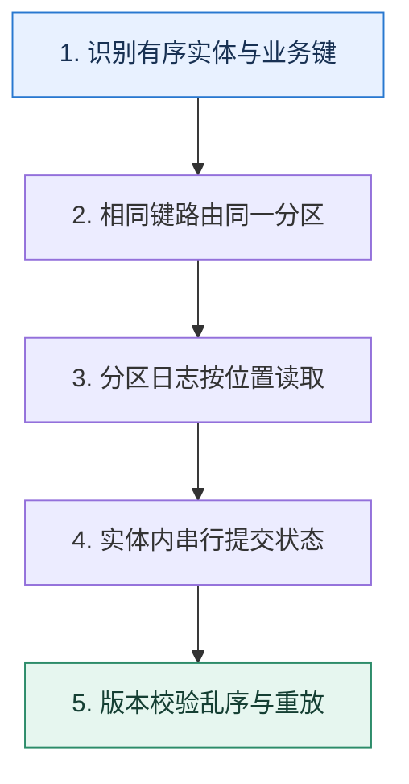

# 消息顺序｜先定义谁和谁必须保持先后

> 本课只回答一个问题：怎样保证同一订单的创建、支付和退款按因果顺序处理，而不同订单仍可并行？

这是一份独立学习稿。来源资料用于核对知识范围；下面的解释、推演、边界和图示均按工程学习路径重新组织，不依赖原页面也能完整阅读。

## 先补齐：建立正确的心智模型

全局顺序会把所有工作压到一条串行通道，代价很高。大多数业务真正需要的是同一实体内有序：同一个订单键进入同一分区，由同一消费序列处理；不同订单分布到不同分区并行。

读这一课时，始终把“组件名字”换成三个可追踪对象：**谁发起动作、状态存在哪里、失败后由谁收敛**。这样遇到不同产品或版本，仍能用同一套模型判断。

## 本节精讲：机制是怎样一步步工作的

生产者用稳定业务键选择分区，Broker 只承诺分区内日志位置递增。消费者组中一个分区在同一时刻交给一个成员，但消费者内部若把消息交给无序线程池，完成顺序仍可能颠倒。扩分区会改变某些键的映射，切换期需要版本校验、固定分区或双阶段迁移。跨分区事件只能靠业务序号、状态机或协调层恢复因果。

下面这张图只表达本课最重要的状态推进，蓝色是入口，绿色是可验收的终点；任一箭头失败，都要回到上文寻找重试、回退或人工处理的位置。

### 一次带数字的完整推演

订单 A 的事件序号 7、8、9 和订单 B 的 3、4 分别按 order_id 哈希。A 都进入分区 2，B 进入分区 5；两个分区并行消费。A 的退款事件 9 若因重试先到，消费者看到当前版本仍为 7，就暂缓或拒绝，等版本 8 的支付事件完成后再执行。

数字的作用不是制造精确感，而是暴露容量和时间关系。把例子中的流量、延迟、分片数或版本号替换成自己的真实数据，方案可能会随之改变。

## 误区与失效边界

同一生产者按同一键发送不代表端到端一定有序：重试配置、多个生产者、分区扩容、异步执行和失败重放都可能改变观察顺序。业务状态机必须拒绝不合法跳转，不能把正确性全部托付给队列。

判断一个结论是否可靠，可以追问两次：**它依赖什么前提？前提失效后系统留下了什么状态？** 如果回答只能停在“框架会自动处理”，就还没有走到工程边界。

## 按讲解顺序重建知识链

来源稿覆盖的论证主线在这里被重建成四步，保留问题、推导、反例和收束，不沿用原页面措辞：

1. 先缩小顺序范围：全局、分区还是业务实体。
2. 再说明稳定键如何换取实体内顺序和实体间并行。
3. 沿生产重试、分区扩容和消费者线程模型找出二次乱序。
4. 最后用事件序号与状态机验证顺序，而不是盲信到达时间。

把四步连起来后，本课不是一个孤立结论，而是一条可以复演的因果链。需要回查课程覆盖范围时，可打开文末的来源稿；学习时以本页模型为主。

## 工程验证：把理解变成证据

测试时为每个实体生成连续序号并随机注入重试、消费者重启和分区再均衡。最终断言不是“日志看起来有序”，而是每个实体的已提交版本连续，非法状态转移计数为零。

### 状态检查表

| 步骤 | 状态或动作 | 需要留下的证据 |
| ---: | --- | --- |
| 1 | 识别有序实体与业务键 | 记录耗时、结果与异常分支，确认状态能进入下一步 |
| 2 | 相同键路由同一分区 | 记录耗时、结果与异常分支，确认状态能进入下一步 |
| 3 | 分区日志按位置读取 | 记录耗时、结果与异常分支，确认状态能进入下一步 |
| 4 | 实体内串行提交状态 | 记录耗时、结果与异常分支，确认状态能进入下一步 |
| 5 | 版本校验乱序与重放 | 记录耗时、结果与异常分支，确认状态能进入下一步 |

检查表不是要求生产系统逐字采用这些字段，而是强迫设计者为每一步提供可观测结果。只有入口、没有终态的流程，最终都会形成无法解释的中间状态。

## 自我检查

同一 order_id 已固定写入一个分区，为什么消费者仍可能把后到的事件先落库？

消费者可能把两条消息交给并行线程，前一条执行更慢；也可能先失败后重试。需要实体内串行、分区内有序执行器或版本条件更新。

再做一次闭卷练习：不看上文画出状态图，并为其中任意两个箭头注入超时、进程崩溃或重复请求。如果你能预测最终状态和观测信号，这一课才真正从“听懂”变成“会用”。

## 来源与版本校准

- [查看来源稿（21 页资料整理）](../content/24-message-ordering.md)

来源稿只用于追溯知识范围，不是本学习稿的正文。具体产品的默认值、命令与内部实现会随版本变化；落地前应使用目标版本官方文档和故障演练再次确认。

本课涉及的产品行为以这些官方资料为校准入口：

- [Apache Kafka · 官方文档](https://kafka.apache.org/documentation/)
- [Apache Kafka · Design](https://kafka.apache.org/25/design/design/)
