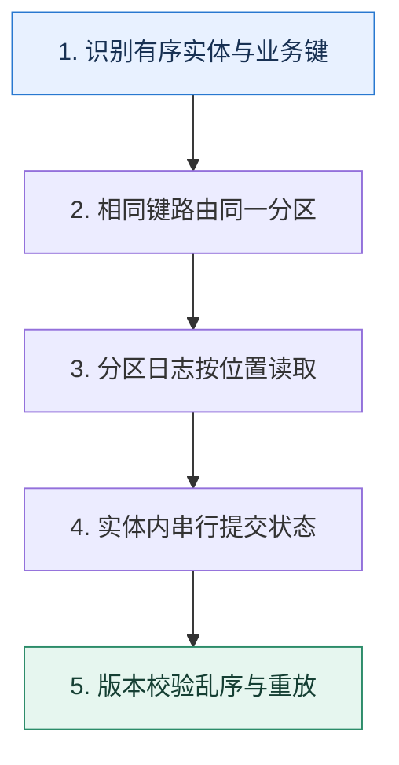

# 消息顺序｜先定义谁和谁必须保持先后

> 本课只解决一个问题：怎样保证同一订单的创建、支付和退款按因果顺序处理，而不同订单仍可并行？

这不是原页面的缩写，也不是一组孤立结论。下面先建立一个能推演的最小世界，再把状态、数字和失败分支摊开，最后按来源讲解顺序覆盖全部知识线索。读完后，你应当能从 `识别有序实体与业务键` 一直解释到 `版本校验乱序与重放`，并说明中途任意一步失败会留下什么状态。

## 零基础入口：先建立本课的心智画面

全局顺序会把所有工作压到一条串行通道，代价很高。大多数业务真正需要的是同一实体内有序：同一个订单键进入同一分区，由同一消费序列处理；不同订单分布到不同分区并行。

先不要急着记组件名。只抓住四个问题：**现在手里有什么输入？下一步只做什么动作？哪个状态发生变化？变化后的结果交给谁？** 之后遇到新框架，只要这四个答案不变，核心机制就没有变。

### 放进一个足够小、可以手算的世界

订单 A 的事件序号 7、8、9 和订单 B 的 3、4 分别按 order_id 哈希。A 都进入分区 2，B 进入分区 5；两个分区并行消费。A 的退款事件 9 若因重试先到，消费者看到当前版本仍为 7，就暂缓或拒绝，等版本 8 的支付事件完成后再执行。

这个小世界故意只保留本课必需的对象。生产系统会有更多节点、线程、分片和异常，但数量增加不会改变这里的因果关系。先确认你能手算这个例子，再把数字替换成真实系统数据。

### 先预测，不要马上看结论

**同一 order_id 已固定写入一个分区，为什么消费者仍可能把后到的事件先落库？**

先写下自己的判断，并指出你依赖的前提。文末自我检查会揭示答案；如果答案不同，回到下面的状态表找出第一个分叉点。

## 本节精讲：让机制一步一步发生

生产者用稳定业务键选择分区，Broker 只承诺分区内日志位置递增。消费者组中一个分区在同一时刻交给一个成员，但消费者内部若把消息交给无序线程池，完成顺序仍可能颠倒。扩分区会改变某些键的映射，切换期需要版本校验、固定分区或双阶段迁移。跨分区事件只能靠业务序号、状态机或协调层恢复因果。

### 可见状态推进

| 当前步 | 现在发生的动作 | 下一步拿到什么 |
| ---: | --- | --- |
| 1 | 识别有序实体与业务键 | 相同键路由同一分区 |
| 2 | 相同键路由同一分区 | 分区日志按位置读取 |
| 3 | 分区日志按位置读取 | 实体内串行提交状态 |
| 4 | 实体内串行提交状态 | 版本校验乱序与重放 |
| 5 | 版本校验乱序与重放 | 得到可核对的终态 |

图只承担一个任务：让你看清状态如何向前移动。它不意味着每一步必然成功；网络超时、进程退出、重复执行和数据竞争都可能让箭头停在中间，因此后面必须继续讨论失效边界。

### 一次带数字的完整推演

订单 A 的事件序号 7、8、9 和订单 B 的 3、4 分别按 order_id 哈希。A 都进入分区 2，B 进入分区 5；两个分区并行消费。A 的退款事件 9 若因重试先到，消费者看到当前版本仍为 7，就暂缓或拒绝，等版本 8 的支付事件完成后再执行。

数字不是装饰。它迫使我们回答容量、顺序、时间窗口或版本选择问题。若换一个数字就得出不同结论，真正的设计依据就是那个阈值，而不是某个中间件名称。

## 按讲解顺序重建知识链：完整来源讲解

下面按来源资料的教学顺序重新编排完整内容。转换页码、来源图片、推广信息、水印和个人宣传已经删除；原本围绕求职问答的角色与措辞改写为工程学习、方案评审和故障复盘语境。机制、算法、例子、反例、事故线索、评论补充和限制条件仍然保留。这里的作用是补齐知识覆盖，不取代前面的独立推演。

我们今天接着学习消息队列的新主题——有序消息。

在消息队列的相关的技术讨论里面，有序消息和消息不丢失、消息重复消费是三个并列的技术讨论热点，同时在实践中也很容易遇到要求使用有序消息的场景。但是大部分人在工程复盘时，无法深入透彻地讨论这个问题。大多数时候，只能说出 topic 只能有一个分区这种最简单的方案。当技术评审者追问这种方案有什么缺陷的时候就开始答不上来了。

所以今天我就带你深入了解有序消息的方方面面，深挖解决方案的缺陷以及对应的改进策略。

### 消息在分区上的组织方式

在 Kafka 中，消息是以分区为单位进行存储的。分区是逻辑上的概念，用于对消息进行水平划分和并行处理。每个 topic 都可以被划分为一个或多个分区，每个分区都是一个有序、不可变的消息日志。

Kafka 使用 WAL （write-ahead-log）日志来存储消息。每个分区都有一个对应的日志文件，新的消息会被追加到文件的末尾，而已经加入日志里的消息，就不会再被修改了。

每个消息在分区日志里都有一个唯一的偏移量（offset），用来标识消息在分区里的位置。Kafka 保证同一分区内的消息顺序，但不保证不同分区之间的顺序。

而 Kafka 本身暴露了对应的接口，也就是说你可以显式地指定消息要发送到哪个分区，也可以显式地指定消费哪个分区的数据。

### 什么是有序消息？

在消息队列里面，有序消息是指消费者消费某个 topic 消息的顺序，和生产者生产消息的顺序一模一样，它也叫做顺序消息。

前面你应该注意到了，Kafka 并不能保证不同分区之间的顺序。也就是说，如果业务上有先后顺序的消息被发送到不同的分区上，那么你难以确定哪一个消息会先被消费。

你需要注意一点语义上的差别，这里说生产者生产消息的顺序，不是指你创建出来消息那个实例的先后顺序，而是指 broker 收到的顺序。比如说你有两个生产者，一个生产者先生产了msg1，另外一个生产者生产了 msg2，但是 msg2 先发到了 broker 上。那么实际上我们认为 msg2 是先于 msg1 的。

如果你要求的是两个生产者，一个生产者一定要先于另外一个生产者发送一条消息，那么这实际上已经超出了消息队列要解决的问题的范畴了，它属于在分布式环境下如何协调不同节点按照先后顺序执行一定的步骤这个问题范畴。有序消息强调的是某个 topic 内，而不是跨 topic的有序消息。

### 跨 topic 的有序消息

不过有些时候可能因为业务特征或者历史问题，业务会要求你在不同的 topic 之间也保证消息是有序的。比如说 msg1 先发送到了 topic_a 上， msg2 被发送到了 topic_b 上。但是在业务层面上，要求 msg1 一定要先于 msg2 消费。

这种场景在事件驱动的架构中更加常见。在复杂的事件驱动架构下，我们可能会倾向于使用不同的 topic 来代表不同的事件，那么就会遇到要求在不同的 topics 下消息依旧需要保持有序的问题。

这一类的问题是不能依赖于消息队列来解决的。要想支持这种跨 topic 的有序消息，一定要引入一个协调者，这个协调者负责把消息重组为有序消息。比如说，如果 msg2 先到了，但是msg1 还没出来，那么这个协调者要有办法让 msg2 的消费者 B 停下来，暂时不消费msg2。而在 msg1 来了之后，唤醒消费者 A 消费 msg1，并且在消费完 msg1 之后要再唤醒消费者 B 处理 msg2。

应当说，这是一个全新的话题，技术讨论基本上不会出现这一类问题，你心中有个基本的概念就可以了。

### 把知识转成可验证的工程判断

在准备技术讨论的时候，你需要了解一下公司内部使用有序消息的情况。

在什么业务场景下，你需要用到有序消息？你是如何解决有序消息这个问题的？用的是哪种方案？如果你用的是单分区解决方案，那么有没有消息积压问题？如果有，你是怎么解决的？如果你用的是多分区解决方案，那么有没有分区负载不均衡的问题？如果有，你是怎么解决的？

你可以在简历介绍技能的部分或者项目部分点出你解决过消息有序性的问题。基本上你只要介绍到了，技术评审者就肯定会问你这方面的问题。

如果你自己在实践中真的用了全局有序的单分区解决方案，但是业务层面上其实并不要求全局有序，那么你可以尝试使用一下多分区解决方案。这样一来，你就会对两个方案有非常深入的理解，也能把握更多细节。

除此之外，如果技术评审者问到了这些问题，你也可以把话题引导到有序消息这个话题上。

1. 增加分区的问题，后面的多分区方案专门讨论了增加分区可能带来的消息失序的问题。
2. Redis 的槽和槽分配。
3. 负载均衡，你记得解释一致性哈希，然后把话题引导到利用一致性哈希来解决多分区数据分布不均匀的问题。
4. 消息积压的问题，你可以把话题引导到单分区方案和多分区方案上。
### 基本思路

我在前置知识里面已经说了 Kafka 分区是如何存储数据的。所以你很容易就猜到第一个解决方案，就是每一个 topic 只使用一个分区，也就是所谓的单分区解决方案。

所以你可以简单介绍这个方案。

要保证消息有序，最简单的做法就是让特定的 topic 只有一个分区。这样所有的消息都发到同一个分区上，那么自然就是有序的。

这个方案的优点是简单，并且是全局有序。但是这个方案有一个很严重的问题：性能太差。因为你一个 topic 只有一个分区，它就没办法支撑高并发。

所以你可以在解释中补充这一点，关键词是性能差。

这种只有一个分区的方案性能差，没办法支撑高并发。对于生产端来说，所有的消息都在一个分区上，也同时意味着所有的消息都发送到了同一个 broker 上，这个服务器很可能撑不住压力；对于消费端来说，只有一个分区，那么就只能有一个消费者消费，很容易出现消息积压的问题。

既然你说了这个点，自然就是为了引出改进方案。不过改进方案都有一个基本的前提，消息需要保持有序，但不是全局有序，而是同一个业务内有序。

如果业务要求的是全局有序，那就没什么优化手段，只能是换用更加强大的机器。但是你设想一下真实的业务场景，大部分业务强调的有序是全局有序吗？并不是，而是业务内有序。比如说在下单的场景下，会产生创建订单消息和完成支付消息。业务上只会要求同一个订单的创建订单消息应该优先于完成支付消息，但是不会要求订单 A 的创建消息需要先于订单 B 的支付消息。

所以你可以先暂时澄清一下同一个业务内有序的概念，然后引出优化方案。

如果我们要求的是全局有序，那除了换更加强大的机器就没别的办法了。而事实上，大部分的业务场景要求的都不是全局有序，而是业务内有序。例如要求同一个订单创建订单的消息应该先于完成支付消息，但是不会要求不同订单之间的消息是有序的。在这种场景下，还有两个改进方案可以考虑。一个是异步消费，还有一个是多分区方案。

### 异步消费

在单分区方案里，最容易遇到的问题就是消息积压，因为你只有一个消费者。在遇到消息积压的情况下，你可以考虑异步消费。但是这里的异步消费和上节课讲的比起来，有点不一样，这

里你要关注一个问题：如何维持顺序？

这里说的顺序，就是同一个业务内的顺序。所以我们可以考虑在异步消费时，当消费者从队列取出来消息之后，把同一个业务的消息丢到同一个队列里。你可以看一下整体的架构图。

图中有一个消费者负责从 Kafka 里拉取消息，然后发送到基于内存的队列里面。在发送的时候，它会根据 id 做一个简单的取余操作来筛选队列。然后工作线程从队列里面拿取消息，真正执行业务逻辑。

这个例子用的是 id，但是你可以根据自己的业务来选择其他字段，你选择的这些字段就被叫做业务特征。

你抓住关键字异步消费介绍这个方案。

第一个方案是异步消费，这个方案和解决消息积压的异步消费方案差不多，但是要做一点改进。消费者线程从 Kafka 里获取消息，然后转发到内存队列里面。在转发的时候，要把同一个业务的消息转发到同一个队列里面。一般来说可以根据业务特征字段计算一个哈希值，比如说直接使用业务 id 作为哈希值。利用这个哈希值除以工作线程数量，然后取余数，得到对应的内存队列。

这种做法的缺陷就是存在消息未消费的问题。也就是消费线程取出来了，转发到队列之后，工作线程还没来得及处理，消费者整体就宕机了，那么这些消息就存在丢失的可能。

最后提到了一个消息未处理的问题，我们上节课已经聊过了，那么你就可以灵活地把话题引导到消息积压的问题上去。

如果你仔细观察，你就会发现，既然我可以用内存队列，我干嘛不直接使用多个分区呢？这也就是我们的第二个改进方案：多分区。

### 进阶推导方案：多分区

这个方案在工程复盘时也有一些人能解释出来，但是很少有人能够深入讨论这个方案的潜在问题和对应的解决方案，所以这也就是你拉开差距的地方。

第二个方案和第一个方案差不多，就是把内存队列换成了多个分区。原本同一个业务的消息发送到同一个队列，这里是同一个业务的消息要发送到同一个分区。

第二个方案就是直接扩展为使用多个分区，只需要确保同一个业务的消息发送到同一个分区就可以保证同一个业务的消息是有序的。

技术评审者自然就会追问，怎么保证同一个业务的消息必然发送到同一个分区呢？做法也很简单，只需要生产者在发送消息的时候，根据业务特征，比如说业务 ID 计算出目标分区，在发送的时候显式地指定分区就可以了。

这里你抓住关键词计算分区解释。

要想确保同一个业务的消息都发送到同一个分区，那么只需要发送者自己根据业务特征，直接计算出来一个目标分区。比如说最简单的策略就是根据业务 ID 对分区数量取余，余数就是目标分区。

就像我之前所说的，所有的方案都有优缺点，这个方案也不例外。它的优点是足够简单，业务方需要做的改动很小。但是缺点有两个，一个是数据不均匀，另一个是增加分区可能导致消息失序。

我们先来看第一个缺点。

### 数据不均匀

这个缺点很容易理解，因为发送方要按照业务特征来选择分区，自然就容易导致一些分区有很多数据，而另外一些分区数据很少。而如果某个分区有很多数据的话，消费者来不及消费也是正常的事情。

数据不均匀一般是业务造成的。在我们的方案里面，分区是根据业务特征来选择的，那么自然有一些分区有很多数据，有一些分区数据很少。比如说万一我们不小心把热点用户的消息都发到了同一个分区里面，那么这个分区的 QPS 就会很高，消费者也不一定来得及消费，就可能引起消息积压。

怎么解决这个问题呢？

要想解决这个问题，可以通过改进计算目标分区的方式来解决，比如说采用类似于 Redis中槽和槽分配的机制，又或者说一致性哈希算法，基本上就能解决这个问题了。

这两个解决思路，我建议你不要等技术评审者追问，而是自己直接接着说，因为到这里你讨论的深度大概率已经超出了一般技术评审者的经验范畴了，所以他们可能想不到该怎么问你。

槽与槽分配

这种解决方案的基本思路就是借鉴 Redis 的数据分布方案。你可以根据业务特征计算一个哈希值，然后映射到槽上。这里，你可以参考 Redis，使用 16384 个槽，不过如果业务体量不是那种几百万 QPS 的，你用 1024 个槽就可以。

你再通过指定不同的槽把数据分配到不同的分区上，这个时候你就可以根据你的业务特征合理分配槽，从而保证分区之间数据分布是均匀的。

整个架构如图：

你抓住关键词槽解释。

第一种思路是借鉴 Redis 的槽与槽分配方案。不过 Redis 使用了 16384 个槽，一般的业务用不上那么多槽，所以可以考虑用 1024 个槽。根据业务的特征来计算一个哈希值，再除以1024 取余就可以得到所在的槽。再根据不同槽的数据多少，合理地把槽分配到不同的分区。最好把槽和分区的绑定关系做成动态的，也就是说我可以随时调整槽到分区的映射关系，保证所有的分区负载都是均匀的。

最后我们提到的动态调整槽与分区的绑定关系，可以借助于配置中心来完成。比如说最开始你把槽 1 绑定到分区 2 上，后面在运行的时候你发现分区 2 数据太多，就把槽 1 重新绑定到了分区 3 上。

当然，因为这个解释的核心是借鉴了 Redis，那么就有可能把话题引导到 Redis 那里。不过你也不用担心，课程后面你会了解到和 Redis 有关的内容。

但是这个过程还是有问题的，可能会引起消息失序，和增加新的分区指向了同一个问题。所以你可以参考增加分区引起消息失序部分来解释。接下来，我们再来看看一致性哈希是怎么解决问题的。

一致性哈希

你已经接触过一致性哈希这个算法很多次了。那么在这里使用哈希一致性算法，就是把分区分散在哈希环上。你根据业务特征计算出一个哈希值之后，根据哈希值在这个环上找到合适的分区，然后把消息发送过去。

你只要通过调整不同分区之间的间隔，就能控制分区上的数据分布。

另外一种思路是使用一致性哈希算法来筛选分区。首先要根据数据分布的整体情况，把分区分布在哈希环上，确保每一个分区上的数据分布大体上是均匀的。如果一部分哈希值上数据较多，就多插入几个分区节点。然后根据业务特征计算一个哈希值，从哈希环上找到对应的分区。

最后你可以进一步总结，升华一下。

这种槽分配和一致性哈希算法非常适合解决数据或者流量分布不均匀的问题，因为我们总是可以通过手工调整槽的映射关系或者哈希环上节点的分布来保证数据或者流量在每一个节点上的分布大体是均匀的。

到这里，我们已经彻底解决了数据不均匀的问题，接下来就要讨论增加分区引起消息失序的问题了。

### 增加分区引起消息失序

你可以结合下面这张图来理解。

在工程复盘时，你可以先介绍这个缺点，关键词是增加分区会引起消息失序，同时补充一个例子。

它还有另外一个缺点，就是如果中间有增加新的分区，那么就可能引起消息失序。比如说最开始 id 为 3 的订单消息 msg1 发到分区 0 上，但是这时候很不幸分区 0 上积攒了很多消息，所以 msg1 迟迟得不到消费。

紧接着我们扩容，增加了一个新的分区。如果这时候来了一个消息 msg2，那么它会被转发到分区 3 上。分区 3 上面没有积攒什么数据，所以消费者 3 直接就消费了这个消息。

这时候我们发现，本来 msg1 应该先于 msg2 被消费。而增加分区之后 msg2 反而被先消费了。这就是一个典型的消息失序场景。

那么针对这个缺点我们也可以进一步提出解决方案。这个消息失序的场景解决起来倒也很简单，就是新增加了分区之后，这些新分区的消费者先等一段时间，比如说三分钟，确保同一个业务在其他分区上的消息已经被消费了。

要解决这个问题也很容易。对于新加入的分区，可以暂停消费一段时间。比如说在前面的例子中，如果我们估算 msg1 会在一分钟内被消费，那么新加入的分区的消费者可以在三分钟后再开始消费。那么大概率 msg1 就会先于 msg2 消费。不过这种等待的解决方式并不能解决根本问题，只能说是很大程度上缓解了问题。但是本身增加分区也是一个很不常见的操作，再叠加消息失序的概率也很低，所以我们也可以通过监控发现这种失序场景，然后再手工修复一下就可以了。

到了这一步，常规的方案和升级的多分区版本已经聊得差不多了。最后我再来教你一个技术讨论的小技巧。

### 基于优化的技术推理路径

刚刚我们从单分区讨论到多分区，就是一个关于性能优化的非常好的案例，我们如何通过这个案例来让我们的能力更加突出呢？这里可以利用我们之前学过的一个技术讨论小技巧，关键词就是优化 + 前后对比。

最开始我进公司的时候就遇到了一个 Kafka 的线上故障。我司有一个业务需要用到有序消息，所以最开始的设计就是对应的 topic 只有一个分区，从而保证了消息有序。

可是随着业务增长，一个分区很快就遇到了性能瓶颈。只有一个分区，也就意味着只有一个消费者，所以在业务增长之后，就开始出现了消息积压。另外一方面，这个分区所在的broker 的负载也明显比其他服务器要大，偶尔也会有一些性能抖动的问题。

后来我仔细看了我们的业务，实际上，我们的业务要求的不是全局有序，而是业务内有序。

换句话来说，不一定非得用一个分区，而是可以考虑使用多个分区。所以我就给这个 topic增加了几个分区，同时也增加了消费者。优化完之后，到目前为止，还没有出现过消息积压的问题。

这里你应该注意到，从单个分区增加到多个分区，还是会出现前面说的消息失序的问题。我建议你主动提起这个问题，展开聊一聊你的应对方案。

当然，为了避免在单分区增加到多分区的时候，出现消息失序的问题，我用了一个很简单的方案，就是对应的消费者在启动之后，并没有立刻消费，而是停顿了三分钟，从而避免了潜在的消息失序问题。

注意，这里的停顿三分钟的前提是你要先把积压的消息消费掉。如果积压的消息还需要三十分钟，那你这里就至少要停顿三十分钟。

### 本节原始知识线索收束

这节课我们了解了有序消息的基本概念，还有一个看起来有点接近但是完全不同的话题：跨topic 的有序消息。其中有一个关键问题，就是消息在分区上是如何组织的，这里你记住WAL 和分区内有序这两个关键词就可以了。

在这个基础上，我们讨论了最常规的方案，也就是保证全局有序的单分区方案，并且进一步解释了如果在单分区上消息积压了，可以通过异步消费来解决问题。

然后我们重点讨论了多分区方案，这里你要记住多分区方案的两个缺陷，还有应对策略。

1. 数据不均匀。对应的解决方案是借鉴 Redis 的槽与槽分配的方案和一致性哈希方案。
2. 增加分区引起的消息失序。要解决这个问题也很简单，就是新增加的分区暂时不要消费，确保在别的分区上的消息已经被消费完了再消费。
RabbitMQ 和 RocketMQ 里面消息有序性的解法也是差不多的。不同的是，在 RabbitMQ里面使用的是 queue，因为 RabbitMQ 没有分区的概念。而 RocketMQ 里面内置了有序消息的功能，底层原理也基本相似。

### 继续推演

最后请你来思考两个问题。

你觉得在多分区方案里面，如果某个分区消息积压了就启用异步消费，这种解决思路你觉得怎么样？我在最后总结了一个槽分配和一致性哈希非常适合用于解决数据或者流量分布不均匀问题的观点，你还在什么地方见过类似的解决思路？

### 补充讨论与边界校准

补充讨论： topic 里面”，这里是丢回到原来的分区尾部？还是说创建一个生产者往对应topic发送原来的消息呢？

讲解补充：丢回去原本的分区就可以了，啥也不用做。但是消息积压的时候，你这个消息就要过很久才能消费到。

1

补充讨论：

讲解补充：最简单的做法，就是重新哈希之后，目标分区暂停消费一会。举个例子来说，原本消息是哈希到 A 分区的，后面重新哈希到 B 了，那么 B 暂停一会就可以。暂停的时间就是考虑到 A 上的都被消费了的时间。如果有 A 上有消息积压就会有比较多的问题。

如果业务上能够检测出来，那么就在 B 上消费的时候，重新丢回去 B 里面。

1

补充讨论： ance，那消息岂不是无序了，而且对于其他业务来说也是不友好的。我之前会经常遇到这个问题，请教下这里改怎么弄呢

讲解补充：分区挂了倒还好，毕竟生产者都发不出来。要解决 rebalance，有一个不太好的办法，但是勉强能用。就是消费者这边手动指定分区。

这样做的话，就是要做好监控。一旦消费特定分区的消费者崩溃了，要及时启动另外一个消费者来消费同样地分区。

1

补充讨论：

讲解补充：好问题。盲猜你是用了不同的 topic 是不是？就是退单的消息用了一个 topic，但是下单的用了另外一个 topic。

如果你是这种的话，只能用我提到的跨 topic 有序的方案，要有一个协调者进来，这个协调者在收到退单的时候，要先去看看有没有收到下单的消息。

但是一般用不着这样，以为你只需要检测有没有这个订单，或者状态是否符合，不符合你就丢回去原本的 topic 里面。或者你设定一个时间，比如说三十分钟之后再处理这个退单消息，然后预期三十分钟内应该能收到下单消息。

1

补充讨论：

讲解补充：1. 你是说那个内存队列？就是载体不同。如果是内存队列，那么宕机就没了。

2. 一样会有数据不均匀的问题，但是更加容易解决，因为你开启队列的时候，自己应用一下一致性哈希之类的算法就可以解决了。
不过其实你可以考虑只用一个队列，线程都从这里面取。就是在最后要协调大家停下来批量提交麻烦一点，倒也还可以接受。

1

补充讨论：

“手工调整槽的映射关系或者哈希环上节点的分布”，

1. 这里使用一致性哈希算法时候，采用插入几个分区节点来分散数据较多的分区
1. 1 这里多几个分区后，是不是一致性哈希算法的计算方法也要调整，否则只会定位在之前的分区所组成的哈希环上？
1. 2 那这里我可以不插入几个分区，转为调整发布者的一致性哈希算法，让指定分区的哈希范围变长或变短来分散数据。这样子的话，除了每个发布者都要调整算法之外，还会有其他什么问题？
2. 手工调整槽的映射关系
2. 1 会出现被调整的槽上有数据的情况吗(比如: 槽5属于分区2，然后上有槽上5个数据，这时候要调整到分区1)，这时候是否需要等待数据消费完，再进行调整呢?
2. 2 调整槽所属的分区，也会出现消息失序的情况吧？
讲解补充：1.1 不需要调整。你可以认为，你的环是不变的，变的是上面的节点；

1. 2 也可以。2 看你业务有没有这个要求。在有序消息的场景下，就是需要的。最好就是调整后的新分区，暂时停止一段时间消费。

补充讨论：

讲解补充：你的哈希算法不变，并且队列数量也不变，那就肯定是有序的。

补充讨论：

讲解补充：显示指定分区，我是指有多个分区的情况。

补充讨论：

讲解补充：老大难的问题了，哈哈哈哈。

说实在的，我也没特别好的的办法。如果你们本身就有那种排序机制，比如说我可以通过状态来判定消息是不是失序了，比如说当状态还是未支付的时候，你收到取消消息，这肯定是乱序了。那么你就可以尝试把取消消息重新发回去原本的消息队列上。

另外一种有漏洞的做法就是借助延迟消息。比如说你 A1 消息在重试，A2 不管知不知道 A1 在重试，直接自己延迟一分钟发送。“一分钟”是假定你的 A1 肯定能在一分钟之内重试完成。

当然，如果 A2 的发送者有办法知道 A1 还没发，那么就可以优化成只有当 A1 没发，A2 才会延迟，当然 A3，A4... 显然也要跟着延迟。

比如说，你可以借助 redis，假设 key1=1 的时候，代表 A1 还没发。key1=2 的时候，A1 已经发了。那么 A2 的发送者看一眼 Redis 就知道了。

不过，我的个人看法是……除非是技术讨论吹牛，不然实践中直接告警拉到。就是在真的发现消息失序的时候，告警，人手工微调一下就可以。可用性高的话，你可能一个月才有一个两个这种失序的问题。

补充讨论： & 1024是能够比较均匀地分配到每个槽中吗？

讲解补充：不不不，这个的关键点是你可以引入逻辑上槽的概念，你不一定非得用 CRC16 来计算槽。你可以说选择你的业务特征，用几个哈希函数，一通猛算，得到一个值，这个值就是你的槽的号。我这里用 1024 只是举个例子。

更好的做法是固定分配。比如说我直接指定，一通猛算出来的值如果是 1，2,1023,345 就到分区 0。就有点你手动分配槽到 Redis 节点上的意思。借助配置中心还可以动态更新这个分配，也很方便。

## 把完整讲解收束成一条因果链

1. 先缩小顺序范围：全局、分区还是业务实体。
2. 再说明稳定键如何换取实体内顺序和实体间并行。
3. 沿生产重试、分区扩容和消费者线程模型找出二次乱序。
4. 最后用事件序号与状态机验证顺序，而不是盲信到达时间。

把这几步连接起来时，不要省略“为什么”。最终结论只有在前提、状态变化和失败代价都说得清楚时才可靠。

## 误区与失效边界

同一生产者按同一键发送不代表端到端一定有序：重试配置、多个生产者、分区扩容、异步执行和失败重放都可能改变观察顺序。业务状态机必须拒绝不合法跳转，不能把正确性全部托付给队列。

再加一条通用但必须落实到本课对象上的边界：机制只能处理它看得见的信号。若输入指标失真、状态没有持久化、错误被吞掉，或者补偿没有幂等保护，再成熟的框架也只能基于错误证据作决定。

### 三种故障注入方式

| 故障 | 要观察什么 | 不能接受的解释 |
| --- | --- | --- |
| 在第 2 步前让依赖超时 | 是否停在可重试状态，是否消耗完上游预算 | “框架稍后会处理” |
| 在状态写入后让进程退出 | 重启后能否识别已完成与待继续动作 | “再执行一次应该没事” |
| 对同一输入并发执行两次 | 是否出现重复副作用、顺序颠倒或覆盖 | “概率很低” |

## 工程验证：把理解变成可以复查的证据

测试时为每个实体生成连续序号并随机注入重试、消费者重启和分区再均衡。最终断言不是“日志看起来有序”，而是每个实体的已提交版本连续，非法状态转移计数为零。

| 步骤 | 状态或动作 | 最少应留下的证据 |
| ---: | --- | --- |
| 1 | 识别有序实体与业务键 | 开始时间、结束时间、输入标识、结果状态、异常原因 |
| 2 | 相同键路由同一分区 | 开始时间、结束时间、输入标识、结果状态、异常原因 |
| 3 | 分区日志按位置读取 | 开始时间、结束时间、输入标识、结果状态、异常原因 |
| 4 | 实体内串行提交状态 | 开始时间、结束时间、输入标识、结果状态、异常原因 |
| 5 | 版本校验乱序与重放 | 开始时间、结束时间、输入标识、结果状态、异常原因 |

验证时同时记录成功路径和失败路径。只证明“正常时能跑通”不能说明设计可靠；至少要让一次超时、一次进程退出和一次重复请求可重现，并能根据日志或指标解释最后状态。

## 学完检查：闭卷画出本课

你现在应该能独立完成四件事：

1. 用自己的话说出本课唯一问题，不使用产品名也能解释。
2. 复算上面的具体例子，并指出哪个输入改变会让结论改变。
3. 沿 Mermaid 图注入一次失败，预测系统停在哪里以及由谁收敛。
4. 说出本课机制不保证什么，并给出一个反例。

## 自我检查

同一 order_id 已固定写入一个分区，为什么消费者仍可能把后到的事件先落库？

消费者可能把两条消息交给并行线程，前一条执行更慢；也可能先失败后重试。需要实体内串行、分区内有序执行器或版本条件更新。

怎样证明自己不是只记住了名词？

把 `识别有序实体与业务键` 的一个真实输入写出来，逐步记录到 `版本校验乱序与重放`。然后在中间任意一步制造失败；如果你能解释当前状态、下一责任方、可观测证据和恢复边界，就已经拥有可以迁移的工程模型。

## 来源与事实校准

- [查看完整来源稿（本地 21 页资料）](../content/24-message-ordering.md)

### 当前事实校准

Kafka 的顺序保证首先落在单个 topic partition 内；业务键需要稳定映射到同一分区。扩分区、重试、并发处理和异步回调都会改变观察到的业务顺序，所以还要用版本号、串行执行或幂等状态机保护。

- [Apache Kafka · Documentation](https://kafka.apache.org/documentation/)
- [Apache Kafka · Design](https://kafka.apache.org/25/design/design/)

来源稿用于核对覆盖范围，不随公开站点发布。产品默认值和具体内部行为可能随版本变化；落地时应使用目标版本的官方文档、可运行实验和故障演练校准。本学习稿中的零基础入口、状态推演、故障矩阵和工程验证属于编辑补充，不冒充来源讲解者的原话。
