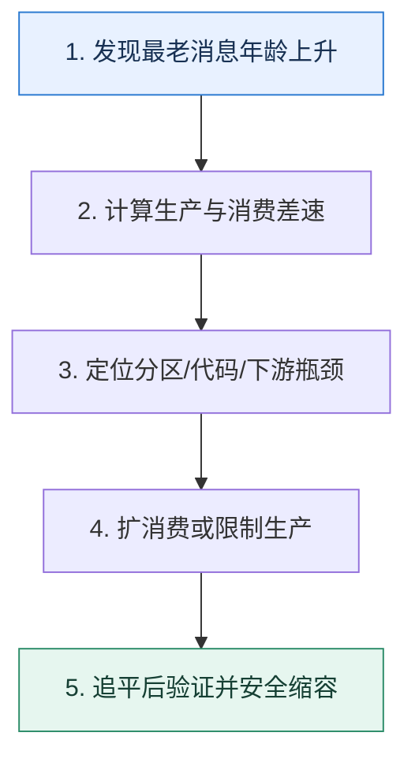

# 消息积压｜先计算差速，再决定扩容还是降载

> 本课只回答一个问题：积压出现时，怎样判断是短时波峰、消费者变慢，还是下游已经超过容量？

这是一份独立学习稿。来源资料用于核对知识范围；下面的解释、推演、边界和图示均按工程学习路径重新组织，不依赖原页面也能完整阅读。

## 先补齐：建立正确的心智模型

队列像水库，积压变化率近似等于生产速率减消费速率。消息条数只说明存量，最老消息年龄才直接反映用户等待；平均速度会掩盖分区热点和单条慢任务。

读这一课时，始终把“组件名字”换成三个可追踪对象：**谁发起动作、状态存在哪里、失败后由谁收敛**。这样遇到不同产品或版本，仍能用同一套模型判断。

## 本节精讲：机制是怎样一步步工作的

先看各分区生产速率、消费速率、Lag 与最老年龄，再分解消费者耗时到反序列化、业务计算和下游 I/O。若只是短峰且可在 SLO 内消化，可以观察；若消费者有空闲分区，增加实例无效；若分区足够且下游有余量，增加消费者或批处理；若下游已饱和，则先限流、降级或暂停非核心生产，再修下游。临时扩容后还要安全缩回，避免重平衡风暴。

下面这张图只表达本课最重要的状态推进，蓝色是入口，绿色是可验收的终点；任一箭头失败，都要回到上文寻找重试、回退或人工处理的位置。

### 一次带数字的完整推演

生产速度 20,000 条/秒，消费速度 12,000 条/秒，差速 8,000 条/秒。持续 15 分钟会积压 720 万条。若扩容后消费达到 30,000 条/秒，净消化速度 10,000 条/秒，还需约 12 分钟清空；用户最长等待不会在扩容瞬间归零。

数字的作用不是制造精确感，而是暴露容量和时间关系。把例子中的流量、延迟、分片数或版本号替换成自己的真实数据，方案可能会随之改变。

## 误区与失效边界

消费者数量超过可分配分区数不会继续增加并行度。只提取消息后快速提交 offset、再异步处理，可能让 Lag 变小却把风险转移到进程内存；进程崩溃时工作丢失。

判断一个结论是否可靠，可以追问两次：**它依赖什么前提？前提失效后系统留下了什么状态？** 如果回答只能停在“框架会自动处理”，就还没有走到工程边界。

## 按讲解顺序重建知识链

来源稿覆盖的论证主线在这里被重建成四步，保留问题、推导、反例和收束，不沿用原页面措辞：

1. 先用差速公式估算积压增长和清空时间。
2. 再按分区观察热点，确认扩实例是否有可用并行度。
3. 分解单条耗时，辨别消费者代码和下游容量。
4. 最后制定限流、降级、扩容、重放和缩容顺序。

把四步连起来后，本课不是一个孤立结论，而是一条可以复演的因果链。需要回查课程覆盖范围时，可打开文末的来源稿；学习时以本页模型为主。

## 工程验证：把理解变成证据

告警至少联合三个量：Lag 条数、最老消息年龄、消费错误率。演练中记录扩容前后消费速率，代入 `清空时间=积压量/(消费速率-生产速率)`，预测值应与实测同一数量级。

### 状态检查表

| 步骤 | 状态或动作 | 需要留下的证据 |
| ---: | --- | --- |
| 1 | 发现最老消息年龄上升 | 记录耗时、结果与异常分支，确认状态能进入下一步 |
| 2 | 计算生产与消费差速 | 记录耗时、结果与异常分支，确认状态能进入下一步 |
| 3 | 定位分区/代码/下游瓶颈 | 记录耗时、结果与异常分支，确认状态能进入下一步 |
| 4 | 扩消费或限制生产 | 记录耗时、结果与异常分支，确认状态能进入下一步 |
| 5 | 追平后验证并安全缩容 | 记录耗时、结果与异常分支，确认状态能进入下一步 |

检查表不是要求生产系统逐字采用这些字段，而是强迫设计者为每一步提供可观测结果。只有入口、没有终态的流程，最终都会形成无法解释的中间状态。

## 自我检查

Lag 条数突然下降，为什么仍不能立即宣布故障恢复？

消费者可能提前提交了位置，或只是把消息搬到内部队列。必须确认业务落库成功率、最老业务任务年龄和下游状态，而不只看 Broker offset。

再做一次闭卷练习：不看上文画出状态图，并为其中任意两个箭头注入超时、进程崩溃或重复请求。如果你能预测最终状态和观测信号，这一课才真正从“听懂”变成“会用”。

## 来源与版本校准

- [查看来源稿（23 页资料整理）](../content/25-message-backlog.md)

来源稿只用于追溯知识范围，不是本学习稿的正文。具体产品的默认值、命令与内部实现会随版本变化；落地前应使用目标版本官方文档和故障演练再次确认。

本课涉及的产品行为以这些官方资料为校准入口：

- [Apache Kafka · 官方文档](https://kafka.apache.org/documentation/)
- [Apache Kafka · Design](https://kafka.apache.org/25/design/design/)
