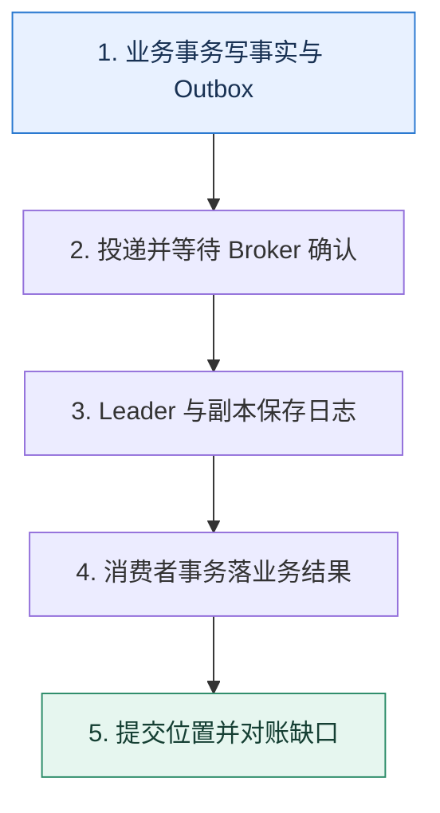

# 消息可靠性｜逐段证明一条消息没有静默消失

> 本课只回答一个问题：从业务提交到消费落库，一条消息在哪些边界可能丢失，怎样逐段封住？

这是一份独立学习稿。来源资料用于核对知识范围；下面的解释、推演、边界和图示均按工程学习路径重新组织，不依赖原页面也能完整阅读。

## 先补齐：建立正确的心智模型

“发送成功”可能只是写进客户端缓冲；“Broker 收到”也不一定已落在足够副本；“消费到了”更不等于业务副作用已经提交。可靠性要沿每个确认边界逐段定义。

读这一课时，始终把“组件名字”换成三个可追踪对象：**谁发起动作、状态存在哪里、失败后由谁收敛**。这样遇到不同产品或版本，仍能用同一套模型判断。

## 本节精讲：机制是怎样一步步工作的

生产端应在本地事实与待发送事件之间建立原子关系，常见做法是 Outbox；客户端等待符合目标的 Broker 确认并允许幂等重试。Broker 通过复制、选主和持久化降低节点故障损失。消费端先完成业务事务，再提交消费位置；若两者无法原子化，就接受重复并让业务幂等。Kafka 的事务可以协调其体系内的读写与 offset，但外部数据库、短信等副作用仍需要幂等或事务消息桥接。

下面这张图只表达本课最重要的状态推进，蓝色是入口，绿色是可验收的终点；任一箭头失败，都要回到上文寻找重试、回退或人工处理的位置。

### 一次带数字的完整推演

订单事务同时写 `orders(O7)` 与 `outbox(E91, NEW)`。投递器把 E91 发往 Broker，收到确认后标记 SENT；标记前崩溃会再次发送。消费者用 E91 作为唯一键写入发货任务，事务成功后提交 offset。无论生产或消费在哪个空隙崩溃，最坏结果是重复而不是静默丢失。

数字的作用不是制造精确感，而是暴露容量和时间关系。把例子中的流量、延迟、分片数或版本号替换成自己的真实数据，方案可能会随之改变。

## 误区与失效边界

更强确认通常牺牲延迟和可用性；复制也不是备份，错误删除可能被同步到所有副本。把“至少一次”宣传成“恰好一次业务效果”会掩盖外部副作用和人工操作。

判断一个结论是否可靠，可以追问两次：**它依赖什么前提？前提失效后系统留下了什么状态？** 如果回答只能停在“框架会自动处理”，就还没有走到工程边界。

## 按讲解顺序重建知识链

来源稿覆盖的论证主线在这里被重建成四步，保留问题、推导、反例和收束，不沿用原页面措辞：

1. 先列出客户端缓冲、网络、Broker、复制、消费确认五段风险。
2. 用 Outbox 解决业务提交与发送之间的空隙。
3. 用复制和确认策略说明 Broker 能承受何种故障。
4. 最后把消费提交放到业务成功之后，以幂等承接不可避免的重复。

把四步连起来后，本课不是一个孤立结论，而是一条可以复演的因果链。需要回查课程覆盖范围时，可打开文末的来源稿；学习时以本页模型为主。

## 工程验证：把理解变成证据

构造故障矩阵：在 Outbox 提交前后、Broker 确认前后、业务事务前后、offset 提交前后分别杀进程。每次恢复后都要满足“业务效果一次、消息可追踪、无永久 NEW 状态”。

### 状态检查表

| 步骤 | 状态或动作 | 需要留下的证据 |
| ---: | --- | --- |
| 1 | 业务事务写事实与 Outbox | 记录耗时、结果与异常分支，确认状态能进入下一步 |
| 2 | 投递并等待 Broker 确认 | 记录耗时、结果与异常分支，确认状态能进入下一步 |
| 3 | Leader 与副本保存日志 | 记录耗时、结果与异常分支，确认状态能进入下一步 |
| 4 | 消费者事务落业务结果 | 记录耗时、结果与异常分支，确认状态能进入下一步 |
| 5 | 提交位置并对账缺口 | 记录耗时、结果与异常分支，确认状态能进入下一步 |

检查表不是要求生产系统逐字采用这些字段，而是强迫设计者为每一步提供可观测结果。只有入口、没有终态的流程，最终都会形成无法解释的中间状态。

## 自我检查

为什么消费者先提交 offset、再写业务数据库是一条危险路径？

提交后 Broker 会认为消息已完成。如果随后进程崩溃，消息不会再投递，而业务结果尚未写入，形成静默丢失。

再做一次闭卷练习：不看上文画出状态图，并为其中任意两个箭头注入超时、进程崩溃或重复请求。如果你能预测最终状态和观测信号，这一课才真正从“听懂”变成“会用”。

## 来源与版本校准

- [查看来源稿（25 页资料整理）](../content/26-message-durability.md)

来源稿只用于追溯知识范围，不是本学习稿的正文。具体产品的默认值、命令与内部实现会随版本变化；落地前应使用目标版本官方文档和故障演练再次确认。

本课涉及的产品行为以这些官方资料为校准入口：

- [Apache Kafka · 官方文档](https://kafka.apache.org/documentation/)
- [Apache Kafka · Design](https://kafka.apache.org/25/design/design/)
