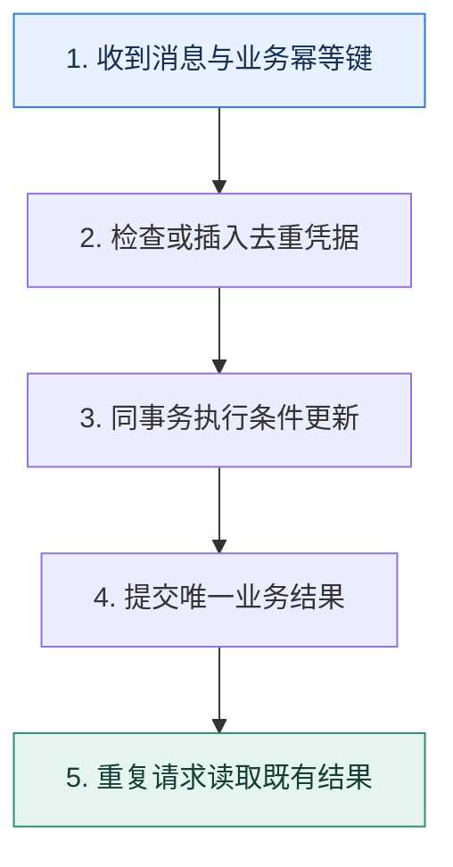

# 重复消费｜把至少一次投递变成一次业务效果

> 本课只回答一个问题：消息可能重复到达时，怎样保证余额、库存和通知不会重复产生副作用？

这是一份独立学习稿。来源资料用于核对知识范围；下面的解释、推演、边界和图示均按工程学习路径重新组织，不依赖原页面也能完整阅读。

## 先补齐：建立正确的心智模型

重试是可靠投递的正常组成部分，不是异常角落。幂等的含义不是代码执行一次，而是同一个业务请求重复执行后，可观察结果与执行一次相同。

读这一课时，始终把“组件名字”换成三个可追踪对象：**谁发起动作、状态存在哪里、失败后由谁收敛**。这样遇到不同产品或版本，仍能用同一套模型判断。

## 本节精讲：机制是怎样一步步工作的

优先选择天然幂等的状态覆盖或条件更新；非幂等动作使用业务幂等键和数据库唯一约束。去重记录与业务结果应在同一本地事务内提交，否则“记录已处理但业务失败”或相反仍有空隙。Redis 和布隆过滤器可在前面挡掉大量明显重复，但缓存丢失、过期或误判不能作为资金类最终凭据。通知等外部副作用要向对方传幂等键，或采用待发送表与状态机。

下面这张图只表达本课最重要的状态推进，蓝色是入口，绿色是可验收的终点；任一箭头失败，都要回到上文寻找重试、回退或人工处理的位置。

### 一次带数字的完整推演

扣款消息 E77 到达两次。事务先插入 `processed_event(E77)`，唯一索引只允许一次，再执行 `UPDATE account SET balance=balance-100 WHERE ...`。第一次共同提交；第二次插入冲突后读取已有结果并返回成功。若扣款与去重分开提交，任一中间崩溃都可能多扣或漏扣。

数字的作用不是制造精确感，而是暴露容量和时间关系。把例子中的流量、延迟、分片数或版本号替换成自己的真实数据，方案可能会随之改变。

## 误区与失效边界

用消息的随机投递 ID 去重可能挡不住业务重发，因为同一业务动作可能生成新消息 ID。去重记录也不能无限保留而不评估业务重试窗口；过早过期会让迟到副本再次生效。

判断一个结论是否可靠，可以追问两次：**它依赖什么前提？前提失效后系统留下了什么状态？** 如果回答只能停在“框架会自动处理”，就还没有走到工程边界。

## 按讲解顺序重建知识链

来源稿覆盖的论证主线在这里被重建成四步，保留问题、推导、反例和收束，不沿用原页面措辞：

1. 从至少一次投递推导重复为何不可避免。
2. 区分消息 ID、请求 ID 和业务唯一键，选择真正代表一次动作的键。
3. 把去重与业务副作用放在同一事务中，封闭崩溃空隙。
4. 最后为缓存加速、外部副作用和去重保留期补上边界。

把四步连起来后，本课不是一个孤立结论，而是一条可以复演的因果链。需要回查课程覆盖范围时，可打开文末的来源稿；学习时以本页模型为主。

## 工程验证：把理解变成证据

并发压测同一个幂等键 100 次，断言业务表只发生一次有效状态转移，所有调用返回相同业务结果，并且唯一冲突可观测。再把消费者杀在事务前后，验证恢复结果不变。

### 状态检查表

| 步骤 | 状态或动作 | 需要留下的证据 |
| ---: | --- | --- |
| 1 | 收到消息与业务幂等键 | 记录耗时、结果与异常分支，确认状态能进入下一步 |
| 2 | 检查或插入去重凭据 | 记录耗时、结果与异常分支，确认状态能进入下一步 |
| 3 | 同事务执行条件更新 | 记录耗时、结果与异常分支，确认状态能进入下一步 |
| 4 | 提交唯一业务结果 | 记录耗时、结果与异常分支，确认状态能进入下一步 |
| 5 | 重复请求读取既有结果 | 记录耗时、结果与异常分支，确认状态能进入下一步 |

检查表不是要求生产系统逐字采用这些字段，而是强迫设计者为每一步提供可观测结果。只有入口、没有终态的流程，最终都会形成无法解释的中间状态。

## 自我检查

为什么只用 Redis `SETNX` 记录消息已处理，仍不足以保护余额扣减？

Redis 标记与数据库扣款不是同一事务。标记成功后数据库失败会漏扣，数据库成功而标记丢失会重扣；缓存只能加速，最终约束应靠业务事务和唯一键。

再做一次闭卷练习：不看上文画出状态图，并为其中任意两个箭头注入超时、进程崩溃或重复请求。如果你能预测最终状态和观测信号，这一课才真正从“听懂”变成“会用”。

## 来源与版本校准

- [查看来源稿（23 页资料整理）](../content/27-duplicate-consumption.md)

来源稿只用于追溯知识范围，不是本学习稿的正文。具体产品的默认值、命令与内部实现会随版本变化；落地前应使用目标版本官方文档和故障演练再次确认。

本课涉及的产品行为以这些官方资料为校准入口：

- [Apache Kafka · 官方文档](https://kafka.apache.org/documentation/)
- [Apache Kafka · Design](https://kafka.apache.org/25/design/design/)
