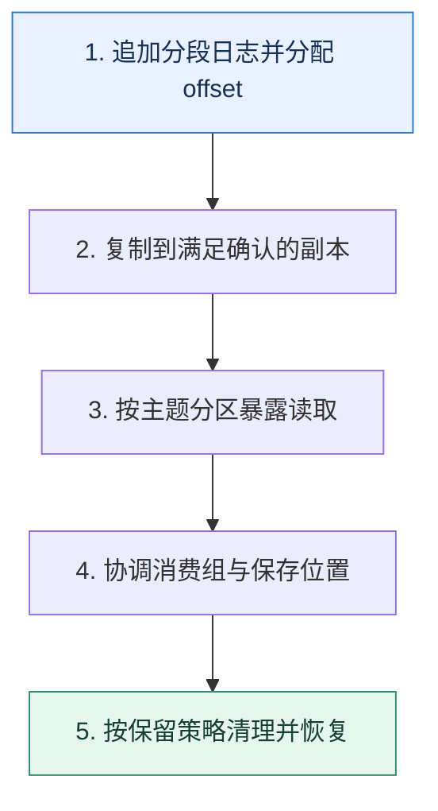

# 从零设计消息队列｜先定义日志，再补齐确认、消费与复制

> 本课只解决一个问题：如果自己实现一个最小可用消息队列，哪些状态不可缺少？

这不是原页面的缩写，也不是一组孤立结论。下面先建立一个能推演的最小世界，再把状态、数字和失败分支摊开，最后按来源讲解顺序覆盖全部知识线索。读完后，你应当能从 `追加分段日志并分配 offset` 一直解释到 `按保留策略清理并恢复`，并说明中途任意一步失败会留下什么状态。

## 零基础入口：先建立本课的心智画面

队列的核心不是一个内存列表，而是可追加、可恢复的持久日志，以及生产位置、复制进度和消费位置。先把单分区正确性做清楚，再扩展分区、消费组与高可用。

先不要急着记组件名。只抓住四个问题：**现在手里有什么输入？下一步只做什么动作？哪个状态发生变化？变化后的结果交给谁？** 之后遇到新框架，只要这四个答案不变，核心机制就没有变。

### 放进一个足够小、可以手算的世界

一个主题有 4 个分区，每个分区 3 副本。生产者把键 K 写到分区 2 的 offset 108，Leader 追加并等两个副本达到确认条件后回复。消费组 G 的成员 C1 从 108 处理，业务成功后提交 109，表示下一条读取位置。另一消费组 H 仍可从自己的位置读取同一条记录。

这个小世界故意只保留本课必需的对象。生产系统会有更多节点、线程、分片和异常，但数量增加不会改变这里的因果关系。先确认你能手算这个例子，再把数字替换成真实系统数据。

### 先预测，不要马上看结论

**为什么消费组提交的 offset 通常表示“下一条要读的位置”，而不是把消息从日志中删除？**

先写下自己的判断，并指出你依赖的前提。文末自我检查会揭示答案；如果答案不同，回到下面的状态表找出第一个分叉点。

## 本节精讲：让机制一步一步发生

Broker 接收记录后追加到分段日志，稀疏索引帮助按 offset 定位；生产请求带序列号以识别重试。主题拆成分区提供并行度，每个分区选 Leader 并复制到副本。消费者组通过租约或协调器分配分区，消费位置独立保存，因此同一日志可以被不同组重复读取。保留策略按时间或大小清理日志，与“某个消费者读完即删除”不同。元数据、选主和复制截断都需要明确一致性协议。

### 可见状态推进

| 当前步 | 现在发生的动作 | 下一步拿到什么 |
| ---: | --- | --- |
| 1 | 追加分段日志并分配 offset | 复制到满足确认的副本 |
| 2 | 复制到满足确认的副本 | 按主题分区暴露读取 |
| 3 | 按主题分区暴露读取 | 协调消费组与保存位置 |
| 4 | 协调消费组与保存位置 | 按保留策略清理并恢复 |
| 5 | 按保留策略清理并恢复 | 得到可核对的终态 |

图只承担一个任务：让你看清状态如何向前移动。它不意味着每一步必然成功；网络超时、进程退出、重复执行和数据竞争都可能让箭头停在中间，因此后面必须继续讨论失效边界。

### 一次带数字的完整推演

一个主题有 4 个分区，每个分区 3 副本。生产者把键 K 写到分区 2 的 offset 108，Leader 追加并等两个副本达到确认条件后回复。消费组 G 的成员 C1 从 108 处理，业务成功后提交 109，表示下一条读取位置。另一消费组 H 仍可从自己的位置读取同一条记录。

数字不是装饰。它迫使我们回答容量、顺序、时间窗口或版本选择问题。若换一个数字就得出不同结论，真正的设计依据就是那个阈值，而不是某个中间件名称。

## 按讲解顺序重建知识链：完整来源讲解

下面按来源资料的教学顺序重新编排完整内容。转换页码、来源图片、推广信息、水印和个人宣传已经删除；原本围绕求职问答的角色与措辞改写为工程学习、方案评审和故障复盘语境。机制、算法、例子、反例、事故线索、评论补充和限制条件仍然保留。这里的作用是补齐知识覆盖，不取代前面的独立推演。

今天我们学习消息队列的架构设计，也就是如果让你设计一个消息队列，你会怎么做。

这个话题在技术讨论中属于很难的一类，它要求你不仅要对 Kafka 本身有很深刻的理解，也要对分布式系统设计与实现有很深刻的理解。而且你还要在技术讨论短短几分钟内说清楚，就更难了。如果没有准备凭着感觉解释的话，大概率只能讲出生产者、消费者这些比较浅显的东西，不成体系。

所以今天我就从理论和落地实践上给你讲清楚，如果你要设计一个消息队列，你要解决哪些问题。很多跟消息队列有关的知识你已经在前面学过了，所以我们直接从工程表达准备开始。

### 把知识转成可验证的工程判断

如果你所在的公司并没有使用任何消息队列之类的中间件，那么你就需要搞清楚你们公司是如何做到解耦、异步和削峰的。当然，如果你所在公司有一些历史比较悠久的系统，尤其是在

Kafka 等消息队列兴盛起来之前就已经存在的系统，也可以去找找它们是如何解决类似问题的。

此外你还可以进一步去了解下面这些实现。

1. 基于内存的消息队列，一般用于进程内的事件驱动，又或者用于替代真实的消息队列参与测试。
2. 基于 TCP 的消息队列。这种消息队列是指生产者直接和消费者连在一起，没有 broker。生产者会直接把消息发给消费者。
3. 基于本地文件的消息队列，也就是生产者直接把消息写入到本地文件，消费者直接从本地文件中读取。
它们也不一定都叫做消息队列，但是基本的形态都是发布 - 订阅模式。

我在技术推理路径里面讲述的内容也不是只能用于解释如何设计一个消息队列，下面这些问题你也可以用里面的内容来解释。

Kafka 为什么要引入 topic？Kafka 为什么要引入分区？只有 topic 行不行？Kafka 为什么要强调把 topic 的分区分散在不同的 broker 上？Kafka 为什么要引入消费者组概念？只有消费者行不行？

### 技术推理路径

技术评审者问到这个问题本身只是希望你能站在设计者的角度，阐述 Kafka 等消息队列为什么设计成当前的形态。那么你就要围绕生产者、消费者、broker 和 topic 这 4 个方面来阐述消息队列设计的关键点。

目前主流的消息队列已经很强大了，所以可以考虑参考它们的设计。现在的消息队列都有几个概念：生产者、消费者、Broker 和 topic。这里我以 MySQL 为例，讲述怎么在 MySQL的基础上封装一个消息队列。

那么接下来你就可以一个一个介绍你准备怎么设计。因为单纯讲设计是一个很干巴巴的事情，这里我就用之前接触过的基于数据库封装消息队列的案例来辅助说明。

### topic 设计

前面你已经知道，一个 topic 会有若干个分区，而这些分区是分散在不同的 broker 上的。那你的设计肯定是不能脱离这些已有的成熟方案。

首先我也会保留 topic 和分区的设计。现代的消息队列基本上都有类似的结构，只是名字可能不一样，有些叫分区 Partition，有些叫队列 Queue。

然后你要站在设计者的角度补充为什么要这么设计，也就是侧面阐述 Kafka 设计的精髓。

topic 是必不可少，因为它代表的是不同的业务。然后面临的选择就是要不要在 topic 内部进一步划分分区。假如说不划分分区的话，有一个很大的缺点，就是并发竞争，比如说所有的生产者都要竞争同一把锁才能写入到 topic，消费者要读取数据也必须竞争同一把锁才能读取数据，这样性能很差。所以 topic 内部肯定要进一步细分，因此需要引入分区的设计。

然后讨论在 MySQL 上怎么把 topic 和表关联起来，关键词就是一个 topic 一个逻辑表。

结合 MySQL 的特性，最基础的设计就是一个 topic 是一个逻辑表，而对应的分区就是对这个逻辑表执行分库分表之后得到的物理表。举个例子，假如说有一个叫做 create_order的 topic，那么就代表我有一个逻辑上叫做 create_order 的表。如果这个 topic 有 3 个分区，那么就代表我有 create_order_0、create_order_1 和 create_order_2 三张物理表。这种情况下，每一张表都可以用自增主键，这个自增主键就对应于 Kafka 中的偏移量。

上面这个解释还提到了分库分表，那么技术评审者可能将话题引导到分库分表上。

这里你可能会困惑，包括技术评审者也可能会问，为什么要这么设计？为什么不能所有的 topic 都用一张逻辑表，里面有一个 topic 的列呢？这个时候你就要抓住性能和隔离两个点来解释。

之所以不采用所有 topic 都共用一张逻辑表，有两方面的原因。首先是一张表，难以应付大数据与高并发的场景，即便分库分表，也要分出来几千张表，实在犯不着；其次 topic 天然就是业务隔离的，因此让不同 topic 用不同的表，那么相互之间就没有影响了。

接着你可以引出 broker 的话题。

而且使用不同的表，能更好地安排不同的数据库实例来存储。

### broker 与消息存储

当你确定了 topic 和分区两个概念之后，接着就是怎么存储这些 topic 和分区。Kafka 在存储分区的时候，是尽量做到分散开来，所以你的设计也要遵循这一点。

为了进一步保证可用性，同一个 topic 的不同分区最好分散在不同的 broker 上存储。这样即便某一个 broker 崩溃了，这个 topic 也最多只有一个分区受到了影响。

如果要利用数据库来做到这一点，那么就是把表分散在不同的数据库上，换句话来说就是，一个 topic 的不同分区，不仅要分表，还要分库。这里的分库，更加准确地说，是分数据源。也就是说，不同分区最好是存放在不同的主从集群上。

要想提高可用性，最好的策略就是把分区分散在不同的主从集群上。比如说有四个分区，那么可以四个分区分别在四个不同的主从集群上。优点是尽量分散了流量，并且不同的主从集

群之间互不影响。

然后你进一步指出，主从集群本身就达成类似 Kafka 的副本效果，只不过你没有 ISR 的概念。

主从集群就意味着每一个分区在从库都有对应的一份数据。举个例子来说，如果是一主两从，那么就意味着每一个分区都有一个主分区和两个从分区。使用 MySQL 的主从机制也意味着我们不需要管理主从选举的问题，这样能够很大程度上减轻落地的难度。

### 发送消息

在解决了 topic 和 broker 的问题之后，接下来就要讨论发送者怎么发送了。第一个要确定就是发送者发送应该是推模型还是拉模型。也就是说，是发送者主动发给 broker 还是 broker主动去拉取。显然在发送者这个场景下，应该是发送者来推送。

就生产者来说，它应该主动推送消息到 broker 上，因为消息产生速率完全跟 broker 没有关系，让 broker 来主动拉取的话，broker 不好控制拉的频率和拉的数量。

紧接着我们可以深入进去，讨论一下发送者发送性能的问题。

批量发送

你同样可以借鉴 Kafka 优化发送者性能的措施，就是批量发送。

为了优化发送性能，可以支持批量发送功能。也就是说，生产者可以考虑凑够一个批次之后再发送。这个批次大小可以让生产者来控制。当然生产者也要考虑兜底措施，也就是说如果在一段时间之内，没有凑够一批数据也要发送，防止消息长时间停留在生产者内存里面，出现消息丢失的问题。Kafka 有类似的机制，比如说生产者可以通过 linger.ms 来控制生产者最终等待多长时间。

这个批量发送能够有效提高生产者的性能，下一节课我们会展开讨论。除了这个批量发送，你还有另外一个做法，就是生产者直接插入数据到消息表。

直接插入消息

在 MySQL 的实现里面，消息最终是存储在数据库里面，你既可以通过 broker 来访问这个数据库，也可以让生产者直接访问这个数据库。后者，你也可以认为生产者和 broker 就是一体的。

如果要追求极致的性能，那么可以考虑让生产者直接把消息插入到数据库里。生产者需要引入一个本地依赖，本地依赖会根据消息的 topic、分区找到对应的数据库配置，初始化连接池。而发送消息就是调用本地依赖的本地方法，这个方法会执行一个 INSERT 语句，插入消息。这样做的好处就是省略了一次网络中间通信。同样地，也可以使用批量插入来进一步提高性能。在消费者端也可以采用这样的措施。

### 消费消息

显然，可能会有不同的业务方消费同一个 topic 的消息，所以你需要引入消费者组和消费者的概念。

在消费消息的时候，同样需要引入消费者组和消费者的概念。一个业务方就是一个消费者组，一个消费者组里面可以有多个消费者。在 Kafka 里面，每一个分区有一个消费者，但是一个消费者可以消费多个分区。那么我这里也保留了这种设计，每一个分区是一张表，这张表对于一个消费者组来说，只能有一个消费者读取消息。

接着你要指出消费者这边使用拉模型会更好。

因为消费者才知道自己的消费速率，所以消费者这边用拉模型，例如每 1s 从消息队列中拉取 50 条消息。

这时候就会有另外一个问题，就是你怎么记录一个消费者已经消费了哪些消息？

记录偏移量

既然我们用的是 MySQL，那么自然就是用另外一张表来记录了，而且同样保持每个 topic 都有一张表，例如 create_order 有一个对应的表叫做 create_order_consumers，里面记录了消费 create_order 这张表的消费者组和消费者数量。

这张表的设计也很简单，主要包含三列：消费者组的名字、分区、已消费偏移量。假如说create_order 这个 topic 有搜索和推荐两个业务方消费消息，那么 create_order_consumers这张表的数据就类似于下面这样。

为了存储每一个消费者消费的偏移量，我需要一张新的表。比如说在 create_order 这个例子里面，有一张表叫做 create_order_consumers。这张表有三个关键列：消费者组名字、分区和偏移量。而每次消费者提交消息，对于 borker 来说就是更新这张表的偏移量。

紧接着你就要介绍一下消息队列惯常支持的指定偏移量消费。

对于消费者来说，它也可以消费指定偏移量的消息，比如最开始消费到了偏移量 1000 的消息，现在因为业务出了问题，要从偏移量 100 的消息重新消费。这种时候，只需要更新commited_offset 为 100 就可以了。

你可以理解为 broker 就是执行一下这种语句。

复制代码1 UPDATE create_order_consumers SET committed_offset=100 2 WHERE partition = 2 and consumer_group = 'test'

而消费者拉取消息，实际上就是执行一个 SELECT 查询，比如在前面的例子里，重置偏移量到100 之后，再次拉取一批消息，假如说一批是 50 条消息，那么就执行这样的 SELECT 语句。

复制代码1 SELECT * FROM create_order_2 WHERE id > 100 LIMIT 50

然后你要分析一下这样做的好处。

可以预见每一个 topic 都不会有很多消费者，所以记录消费偏移量的表不会有很多数据。而且在执行更新的时候，也只会使用到行锁，所以性能会很好。

你还可以考虑一些改进，也就是不用 MySQL 来记录这个消费偏移量。

也可以参考 Kafka 之类的设计，使用别的中间件来记录消费偏移量，比如说 ZooKeeper。

然后可以用一个 Redis 结合异步刷新的方案来进一步刷进阶推导。

此外，更新偏移量的操作并发非常高，那么可以考虑使用 Redis 来记录消费偏移量，然后异步刷新到数据库中。

但凡涉及到异步，你就应该想到数据丢失的问题。

但是这个方案存在的风险就是 Redis 可能突然宕机，导致最新的偏移量没有更新到 MySQL中。比如说数据库记录的消费偏移量是 950，而消费者已经消费到了偏移量 1000，但是因为 Redis 突然宕机，以至于数据库里的偏移量还没更新为 1000。当 Redis 再次恢复之后，消费者就只能从 950 的位置重新消费。这种情况下，消费者做到幂等就可以。

如果要提高性能，也可以考虑让消费者直接连上数据库，自己拉取消息。

直接拉取消息

类似于生产者直连数据库，消费者也可以考虑直连数据库。

还有一个优化消费者性能的地方，就是提供一个本地依赖，让消费者通过这个本地依赖直连数据库，直接从数据库中读取消息。同样地，消费者也通过这个本地依赖来提交消息。

### 延迟消息

这个方案有一个很大的好处，就是它很容易实现延迟消息。关键操作就是在消息表里面加上一个预期发送时间。而消费者拉取消息的时候，执行的语句类似于下面这样：

复制代码1 SELECT * FROM some_topic 2 WHERE send_time <= now()3 AND send_time > $last_batch_send_max_time

上面 SQL 中的参数 $last_batch_send_time 就是消费者拉取出来的一批消息中最大的那个发送时间。你应该注意到了，在这种形态下，你需要记录的就不是消费偏移量，而是时间戳了。比如说对于某个消费者，你应该记录它已经消费到了哪个时间点的延迟消息。

所以你可以先简单介绍这个方案。

我这个方案很容易支持延迟消息，只需要在消息表里面加上一个 send_time 的列记录预期发送时间的毫秒数就可以。比如说消费者拉取消息的时候就是执行类似这样一个语句，SELECT * FROM some_topic WHERE send_time <= now() AND send_time >

last_batch_send_max_time。last_batch_send_max_time 就是消费者拉取出来的一批消息里最大的那个发送时间。不过这里并不能用 LIMIT 来解决批次大小的问题，因为这里要考虑同时发送的问题。

最后一句话，就是为了引出来同时发送的问题。你不需要立刻解释，而是等着技术评审者来问。问到了你就先解释什么叫做同时发送。

举个例子来说，数据库里面有 40 条消息是在 00:00.001 时刻发送，50 条是在 00:00.002时刻发送。如果你在 SELECT 语句里面加上 LIMIT 50，那么你就会拿到 40 条 00:00.001发送的消息，10 条 00:00.002 发送的消息。下一次执行的时候， WHERE send_time >00:00.002 就会把剩下的 40 条 00:00.002 发送的消息全部跳过。

如果条件改成 WHERE send_time >= 00:00.002，那么这一次拉出来的 10 条 00:00.002消息会再次拉出来。

紧接着就要说一下这个问题的解决方案。

要解决这个问题就要在查询的时候，不依赖于数据库计算 LIMIT，而是自己算。也就是说，当我拿到这个查询返回的结果集的时候，首先读够 50 条。然后检查第 50 条之后的数据，如果 send_time 和第 50 条是一样，那么就加入到当前批次来。所以按照这个算法，当前批次应该是把 00:00.001 和 00:00.002 两个时刻的数据都读到，也就是有 90 条。这个算法有一个基本假设，也就是某一个时刻，要发送的消息不会太多。比如说特定某毫秒的消息，连几十条可能都没有。

如果技术评审者问这个方案的难点在哪里，你也可以用这个同时发送的问题来解释。在其他类似的跟时间有关的场景下，也需要考虑同样的问题，所以解决思路还是比较有参考价值的。

### 方案总结

这个方案还有一些点需要解释一下，让你心中有底，防止技术评审者突然问到相关的问题。

首先这个方案利用了数据库来作为存储，而不是自己操作文件，也就是避开了消息队列中对性能影响很大的 IO 方面的内容，自然也就用不上零拷贝之类的技术。

这个方案是基于 MySQL 实现的，你也可以把 MySQL 换成 PostgreSQL 或者 Oracle。在换成 Oracle 之后，连分库分表都不需要，因为 Oracle 完全撑得住高并发。你也可以考虑换成TiDB 等分布式数据库。

常见疑问是有点奇怪，就是什么情况下我们会考虑用 MySQL 来实现一个消息队列？答案是在一些 ToB 的场景下。比如说 A 公司研发了一个软件，B 公司购买之后要求本地部署。A 公司研发的软件需要使用到消息队列，但是 B 公司是一个小公司，并不打算部署消息队列，因为他们缺乏技术力量来维护这个消息队列。那么 A 公司就可以考虑利用 MySQL 来封装一个消息队列，比较典型的例子就是私有化部署的即时通讯工具。

### 本节原始知识线索收束

这节课我带你深入讨论了设计一个消息队列应该要考虑的问题，并且给出了基于 MySQL 实现的一个方案，里面有一些要点需要你记住。

一个 topic 一个逻辑表，一个分区一个物理表。同一个 topic 的不同分区对应的表，应该尽可能分散在不同的数据库、主从集群上。生产者使用推模型，主动推送消息。生产者可以考虑使用批量发送、直连数据库的方式提高性能。一个 topic 一个消费偏移量表，用来记录各个消费者组的消费进度。消费者使用拉模型，按照自己的消费能力按需拉取。可以通过增加 send_time 这个列来支持延时队列。

如果你有时间的话，我建议你尝试自己实现一下，加深你对消息队列的理解。

此外，你在技术讨论中还有可能遇到类似的问题，比如说让你设计一个 Redis、一个数据库，或者ZooKeeper。如果你没有提前准备这一类问题，你就可以解释相应中间件的核心原理。比如说消息队列，除了我告诉你的用 MySQL 来封装一个消息队列的核心设计，其他的基本上都是在介绍 Kafka 的核心原理。

### 继续推演

最后请你来思考两个问题。

在 MySQL 的实现里面，当来了一个新消费者组的时候，该怎么初始化消息偏移量表中该消费者组的数据？有些小型公司也不会使用 Kafka 之类的专业的消息队列，而是借助于 Redis 来实现。你知道怎么用 Redis 来实现类似的功能吗？

### 补充讨论与边界校准

#### 全部留言 (3)

补充讨论：

讲解补充：原则就是尽量分散，避免因为一个 Broker 出故障，导致好几个业务都受到影响。

不过就我的观察，实际上大厂在这方面也不是很讲究，都是随便搞。

1

补充讨论： 不同的消费者怎么和不同的分区对应上的?

讲解补充：三个分区的话，一个消费者会用不上。也就是不会给它安排任务。

但是这是一个动态的过程，也就是某一个时刻，肯定是只有三个消费者在消费，一个空闲。但是因为存在 rebalance 过程，那么可能一开始是 ABC，但是后面 C 有点小问题，换成 ABD 三个消费者，也是可能的。但是正常会认为，比分区数量还要多的消费者，都是浪费资源。

1

补充讨论： MySQL 的实现里面，当来了一个新消费者组的时候，该怎么初始化消息偏移量表中该消费者组的数据？答:如果有3个分区在该topic对应的位移表里面增加一条新的消费组的数据(如 数据库的记录用key:value标识 消费组名字:new_consumer_1,分区:1,位移:0; 消费组名字:new_consumer_1,分区:2,位移:0,消费组名字:new_consumer_1,分区:3,位移:0)三条数据; 疑问点:

二、有些小型公司也不会使用 Kafka 之类的专业的消息队列，而是借助于 Redis 来实现。你知道怎么用 Redis 来实现类似的功能吗？

讲解补充：你这个是不是没写完？

## 把完整讲解收束成一条因果链

1. 从单机追加日志、校验和与崩溃恢复开始。
2. 加入 offset 和稀疏索引，解释读取与保留不互相绑定。
3. 再用分区扩吞吐、消费组分工，用副本承受节点故障。
4. 最后列出确认、高水位、选主、再均衡和幂等生产的状态机。

把这几步连接起来时，不要省略“为什么”。最终结论只有在前提、状态变化和失败代价都说得清楚时才可靠。

## 误区与失效边界

最小实现可以暂不支持跨分区事务、动态扩容和精确一次，但不能省略崩溃恢复与校验。只依赖文件系统缓存却宣称每条已持久化，或只复制数据却没有一致的高水位，都会在选主时暴露数据分叉。

再加一条通用但必须落实到本课对象上的边界：机制只能处理它看得见的信号。若输入指标失真、状态没有持久化、错误被吞掉，或者补偿没有幂等保护，再成熟的框架也只能基于错误证据作决定。

### 三种故障注入方式

| 故障 | 要观察什么 | 不能接受的解释 |
| --- | --- | --- |
| 在第 2 步前让依赖超时 | 是否停在可重试状态，是否消耗完上游预算 | “框架稍后会处理” |
| 在状态写入后让进程退出 | 重启后能否识别已完成与待继续动作 | “再执行一次应该没事” |
| 对同一输入并发执行两次 | 是否出现重复副作用、顺序颠倒或覆盖 | “概率很低” |

## 工程验证：把理解变成可以复查的证据

最小验收包括：随机断电后日志只能丢到承诺边界；损坏尾段能检测并截断；同一生产序列重试不重复追加；消费组重平衡后一个分区不能同时由两个活跃租约提交。

| 步骤 | 状态或动作 | 最少应留下的证据 |
| ---: | --- | --- |
| 1 | 追加分段日志并分配 offset | 开始时间、结束时间、输入标识、结果状态、异常原因 |
| 2 | 复制到满足确认的副本 | 开始时间、结束时间、输入标识、结果状态、异常原因 |
| 3 | 按主题分区暴露读取 | 开始时间、结束时间、输入标识、结果状态、异常原因 |
| 4 | 协调消费组与保存位置 | 开始时间、结束时间、输入标识、结果状态、异常原因 |
| 5 | 按保留策略清理并恢复 | 开始时间、结束时间、输入标识、结果状态、异常原因 |

验证时同时记录成功路径和失败路径。只证明“正常时能跑通”不能说明设计可靠；至少要让一次超时、一次进程退出和一次重复请求可重现，并能根据日志或指标解释最后状态。

## 学完检查：闭卷画出本课

你现在应该能独立完成四件事：

1. 用自己的话说出本课唯一问题，不使用产品名也能解释。
2. 复算上面的具体例子，并指出哪个输入改变会让结论改变。
3. 沿 Mermaid 图注入一次失败，预测系统停在哪里以及由谁收敛。
4. 说出本课机制不保证什么，并给出一个反例。

## 自我检查

为什么消费组提交的 offset 通常表示“下一条要读的位置”，而不是把消息从日志中删除？

日志保留与某个消费组进度解耦，多个消费组可独立重放。同一条记录能被不同用途读取，offset 只记录组自己的游标。

怎样证明自己不是只记住了名词？

把 `追加分段日志并分配 offset` 的一个真实输入写出来，逐步记录到 `按保留策略清理并恢复`。然后在中间任意一步制造失败；如果你能解释当前状态、下一责任方、可观测证据和恢复边界，就已经拥有可以迁移的工程模型。

## 来源与事实校准

- [查看完整来源稿（本地 18 页资料）](../content/28-design-a-message-queue.md)

### 当前事实校准

设计消息队列必须同时定义追加日志、分区路由、复制提交、消费位点、保留清理和故障选主。只画生产者—Broker—消费者三块，无法说明消息在崩溃和重试后是否仍可恢复。

- [Apache Kafka · Documentation](https://kafka.apache.org/documentation/)
- [Apache Kafka · Design](https://kafka.apache.org/25/design/design/)

来源稿用于核对覆盖范围，不随公开站点发布。产品默认值和具体内部行为可能随版本变化；落地时应使用目标版本的官方文档、可运行实验和故障演练校准。本学习稿中的零基础入口、状态推演、故障矩阵和工程验证属于编辑补充，不冒充来源讲解者的原话。
