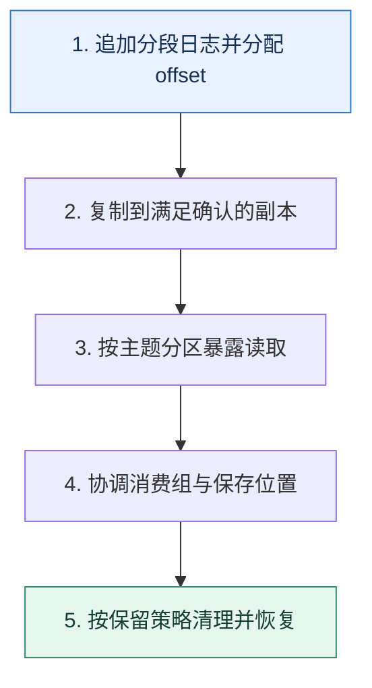

# 从零设计消息队列｜先定义日志，再补齐确认、消费与复制

> 本课只回答一个问题：如果自己实现一个最小可用消息队列，哪些状态不可缺少？

这是一份独立学习稿。来源资料用于核对知识范围；下面的解释、推演、边界和图示均按工程学习路径重新组织，不依赖原页面也能完整阅读。

## 先补齐：建立正确的心智模型

队列的核心不是一个内存列表，而是可追加、可恢复的持久日志，以及生产位置、复制进度和消费位置。先把单分区正确性做清楚，再扩展分区、消费组与高可用。

读这一课时，始终把“组件名字”换成三个可追踪对象：**谁发起动作、状态存在哪里、失败后由谁收敛**。这样遇到不同产品或版本，仍能用同一套模型判断。

## 本节精讲：机制是怎样一步步工作的

Broker 接收记录后追加到分段日志，稀疏索引帮助按 offset 定位；生产请求带序列号以识别重试。主题拆成分区提供并行度，每个分区选 Leader 并复制到副本。消费者组通过租约或协调器分配分区，消费位置独立保存，因此同一日志可以被不同组重复读取。保留策略按时间或大小清理日志，与“某个消费者读完即删除”不同。元数据、选主和复制截断都需要明确一致性协议。

下面这张图只表达本课最重要的状态推进，蓝色是入口，绿色是可验收的终点；任一箭头失败，都要回到上文寻找重试、回退或人工处理的位置。

### 一次带数字的完整推演

一个主题有 4 个分区，每个分区 3 副本。生产者把键 K 写到分区 2 的 offset 108，Leader 追加并等两个副本达到确认条件后回复。消费组 G 的成员 C1 从 108 处理，业务成功后提交 109，表示下一条读取位置。另一消费组 H 仍可从自己的位置读取同一条记录。

数字的作用不是制造精确感，而是暴露容量和时间关系。把例子中的流量、延迟、分片数或版本号替换成自己的真实数据，方案可能会随之改变。

## 误区与失效边界

最小实现可以暂不支持跨分区事务、动态扩容和精确一次，但不能省略崩溃恢复与校验。只依赖文件系统缓存却宣称每条已持久化，或只复制数据却没有一致的高水位，都会在选主时暴露数据分叉。

判断一个结论是否可靠，可以追问两次：**它依赖什么前提？前提失效后系统留下了什么状态？** 如果回答只能停在“框架会自动处理”，就还没有走到工程边界。

## 按讲解顺序重建知识链

来源稿覆盖的论证主线在这里被重建成四步，保留问题、推导、反例和收束，不沿用原页面措辞：

1. 从单机追加日志、校验和与崩溃恢复开始。
2. 加入 offset 和稀疏索引，解释读取与保留不互相绑定。
3. 再用分区扩吞吐、消费组分工，用副本承受节点故障。
4. 最后列出确认、高水位、选主、再均衡和幂等生产的状态机。

把四步连起来后，本课不是一个孤立结论，而是一条可以复演的因果链。需要回查课程覆盖范围时，可打开文末的来源稿；学习时以本页模型为主。

## 工程验证：把理解变成证据

最小验收包括：随机断电后日志只能丢到承诺边界；损坏尾段能检测并截断；同一生产序列重试不重复追加；消费组重平衡后一个分区不能同时由两个活跃租约提交。

### 状态检查表

| 步骤 | 状态或动作 | 需要留下的证据 |
| ---: | --- | --- |
| 1 | 追加分段日志并分配 offset | 记录耗时、结果与异常分支，确认状态能进入下一步 |
| 2 | 复制到满足确认的副本 | 记录耗时、结果与异常分支，确认状态能进入下一步 |
| 3 | 按主题分区暴露读取 | 记录耗时、结果与异常分支，确认状态能进入下一步 |
| 4 | 协调消费组与保存位置 | 记录耗时、结果与异常分支，确认状态能进入下一步 |
| 5 | 按保留策略清理并恢复 | 记录耗时、结果与异常分支，确认状态能进入下一步 |

检查表不是要求生产系统逐字采用这些字段，而是强迫设计者为每一步提供可观测结果。只有入口、没有终态的流程，最终都会形成无法解释的中间状态。

## 自我检查

为什么消费组提交的 offset 通常表示“下一条要读的位置”，而不是把消息从日志中删除？

日志保留与某个消费组进度解耦，多个消费组可独立重放。同一条记录能被不同用途读取，offset 只记录组自己的游标。

再做一次闭卷练习：不看上文画出状态图，并为其中任意两个箭头注入超时、进程崩溃或重复请求。如果你能预测最终状态和观测信号，这一课才真正从“听懂”变成“会用”。

## 来源与版本校准

- [查看来源稿（18 页资料整理）](../content/28-design-a-message-queue.md)

来源稿只用于追溯知识范围，不是本学习稿的正文。具体产品的默认值、命令与内部实现会随版本变化；落地前应使用目标版本官方文档和故障演练再次确认。

本课涉及的产品行为以这些官方资料为校准入口：

- [Apache Kafka · 官方文档](https://kafka.apache.org/documentation/)
- [Apache Kafka · Design](https://kafka.apache.org/25/design/design/)
