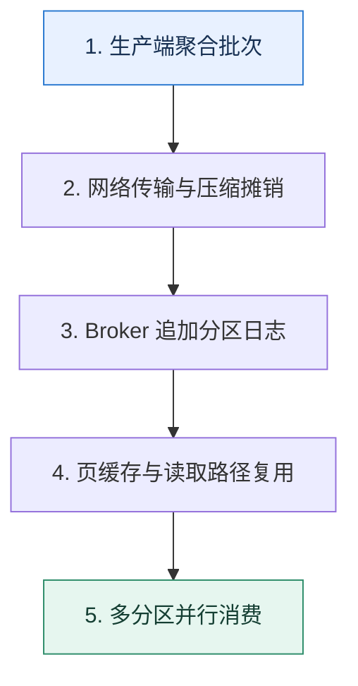

# Kafka 吞吐来源｜批量、追加日志与并行分区怎样叠加

> 本课只回答一个问题：Kafka 为什么能在可靠保存消息的同时维持高吞吐？

这是一份独立学习稿。来源资料用于核对知识范围；下面的解释、推演、边界和图示均按工程学习路径重新组织，不依赖原页面也能完整阅读。

## 先补齐：建立正确的心智模型

高吞吐不是“顺序写”一个原因，而是端到端减少每条消息的固定成本：生产端批量、网络与压缩摊销、Broker 追加日志、操作系统页缓存、读取传输路径和分区并行共同作用。

读这一课时，始终把“组件名字”换成三个可追踪对象：**谁发起动作、状态存在哪里、失败后由谁收敛**。这样遇到不同产品或版本，仍能用同一套模型判断。

## 本节精讲：机制是怎样一步步工作的

生产者把多条记录组成 batch，一次系统调用和网络往返承载更多数据，压缩也能跨记录获得更高比例。Broker 以追加方式写分区日志，避免随机更新；页缓存让读写复用操作系统成熟的缓存与回写。合适平台可利用零拷贝类路径减少用户态复制，但具体机制受操作系统、加密和版本影响，不能作为永恒口号。分区让不同磁盘和节点并行，消费者也能按分区扩展。

下面这张图只表达本课最重要的状态推进，蓝色是入口，绿色是可验收的终点；任一箭头失败，都要回到上文寻找重试、回退或人工处理的位置。

### 一次带数字的完整推演

若单条 1KB 消息每次独立请求，10 万条会产生 10 万次协议与系统调用开销。改为每批 500 条，只需约 200 个批次；即使等待批次增加 5ms 延迟，吞吐和压缩率可能大幅改善。把 24 个分区均匀放到 6 个 Broker，则写入与消费可并行，但热点键仍可能只压在一个分区。

数字的作用不是制造精确感，而是暴露容量和时间关系。把例子中的流量、延迟、分片数或版本号替换成自己的真实数据，方案可能会随之改变。

## 误区与失效边界

更大的 batch 和等待时间会增加尾延迟与内存；更多分区带来文件、复制、选主和再均衡成本。吞吐优化不能以降低确认级别、容忍数据丢失为默认代价，可靠性目标必须先固定。

判断一个结论是否可靠，可以追问两次：**它依赖什么前提？前提失效后系统留下了什么状态？** 如果回答只能停在“框架会自动处理”，就还没有走到工程边界。

## 按讲解顺序重建知识链

来源稿覆盖的论证主线在这里被重建成四步，保留问题、推导、反例和收束，不沿用原页面措辞：

1. 先把单条消息的固定成本拆成网络、系统调用、复制和存储。
2. 说明批量与压缩如何摊薄这些成本。
3. 再解释追加日志、页缓存与传输路径为什么避免额外搬运。
4. 最后用分区扩并行，同时计算热点和元数据代价。

把四步连起来后，本课不是一个孤立结论，而是一条可以复演的因果链。需要回查课程覆盖范围时，可打开文末的来源稿；学习时以本页模型为主。

## 工程验证：把理解变成证据

基准测试同时报告消息条数与字节吞吐、P50/P99 延迟、CPU、磁盘吞吐、网络、压缩比和副本延迟。只给“每秒多少条”而不说明消息大小、确认配置和硬件，结果无法复现。

### 状态检查表

| 步骤 | 状态或动作 | 需要留下的证据 |
| ---: | --- | --- |
| 1 | 生产端聚合批次 | 记录耗时、结果与异常分支，确认状态能进入下一步 |
| 2 | 网络传输与压缩摊销 | 记录耗时、结果与异常分支，确认状态能进入下一步 |
| 3 | Broker 追加分区日志 | 记录耗时、结果与异常分支，确认状态能进入下一步 |
| 4 | 页缓存与读取路径复用 | 记录耗时、结果与异常分支，确认状态能进入下一步 |
| 5 | 多分区并行消费 | 记录耗时、结果与异常分支，确认状态能进入下一步 |

检查表不是要求生产系统逐字采用这些字段，而是强迫设计者为每一步提供可观测结果。只有入口、没有终态的流程，最终都会形成无法解释的中间状态。

## 自我检查

把批次从 100 条扩大到 1000 条，为什么吞吐可能提高而 P99 延迟变差？

消息需要等待批次凑齐或达到超时，单批处理时间和重试代价也更大。批量摊销固定成本，但会引入排队等待和更大的故障单位。

再做一次闭卷练习：不看上文画出状态图，并为其中任意两个箭头注入超时、进程崩溃或重复请求。如果你能预测最终状态和观测信号，这一课才真正从“听懂”变成“会用”。

## 来源与版本校准

- [查看来源稿（22 页资料整理）](../content/29-kafka-performance.md)

来源稿只用于追溯知识范围，不是本学习稿的正文。具体产品的默认值、命令与内部实现会随版本变化；落地前应使用目标版本官方文档和故障演练再次确认。

本课涉及的产品行为以这些官方资料为校准入口：

- [Apache Kafka · 官方文档](https://kafka.apache.org/documentation/)
- [Apache Kafka · Design](https://kafka.apache.org/25/design/design/)
