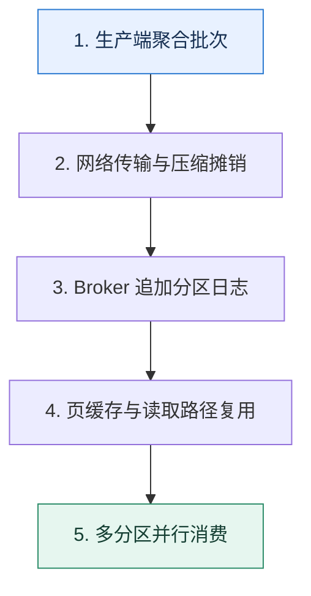

# Kafka 吞吐来源｜批量、追加日志与并行分区怎样叠加

> 本课只解决一个问题：Kafka 为什么能在可靠保存消息的同时维持高吞吐？

这不是原页面的缩写，也不是一组孤立结论。下面先建立一个能推演的最小世界，再把状态、数字和失败分支摊开，最后按来源讲解顺序覆盖全部知识线索。读完后，你应当能从 `生产端聚合批次` 一直解释到 `多分区并行消费`，并说明中途任意一步失败会留下什么状态。

## 零基础入口：先建立本课的心智画面

高吞吐不是“顺序写”一个原因，而是端到端减少每条消息的固定成本：生产端批量、网络与压缩摊销、Broker 追加日志、操作系统页缓存、读取传输路径和分区并行共同作用。

先不要急着记组件名。只抓住四个问题：**现在手里有什么输入？下一步只做什么动作？哪个状态发生变化？变化后的结果交给谁？** 之后遇到新框架，只要这四个答案不变，核心机制就没有变。

### 放进一个足够小、可以手算的世界

若单条 1KB 消息每次独立请求，10 万条会产生 10 万次协议与系统调用开销。改为每批 500 条，只需约 200 个批次；即使等待批次增加 5ms 延迟，吞吐和压缩率可能大幅改善。把 24 个分区均匀放到 6 个 Broker，则写入与消费可并行，但热点键仍可能只压在一个分区。

这个小世界故意只保留本课必需的对象。生产系统会有更多节点、线程、分片和异常，但数量增加不会改变这里的因果关系。先确认你能手算这个例子，再把数字替换成真实系统数据。

### 先预测，不要马上看结论

**把批次从 100 条扩大到 1000 条，为什么吞吐可能提高而 P99 延迟变差？**

先写下自己的判断，并指出你依赖的前提。文末自我检查会揭示答案；如果答案不同，回到下面的状态表找出第一个分叉点。

## 本节精讲：让机制一步一步发生

生产者把多条记录组成 batch，一次系统调用和网络往返承载更多数据，压缩也能跨记录获得更高比例。Broker 以追加方式写分区日志，避免随机更新；页缓存让读写复用操作系统成熟的缓存与回写。合适平台可利用零拷贝类路径减少用户态复制，但具体机制受操作系统、加密和版本影响，不能作为永恒口号。分区让不同磁盘和节点并行，消费者也能按分区扩展。

### 可见状态推进

| 当前步 | 现在发生的动作 | 下一步拿到什么 |
| ---: | --- | --- |
| 1 | 生产端聚合批次 | 网络传输与压缩摊销 |
| 2 | 网络传输与压缩摊销 | Broker 追加分区日志 |
| 3 | Broker 追加分区日志 | 页缓存与读取路径复用 |
| 4 | 页缓存与读取路径复用 | 多分区并行消费 |
| 5 | 多分区并行消费 | 得到可核对的终态 |

图只承担一个任务：让你看清状态如何向前移动。它不意味着每一步必然成功；网络超时、进程退出、重复执行和数据竞争都可能让箭头停在中间，因此后面必须继续讨论失效边界。

### 一次带数字的完整推演

若单条 1KB 消息每次独立请求，10 万条会产生 10 万次协议与系统调用开销。改为每批 500 条，只需约 200 个批次；即使等待批次增加 5ms 延迟，吞吐和压缩率可能大幅改善。把 24 个分区均匀放到 6 个 Broker，则写入与消费可并行，但热点键仍可能只压在一个分区。

数字不是装饰。它迫使我们回答容量、顺序、时间窗口或版本选择问题。若换一个数字就得出不同结论，真正的设计依据就是那个阈值，而不是某个中间件名称。

## 按讲解顺序重建知识链：完整来源讲解

下面按来源资料的教学顺序重新编排完整内容。转换页码、来源图片、推广信息、水印和个人宣传已经删除；原本围绕求职问答的角色与措辞改写为工程学习、方案评审和故障复盘语境。机制、算法、例子、反例、事故线索、评论补充和限制条件仍然保留。这里的作用是补齐知识覆盖，不取代前面的独立推演。

今天我们来讨论一个问题，Kafka 的性能为什么那么好？

Kafka 的高性能话题也算是热点了，如果你技术讨论的公司在并发量或者数据量上已经到了一定地步，那么技术讨论的时候大概率逃不过这个问题。

大部分人面不好这个部分的原因只有一个：Kafka 为了实现高性能采用的手段太多了，以至于根本记不住。那么这一节课我就先聚焦在 Kafka 本身为了高性能做了哪些事情，下一节课我再从实践出发，告诉你怎么优化 Kafka 的性能。

让我们先从 Kafka 的一些基本知识开始说起。

### Kafka 分段与索引

即便在同一个分区内部，Kafka 也进一步利用了分段日志和索引来加速消息查找。在 Kafka 内部，一个分区的日志是由很多个段（segment）组成的，每个段你可以理解成一个文件。同一

个 topic 的文件就存放在以 topic 命名的目录下。

为了快速找到对应的段文件，段日志文件使用了偏移量来命名。假如说一个文件的名字是N.log，那么就表示这个段文件里第一条消息的偏移量是 N + 1。

这里你就能猜到，Kafka 完全可以根据文件名来进行二分查找，从而快速定位到段文件。

为了加快段文件内的查找，每一个段文件都有两个索引文件。

一个是偏移量索引文件，存储着部分消息偏移量到存储位置的映射，类似于 <offset,position> 这种二元组。这个 offset 不是全局 offset，是相对于这个文件第一条消息的偏移量。也就是说假如第一条消息的全局偏移量是 1000，那么偏移量为 1002 的消息的索引项是 <2, pos1>。一个是时间索引文件，存储着时间戳到存储位置的映射，类似于 <timestamp,position> 二元组。

所以整个日志文件目录看上去是这样的。

以这张图片为例，假如说要查找 topic 为 test_topic，分区为 1，偏移量为 20000 的消息，那么整个过程是这样的。

1. 在日志目录下找到名字为 test_topic_1 的子目录，里面就放着这个分区的消息日志文件。
2. 在 test_topic_1 子目录下，根据文件名进行二分查找，可以确定 20000 这条消息应该放在
010031. log 这个文件里面。
3. 利用 010031.index 的内容进行二分查找，查找索引项。如果 20000 恰好有一个索引项<20000, pos0>，那么就读取 pos0 这个位置的数据。
4. 如果 20000 没有对应的索引项，就找到比 20000 小的最接近 20000 的索引项，假如有<19990，pos1>，那么就从 pos1 往后遍历，找到 20000 对应的数据。
对应的根据时间查找也差不多。这里要注意的是，索引文件放的只是部分消息对应的位置，因为 Kafka 希望索引文件能够装入内存。这种思想我之前提到过，我们在讨论 MySQL 索引的时候也是默认索引都在内存里面。

为了帮助你记忆，我整理成了三句话：topic 加分区定目录，偏移量定文件，索引定位置。记住这三句话就可以了。

### 零拷贝

零拷贝（zero copy）是中间件广泛使用的一个技术，它能极大地提高中间件的性能。所谓的零拷贝，就是指没有 CPU 参与的拷贝。要理解零拷贝，要先从一般的读写操作开始讲起。假如说你现在要从磁盘读取内容，然后发送到网络上，那么基本流程如图所示。

DMA （Direct Memory Access）是一个独立于 CPU 的硬件，所以我们不太在意 DMA 拷贝。NIC（Network Interface Card）就是指网卡。

这里面总共有四个步骤。

1. 应用进入内核态，从磁盘里读取数据到内核缓存，也就是读缓存。这一步应用就是发了一个指令，然后是 DMA 来完成的。
2. 应用把读缓存里的数据拷贝到应用缓存里，这个时候切换回用户态。
3. 应用进入内核态，把应用缓存里的数据拷贝到内核缓存里，也就是写缓存。
4. 应用把数据从写缓存拷贝到 NIC 缓存里，这一步应用也就是发了一个指令，DMA 负责执行。
而这里面总共有四次内核态与用户态的切换。

为什么要那么复杂，能不能不经过应用缓存，直接让磁盘读到内核缓存，然后内核缓存直接写到 NIC 缓存？这样不是非常完美吗？

也可以，而这就是零拷贝，对应的内核态 - 用户态切换，也只剩下了两次。

那么和最原始的操作比起来，零拷贝少了两次内核态与用户态的切换，还少了两次 CPU 拷贝。但是零拷贝本身还是要用到 DMA 拷贝。

### 批量操作的优势

批量操作在高性能中间件里面也很常见。那么批量操作的优势究竟在哪里呢？主要体现在两个方面：一个是更少的系统调用和内核态与用户态的切换，还有一个是高效利用网络带宽。

我给你举一个例子，客户端每次都只发一个请求到服务端上，如今要发 100 个请求。现在客户端用了零拷贝技术，那么客户端发送 100 个请求，需要 100 次系统调用，200 次内核态与用户态的切换。而如果客户端一次性发送 100 个请求，那么它只需要 1 次系统调用，2 次内核态与用户态的切换。

在网络传输的时候，每一次发送都有一个固定开销，比如说协议头的部分，这个开销大小和具体的协议设计有关。假如说每个请求大小是 1KB，在网络传输的时候，分 100 次传输 1KB 和1 次传输 100KB，后者也是明显快很多的。前者需要传输 100 次协议头，而后者只需要传输1 次协议头。

当然，这是指应用层协议，如果是底层协议，比如 TCP，这方面也能节省一些，但是效果不如应用层协议好。

### 把知识转成可验证的工程判断

准备 Kafka 高性能的技术讨论，你还可以在公司内部了解一些信息。

公司有没有因为分区或者 topic 太多导致 Kafka 性能衰退的案例？如果有，当时是怎么解决的？公司内部的 Kafka 用的是机械硬盘还是固态硬盘？公司内部的 Kafka 能撑住的并发量是多大？你的业务并发量是多大？公司内部还有没有别的中间件也使用了类似的优化技术？你在业务中有没有使用批量处理的技术来优化系统性能？如果有，具体是怎么做的？

在技术讨论中，比较好的策略是你根据自己对不同中间件的了解进行横向对比。比如说聊到 WAL的时候，把它和 MySQL、Redis 进行对比。这样能够凸显你对系统设计原则有深刻的理解。

当你和技术评审者聊到了下面这些话题的时候，你都可以尝试引导到这节课的话题下。

你们聊到了 WAL 和 AOF，可以提及 Kafka 利用了类似的技术。你们聊到操作系统的基本原理，系统调用、文件 IO 等，你就可以提及零拷贝，批量处理技术在 Kafka 中的应用。

你们聊到了并发优化的内容，那么可以用分区作为例子解释缩小并发粒度的好处。你们聊到其他中间件采用了后面我列举的技术，那么你就可以和 Kafka 对比，深入阐述相关原理。你们聊到了 Kafka 消息怎么存储，那么你就可以从性能的角度解释 Kafka 的分段和索引的优点。

当然，技术评审者不一定直接问你为什么 Kafka 性能那么高，他也可能有多种问法。

你们公司的 Kafka 性能怎样？怎么做到的？Kafka 为什么要用零拷贝？分区太多为什么会导致 Kafka 性能衰退？Kafka 为什么要用压缩技术？Kafka 是怎么查找到特定偏移量的消息的？

这一类问题，你都可以用后面的内容来解释。

### 技术推理路径

Kafka 本身使用了很多手段来保证高性能，包括零拷贝、page cache（页缓存）、顺序读写、分区分段与索引、批量处理、压缩。其中零拷贝和顺序读写最重要，是一定要能解释出来的。

### 零拷贝

前面你已经了解了什么是零拷贝，那么你在解释的时候就可以介绍零拷贝是如何运作的，然后再总结零拷贝的优势。

零拷贝是中间件设计的通用技术，是指完全没有 CPU 参与的读写操作。我以从磁盘读数据，然后写到网卡上为例介绍一下。首先，应用程序发起系统调用，这个系统调用会读取磁盘的数据，读到内核缓存里面。同时，磁盘到内核缓存是 DMA 拷贝。然后再从内核缓存

拷贝到 NIC 缓存中，这个过程也是 DMA 拷贝。这样就完成了整个读写操作。和普通的读取磁盘再发送到网卡比起来，零拷贝少了两次 CPU 拷贝，和两次内核态与用户态的切换。

正常来说，你在解释里面不需要介绍普通的读取磁盘再发送的流程，不过如果技术评审者问了，你就可以按照前置知识里面的内容来解释。这里还有可能引申到操作系统相关的基本知识，技术讨论前你也不要忘了复习。

然后你再补充一句，引出 page cache 的内容。

这里说的内核缓存，在 linux 系统上其实就是 page cache。

### page cache

相信你对 page cache 并不陌生，前面我们接触过很多次了。Kafka 把数据写入到 page cache 而不是直接刷新到磁盘上，有效减少了真实的 IO 操作次数。

另外一方面，Kafka 是基于 JVM 的，所以直接操作 page cache 能够避开 JVM 的垃圾回收。同时也能充分利用操作系统对 page cache 的优化。

Kafka 充分利用了 page cache。Kafka 写入的时候只是写入到了 page cache，这几乎等价于一个内存写入操作，然后依靠异步刷新把数据刷新到磁盘上。而 page cache 是可以存放很多数据的，也就是说 Kafka 本身调用了很多次写入操作之后，才会真的触发 IO 操作，提高了性能。而且，Kafka 是基于 JVM 的，那么利用 page cache 也能缓解垃圾回收的压力。大多数跟 IO 操作打交道的中间件都有类似的机制，比如说 MySQL、Redis。

你在这里可以适当引导一下，把话题引导到消息丢失上。

不过使用 page cache 的缺陷就是如果消息还没刷新到磁盘上，服务器就宕机了，那么整个消息就丢失了。

### 顺序写

在写操作里面，我们一般默认写是很慢的。但是实际上，写操作分成顺序写和随机写，我们认为写操作很慢，那都是随机写，而顺序写本身并不慢，所以你要先指出顺序写的性能。

在计算机里面，普遍认为写很慢，但是实际上是随机写很慢，但是顺序写并不慢。即便是机械硬盘的顺序写也并不一定会比固态硬盘的顺序写慢。

然后补充 Kafka 充分利用了顺序写。

Kafka 在写入数据的时候就充分利用了顺序写的特性。它针对每一个分区，有一个日志文件WAL（write-ahead log），这个日志文件是只追加的，也就是顺序写的，因此发消息的性能会很好。MySQL、Redis 和其他消息中间件也采用了类似的技术。

紧接着你再补充一点业界早期的讨论。

所以早期的时候业界就有人做过实验，一台 Kafka 服务器，把磁盘从机械硬盘切换到固态硬盘，性能虽然有提升，但是并不明显。在固态硬盘很贵的情况下，并不划算。

接下来你可以从两个角度刷进阶推导：分区多影响写入性能和如何解决分区多问题。

### 分区多影响写入性能

你应该注意到， Kafka 是每一个分区都有一个日志文件，万一你有很多分区呢？也就是说，如果分区特别多，就可能导致 Kafka 的写性能衰退。

但是 Kafka 的顺序写要求的是分区内部顺序写，不同的分区之间就不是顺序写的。所以如果一个 topic 下的分区数量不合理，偏多的话，写入性能是比较差的。

举个例子，假如说要写入 100M 的数据，如果只有一个分区，那就是直接顺序写入100M。但是如果有 100 个分区，每个分区写入 1M，它的性能是要差很多的。因为一个topic 至少有一个分区，topic 多也会影响 Kafka 的性能。最好是在创建 topic 的时候就规划好分区，但是如果没规划好，还是得考虑解决。

这个解释里你提到了一个点，就是分区设置不合理，所以技术评审者就会追问你如何估计分区数量。这个知识你已经在前面第 25 讲学过了，记得复习一下。

最后一句话，也是你引导技术评审者追问怎么解决分区或者 topic 过多的问题。

### 分区过多如何解决？

我们从分区过多和 topic 过多的角度分别去讨论。

如果是分区过多的话很好办，你只需要不使用其中的一些分区就可以了。

如果某个 topic 分区太多了用不上，就可以考虑不用其中的一些分区。假设说我们现在有32 个分区，但是事实上业务本身用不上那么多分区，那么就可以考虑要求发送者只将消息发送到特定的 16 个分区上。当然，能够直接创建新 topic 是最好的。

topic 过多的问题，要稍微棘手一点，你可以考虑合并 topic。

topic 过多的话，可以考虑合并一些 topic，但这也是看业务的。比如说最开始的设计是某个主业务下的子业务都有一个 topic，那么可以考虑这些子业务合并使用一个 topic，然后在里面用 type 等字段来标记是归属于哪个子业务的。

有时候技术评审者可能会问，究竟多少个分区才算多，或者多少个分区才会导致性能下降呢？这里我给你一个阿里云中间件团队测试的结论。

多少分区才算多，以及多少分区才会引起性能下降，这和 topic 本身有关，也和业务有关。

不过之前阿里云中间件团队测试过，在一个 topic 八个分区的情况下，超过 64 个 topic 之后，Kafka 性能就开始下降了。

如果有兴趣，你也可以在你们公司的 Kafka 上执行一下测试。

### 分区

分区本身就能带来性能的提升，分区的好处就是 Kafka 可以按分区来处理，减少并发竞争。

Kafka 的分区机制也能提高性能。假如说现在 Kafka 没有分区机制，只有 topic，那么可以预计的是不管是读还是写，并发竞争都是 topic 维度的。而在引入了分区机制之后，并发竞争的维度就变成分区了。如果是操作不同的分区，那么完全不需要搞并发控制。

如果你在技术讨论过程中和技术评审者讲到了并发优化的点，那么你可以用分区这个例子来解释可以通过缩小并发粒度来提高性能。

### 分段与索引

分段与索引的基本概念我们已经学过了，所以你只需要根据我总结的三句话简单介绍分段与索引就可以。同时讲清楚如何查找到特定消息，因为查找过程本身就是一个进阶推导。

在 Kafka 中，每一个分区都对应多个段文件，放在同一个目录下。Kafka 根据 topic 和分区就可以确定消息存储在哪个目录内。每个段文件的文件名就是偏移量，假设为 N，那么这个文件第一条消息的偏移量就是 N+1。所以 Kafka 根据偏移量和文件名进行二分查找，就能确定消息在哪个文件里。

然后每一个段文件都有一个对应的偏移量索引文件和时间索引文件。Kafka 根据这个索引文件进行二分查找，就很容易在文件里面找到对应的消息。如果目标消息刚好有这个索引项，那么直接读取对应位置的数据。如果没有，就找到比目标消息偏移量小的，最接近目标消息的位置，顺序找过去。整个过程非常像跳表。

### 批量处理

批量处理是高并发和大数据的常见解决方案。Kafka 为了提高性能，引入端到端的批量发送机制。在发送端，Kafka 的客户端并不是一次只发送一条消息，而是发送一批消息（record batch）。简单来说，就是好几条消息合并在一起发送。

而在 broker 端，Kafka 在存储的时候也是按照批来处理的。你在解释的时候要先解释 Kafka批量处理的基本机制。

Kafka 还采用了批量处理来提高性能。Kafka 的客户端在发送的时候，并不是说每来一条消息就发送到 broker 上，而是说聚合够一批再发送。而在 broker 这一端，Kafka 也是同样按照批次来处理的，显然即便同样是顺序写，一次性写入数据都要比分多次快很多。除了Kafka，很多高并发、大数据的中间件也采用类似的技术，比如说日志采集与上报就采用批量处理来提升性能。

然后你可以从批量处理的高性能原因和兜底技术两个角度刷进阶推导。

批量处理高性能原因

首先你要深入分析批量处理高性能的原因。

批量处理能够提升性能的原因是非常直观的，有两方面。一方面是减少系统调用和内核态与用户态切换的次数。比方说 100 个请求发送出去，即便采用零拷贝技术，也要 100 次系统调用 200 次内核态与用户态切换。而如果是一次性发送的话，那么就只需要 1 次系统调用和 2 次内核态与用户态切换。

另外一方面，批量处理也有利于网络传输。在网络传输中，一个难以避免的问题就是网络协议自身的开销。比如说协议头开销。那么如果发送 100 次请求，就需要传输 100 次协议头。如果 100 个请求合并为一批，那就只需要一个协议头。

批量处理的兜底技术

那么多大批次比较合适呢？关键词就是要兜底。

不过批次也要设计合理。正常来说批次总是越大越好，但是批次太大会导致一个后果，就是客户端难以凑够一个批次。比如说 100 条消息一批和 1000 条消息一批，后者肯定很难凑够一个批次。一般来说批量处理都是要兜底的，就是在固定时间内如果都没有凑够某个批次，那么就直接发送。比如说 Kafka 里面生产者就可以通过 linger.ms 参数来控制生产者最终等多长时间。时间到了，即便只有一条消息，生产者也会把消息发送到 broker 上。

### 压缩

为了进一步降低数据传输和存储的压力，Kafka 还启用了压缩功能。Kafka 的压缩机制很特别。正常我们会认为如果 Kafka 支持压缩，那么应该是生产者压缩，发送到 broker 之后，broker 解压缩。然后 broker 压缩，发送到消费者之后，消费者解压缩。

Kafka 是彻底地端到端，就是生产者压缩之后发送到 broker，broker 直接存储。当 broker推送到消费者的时候，消费者解压缩。

Kafka 为了进一步降低网络传输和存储的压力，还对消息进行了压缩。这种压缩是端到端的压缩，也就是生产者压缩，broker 直接存储压缩后的数据，只有消费者才会解压缩。它带来的好处就是，网络传输的时候传输的数据会更少，存储的时候需要的磁盘空间也更少。当然，缺点就是压缩还是会消耗 CPU。如果生产者和消费者都是 CPU 密集型的应用，那么这种压缩机制反而加重了它们的负担。

最后我们点出 CPU 密集型应用在使用 Kafka 的时候还面临着压缩数据竞争 CPU 资源的问题。不过在业界，CPU 密集型的应用非常少，会使用到 Kafka 的 CPU 密集型应用就更少了。

### 本节原始知识线索收束

最后我来总结一下这节课的要点。通过 Kafka 的分段与索引技术，我们了解到一个消息是怎么被存储的，还有消息是怎么查找的。这里还引入了一个新概念——零拷贝技术，你需要记住相比传统 IO 它独特的优势。

在解释 Kafka 为什么性能这么好这个问题的时候，你要从零拷贝、page cache、顺序写、分区、分段与索引、批量处理、压缩这几个角度解释。而如果你记不住这么多内容，那么记住零

拷贝、顺序写这两个也可以。

我也建议你从横向角度去分类，比如写下零拷贝再写下使用了零拷贝的相应的中间件。这样能够加深你的理解，你在工程复盘时也可以用这个知识来刷进阶推导。

### 继续推演

最后，请你来思考两个问题。

Kafka 用到的这些优化技术，很多中间件也用到了，你能举几个例子吗？我在分区里面讲到分区可以用来缩小并发粒度，减轻并发竞争，你还见过类似的技术吗？或者你有没有尝试在工作中使用类似的技术来优化自己的业务并发性能？

### 补充讨论与边界校准

补充讨论：

page cache 技术，MySQL、 Redis、Elasticsearch 也用到了。顺序写 Hive、Spark、ClickHouse 都使用到了。零拷贝 技术 Netty, RocketMQ肯定使用到了。

分区可以用来缩小并发粒度，减轻并发竞争:JDK1.8 之前实现的 ConcurrentHashMap 版本。HashTable 是基于一个数组 + 链表实现的，所以在并发读写操作集合时，存在激烈的锁资源竞争，也因此性能会存在瓶颈。而 Concurre ntHashMap 就很很巧妙地使用了分段锁 Segment 来降低锁资源竞争

讲解补充：赞！在技术讨论中要记得这种横向对比的技术讨论技巧！

1

补充讨论： 多分区，在写入的时候，是同时写入多个分区吗？还是只写主分区，然后同步到从分区？

讲解补充：这个是和你的生产者的 acks 设置有关的。如果你选择要同步到从分区，那么就是写主分区，然后同步到从分区之后，才算是写入成功了。

补充讨论： 20000 这条消息应该放在 010031.log 这个文件里面。”，这里的20000是不是写错了，应该是2000？根据描述：假如说一个文件的名字是 N.log，那么就表示这个段文件里第一条消息的偏移量是N + 1。

讲解补充：我应该没写错吧？这里就是整个偏移量是 20000，010031 的第一条应该是 10032，20000在这个文件。

补充讨论： Separation）：在高并发环境下，锁竞争可能会成为瓶颈。锁分离是一种将锁拆分成多个细粒度锁的技术，以减少锁竞争和提高并发性能。例如，在数据库中，可以将表锁拆分为行锁或列锁。

数据分片（Data Sharding）：数据分片是一种将数据拆分成多个分片的技术，以提高并发性能和可扩展性。每个分片可以独立处理请求，从而减少竞争和提高吞吐量。例如，在分布式数据库中，可以将数据按照某种规则（如哈希或范围）划分到不同的节点上。

缓存（Caching）：缓存是一种将数据存储在内存中，以加速读写操作和减少对后端存储系统的访问的技术。例如，在 Web 应用中，可以使用缓存来缓存页面、结果集或对象，以减少数据库访问和提高响应速度。

异步处理（Asynchronous Processing）：异步处理是一种将请求和响应分离的技术，以提高并发性能和可扩展性。例如，在 Web 应用中，可以使用异步 Servlet 或异步消息处理器来处理请求，从而释放线程资源和提高吞吐量。

无锁编程（Lock-free Programming）：无锁编程是一种不使用锁的并发编程技术，以减少竞争和提高性能。例如，在并发数据结构中，可以使用无锁算法（如 CAS）来实现原子操作，从而避免锁竞争和死锁。

讲解补充：赞赞赞！如果是技术讨论的话，比较建议用自己业务的例子，这样会有更好的说服力。

补充讨论：

编辑回复: 多谢提醒，已经改好啦🌹

补充讨论：

讲解补充：基本类似，但是我研究不够深入，哈哈哈，没怎么看过源码。

补充讨论： GMP调度模型中的有global queue还有每个P本地的queue，实际P本地的queue的存在也是为了减少并发竞争

讲解补充：赞！这就是典型的全局竞争优化为局部竞争！

补充讨论：

讲解补充：问到我的知识盲区了，我没怎么用过 plusar。之前我做技术选型的时候，我差不多就是无脑选 Kafka。

补充讨论： DMA 来完成的”，这里的“应用发指令”，从Java代码的角度，什么代码的效果是普通的两次拷贝？什么代码可以做到零拷贝（即该代码可以控制DMA来完成数据拷贝）？(附：如果是C语言，又是哪一个语句？这个和专栏有点距离，可以不答)Q2：kafa是用Java写的，kafka可以控制Page Cache，那么，什么Java代码可以控制Page Cac he？Q3：kafka的批量处理，是可以设置的吗？比如：是否采用批量处理，批量处理的数量等。应用可以设置吗？Q4：电商的topic按什么分类？比如京东，首页左边是商品分类，会按商品类型来设置topic吗？Q5：生产者和消费者的压缩，并不是应用压缩，而是kafka客户端的压缩，对吗？ 即生产者和消费者的开发人员并不需要开发压缩、解压缩功能，而是调用kafka的客户端的库，由库来完成压缩和解压缩功能。Q6：kafka功能强大，那其他三种MQ就没有必要用了，只选kafka就可以了。是这样吗？

讲解补充：1. 在 JAVA 层面上其实你是感知不到的，你只知道你调用了一个JAVA 方法。如果这个 JAV A 方法最终在 JDK 里面发起了系统调用，那么你就要进入内核态了。在 Java 里面有一部分方法都是依赖native 方法来实现的。

2. 说起来，这就是我的知识盲点了，以前JAVA我也没直接操作过 Page Cache，但是我之前记得就是有不同的文件相关的 OutputStream 实现，就是没特意写明就是写到了 page cache。
3. 都是可以设置的。
4. 这个每个公司，甚至一个公司的不同部门设计方案都不一样，要看具体的场景。这个topic 和商品分类没什么关系，一般是指什么业务场景。
5. 对的
6. 也不是，因为别的 MQ 有一些 Kafka 没有的功能。不过如果你技术选项，无脑选 Kafka 就是了。这样做最大的好处就是，万一出问题了，别人也不能说 kafka 选得不对。

补充讨论： topic 八个分区的情况下，超过 64 个 topic 之后，Kafka 性能就开始下降了。

老师，这个测试数据是部署了多少broker节点？换句话说，一个broker节点分配多少分区比较合适？

讲解补充：我给你找找原文，应该是这篇 https://developer.aliyun.com/article/62832。

我个人的话对一个 Broker 节点该分配多少分区，没有研究，这个得去找 Kafka 运维的同学了解一下了。

## 把完整讲解收束成一条因果链

1. 先把单条消息的固定成本拆成网络、系统调用、复制和存储。
2. 说明批量与压缩如何摊薄这些成本。
3. 再解释追加日志、页缓存与传输路径为什么避免额外搬运。
4. 最后用分区扩并行，同时计算热点和元数据代价。

把这几步连接起来时，不要省略“为什么”。最终结论只有在前提、状态变化和失败代价都说得清楚时才可靠。

## 误区与失效边界

更大的 batch 和等待时间会增加尾延迟与内存；更多分区带来文件、复制、选主和再均衡成本。吞吐优化不能以降低确认级别、容忍数据丢失为默认代价，可靠性目标必须先固定。

再加一条通用但必须落实到本课对象上的边界：机制只能处理它看得见的信号。若输入指标失真、状态没有持久化、错误被吞掉，或者补偿没有幂等保护，再成熟的框架也只能基于错误证据作决定。

### 三种故障注入方式

| 故障 | 要观察什么 | 不能接受的解释 |
| --- | --- | --- |
| 在第 2 步前让依赖超时 | 是否停在可重试状态，是否消耗完上游预算 | “框架稍后会处理” |
| 在状态写入后让进程退出 | 重启后能否识别已完成与待继续动作 | “再执行一次应该没事” |
| 对同一输入并发执行两次 | 是否出现重复副作用、顺序颠倒或覆盖 | “概率很低” |

## 工程验证：把理解变成可以复查的证据

基准测试同时报告消息条数与字节吞吐、P50/P99 延迟、CPU、磁盘吞吐、网络、压缩比和副本延迟。只给“每秒多少条”而不说明消息大小、确认配置和硬件，结果无法复现。

| 步骤 | 状态或动作 | 最少应留下的证据 |
| ---: | --- | --- |
| 1 | 生产端聚合批次 | 开始时间、结束时间、输入标识、结果状态、异常原因 |
| 2 | 网络传输与压缩摊销 | 开始时间、结束时间、输入标识、结果状态、异常原因 |
| 3 | Broker 追加分区日志 | 开始时间、结束时间、输入标识、结果状态、异常原因 |
| 4 | 页缓存与读取路径复用 | 开始时间、结束时间、输入标识、结果状态、异常原因 |
| 5 | 多分区并行消费 | 开始时间、结束时间、输入标识、结果状态、异常原因 |

验证时同时记录成功路径和失败路径。只证明“正常时能跑通”不能说明设计可靠；至少要让一次超时、一次进程退出和一次重复请求可重现，并能根据日志或指标解释最后状态。

## 学完检查：闭卷画出本课

你现在应该能独立完成四件事：

1. 用自己的话说出本课唯一问题，不使用产品名也能解释。
2. 复算上面的具体例子，并指出哪个输入改变会让结论改变。
3. 沿 Mermaid 图注入一次失败，预测系统停在哪里以及由谁收敛。
4. 说出本课机制不保证什么，并给出一个反例。

## 自我检查

把批次从 100 条扩大到 1000 条，为什么吞吐可能提高而 P99 延迟变差？

消息需要等待批次凑齐或达到超时，单批处理时间和重试代价也更大。批量摊销固定成本，但会引入排队等待和更大的故障单位。

怎样证明自己不是只记住了名词？

把 `生产端聚合批次` 的一个真实输入写出来，逐步记录到 `多分区并行消费`。然后在中间任意一步制造失败；如果你能解释当前状态、下一责任方、可观测证据和恢复边界，就已经拥有可以迁移的工程模型。

## 来源与事实校准

- [查看完整来源稿（本地 22 页资料）](../content/29-kafka-performance.md)

### 当前事实校准

Kafka 的性能来自批量、顺序追加、页缓存、压缩和分区并行的组合，而不是“零拷贝”一个词。批量会增加等待和内存，分区会增加元数据与重平衡成本，每个优化都必须用吞吐、端到端延迟和故障恢复时间共同衡量。

- [Apache Kafka · Documentation](https://kafka.apache.org/documentation/)
- [Apache Kafka · Design](https://kafka.apache.org/25/design/design/)

来源稿用于核对覆盖范围，不随公开站点发布。产品默认值和具体内部行为可能随版本变化；落地时应使用目标版本的官方文档、可运行实验和故障演练校准。本学习稿中的零基础入口、状态推演、故障矩阵和工程验证属于编辑补充，不冒充来源讲解者的原话。
