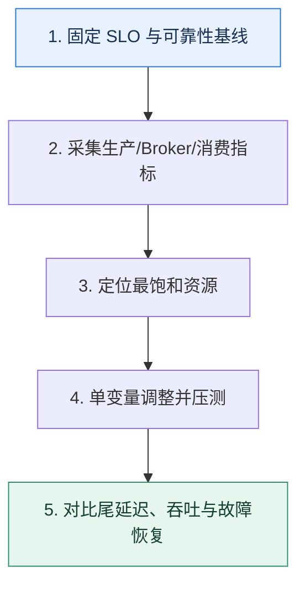

# Kafka 调优｜沿生产、Broker、消费三段寻找真正瓶颈

> 本课只回答一个问题：吞吐不够或延迟升高时，怎样调优而不是盲目改参数？

这是一份独立学习稿。来源资料用于核对知识范围；下面的解释、推演、边界和图示均按工程学习路径重新组织，不依赖原页面也能完整阅读。

## 先补齐：建立正确的心智模型

调优先固定可靠性和延迟目标，再用指标判断瓶颈在生产者、Broker 资源、复制还是消费者。参数是控制杆，不是答案；一次只改变少量变量并保留回退基线。

读这一课时，始终把“组件名字”换成三个可追踪对象：**谁发起动作、状态存在哪里、失败后由谁收敛**。这样遇到不同产品或版本，仍能用同一套模型判断。

## 本节精讲：机制是怎样一步步工作的

生产端关注批次大小、等待时间、压缩、缓冲与在途请求；Broker 关注分区分布、磁盘与网络、页缓存、请求队列、复制落后；消费端关注每批处理、拉取大小、并发模型、提交语义和下游耗时。若分区热点，增加消费者无效；若磁盘空闲而 CPU 被压缩打满，应调整算法或把成本移到合适一侧；若系统开始交换内存到磁盘，尾延迟通常会恶化，应控制堆与进程内存并保留页缓存。

下面这张图只表达本课最重要的状态推进，蓝色是入口，绿色是可验收的终点；任一箭头失败，都要回到上文寻找重试、回退或人工处理的位置。

### 一次带数字的完整推演

基线为 80MB/s、P99 180ms，Broker 磁盘仅 35% 但生产者 CPU 95%，平均批次只有 8KB。先把批次目标增至 64KB、等待从 0 调到 5ms并评估压缩；吞吐升到 140MB/s，P99 210ms。若业务预算是 250ms，这个交换可接受；若预算 100ms，就需要降低等待或扩生产端。

数字的作用不是制造精确感，而是暴露容量和时间关系。把例子中的流量、延迟、分片数或版本号替换成自己的真实数据，方案可能会随之改变。

## 误区与失效边界

不要同时修改十几个参数后用一次峰值证明成功。增加分区可能短期提升并行度，却增加复制、文件句柄和恢复时间；关闭可靠确认换来的吞吐必须明确记为可靠性降级。

判断一个结论是否可靠，可以追问两次：**它依赖什么前提？前提失效后系统留下了什么状态？** 如果回答只能停在“框架会自动处理”，就还没有走到工程边界。

## 按讲解顺序重建知识链

来源稿覆盖的论证主线在这里被重建成四步，保留问题、推导、反例和收束，不沿用原页面措辞：

1. 从端到端延迟分解开始，避免只盯 Broker。
2. 按生产者、Broker、消费者三段列指标和容量。
3. 根据 CPU、磁盘、网络、分区倾斜选择控制杆。
4. 最后用故障与恢复测试验证调优没有破坏确认和重放语义。

把四步连起来后，本课不是一个孤立结论，而是一条可以复演的因果链。需要回查课程覆盖范围时，可打开文末的来源稿；学习时以本页模型为主。

## 工程验证：把理解变成证据

维护实验日志：工作负载、消息大小、分区与副本、确认方式、单次改动、吞吐、P99、资源利用率、积压恢复时间。任何优化都要能从前后两行数据中解释。

### 状态检查表

| 步骤 | 状态或动作 | 需要留下的证据 |
| ---: | --- | --- |
| 1 | 固定 SLO 与可靠性基线 | 记录耗时、结果与异常分支，确认状态能进入下一步 |
| 2 | 采集生产/Broker/消费指标 | 记录耗时、结果与异常分支，确认状态能进入下一步 |
| 3 | 定位最饱和资源 | 记录耗时、结果与异常分支，确认状态能进入下一步 |
| 4 | 单变量调整并压测 | 记录耗时、结果与异常分支，确认状态能进入下一步 |
| 5 | 对比尾延迟、吞吐与故障恢复 | 记录耗时、结果与异常分支，确认状态能进入下一步 |

检查表不是要求生产系统逐字采用这些字段，而是强迫设计者为每一步提供可观测结果。只有入口、没有终态的流程，最终都会形成无法解释的中间状态。

## 自我检查

Broker 磁盘利用率不高，增加磁盘数量却没有提高吞吐，下一步应检查什么？

检查生产者批次与 CPU、网络上限、分区热点、复制等待、消费者或下游。磁盘空闲说明它未必是当前约束，扩非瓶颈资源不会提高端到端吞吐。

再做一次闭卷练习：不看上文画出状态图，并为其中任意两个箭头注入超时、进程崩溃或重复请求。如果你能预测最终状态和观测信号，这一课才真正从“听懂”变成“会用”。

## 来源与版本校准

- [查看来源稿（16 页资料整理）](../content/30-kafka-practice.md)

来源稿只用于追溯知识范围，不是本学习稿的正文。具体产品的默认值、命令与内部实现会随版本变化；落地前应使用目标版本官方文档和故障演练再次确认。

本课涉及的产品行为以这些官方资料为校准入口：

- [Apache Kafka · 官方文档](https://kafka.apache.org/documentation/)
- [Apache Kafka · Design](https://kafka.apache.org/25/design/design/)
