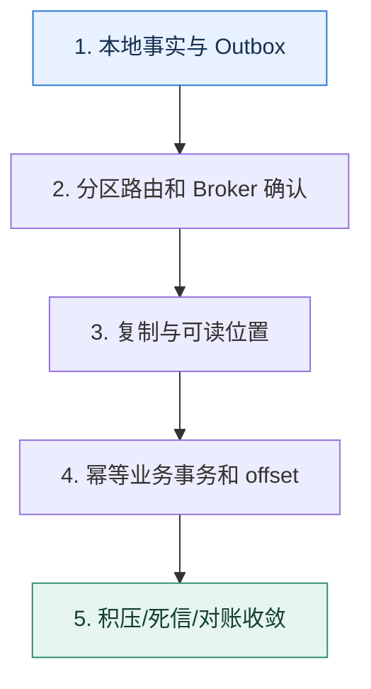

# 消息队列专题复盘｜沿一条事件证明可靠、可序与可恢复

> 本课只回答一个问题：怎样把延迟、顺序、积压、可靠性和幂等串成一条完整的事件生命周期？

这是一份独立学习稿。来源资料用于核对知识范围；下面的解释、推演、边界和图示均按工程学习路径重新组织，不依赖原页面也能完整阅读。

## 先补齐：建立正确的心智模型

专题复盘不背产品参数，而是跟踪一条业务事实：它为何产生、何时可见、存在哪里、由谁处理、失败如何恢复、重复怎样收敛，以及积压时怎样保护下游。

读这一课时，始终把“组件名字”换成三个可追踪对象：**谁发起动作、状态存在哪里、失败后由谁收敛**。这样遇到不同产品或版本，仍能用同一套模型判断。

## 本节精讲：机制是怎样一步步工作的

生产者先在本地事务中保存事实与 Outbox，再按业务键发送到分区；Broker 满足确认条件后回复。消费者按分区读取，业务事务用幂等键落库，再提交位置。延迟动作携带目标时间与版本；积压用差速和最老年龄判断。任何阶段故障都应能回答消息处于哪个可观察状态，恢复后是重试、跳过还是人工处理。

下面这张图只表达本课最重要的状态推进，蓝色是入口，绿色是可验收的终点；任一箭头失败，都要回到上文寻找重试、回退或人工处理的位置。

### 一次带数字的完整推演

支付事件 P88 与订单 O12 同事务写入，投递到 O12 所在分区。库存消费者成功处理但提交 offset 前崩溃，消息重放；唯一键 P88 让第二次读取已有结果。通知消费者下游超时，进入有界重试和死信观察。生产突然高出消费 5000 条/秒，10 分钟积压 300 万条，系统限制非核心通知并优先保证库存链路。

数字的作用不是制造精确感，而是暴露容量和时间关系。把例子中的流量、延迟、分片数或版本号替换成自己的真实数据，方案可能会随之改变。

## 误区与失效边界

一条链路“最终成功”不代表设计合格。若无法定位消息、没有重试上限、死信无人处理、顺序依赖隐藏在并发线程中，下一次故障仍会变成数据悬案。

判断一个结论是否可靠，可以追问两次：**它依赖什么前提？前提失效后系统留下了什么状态？** 如果回答只能停在“框架会自动处理”，就还没有走到工程边界。

## 按讲解顺序重建知识链

来源稿覆盖的论证主线在这里被重建成四步，保留问题、推导、反例和收束，不沿用原页面措辞：

1. 先画出业务事务与消息发送的原子边界。
2. 再标记分区键、复制确认和消费组进度。
3. 注入重复、乱序、消费者崩溃与下游超时，说明每种恢复路径。
4. 最后用积压公式和死信处理人把运行闭环补齐。

把四步连起来后，本课不是一个孤立结论，而是一条可以复演的因果链。需要回查课程覆盖范围时，可打开文末的来源稿；学习时以本页模型为主。

## 工程验证：把理解变成证据

任选一个真实事件，填写 `event_id、business_key、partition、producer_attempt、broker_offset、consumer_attempt、business_result、next_retry_at、final_state`。若日志无法关联这些字段，先补可观测性再谈可靠消息。

### 状态检查表

| 步骤 | 状态或动作 | 需要留下的证据 |
| ---: | --- | --- |
| 1 | 本地事实与 Outbox | 记录耗时、结果与异常分支，确认状态能进入下一步 |
| 2 | 分区路由和 Broker 确认 | 记录耗时、结果与异常分支，确认状态能进入下一步 |
| 3 | 复制与可读位置 | 记录耗时、结果与异常分支，确认状态能进入下一步 |
| 4 | 幂等业务事务和 offset | 记录耗时、结果与异常分支，确认状态能进入下一步 |
| 5 | 积压/死信/对账收敛 | 记录耗时、结果与异常分支，确认状态能进入下一步 |

检查表不是要求生产系统逐字采用这些字段，而是强迫设计者为每一步提供可观测结果。只有入口、没有终态的流程，最终都会形成无法解释的中间状态。

## 自我检查

为什么消息系统的最终验收要看业务对账，而不只是 Broker 的成功率？

Broker 只能证明消息在其边界内被保存和读取，不能证明外部数据库或接口产生了正确且唯一的业务效果。对账才能发现跨边界的漏做、多做和永久中间态。

再做一次闭卷练习：不看上文画出状态图，并为其中任意两个箭头注入超时、进程崩溃或重复请求。如果你能预测最终状态和观测信号，这一课才真正从“听懂”变成“会用”。

## 来源与版本校准

- [查看来源稿（8 页资料整理）](../content/30a-mock-message-queue.md)

来源稿只用于追溯知识范围，不是本学习稿的正文。具体产品的默认值、命令与内部实现会随版本变化；落地前应使用目标版本官方文档和故障演练再次确认。

本课涉及的产品行为以这些官方资料为校准入口：

- [Apache Kafka · 官方文档](https://kafka.apache.org/documentation/)
- [Apache Kafka · Design](https://kafka.apache.org/25/design/design/)
