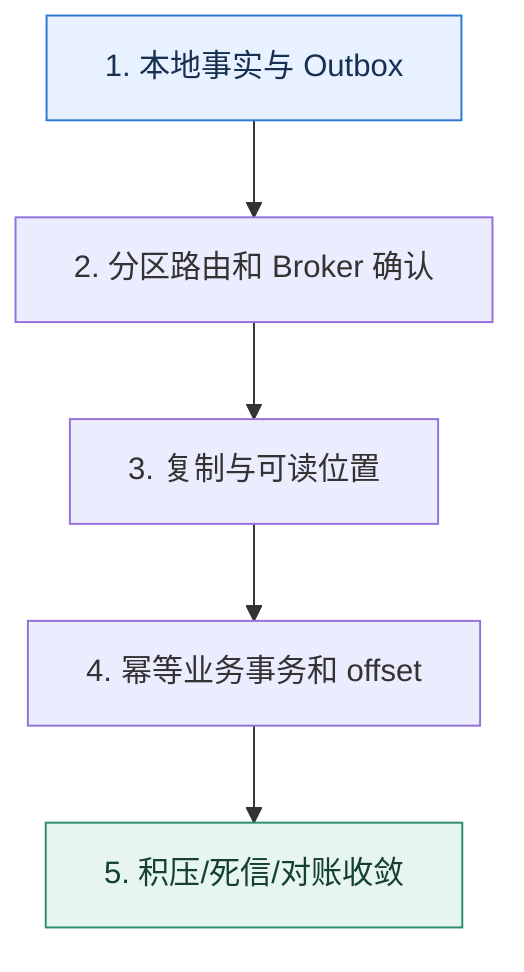

# 消息队列专题复盘｜沿一条事件证明可靠、可序与可恢复

> 本课只解决一个问题：怎样把延迟、顺序、积压、可靠性和幂等串成一条完整的事件生命周期？

这不是原页面的缩写，也不是一组孤立结论。下面先建立一个能推演的最小世界，再把状态、数字和失败分支摊开，最后按来源讲解顺序覆盖全部知识线索。读完后，你应当能从 `本地事实与 Outbox` 一直解释到 `积压/死信/对账收敛`，并说明中途任意一步失败会留下什么状态。

## 零基础入口：先建立本课的心智画面

专题复盘不背产品参数，而是跟踪一条业务事实：它为何产生、何时可见、存在哪里、由谁处理、失败如何恢复、重复怎样收敛，以及积压时怎样保护下游。

先不要急着记组件名。只抓住四个问题：**现在手里有什么输入？下一步只做什么动作？哪个状态发生变化？变化后的结果交给谁？** 之后遇到新框架，只要这四个答案不变，核心机制就没有变。

### 放进一个足够小、可以手算的世界

支付事件 P88 与订单 O12 同事务写入，投递到 O12 所在分区。库存消费者成功处理但提交 offset 前崩溃，消息重放；唯一键 P88 让第二次读取已有结果。通知消费者下游超时，进入有界重试和死信观察。生产突然高出消费 5000 条/秒，10 分钟积压 300 万条，系统限制非核心通知并优先保证库存链路。

这个小世界故意只保留本课必需的对象。生产系统会有更多节点、线程、分片和异常，但数量增加不会改变这里的因果关系。先确认你能手算这个例子，再把数字替换成真实系统数据。

### 先预测，不要马上看结论

**为什么消息系统的最终验收要看业务对账，而不只是 Broker 的成功率？**

先写下自己的判断，并指出你依赖的前提。文末自我检查会揭示答案；如果答案不同，回到下面的状态表找出第一个分叉点。

## 本节精讲：让机制一步一步发生

生产者先在本地事务中保存事实与 Outbox，再按业务键发送到分区；Broker 满足确认条件后回复。消费者按分区读取，业务事务用幂等键落库，再提交位置。延迟动作携带目标时间与版本；积压用差速和最老年龄判断。任何阶段故障都应能回答消息处于哪个可观察状态，恢复后是重试、跳过还是人工处理。

### 可见状态推进

| 当前步 | 现在发生的动作 | 下一步拿到什么 |
| ---: | --- | --- |
| 1 | 本地事实与 Outbox | 分区路由和 Broker 确认 |
| 2 | 分区路由和 Broker 确认 | 复制与可读位置 |
| 3 | 复制与可读位置 | 幂等业务事务和 offset |
| 4 | 幂等业务事务和 offset | 积压/死信/对账收敛 |
| 5 | 积压/死信/对账收敛 | 得到可核对的终态 |

图只承担一个任务：让你看清状态如何向前移动。它不意味着每一步必然成功；网络超时、进程退出、重复执行和数据竞争都可能让箭头停在中间，因此后面必须继续讨论失效边界。

### 一次带数字的完整推演

支付事件 P88 与订单 O12 同事务写入，投递到 O12 所在分区。库存消费者成功处理但提交 offset 前崩溃，消息重放；唯一键 P88 让第二次读取已有结果。通知消费者下游超时，进入有界重试和死信观察。生产突然高出消费 5000 条/秒，10 分钟积压 300 万条，系统限制非核心通知并优先保证库存链路。

数字不是装饰。它迫使我们回答容量、顺序、时间窗口或版本选择问题。若换一个数字就得出不同结论，真正的设计依据就是那个阈值，而不是某个中间件名称。

## 按讲解顺序重建知识链：完整来源讲解

下面按来源资料的教学顺序重新编排完整内容。转换页码、来源图片、推广信息、水印、角色化问答和只服务于技术讨论场景的话术已经删除；机制、算法、例子、反例、事故线索、评论补充和限制条件仍然保留。这里的作用是补齐知识覆盖，不取代前面的独立推演。

恭喜你学完第三章的内容，又到了要验收成果的时刻了。消息队列这一章的内容很重要，知识也很系统，所以为了帮助你更好地掌握这部分内容，我们在这里设置了工程问题。

你在解释的时候，最好是能够写成一个个文档，至少也要口头上说一遍。千万不要仅仅在脑海里面回忆一遍。因为在真正技术讨论的时候，脑海中的记忆到嘴里说出的话，还需要一个转换。

### 22｜消息队列：消息队列可以用来解决什么问题？

1. 你用过消息队列吗？主要用来解决什么问题？异步、削峰和解耦你能各举一个例子吗？
2. 你用的是哪个消息队列？为什么使用它而不用别的消息队列？
3. 为什么你一定要用消息队列？不用行不行？不用有什么缺点？
4. 在对接多个下游的时候，直接用 RPC 调用行不行？为什么？
5. 为什么说使用消息队列可以提高性能？

6. 为什么说使用消息队列可以提高扩展性？
7. 为什么说使用消息队列可以提高可用性？
8. 为什么秒杀场景中经常用消息队列？怎么用的？
9. 订单超时取消可以怎么实现？
10. 你了解事件驱动吗？
11. 什么是 SAGA 事务？怎么利用事件驱动来设计一个 SAGA 事务框架？
### 23｜延迟消息：怎么在 Kafka 上支持延迟消息？

1. 什么是延迟消息？你有没有用过？可以用来解决什么问题？
2. Kafka 支不支持延迟消息？为什么 Kafka 不支持？
3. RabbitMQ 支不支持延迟消息？怎么支持的？
4. RabbitMQ 的延迟消息解决方案有什么缺点？让你来改进，你会怎么办？
5. 什么是死信队列？什么是消息 ttl？
6. 如果要让 Kafka 支持延迟消息你会怎么做？你有几种方案？各有什么优缺点？
7. 在你的延迟消息队列方案里面，时间有多精确？比如说我希望在 10:00:00 发出来，你能保证这个一定恰好在这个时刻发出来吗？误差有多大？你能进一步提高时间精确性吗？
8. 在分区设置不同延迟时间的方案里，能不能支持随机延迟时间？
9. 在分区设置不同延迟时间的方案里，如果要是发生了 rebalance，会有什么后果？
10. 当你从准备转发消息到业务 topic（biz_topic）的时候失败了，有什么后果？怎么办？
11. 在你使用 MySQL 支持延迟消息的方案里，你怎么解决性能问题？
12. 如果要分库分表来解决 MYSQL 的性能问题，你会怎么分库分表？是分库还是分表？
13. 如果要是不同业务 topic 的并发量有区别，你分库分表怎么解决这种负载不均匀的问题？
14. 如果延迟消息还要求有序性，该怎么办？
15. 如果你已经将消息转发到了 biz_topic 上，但是更新数据库状态失败了怎么办？
16. 除了用 MySQL，可以考虑用别的中间件来实现延迟消息吗？

### 24｜消息积压：业务突然增长，导致消息消费不过来怎么办？

1. 一个分区可以有多个消费者吗？一个消费者可以消费多个分区吗？
2. 你业务里面的消息有多少个分区？你怎么计算出来的？它能撑住多大的读写压力？
3. 你遇到过消息积压吗？怎么发现的？为什么会积压？最后怎么解决的？
4. 为什么会出现消息积压？只要我容量规划好，肯定不会有消息积压，对不对？
5. 消息积压可以考虑怎么解决？
6. 增加消费者数量能不能解决消息积压问题？
7. 能不能通过限制发送者，让他们少发一点来解决消息积压问题？
8. 现在我发现分区数量不够了，但是运维又不准我增加新的分区，该怎么办？
9. 异步消费有什么缺陷？
10. 你怎么解决异步消费的消息丢失问题？你的方案会引起重复消费吗？
11. 在异步消费一批消息的时候，要是有部分消费失败了，怎么办？要不要提交？
### 25｜消息顺序：保证消息有序，一个 topic 只能有一个 partition 吗？

1. 消息在 Kafka 分区上是怎么存储的？
2. 什么是有序消息？用于解决什么问题？
3. Kafka 上的消息是有序的吗？为什么？
4. 要想在 Kafka 上保证消息有序，应该怎么做？
5. 什么是全局有序？要保证全局有序，在 Kafka 上可以怎么做？
6. 要保证消息有序，一个 topic 只能有一个 partition 吗？
7. 异步消费的时候怎么保证消息有序？
8. 在你使用的多分区方案中，有没有可能出现分区间负载不均衡的问题？怎么解决？
9. 增加分区有可能让你的消息失序吗？怎么解决？
10. 你还知道哪些消息队列是支持有序消息的？
11. 要做到跨 topic 的消息也有序，难点在哪里？

### 26｜消息不丢失：生产者收到写入成功响应后消息一定不会丢失吗？

1. 什么是 ISR？什么是 OSR？
2. 一个分区什么情况下会被挪进去 ISR，什么时候又会被挪出 ISR？
3. 生产者的 acks 参数有什么含义？你用的是多少？
4. 怎么感觉业务选择合适的 acks 参数？
5. 消息丢失的场景有哪些？
6. 你遇到过消息丢失的问题吗？是什么原因引起的？你怎么排查的？最终怎么解决的？
7. 当生产者收到发送成功的响应之后，消息就肯定不会丢失吗？
8. acks 设置为 all，消息就一定不会丢失吗？
9. 什么是事务消息？Kafka 支持事务消息吗？
10. 怎么在 Kafka 上支持事务消息？
11. 什么是本地消息表？拿来做什么的？
12. 你是怎么保证你在执行了业务操作之后，消息一定发出去了？
13. 怎么保证生产者收到发送成功的响应之后，消息一定不会丢失？需要调整哪些参数？
14. 什么是 unclean 选举？有什么问题？你用的 Kafka 允许 unclean 选举吗？
15. 在你设计的回查方案里面，你怎么知道应该回查哪个接口？你这个能同时支持 HTTP 和RPC 吗？能方便扩展到别的协议吗？
16. 你的回查机制有没有可能先收到提交消息？再收到准备消息？怎么保证两者的顺序？
17. 如果你已经把消息发到了业务 topic 上，但是你标记已发送失败了，怎么办？
### 27｜重复消费：高并发场景下怎么保证消息不会重复消费？

1. 什么是布隆过滤器？
2. 什么是 bit array？
3. 为什么说尽量把消费者设计成幂等的？
4. 什么场景会造成重复消费？

5. 什么是恰好一次语义，Kafka 支持恰好一次语义吗？
6. 利用唯一索引来实现幂等的方案里，你是先插入数据到唯一索引，还是先执行业务？为什么
7. 如果先插入唯一索引成功了，但是业务执行失败了，怎么办？
8. 如果不能使用本地事务，你怎么利用唯一索引来实现幂等？中间可能会有什么问题？你怎么解决？
9. 利用唯一索引来解决幂等问题，有什么缺陷？
10. 高并发场景下，怎么解决幂等问题？
11. 在你的高并发幂等方案里面，为什么要引入 Redis？
12. Redis 里面的 Key 过期时间该怎么确定？
13. 布隆过滤器 + Redis + 唯一索引里面，去掉布隆过滤器行不行？去掉 Redis 呢？去掉唯一索引呢？
14. 布隆过滤器 + Redis + 唯一索引方案中能不能使用本地布隆过滤器？怎么用？
15. 布隆过滤器 + Redis + 唯一索引有什么缺陷？
### 28｜架构设计：如果让你设计一个消息队列，你会怎么设计架构

1. Kafka 为什么要引入分区？只有 topic 行不行？
2. Kafka 为什么要强调把 topic 的分区分散在不同的 broker 上？
3. Kafka 为什么要引入消费者组概念？只有消费者行不行？
4. Kafka 为什么要引入 topic？
5. 如果让你来设计一个消息队列，你会怎么设计架构？
6. 在你的设计里面，你能支持延迟消息吗？
7. 在你的设计里面，怎么保证消息有序？
8. 在你的设计里面，会出现消息丢失的问题吗？
9. 在你的设计里面，什么场景会引起重复消息？
10. 在你的设计里面，你觉得性能瓶颈可能出现在哪里？

11. 在你的设计里面，你还可以考虑怎么提高性能？
### 29｜高性能：Kafka 为什么性能那么好

1. 为什么 Kafka 性能那么好？
2. 为什么零拷贝性能那么好？
3. 写磁盘一定很慢吗？顺序写为什么很快？
4. 批量操作为什么快？节省了什么资源？
5. 什么是上下文切换？为什么上下文切换慢？
6. 分区过多有什么问题？topic 过多有什么问题？
7. 分区有什么好处？
8. 实际中使用批量发送之类的技术，可能出现什么问题？怎么解决？
9. 什么是 page cache ？为什么要引入 page cache？

1. 什么是交换区？
2. 如果来不及发送，那么性能瓶颈可能在哪里？
3. 怎么优化发送者的发送性能？
4. 批次发送的时候，多大的批次才是最合适的？
5. 使用压缩有什么优缺点？怎么选择合适的压缩算法？
6. 怎么优化 broker？
7. 怎么优化 broker 所在的操作系统?
8. 什么是 TCP 读写缓冲区？怎么调优？
9. 哪些参数可以影响 Kafka 的主从同步？你优化过吗？
10. 你有优化过 Kafka 的 JVM 吗？怎么优化的？
### 消息队列技术讨论一图懂

### 补充讨论与边界校准

#### 全部留言 (2)

补充讨论：

讲解补充：哈哈哈，暂时没有啊。核心问题专栏都写了，一些比较基础的问题你可以平时学基础知识的时候学到。

补充讨论： array?直接调用某个工具函数就可以实现吗？Q3：常见的4个MQ，好像都是开源的吧。如果想研究源代码，研究哪个更好？

讲解补充：1. ZMQ 我倒是没怎么了解过。

2. 调用 Redis 的API 就可以了
3. 无脑 Kafka

## 把完整讲解收束成一条因果链

1. 先画出业务事务与消息发送的原子边界。
2. 再标记分区键、复制确认和消费组进度。
3. 注入重复、乱序、消费者崩溃与下游超时，说明每种恢复路径。
4. 最后用积压公式和死信处理人把运行闭环补齐。

把这几步连接起来时，不要省略“为什么”。最终结论只有在前提、状态变化和失败代价都说得清楚时才可靠。

## 误区与失效边界

一条链路“最终成功”不代表设计合格。若无法定位消息、没有重试上限、死信无人处理、顺序依赖隐藏在并发线程中，下一次故障仍会变成数据悬案。

再加一条通用但必须落实到本课对象上的边界：机制只能处理它看得见的信号。若输入指标失真、状态没有持久化、错误被吞掉，或者补偿没有幂等保护，再成熟的框架也只能基于错误证据作决定。

### 三种故障注入方式

| 故障 | 要观察什么 | 不能接受的解释 |
| --- | --- | --- |
| 在第 2 步前让依赖超时 | 是否停在可重试状态，是否消耗完上游预算 | “框架稍后会处理” |
| 在状态写入后让进程退出 | 重启后能否识别已完成与待继续动作 | “再执行一次应该没事” |
| 对同一输入并发执行两次 | 是否出现重复副作用、顺序颠倒或覆盖 | “概率很低” |

## 工程验证：把理解变成可以复查的证据

任选一个真实事件，填写 `event_id、business_key、partition、producer_attempt、broker_offset、consumer_attempt、business_result、next_retry_at、final_state`。若日志无法关联这些字段，先补可观测性再谈可靠消息。

| 步骤 | 状态或动作 | 最少应留下的证据 |
| ---: | --- | --- |
| 1 | 本地事实与 Outbox | 开始时间、结束时间、输入标识、结果状态、异常原因 |
| 2 | 分区路由和 Broker 确认 | 开始时间、结束时间、输入标识、结果状态、异常原因 |
| 3 | 复制与可读位置 | 开始时间、结束时间、输入标识、结果状态、异常原因 |
| 4 | 幂等业务事务和 offset | 开始时间、结束时间、输入标识、结果状态、异常原因 |
| 5 | 积压/死信/对账收敛 | 开始时间、结束时间、输入标识、结果状态、异常原因 |

验证时同时记录成功路径和失败路径。只证明“正常时能跑通”不能说明设计可靠；至少要让一次超时、一次进程退出和一次重复请求可重现，并能根据日志或指标解释最后状态。

## 学完检查：闭卷画出本课

你现在应该能独立完成四件事：

1. 用自己的话说出本课唯一问题，不使用产品名也能解释。
2. 复算上面的具体例子，并指出哪个输入改变会让结论改变。
3. 沿 Mermaid 图注入一次失败，预测系统停在哪里以及由谁收敛。
4. 说出本课机制不保证什么，并给出一个反例。

## 自我检查

为什么消息系统的最终验收要看业务对账，而不只是 Broker 的成功率？

Broker 只能证明消息在其边界内被保存和读取，不能证明外部数据库或接口产生了正确且唯一的业务效果。对账才能发现跨边界的漏做、多做和永久中间态。

怎样证明自己不是只记住了名词？

把 `本地事实与 Outbox` 的一个真实输入写出来，逐步记录到 `积压/死信/对账收敛`。然后在中间任意一步制造失败；如果你能解释当前状态、下一责任方、可观测证据和恢复边界，就已经拥有可以迁移的工程模型。

## 来源与事实校准

- [查看完整来源稿（本地 8 页资料）](../content/30a-mock-message-queue.md)

### 当前事实校准

消息专题复盘要能沿一条消息从业务事务、生产发送、Broker 复制、消费处理到下游副作用画出完整时间线，并在任意边界注入崩溃；只背 Kafka 参数不能证明端到端语义。

- [Apache Kafka · Documentation](https://kafka.apache.org/documentation/)
- [Apache Kafka · Design](https://kafka.apache.org/25/design/design/)

来源稿用于核对覆盖范围，不随公开站点发布。产品默认值和具体内部行为可能随版本变化；落地时应使用目标版本的官方文档、可运行实验和故障演练校准。本学习稿中的零基础入口、状态推演、故障矩阵和工程验证属于编辑补充，不冒充来源讲解者的原话。
