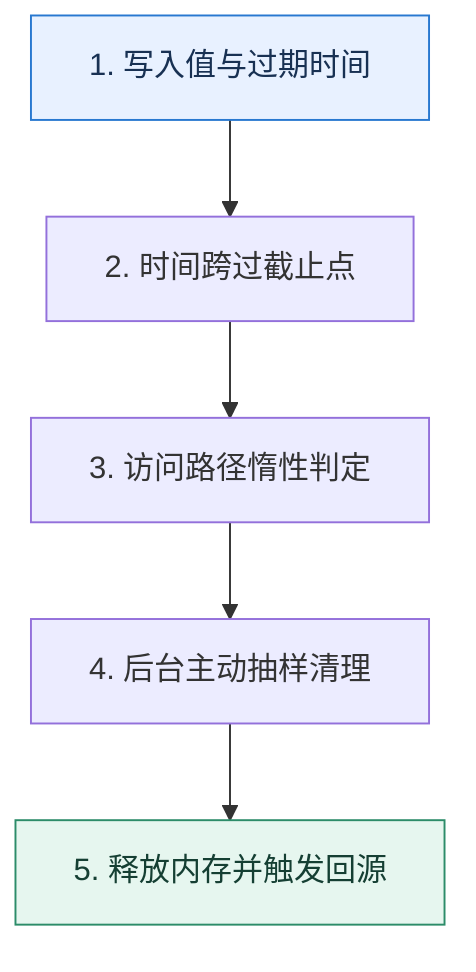

# Redis 过期机制｜键到期后为什么不一定立刻消失

> 本课只回答一个问题：给键设置 TTL 后，Redis 怎样在内存、CPU 与及时清理之间取平衡？

这是一份独立学习稿。来源资料用于核对知识范围；下面的解释、推演、边界和图示均按工程学习路径重新组织，不依赖原页面也能完整阅读。

## 先补齐：建立正确的心智模型

若为每个键创建独立定时器，海量键会带来调度成本；若完全等访问时再删，长期不访问的过期键会占内存。因此 Redis 把访问时检查与后台主动抽样结合起来。

读这一课时，始终把“组件名字”换成三个可追踪对象：**谁发起动作、状态存在哪里、失败后由谁收敛**。这样遇到不同产品或版本，仍能用同一套模型判断。

## 本节精讲：机制是怎样一步步工作的

惰性过期发生在读取或操作键时：发现已到期便把它当作不存在并清理。主动过期周期性检查带 TTL 的键并删除到期样本，在时间预算内继续或停止。这个设计让过期清理只消耗受控 CPU，但到期键的物理内存回收可能稍晚。TTL 还会影响持久化、复制与故障切换的可见结果，具体实现随版本变化，工程上应依赖语义与监控而不是猜测内部扫描比例。

下面这张图只表达本课最重要的状态推进，蓝色是入口，绿色是可验收的终点；任一箭头失败，都要回到上文寻找重试、回退或人工处理的位置。

### 一次带数字的完整推演

缓存 1000 万个会话，统一在 12:00 到期会形成清理与回源波峰。把基础 TTL 设为 30 分钟并随机增加 0–5 分钟，使到期请求散开；访问一个已到期会话时惰性路径立即返回不存在，其余键由主动周期逐步回收。

数字的作用不是制造精确感，而是暴露容量和时间关系。把例子中的流量、延迟、分片数或版本号替换成自己的真实数据，方案可能会随之改变。

## 误区与失效边界

TTL 是数据新鲜度与内存生命周期，不是精确调度器。业务若要求 12:00:00 必须执行动作，应使用持久化调度机制；过期通知也可能延迟或丢失，不能作为唯一业务事实来源。

判断一个结论是否可靠，可以追问两次：**它依赖什么前提？前提失效后系统留下了什么状态？** 如果回答只能停在“框架会自动处理”，就还没有走到工程边界。

## 按讲解顺序重建知识链

来源稿覆盖的论证主线在这里被重建成四步，保留问题、推导、反例和收束，不沿用原页面措辞：

1. 先解释逐键定时器和纯惰性删除各自的成本。
2. 再把惰性与主动过期组合成受控清理过程。
3. 用集中到期说明为什么 TTL 要抖动。
4. 最后区分逻辑过期、物理回收与精确定时任务。

把四步连起来后，本课不是一个孤立结论，而是一条可以复演的因果链。需要回查课程覆盖范围时，可打开文末的来源稿；学习时以本页模型为主。

## 工程验证：把理解变成证据

压测记录 `expired_keys` 增速、CPU、内存、命中率与回源 QPS；一次性写入同 TTL 与加入随机抖动各跑一轮，比较到期窗口内的峰值，而不是只看最终都被删除。

### 状态检查表

| 步骤 | 状态或动作 | 需要留下的证据 |
| ---: | --- | --- |
| 1 | 写入值与过期时间 | 记录耗时、结果与异常分支，确认状态能进入下一步 |
| 2 | 时间跨过截止点 | 记录耗时、结果与异常分支，确认状态能进入下一步 |
| 3 | 访问路径惰性判定 | 记录耗时、结果与异常分支，确认状态能进入下一步 |
| 4 | 后台主动抽样清理 | 记录耗时、结果与异常分支，确认状态能进入下一步 |
| 5 | 释放内存并触发回源 | 记录耗时、结果与异常分支，确认状态能进入下一步 |

检查表不是要求生产系统逐字采用这些字段，而是强迫设计者为每一步提供可观测结果。只有入口、没有终态的流程，最终都会形成无法解释的中间状态。

## 自我检查

键的 TTL 已经显示到期，为什么进程内存未必在同一毫秒下降？

逻辑上它已不可读，但物理清理由访问触发或后台周期完成；内存分配器也可能暂不把空间归还操作系统。TTL 语义与 RSS 下降不是同一个事件。

再做一次闭卷练习：不看上文画出状态图，并为其中任意两个箭头注入超时、进程崩溃或重复请求。如果你能预测最终状态和观测信号，这一课才真正从“听懂”变成“会用”。

## 来源与版本校准

- [查看来源稿（20 页资料整理）](../content/31-redis-expiration.md)

来源稿只用于追溯知识范围，不是本学习稿的正文。具体产品的默认值、命令与内部实现会随版本变化；落地前应使用目标版本官方文档和故障演练再次确认。

本课涉及的产品行为以这些官方资料为校准入口：

- [Redis · EXPIRE](https://redis.io/docs/latest/commands/expire/)
