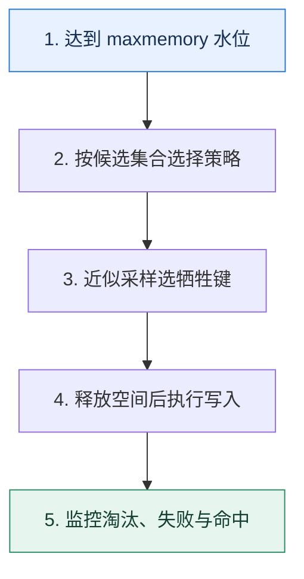

# 缓存淘汰｜内存满时决定牺牲谁

> 本课只解决一个问题：Redis 达到内存上限后，应该拒绝写入还是淘汰某些键？

这不是原页面的缩写，也不是一组孤立结论。下面先建立一个能推演的最小世界，再把状态、数字和失败分支摊开，最后按来源讲解顺序覆盖全部知识线索。读完后，你应当能从 `达到 maxmemory 水位` 一直解释到 `监控淘汰、失败与命中`，并说明中途任意一步失败会留下什么状态。

## 零基础入口：先建立本课的心智画面

过期解决键何时失效，淘汰解决内存不足时如何腾空间，两者不能混为一谈。策略选择取决于哪些键可丢、是否都设置 TTL，以及访问频率能否代表未来价值。

先不要急着记组件名。只抓住四个问题：**现在手里有什么输入？下一步只做什么动作？哪个状态发生变化？变化后的结果交给谁？** 之后遇到新框架，只要这四个答案不变，核心机制就没有变。

### 放进一个足够小、可以手算的世界

实例上限 20GB，热数据 12GB、偶发数据 15GB。若使用 allkeys-lru，访问波动后会逐步保留近期集合；若业务键中混有不可丢的分布式锁或队列状态，任何全局淘汰都可能破坏正确性，应拆实例并对关键状态使用 noeviction 和持久化设计。

这个小世界故意只保留本课必需的对象。生产系统会有更多节点、线程、分片和异常，但数量增加不会改变这里的因果关系。先确认你能手算这个例子，再把数字替换成真实系统数据。

### 先预测，不要马上看结论

**为什么把 `volatile-lru` 简单理解为“内存满了就淘汰最久未访问的任意键”是错的？**

先写下自己的判断，并指出你依赖的前提。文末自我检查会揭示答案；如果答案不同，回到下面的状态表找出第一个分叉点。

## 本节精讲：让机制一步一步发生

`noeviction` 保留现有数据并让会增加内存的写入失败，适合不能默默丢键的场景；`allkeys-*` 在全部键中选择，适合纯缓存；`volatile-*` 只从有 TTL 的键中选择，若候选不足仍可能写失败。LRU 倾向最近少用，LFU倾向频率低，random 简单，TTL 类策略偏向更早到期。Redis 的 LRU/LFU 是近似策略，抽样和元数据开销换取速度。大对象即使热门也可能挤走许多小对象，因此还要治理对象大小。

### 可见状态推进

| 当前步 | 现在发生的动作 | 下一步拿到什么 |
| ---: | --- | --- |
| 1 | 达到 maxmemory 水位 | 按候选集合选择策略 |
| 2 | 按候选集合选择策略 | 近似采样选牺牲键 |
| 3 | 近似采样选牺牲键 | 释放空间后执行写入 |
| 4 | 释放空间后执行写入 | 监控淘汰、失败与命中 |
| 5 | 监控淘汰、失败与命中 | 得到可核对的终态 |

图只承担一个任务：让你看清状态如何向前移动。它不意味着每一步必然成功；网络超时、进程退出、重复执行和数据竞争都可能让箭头停在中间，因此后面必须继续讨论失效边界。

### 一次带数字的完整推演

实例上限 20GB，热数据 12GB、偶发数据 15GB。若使用 allkeys-lru，访问波动后会逐步保留近期集合；若业务键中混有不可丢的分布式锁或队列状态，任何全局淘汰都可能破坏正确性，应拆实例并对关键状态使用 noeviction 和持久化设计。

数字不是装饰。它迫使我们回答容量、顺序、时间窗口或版本选择问题。若换一个数字就得出不同结论，真正的设计依据就是那个阈值，而不是某个中间件名称。

## 按讲解顺序重建知识链：完整来源讲解

下面按来源资料的教学顺序重新编排完整内容。转换页码、来源图片、推广信息、水印和个人宣传已经删除；原本围绕求职问答的角色与措辞改写为工程学习、方案评审和故障复盘语境。机制、算法、例子、反例、事故线索、评论补充和限制条件仍然保留。这里的作用是补齐知识覆盖，不取代前面的独立推演。

本节讨论一个使用缓存的时候绕不开的话题——如何淘汰键值对？

这个问题在技术讨论中也很常见。大多数人都能把八股文背好，也就是常见的 LRU 之类的策略都能解释出来。而它在技术讨论中的独特优势，就是能够根据业务设计出花样繁多的解决方案。如果你能在技术讨论中用上这些方案，就能给技术评审者留下很深刻的印象。

那么我们先从“为什么要淘汰”这个问题开始学习。

### 为什么要淘汰？

我们日常在使用缓存的时候，都会尝试控制整个缓存的开销，尤其是本地缓存的内存开销。比如说线上偶尔会遇到本地缓存了太多数据，导致应用内存不足的问题。如果是 Java 这种垃圾回收的语言，那么你就会遇到频繁地垃圾回收甚至 full GC 之类的问题。

所以用缓存肯定要控制住缓存的内存使用量。而这就会引出一个问题，万一我达到了内存使用上限，但是我又需要加入新的键值对，怎么办？最保守的做法就是直接报错，那么你就没有办法缓存新的数据了。后续如果缓存中已有的数据过期了，你就能缓存新的数据了。

但是大多数的业务是不能接受这种方案的，因为这一类的业务认为已经在缓存中的数据可能用不上了，虽然还没有过期，但是还是可以考虑淘汰掉，腾出空间来存放新的数据。这些新的数据比老的数据有更大的可能性被使用。

### 淘汰算法

最有名的淘汰算法是 LRU 和 LFU。除了这两种，还有最佳置换算法（OPT）和先进先出置换算法（FIFO）等，但是用得都不如 LRU 和 LFU 多，所以这里主要聊 LRU 和 LFU 这两种。

### LRU

LRU（Least Recently Used）是指最近最少使用算法。也就是说，缓存容量不足的时候，就从所有的 key 里面挑出一个最近一段时间最长时间未使用的 key。

这个算法从实现上来说很简单，只需要把 key 用额外的链表连起来，然后每次被访问到的 key都挪到队尾，那么队首就是最近最长时间未访问过的 key。也可以反过来，每次访问过的挪到队首，那么队尾就是最近最久未访问过的 key。比如说你可以借助 Java 的 LinkedHashMap轻易实现 LRU 算法。

这里访问是一个含糊的说法，你可以认为读写都是访问，也可以认为只有写是访问。所以有个LRU 的变种是只有在写的时候，才会挪动这个 key，读并不会，也就是它倾向于保留写频繁的数据。

### LFU

LFU（Least Frequently Used）是最不经常使用算法，它是根据对象的使用次数来确定淘汰对象的，每次都是将使用次数最低的淘汰掉。所以基本的思路就是按照访问频率来给所有的对象排序。每次要淘汰的时候，就从使用次数最少的对象里面找出一个淘汰掉。

如果有好几个对象的访问频次恰好相等，而且又是最低的，那么你可以自由决策如何淘汰。标准做法是淘汰最先插入的，不过也有一些实现就是随机删一个，又或者删掉排序位置最小的那个。实现的基本思路就是每次读写的时候，对象上面的次数都加 1，然后调整位置。

这个算法也有一些变种。最主要的变种是统计一段时间内的访问次数而不是整个生命周期的次数。比如说每个对象都只统计近一个小时内的访问次数。但是这种变种的实现复杂度就要高很多。

### 小结

在实践中，一般是优先考虑 LRU。这主要是因为 LRU 对时间局部性突出的应用非常友好，而大多数的应用场景都满足时间局部性的要求。

但是 LRU 在一些特殊的场景下，表现也不好。最典型的场景就是访问历史记录，因为越是历史悠久的，越有可能已经被你淘汰了。另外一个场景是遍历，遍历的时候，当次被遍历到对象总是不会被淘汰掉，而实际上，已经被遍历的对象反而应该被淘汰掉，腾出空间给尚未遍历的对象。

例如，图中遍历到 key5 的时候会触发淘汰，把 key4 淘汰了。紧接着遍历 key4，会把 key3淘汰了。以此类推，最终结果就是缓存完全没命中。

### Redis 支持的淘汰算法

Redis 支持很多种淘汰算法，你可以通过 maxmemory 选项来控制 Redis 的整个内存使用量，还可以通过指定 maxmemory_policy 来设置淘汰算法。

另外，你没有办法控制某些 key 的最大内存使用量，比如说某个业务最多缓存 100M 的数据，你只能控制整个 Redis 实例的内存使用量。

但是我们可以通过控制某个业务允许的键值对数量和单一键值对最大内存来间接控制业务在Redis 上的内存使用量。比如说某个业务只允许有 10000 个键值对，每个键值对不能超过1KB，那么它的整个内存使用量就不会超过 10MB。

你可以考虑在 Redis 中额外记录一个键值对数量，同时监听键值对的删除命令。当新加入某个键值对的时候，键值对数量加一。当某个键值对被删除的时候，键值对减一，那么就算键值对

自然过期被淘汰，你还是能够得到通知。

注意，你要区分一下你这个键值对是一个全新的键值对，还是已有这个键但是值被修改了。在后一种情况下，你并不需要更新键值对的数量。

这种机制很复杂，如果你想把我在后面提到的那些算法用在 Redis 上，就得编写一些比较复杂的 lua 脚本。

### 把知识转成可验证的工程判断

在技术讨论缓存淘汰之前，你需要了解清楚公司内的一些情况。

公司的 Redis 淘汰策略是什么？中间有没有调整过？如果有，那么为什么调整？你有没有用过本地缓存？如果用过本地缓存，那么这个本地缓存是如何控制内存使用量的？它支持什么样的缓存淘汰策略？有没有出现过因为缓存占用内存太大而引起的线上故障？后来是怎么解决的？有没有使用 Redis 不当引起的线上故障？后来是怎么解决的？

我非常建议你有空的时候写一个本地缓存。对于大多数语言来说，实现一个本地缓存所需的数据结构大多数都已经有了，所以实际上难度并不大。

在这个过程中，你就可以尝试设计不同的淘汰策略，这样你就会有更加深刻的理解，技术讨论的时候也就不会害怕技术评审者问细节了。

除此以外，当技术评审者问到以下问题，你也可以用这节课的内容来解释。

在使用缓存的时候有什么注意事项？为什么要控制缓存的内存使用量？你使用缓存遇到过什么问题？你优化过缓存吗？怎么提高缓存的命中率？Redis 支持哪些淘汰策略？你们公司用的是什么？

### 基本思路

最好的技术推理路径还是把优化缓存淘汰策略作为保证系统高性能的一环。这里就可以用对比说明策略，就是在优化之前缓存命中率或者响应时间有多差，而在优化之后，缓存命中率提高了多少或者响应时间下降了多少。

这里我用优先淘汰代价低的案例，给你展示如何解释。

为了进一步提高系统的性能，我还尝试过优化缓存。早期我们有一个业务，用到了一个本地缓存。这个本地缓存使用的淘汰算法是 LRU，最开始我们都觉得这个算法没什么问题。后来业务反馈，说有几个大客户一直抱怨自己的查询时快时慢。一听到时快时慢，我就可以确定应该是缓存出了问题。

经过排查我们发现原来这个缓存执行 LRU 的时候有时会把大客户的数据淘汰掉。而偏偏大客户的数据实时计算很慢，所以一旦没有命中缓存，响应时间就会暴增。

后来我进一步梳理业务，一方面考虑进一步增大缓存的可用内存。另外一方面，设计了灵活的淘汰策略，在淘汰的时候优先淘汰小客户的数据。

这样做的好处就是优先保证了大客户的用户体验，平均响应时间下降了 40%。而小客户因为本身计算就很快，所以影响也不是很大。

当然，从实践角度来说，针对不同业务调整淘汰策略取得的收益是比较小的。但是站在技术讨论的角度，这也算是一个比较新奇的优化点，倒是可以用用。

除了你主动提起，技术评审者也可能主动询问，比如从怎么安全使用缓存这个点切入。“安全”强调的就是你用缓存不能影响到别人，那么控制缓存的内存使用量就是一个关键的环节。所以这种时候你应该这样解释：

使用缓存一定要注意控制缓存的内存使用量，不能因为某一个业务而直接把所有的内存都耗尽。

要控制住内存使用量，就需要在内存用完的时候淘汰一些键值对。

实际上，解决缓存淘汰的最佳思路，就是给缓存足够的内存，不触发淘汰。但这也可以说是正确但是无用的废话，因为现实中不可能你需要多少内存就给你多少内存，所以最终还是要考虑怎么淘汰键值对。

解决缓存淘汰的问题，应该优先考虑增加内存，降低缓存淘汰的几率。不过毕竟内存也不是无限的，最终都还是要选择合适的淘汰策略。比如说某个线上系统的 Redis 使用了 volatile-lru淘汰策略。

这里你可以将 volatile-lru 淘汰策略换成你们实际的策略。有些时候技术评审者也可能会直接问你Redis 支持哪些淘汰策略，这时候你按照前置知识里面罗列出来的内容解释就可以了，同时你不要忘记补充你的 Redis 使用的是什么策略。

最后，你记得补充一句话，用来引导话题。

这些 LRU 或者 LFU 之类的算法都是普适性很强的算法，但是我也用过一些更加针对业务的淘汰算法。比如说按照优先级淘汰，大对象优先淘汰、小对象优先淘汰、代价低优先淘汰。大多数时候，不论是 Redis 还是本地缓存，这种业务针对性特别强的算法，都得自己实现。

我

### 进一步推导：怎样把机制用进真实系统

在实践中，同一个公司内部业务的重要性都是有区别的。就算是同一个业务内部，不同用户的重要性也是有区别的。所以针对业务设计淘汰策略的一个核心思路就是根据业务的重要性来设计。

比如说某个服务同时服务于 VIP 用户和普通用户，那么完全可以在缓存触发淘汰的时候，先把普通用户的数据淘汰了。所以可以考虑为每一个键值对绑定一个优先级，每次缓存要执行淘汰的时候，就从先淘汰优先级最低的数据。

这个方案在 Redis 落地基本上就是在前面提到的控制键值对数量的基础上，引入一个按照优先级进行排序的有序集合，那么有序集合里元素个数就是键值对个数。在每次触发淘汰的时候，从有序集合里面取出来一个 key，再把对应的键值对删除。

你可以先简单介绍一下这个方案。

之前我在业务里面使用过一个按照优先级来淘汰的策略。我们的业务有一个特点，就是数据有很鲜明的重要性之分。所以对于我们来说，应该尽可能保证优先级高的数据都在缓存中。所以在触发了淘汰的时候，我们希望先淘汰优先级比较低的缓存。所以我在 Redis 上利用有序集合设计了一个控制键值对数量，并且按照优先级来淘汰键值对的机制。这个有序集合是使用数据的优先级来排序的，也就是用优先级作为 score。

这里，你要仔细解释每一个部分。首先是增加键值对的时候是如何操作的。

增加一个键值对就要执行一个 lua 脚本。在这个脚本里面，它会先检测有序集合里面的元素个数有没有超过允许的键值对数量上限，如果没有超过，就写入键值对，再把 key 加入有序集合。如果超过了上限，那么就从有序集合里面拿出第一个 key，删除这个 key 对应的键值对。

然后补充怎么在键值对过期的时候，维护有序集合。

同时监听 Redis 上的删除事件，每次收到删除事件，就把有序集合中对应的 key 删除。

那么在这个基础上，根据你计算优先级的不同方式，你可以将这个机制用于不同的场景。所以你需要总结拔高一下。

在这个基础上，我可以根据不同的业务特征来计算优先级，从而实现大对象先淘汰、小对象先淘汰、热度低先淘汰等算法。

这里我稍微解释一下这个总结里面提到的几种淘汰策略，你在技术评审者问到的时候可以补充说明。

### 先淘汰大对象

在一些场景下，如果你的缓存有大有小，那么在淘汰的时候你会希望尽可能先把大的对象淘汰了，因为这样可以一次性腾出比较多的内存。这种策略在本地缓存实现上经常使用。与之对应的另一些场景下，你可以考虑小对象优先淘汰。

### 先淘汰小对象

比如说你的大对象都是经过复杂计算之后得出来的，而小对象的计算逻辑就非常简单。那么显然淘汰大对象是不合适的，因为一旦缓存未命中，那么响应时间就会大幅度提高。而淘汰小对象，即便下一次触发了重复计算，响应时间也没多少波动。进一步抽象就可以说成是代价低的优先淘汰。

所谓的代价高低是一种逻辑上的概念，你可以把任何你认为会对你的业务产生关键性影响的资源认为是“代价”，而消耗很多这个资源的，就是代价高昂。不怎么消耗这个资源的，就可以认为是代价低廉。

那么小对象先淘汰也是基于这样一个假设，小对象对应的计算步骤都是很快的，代价是比较低的，所以可以先淘汰。但是淘汰小对象也有一个缺陷，就是如果新加入的键值对数据比较大，那么你需要淘汰好几个小对象才能腾出足够的空间。

### 低热度优先

这种是根据数据冷热来淘汰，比如说存在博主粉丝关系的内容平台上，在淘汰数据的时候完全可以先把小博主的数据淘汰了，留下大博主的数据。因为我们知道大博主粉丝更多，所以他们的数据留下来有更大的概率会被访问到。这个和上节课提到的热点数据缓存时间会更长的思路是一样的。

### 本节原始知识线索收束

最后我们来总结一下这节课的内容。

你需要先了解为什么会有淘汰这种说法，原因就是我们希望控制住内存使用量。常见的淘汰算法 LRU、LFU，以及 Redis 支持的各种淘汰算法比较重要，在准备技术讨论的过程中，记得提前了解你们公司 Redis 使用的算法。

最后我提出了一个针对业务特性来设计的按照优先级淘汰的算法，根据怎么计算优先级又可以进一步细分成大对象先淘汰、小对象先淘汰、根据热度来淘汰。这些方案在 Redis 上落地的时候，都需要借助 Redis 的有序集合，而且为了避免并发问题，你操作 Redis 的时候都是要通过 lua 脚本封装一系列操作的。

### 继续推演

最后请你来思考两个问题。

我在这一节课里面只说了，可以在 Redis 上控制键值对数量来间接控制内存使用量。实际上要直接控制某个业务的内存使用量也不是不行，就是非常麻烦，你觉得可以怎么做？在 Redis 控制内存使用量的方案中，我一直说要使用 lua 脚本，因为有并发问题。那么你能想到有什么样的并发问题吗？

### 补充讨论与边界校准

#### 全部留言 (5)

补充讨论：

讲解补充：1. 不能……有一种粗暴的方式就是要求客户端只能存储 byte，然后就比较容易计算了。

2. 对的，你的顾虑很有道理，大规模监听 redis 的过期事件确实不怎么靠谱。但是怎么说呢，就是这个技术讨论意义大于实践意义，你不到逼不得已不要搞这种定制化做法……我搞过一次就不想再搞第二次。
1

补充讨论：

讲解补充：这是必然的代价。不过这里只存了 key，所以也没那么严重。毕竟值占据的内存比 key 的多。

补充讨论：

讲解补充：暂时没有这个计划。一般来说，选择数据结构应该是先看业务场景吧？比如说很多场景要求用 zset 之类的，想换也换不了。

不过如果是站在技术讨论的角度话，如果你想刷优化 Redis 内存使用量的，确实是可以考虑使用更加紧凑的内存结构，比如说 intset 之类的，不过都是首先得业务允许。

补充讨论： 当第一个请求完成有序集合的删除操作，此时第二个请求过来会判断未超限，导致2个请求都会去set

讲解补充：赞！

补充讨论： 在生产实践中，网络公司的网站是大量采用本地缓存还是很少使用本地缓存？

讲解补充：只有性能要求很高的时候才会用，因为本地缓存一致性问题更加严重。

## 把完整讲解收束成一条因果链

1. 先分清过期与淘汰的触发条件。
2. 按 allkeys、volatile 和 noeviction 划定候选集合。
3. 再比较 LRU、LFU、随机与 TTL 倾向的工作负载假设。
4. 最后把关键状态隔离，并用对象大小和命中率验证选择。

把这几步连接起来时，不要省略“为什么”。最终结论只有在前提、状态变化和失败代价都说得清楚时才可靠。

## 误区与失效边界

策略名字不能替代容量模型。高命中率下仍可能发生写失败或延迟抖动；把缓存与关键协调状态混在同一淘汰域是常见风险。`volatile-lru` 在几乎没有 TTL 键时并不会神奇地从所有键腾空间。

再加一条通用但必须落实到本课对象上的边界：机制只能处理它看得见的信号。若输入指标失真、状态没有持久化、错误被吞掉，或者补偿没有幂等保护，再成熟的框架也只能基于错误证据作决定。

### 三种故障注入方式

| 故障 | 要观察什么 | 不能接受的解释 |
| --- | --- | --- |
| 在第 2 步前让依赖超时 | 是否停在可重试状态，是否消耗完上游预算 | “框架稍后会处理” |
| 在状态写入后让进程退出 | 重启后能否识别已完成与待继续动作 | “再执行一次应该没事” |
| 对同一输入并发执行两次 | 是否出现重复副作用、顺序颠倒或覆盖 | “概率很低” |

## 工程验证：把理解变成可以复查的证据

对候选策略回放一天真实访问轨迹，统计命中率、evicted_keys、写失败、P99 和大对象占比。策略切换前确保 maxmemory 有安全余量，并准备在淘汰激增时限流回源。

| 步骤 | 状态或动作 | 最少应留下的证据 |
| ---: | --- | --- |
| 1 | 达到 maxmemory 水位 | 开始时间、结束时间、输入标识、结果状态、异常原因 |
| 2 | 按候选集合选择策略 | 开始时间、结束时间、输入标识、结果状态、异常原因 |
| 3 | 近似采样选牺牲键 | 开始时间、结束时间、输入标识、结果状态、异常原因 |
| 4 | 释放空间后执行写入 | 开始时间、结束时间、输入标识、结果状态、异常原因 |
| 5 | 监控淘汰、失败与命中 | 开始时间、结束时间、输入标识、结果状态、异常原因 |

验证时同时记录成功路径和失败路径。只证明“正常时能跑通”不能说明设计可靠；至少要让一次超时、一次进程退出和一次重复请求可重现，并能根据日志或指标解释最后状态。

## 学完检查：闭卷画出本课

你现在应该能独立完成四件事：

1. 用自己的话说出本课唯一问题，不使用产品名也能解释。
2. 复算上面的具体例子，并指出哪个输入改变会让结论改变。
3. 沿 Mermaid 图注入一次失败，预测系统停在哪里以及由谁收敛。
4. 说出本课机制不保证什么，并给出一个反例。

## 自我检查

为什么把 `volatile-lru` 简单理解为“内存满了就淘汰最久未访问的任意键”是错的？

volatile 策略只在设置了过期时间的键中选择；无 TTL 键不在候选集合。若候选不足，写入仍可能失败。

怎样证明自己不是只记住了名词？

把 `达到 maxmemory 水位` 的一个真实输入写出来，逐步记录到 `监控淘汰、失败与命中`。然后在中间任意一步制造失败；如果你能解释当前状态、下一责任方、可观测证据和恢复边界，就已经拥有可以迁移的工程模型。

## 来源与事实校准

- [查看完整来源稿（本地 16 页资料）](../content/32-cache-eviction.md)

### 当前事实校准

达到 maxmemory 后，Redis 会按 maxmemory-policy 决定淘汰或拒绝会增加内存的命令。LRU/LFU 属于近似选择，并且 volatile 系列只在带 TTL 的键中选候选；因此策略名称不能替代候选集合、对象大小和业务可丢失性的检查。

- [Redis · Key eviction](https://redis.io/docs/latest/develop/reference/eviction/)
- [Redis · Memory optimization](https://redis.io/docs/latest/operate/oss_and_stack/management/optimization/memory-optimization/)

来源稿用于核对覆盖范围，不随公开站点发布。产品默认值和具体内部行为可能随版本变化；落地时应使用目标版本的官方文档、可运行实验和故障演练校准。本学习稿中的零基础入口、状态推演、故障矩阵和工程验证属于编辑补充，不冒充来源讲解者的原话。
